# Mirai — Hack The Box

**Plataforma:** Hack The Box  
**Dificultad:** 🟢 Fácil  
**SO:** Linux  
**Autor de la máquina:** Arrexel  
**Fecha de resolución:** 2026  
**Técnicas:** Nmap · Raspberry Pi · Pi-hole · Credenciales por defecto · SSH · sudo NOPASSWD · Análisis forense · Recuperación de ficheros borrados

---

## Índice

1. [Reconocimiento](#1-reconocimiento)
2. [Enumeración del servicio web](#2-enumeración-del-servicio-web)
3. [Acceso inicial — SSH](#3-acceso-inicial--ssh)
4. [Obtención de shell](#4-obtención-de-shell)
5. [Post-explotación y flags](#5-post-explotación-y-flags)
6. [Lección aprendida](#6-lección-aprendida)

---

## 1. Reconocimiento

Comenzamos comprobando conectividad con la máquina objetivo mediante ICMP.

```bash
ping -c 1 10.129.X.X
```

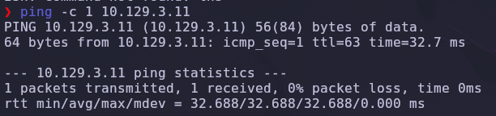

Salida obtenida:

```text
64 bytes from 10.129.X.X: icmp_seq=1 ttl=63 time=32.7 ms
```

> 💡 El parámetro `-c 1` envía un único paquete ICMP, suficiente para confirmar que el host está activo. El valor `TTL=63` es especialmente revelador: los sistemas Linux inician el TTL en 64, por lo que un valor cercano (63 tras un salto de red) indica que estamos frente a una máquina **Linux**.

---

### Escaneo inicial de puertos

Realizamos un escaneo completo de todos los puertos TCP con Nmap.

```bash
nmap -sS -Pn -vvv --min-rate 5000 --open -n -p- 10.129.X.X -oN AllPorts
```

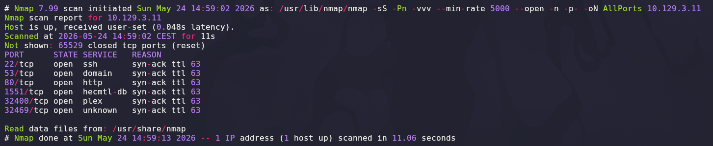

### Explicación de parámetros utilizados

| Parámetro | Función |
|---|---|
| `-sS` | SYN Scan rápido y sigiloso |
| `-Pn` | Omite descubrimiento por ping |
| `-vvv` | Máximo nivel de verbosidad |
| `--min-rate 5000` | Fuerza velocidad mínima de paquetes |
| `--open` | Muestra solo puertos abiertos |
| `-n` | Evita resolución DNS |
| `-p-` | Escanea los 65535 puertos TCP |
| `-oN` | Guarda el resultado en formato normal |

Resultado relevante:

```text
22/tcp    open  ssh
53/tcp    open  domain
80/tcp    open  http
1551/tcp  open  hecmtl-db
32400/tcp open  plex
32469/tcp open  unknown
```

> 💡 La combinación de puertos es muy característica: **SSH** (22), un servidor **DNS** (53), un servicio **web** ligero (80) y **Plex Media Server** (32400). Este perfil —DNS local + web minimalista + servidor multimedia— es típico de un pequeño dispositivo doméstico tipo *appliance*, lo que orienta la enumeración desde el primer momento.

---

### Enumeración detallada

Una vez identificados los puertos abiertos, lanzamos un escaneo más profundo con detección de versiones y scripts NSE únicamente sobre ellos.

```bash
nmap -sCV -T5 -p22,53,80,1551,32400,32469 10.129.X.X
```

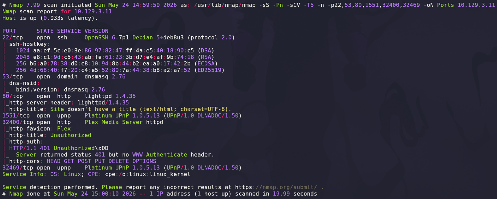

Salida relevante:

```text
22/tcp    open  ssh     OpenSSH 6.7p1 Debian 5+deb8u3 (protocol 2.0)
53/tcp    open  domain  dnsmasq 2.76
80/tcp    open  http    lighttpd 1.4.35
32400/tcp open  http    Plex Media Server httpd
```

### Explicación de parámetros

| Parámetro | Función |
|---|---|
| `-sCV` | Ejecuta detección de versiones y scripts NSE |
| `-T5` | Timing agresivo para acelerar el escaneo |

> 💡 La huella de servicios es inconfundible: `dnsmasq` como servidor DNS ligero, `lighttpd` como servidor web minimalista y `OpenSSH` sobre Debian. Esta tríada, junto con el `TTL=63`, apunta directamente a una **Raspberry Pi** ejecutando **Raspbian** —la distribución Debian adaptada a este hardware—.

---

## 2. Enumeración del servicio web

Accedemos desde el navegador al puerto `80`.

```text
http://10.129.X.X
```

El servidor `lighttpd` devuelve una página por defecto sin contenido relevante (Nmap ya advirtió *"Site doesn't have a title"*). Procedemos a descubrir rutas ocultas mediante fuzzing de directorios con **Gobuster**.

```bash
gobuster dir -u http://10.129.X.X -w /usr/share/seclists/Discovery/Web-Content/DirBuster-2007_directory-list-lowercase-2.3-medium.txt
```

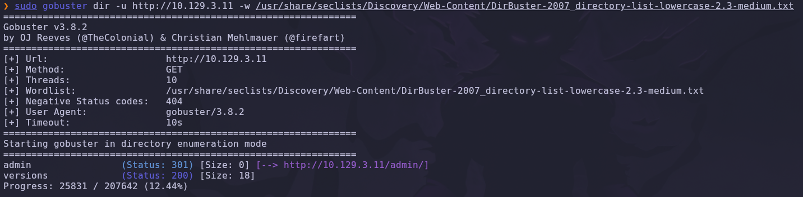

Resultado:

```text
/admin     (Status: 301)
/versions  (Status: 200)
```

> 💡 Un código `301` indica una redirección permanente: la ruta `/admin` existe y el servidor reenvía la petición a `/admin/`. Es un objetivo prioritario, ya que los paneles administrativos suelen exponer información del sistema o funcionalidades sensibles.

---

### Panel de administración Pi-hole

Accedemos a la ruta descubierta:

```text
http://10.129.X.X/admin/
```

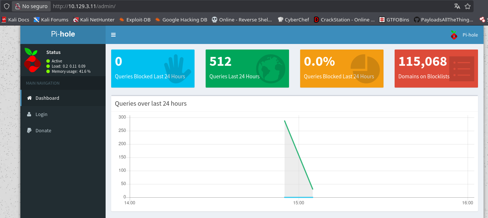

Se carga el panel de **Pi-hole**, una solución de filtrado de publicidad y rastreadores que actúa como *sinkhole* DNS a nivel de red. Pi-hole se instala de forma abrumadoramente mayoritaria sobre una **Raspberry Pi**, lo que confirma la hipótesis planteada durante el reconocimiento: estamos ante un dispositivo Raspbian.

> 💡 Pi-hole no expone aquí ninguna vulnerabilidad directa, pero su presencia es la **pieza clave de inteligencia**: identificar el tipo exacto de dispositivo nos permite buscar vectores de acceso conocidos asociados a ese hardware, en lugar de seguir enumerando a ciegas.

---

## 3. Acceso inicial — SSH

Confirmado que el objetivo es una Raspberry Pi, el siguiente paso lógico es investigar sus **credenciales por defecto**. Las imágenes oficiales de Raspbian se distribuyen históricamente con una cuenta preconfigurada y, salvo que el administrador la modifique manualmente, esas credenciales permanecen activas.

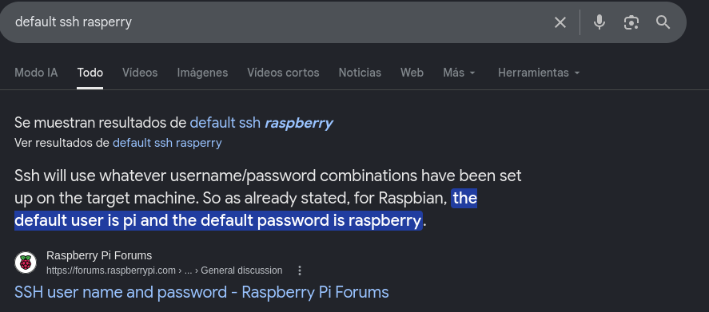

Una búsqueda rápida confirma el dato: el usuario por defecto de Raspbian es `pi` y su contraseña es `raspberry`.

```text
Usuario: pi
Contraseña: raspberry
```

> 💡 No es casualidad que la máquina se llame **Mirai**: la botnet del mismo nombre se propagó masivamente en 2016 comprometiendo dispositivos IoT precisamente mediante credenciales de fábrica. El puerto `22` (SSH) abierto convierte a `pi:raspberry` en un vector de acceso inmediato y totalmente realista.

---

## 4. Obtención de shell

Con las credenciales identificadas, establecemos una conexión SSH directa contra el puerto `22`.

```bash
ssh pi@10.129.X.X
```

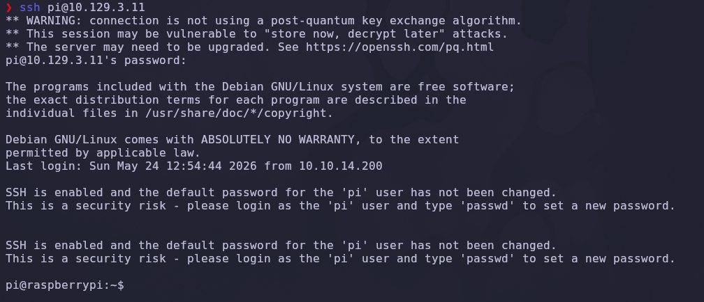

El acceso es inmediato. El propio sistema operativo nos da la bienvenida con un aviso de seguridad explícito: *"the default password for the 'pi' user has not been changed"*. La máquina misma reconoce la mala configuración que acabamos de explotar.

---

### Escalada de privilegios

Ya dentro como `pi`, comprobamos qué permisos de `sudo` tiene asignado el usuario.

```bash
sudo -l
```

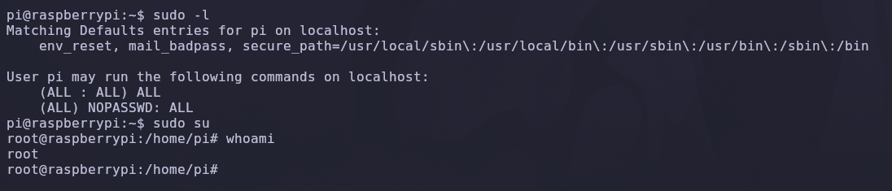

### Explicación

| Comando | Función |
|---|---|
| `sudo -l` | Lista los permisos `sudo` del usuario actual |
| `sudo su` | Abre una shell como `root` |
| `whoami` | Confirma el usuario efectivo |

La salida es demoledora:

```text
User pi may run the following commands on localhost:
    (ALL : ALL) ALL
    (ALL) NOPASSWD: ALL
```

El usuario `pi` puede ejecutar **cualquier comando como cualquier usuario y sin necesidad de contraseña** (`NOPASSWD: ALL`). Esto convierte la escalada en un trámite: basta con invocar una shell privilegiada.

```bash
sudo su
whoami
```

Resultado:

```text
root
```

> 💡 La directiva `NOPASSWD: ALL` en `/etc/sudoers` elimina cualquier barrera entre un usuario sin privilegios y `root`. Cualquier persona con acceso a la cuenta `pi` obtiene control total del sistema de forma instantánea, sin explotar ningún fallo de software.

✅ Compromiso total de la máquina.

---

## 5. Post-explotación y flags

Con privilegios de `root`, solo queda localizar las flags del sistema.

### Flag de usuario

La flag de usuario reside en el escritorio del propio usuario `pi`, accesible directamente dado que ya disponemos de su sesión (y, además, de `root`):

```bash
cat /home/pi/Desktop/user.txt
```

### Flag de root — recuperación forense

Intentamos leer la flag de `root` en su ubicación habitual:

```bash
cat /root/root.txt
```

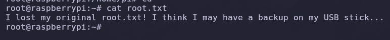

En lugar de la flag encontramos un mensaje:

```text
I lost my original root.txt! I think I may have a backup on my USB stick...
```

El fichero original ha sido sustituido y se nos indica que existe una copia en una memoria USB. Comprobamos los dispositivos de almacenamiento montados en el sistema:

```bash
mount | grep usb
```

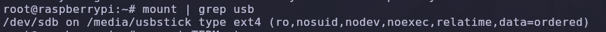

Resultado:

```text
/dev/sdb on /media/usbstick type ext4 (ro,nosuid,nodev,noexec,relatime,data=ordered)
```

Existe un dispositivo `/dev/sdb` montado en `/media/usbstick` con sistema de ficheros `ext4`. Exploramos su contenido:

```bash
cd /media/usbstick
ls
cat damnit.txt
```

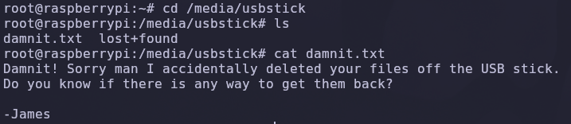

El directorio solo contiene `damnit.txt` y la carpeta `lost+found`. El fichero deja claro lo ocurrido:

```text
Damnit! Sorry man I accidentally deleted your files off the USB stick.
Do you know if there is any way to get them back?

-James
```

El fichero `root.txt` fue **borrado** de la memoria USB. Sin embargo, en sistemas de ficheros como `ext4`, eliminar un fichero solo desvincula su entrada de directorio (el *inode*): los **bloques de datos reales permanecen intactos en el disco** hasta que se sobrescriben. Podemos extraerlos leyendo directamente el dispositivo de bloque en crudo:

```bash
strings /dev/sdb
```

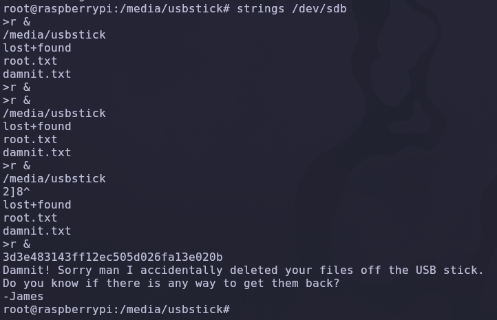

`strings` recorre el contenido binario del dispositivo y extrae las secuencias de texto imprimibles. Entre los restos del fichero borrado aparece la flag recuperada:

```text
3d3e483143ff12ec505d026fa13e020b
```

> 💡 El borrado de un fichero **no destruye la información**. Mientras los bloques no sean reescritos, herramientas como `strings`, `extundelete`, `photorec` o `debugfs` permiten recuperar el contenido. Operar sobre el dispositivo en bruto (`/dev/sdb`) en lugar del punto de montaje es clave en cualquier análisis forense.

✅ Máquina completada.

---

## 6. Lección aprendida

Esta máquina demuestra cómo una cadena de descuidos triviales —ninguno de ellos un *exploit* de software— conduce al compromiso total de un dispositivo.

| Vulnerabilidad | Dónde | Impacto |
|---|---|---|
| Credenciales SSH por defecto | Usuario `pi` (Raspbian) | Acceso remoto inmediato al sistema |
| Servicio Pi-hole expuesto | Puerto 80 `/admin/` | Identificación precisa del dispositivo |
| `sudo NOPASSWD: ALL` | Configuración de `/etc/sudoers` | Escalada instantánea a `root` |
| Datos sensibles recuperables en disco | `/dev/sdb` | Recuperación de ficheros borrados |
| Dispositivo IoT sin *hardening* | Raspberry Pi | Compromiso total del sistema |

---

## Recomendaciones defensivas

- Cambiar **siempre** las credenciales por defecto en cualquier dispositivo, especialmente en equipos IoT y Raspberry Pi.
- Deshabilitar el acceso SSH por contraseña y emplear autenticación por clave pública.
- Restringir los permisos de `sudo`: nunca conceder `NOPASSWD: ALL` a cuentas de uso diario.
- No exponer paneles administrativos (Pi-hole, Plex) directamente a redes no confiables.
- Aplicar segmentación de red y aislar los dispositivos IoT en una VLAN dedicada.
- Sobrescribir de forma segura (`shred`, `wipe`) los soportes de almacenamiento antes de reutilizarlos o desecharlos.
- Mantener actualizado el sistema operativo y los servicios expuestos.

---

*Writeup por [Arabot](https://github.com/Caan31) · Hack The Box · 2026*  
*¿Te ha ayudado? Dale una ⭐ al repositorio.*
